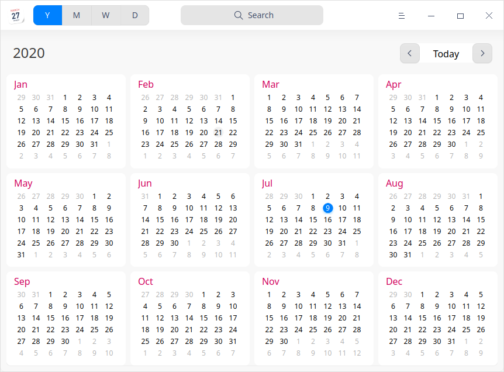
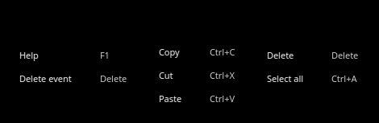
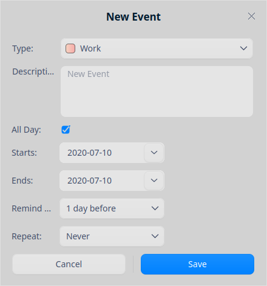

# Calendario|../common/dde-calendar.svg|

## Vistazo

El calendario es una herramienta útil para gestionar su vida personal. Al relacionar los eventos con un tiempo específico, le permite llevar un registro y hacer planes para su agenda.

## Guía

Puede ejecutar, cerrar o crear un acceso directo para el calendario de las siguientes maneras.

### Iniciar calendario

1.  Haga clic en  en el dock para entrar en la interfaz del Launcher.
2.  Localice  desplazando la rueda del ratón o buscando "calendario" en la interfaz del lanzador y haga clic en él para ejecutarlo.
3.  Haga clic con el botón derecho del ratón en  y podrá que:

    - Hacer clic en **Enviar al escritorio** para crear un acceso directo al escritorio.
    - Hacer clic en **Enviar al muelle** para fijarlo en el Dock.
    - Hacer clic en **Añadir al inicio** para añadir la aplicación al inicio y que se ejecute automáticamente cuando se inicie el sistema.

### Salir de calendario

- En la interfaz del Calendario, haga clic en  para salir del calendario.
- Haga clic con el botón derecho del ratón en  en el dock y seleccione **Cerrar todo** para salir.
- Haga clic en  en la interfaz del Calendario y seleccione **Salir** para salir.

### Ver atajos de teclado

En la interfaz del Calendario, pulsa **Ctrl + Shift + ?** en el teclado para ver los atajos. El dominio de los atajos mejorará en gran medida tu eficacia.

## Operaciones

El calendario se puede dividir en vista anual, vista mensual, vista semanal y vista diaria, mostrando los atributos de la fecha en diferentes perspectivas.

La vista mensual es la predeterminada y puede hacer clic para cambiar entre las diferentes vistas.

- Las fechas del calendario lunar sólo se mostrarán en el sistema lunar en concordancia con las fechas del calendario solar.
- La fecha comienza en el año **1900** y no se pueden ver fechas anteriores a ese año durante el cambio de fecha. 
- En la vista mensual y semanal, la representaciones de los sábados y domingos es diferente a la vista de los días entre lunes y viernes. 

| Vista   | Característica                                               |
| ------- | ------------------------------------------------------------ |
| Anual   | Muestra los meses y días de todo el año.                     |
| Mes     | Muestra la información con eventos festivos.                 |
| Semanal | Muestra el cronograma semanal.                               |
| Diaria  | Muestra la información del cronograma y las festividades.    |

### Crear eventos

1. Seleccione una fecha en la vista mensual, semanal o diaria.
2.  Haga doble clic, o haga clic derecho, para seleccionar **Nuevo evento** en el área en blanco de una fecha y aparecerá una ventana llamada **Nuevo evento**.
3. Establezca el tipo de programación, la descripción, la hora, el recordatorio, etc.

   
&nbsp;&nbsp;&nbsp;&nbsp;&nbsp;&nbsp;&nbsp;&nbsp;&nbsp;&nbsp;&nbsp;&nbsp;&nbsp;

   - Tipo: trabajo, personal y otro
   - Fecha del evento: todo el día, inicia y termina.

      - Cuando se marca todo el día:
         - Sólo se pueden seleccionar fechas como inicio y término y no se podrán especificar horas y minutos. 
         - Recordar: Nunca, El día de inicio (9:00 AM), 1 día antes (la configuración por defecto), 2 días antes y 1 semana antes

      - Cuando no se marca todo el día:
         - Puede seleccionar fechas, horas y minutos como inicio y tñermino.
         - Recuérdame: Nunca, En el momento del evento, 15 minutos antes, 30 minutos antes, 1 hora antes, 1 día antes, 2 días antes y 1 semana antes. 

   - Repetir: Nunca, Diaramente, Días laborables, Semanalmente, Mensualmente o Anualmente.

   - Fin de repetición: Nunca, después de n vez(es) o en una fecha establecida.

 > Nota: Sólo cuando activa la función **Repetir** se podrá mostrar la opción **Fin de repetición**.

4.  Clic en **Guardar** para crear el evento.

> Consejo: puede arrastrar la etiqueta del evento a una hora o fecha determinada.

### Editar eventos

1. Haga clic con el botón derecho del ratón en una fecha con horario en la vista mensual, semanal o diaria.
2. Seleccione **Editar** y aparecerá el diálogo **Editar evento**.
3. Establezca las propiedades del evento en edición.  
4. Haga clic en **Guardar**. 
5. Si se trata de un evento de todo el día o de un evento con repetición, aparecerá un recuadro para que confirme la información y termine la edición. 

Durante la edición del evento, se mostrarán diferentes informaciones de aviso según los cambios de contenido. La descripción de los iconos contenidos en la información de avisos es la siguiente.

| Icon                      | Description                                                  |
| ------------------------- | ------------------------------------------------------------ |
| Todo                      | Sólo es efectivo para los cambios de eventos repetitivos relevantes. |
| Solo este evento          | Sólo es efectivo para la modificación del evento actual.     |
| Todos los futuros eventos | Todos los eventos futuros durante y después de la fecha seleccionada serán cambiados y los eventos anteriores a la fecha seleccionada permanecerán sin cambios. |
| Cambiar todos             | Todos los eventos que se repiten serán cambiados.            |

### Establecer un evento de todo el día o de varios días

Marque **Todo el día**, establezca los **Inicios** y **Finales** y podrá establecer un evento de todo el día o de varios días consecutivos al crear o editar un evento.

### Establecer repetición de eventos

1. Haga clic en la lista desplegable a la derecha de **Repetir** y seleccione una opción al crear o editar un evento.
   - **Diariamente**:  Introduzca el número de días entre cada repetición.
   - **Días laborables**: Introduzca el número de días de la semana entre cada repetición.
   - **Semanal**: Introduzca el número de semanas entre cada repetición y seleccione el día en que se producirá el evento.
   - **Mensual**: Introduzca el número de meses entre cada repetición.
   - **Anual**: Introduzca el número de años entre cada repetición y haga clic en el mes en el que se producirá el programa.
2. Haga clic en la lista desplegable a la derecha de **Fin de repetición** y seleccione la hora de finalización de la programación.

### Ver eventos

Haga doble clic en el título de un evento en la vista mensual, semanal o diaria y aparecerá la ventana **Mi evento**. Puedes ver los eventos, [editarlos](#Editar eventos) or [borrarlos](#Borrar eventos). 

### Ver detalles del recordatorio del horario

Haga clic en el cuadro de aviso de notificación para ver los detalles del recordatorio de programación después de que el sistema envíe una notificación.

La descripción de los iconos contenidos en la información del aviso es la siguiente.

| Icono                     | Descripción                                                  |
| ------------------------- | ------------------------------------------------------------ |
| Recuérdame luego          | El recordatorio se establece en el día actual. Después del primer aviso, haga clic en **Recuérdame luego** y se le recordará dentro de 10 minutos. Los siguientes intervalos de recordatorio se incrementarán en 5 minutos a partir del primero cada vez que haga clic en **Recuérdame luego**. |
| Recuérdame mañana         | El recordatorio se establece con uno o dos días de antelación. |
| El día anterior al evento | El recordatorio está fijado con una semana de antelación.    |
| Cerrar                    | Desactiva la información de la consulta.                     |

### Buscar eventos

En la vista anual, mensual, semanal o diaria, cuando se introducen los eventos en el cuadro de búsqueda superior, los resultados de la búsqueda correspondiente se mostrarán automáticamente en el lado derecho del calendario.

1.  En el cuadro de búsqueda superior de la interfaz del Calendario, puede hacer clic enpara escribir en ella.

2.  Pulse la tecla **Enter** del teclado para realizar la búsqueda.

   - Cuando haya coincidencia de búsqueda, la lista de resultados se mostrará a la derecha.
   - De lo contrario, se mostrará el texto **Sin resultados de búsqueda** del mismo lugar.

3.   Clic  o elimine el texto introducido en el cuadro de búsqueda para borrar las palabras clave actuales o cancelar la búsqueda. 

### Borrar eventos

1.  Haga clic derecho en un evento programado en la vista mensual, semanal o diaria.
2.  Haga clic en **Borrar** y aparecerá un cuadro de aviso **Está borrando un evento**.
3.  Confirme la información solicitada y elimine el evento.

También puede hacer clic en **Cancelar** para cancelar la operación.

La descripción de los iconos contenidos en la información de los eventos repetitivos y no repetitivos es la siguiente.

| Icon                             | Description                                                  |
| -------------------------------- | ------------------------------------------------------------ |
| Borrar                           | Borra los eventos que no se repiten.                         |
| Borrar todo                      | Borra todas las apariciones de este evento.                  |
| Eliminar solo este evento        | Borra sólo la aparición seleccionada del evento. Esto sólo es aplicable a los eventos que se repiten. |
| Borrar todos los eventos futuros | Elimina esta y todas las futuras apariciones de este evento, pero las ocurrencias del evento antes de la fecha seleccionada se mantendrán. Esto sólo es aplicable a los eventos que se repiten. |

### Borrar todas las apariciones en repeticiones de eventos

En el Calendario, si selecciona la primera ocurrencia de los eventos que se repiten, puede hacer clic en **Borrar todo** para eliminar todas las ocurrencias del evento. 

### Borrar parte de las repeticiones de eventos

En el Calendario, si selecciona una o más ocurrencias de los eventos que se repiten, puede realizar las siguientes tareas al eliminar eventos:

- Haga clic en **Borrar sólo este evento**: borra sólo el evento seleccionado.
- Haga clic en **Borrar todos los eventos futuros**: eliminará la aparición seleccionada sus posteriores apariciones del evento.

## Menú principal

En el menú principal, puede alternar los temas de las ventanas, ver el manual de ayuda y obtener más información sobre el Calendario.

### Tema visual

El tema de la ventana ofrece tres tipos de tonalidades, llamados Claro, Oscuro y Sistema.

1.  En la interfaz del Calendario, haga clic en .

2.  Haga clic en **Tema** para seleccionar alguno de los temas.

### Ayuda

1.  En la interfaz del Calendario, clic en .
2.  Haga clic en **Ayuda** para ver el manual del Calendario.

### Acerca de

1.  En la interfaz del Calendario, clic en .
2.  Haga clic en **Acerca de** para ver la versión y la descripción del Calendario. 

### Salir

1.   En la interfaz del Calendario, clic en . 
2.  Haga clic en **Salir** para cerrar el Calendario.

