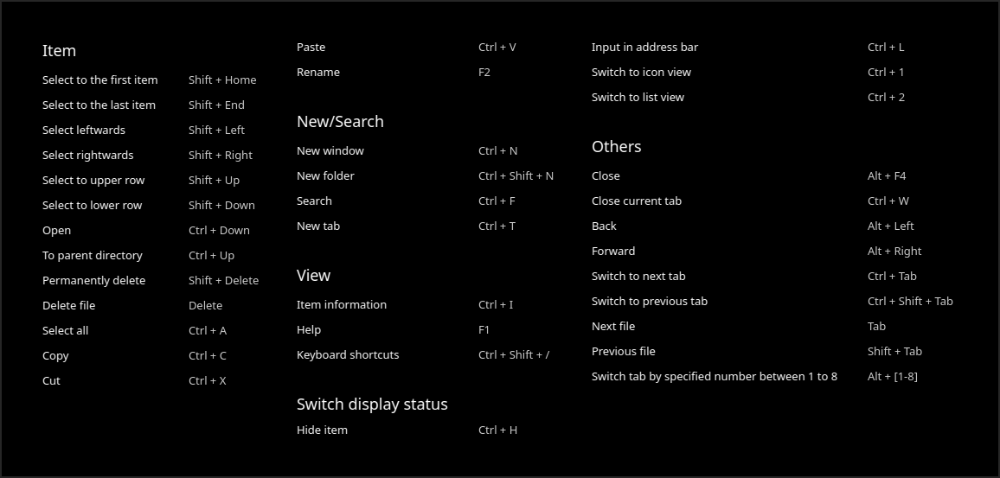
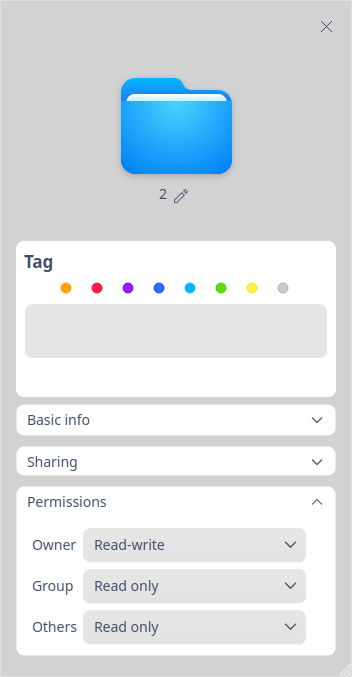

# Gestor de archivos|../common/deepin-file-manager.svg|

## Vistazo

El Gestor de archivos es una herramienta de gestión de archivos potente, sencilla y fácil de usar. Siga la funcionalidades y diseños característicios de un gestor de archivos tradicional, y simplifique la usuabilidad sin perder otras mejoras. Ofrece una barra de navegación que se abre sola, un cuadro de búsqueda con reconocimiento inteligente, múltiples vistas y un filtrador de resultados para revisar los archivos fácilmente. Más allá de lo clásico, ¡le ofrece una mejor experiencia!

## Guía

Puede ejecutar, cerrar y crear un acceso directo para el Gestor de archivos de las siguientes maneras.

### Ejecutar el gestor de archivos

1. Haga clic en  en el dock para entrar en la interfaz del Lanzador.
2. Localice el icono  desplazando la rueda del ratón o buscando como "Gestor de archivos" en la interfaz del Lanzador.
3. Haga clic con el botón derecho del ratón en , puede que:
 - Haga clic en **Enviar al escritorio** para crear un acceso directo al escritorio.
 - Haga clic en **Enviar al muelle** para fijar la aplicación en el dock.
 - Haga clic en **Añadir al arranque** para añadir la aplicación al inicio, se ejecutará automáticamente cuando se inicie el sistema.

### Salir del gestor de archivos

- En la interfaz del Administrador de Archivos, haga clic en **X** para salir.
- Haga clic con el botón derecho del ratón en  en el Dock, seleccione **Cerrar todo** para salir del Administrador de archivos.
- Haga clic en  y seleccione **Salir** para salir del Gestor de Archivos.

### Ver atajos de teclado

En la interfaz del Visor de documentos, pulse **Ctrl + Shift + ?** para ver rápidamente todas las teclas de acceso rápido, lo que le ayudará a utilizarlas con destreza y a mejorar su productividad. 

## Interfaz de usuario

En la interfaz del Gestor de archivos, puede ejecutar muchas operaciones con las barras funcionales. Está diseñado para ser fácil de usar, amigable al público casual y avanzado.

| No. | Nombre     | Descripción                                                     |
| ---- | ------------- | ------------------------------------------------------------ |
| 1    | Panel izquierdo    | Haga clic en los iconos del panel izquierdo para visitar rápidamente los archivos locales, los discos, los ordenadores de la red local, los marcadores y las etiquetas. |
| 2    | Barra de dirección | Puedes cambiar rápidamente el historial de visitas, cambiar entre los niveles del directorio, buscar e introducir la dirección en la barra de direcciones. |
| 3    | Vista              | Haga clic en  y  para cambiar los modos de vista. |
| 4    | Columna informativa | Clic en  para ver la información básica y las etiquetas de los archivos (carpetas). |
| 5    | Menú principal | Puede abrir una nueva ventana, cambiar de tema, establecer una contraseña compartida, realizar ajustes, ver el manual y la información de la aplicación, y cerrar de la aplicación desde el menú principal. |
| 6    | Barra de estado    | Puede ver el número de archivos o los archivos seleccionados. |

> Consejos: puede arrastrar la línea divisoria a la derecha del panel izquierdo para cambiar su anchura.

## Funciones básicas

El Gestor de archivos cuenta con las funciones básicas de un explorador de ficheros, con el que puede crear, copiar, renombrar o eliminar archivos/carpetas fácilmente.

### Nuevo documento/carpeta

#### Nuevo documento

1. En la interfaz del Gestor de archivos, haga clic y seleccione **Nuevo documento**.
2. En el menú emergente, seleccione el formato de documento que desea crear.
3. Introduzca un nombre para el nuevo documento y pulse **Intro**, o haga clic en el área en blanco.

#### Nueva carpeta

1. En la interfaz del Gestor de archivos, haga clic derecho y seleccione **Nueva carpeta**.
2. Introduzca un nombre para la nueva carpeta y pulse **Intro**, o haga clic en el área vacía.

### Renombrar Archivo/Carpeta

1. Seleccione el archivo/carpeta, haga clic derecho para seleccionar **Rename**.
2. Introduzca un nuevo nombre para el archivo/carpeta y pulse **Intro**, o haga clic en cualquier zona en blanco.

> Consejo: Marque la opción "Ocultar la extensión del archivo al renombrarlo" en **Ajustes** para renombrar el archivo con seguridad.

### Renombrar en lote

1. En la interfaz del Administrador de Archivos, seleccione varios archivos.
2. Haga clic con el botón derecho y seleccione **Renombrar**.
   - **Reemplazar texto**: Introduzca el contenido a reemplazar en la casilla Buscar, e introduzca el contenido a renombrar en la casilla Reemplazar.
   - **Añadir texto**: Introduzca el contenido a añadir en la casilla Añadir y seleccione la ubicación.
   - **Personalizar texto **: Introduzca el nombre del archivo y donde empiezar.
3. Haga clic en **Renombrar** para finalizar la operación.

### Vista de archivos

Haga clic en  y  en la interfaz para alternar las vistas de iconos y listas.

- Vista de iconos: muestra nombres de archivos, iconos o miniaturas.

- Vista de listas: muestra en una lista los iconos o miniaturas de los archivos, los nombres, la hora de modificación, los tamaños, los tipos, etc. 

> Consejo: En la vista de lista, coloque el cursor en la línea divisoria entre dos columnas cualquiera y arrástrela para cambiar el ancho de la columna actual. Si hace doble clic en la línea divisoria, se ajustará automáticamente a la mayor anchura de la columna actual. 

> Consejo: Pulse  **Ctrl**+**1**  or  **Ctrl**+ **2**  para alternar las vistas de iconos y listas. 

### Ordenado

1. Haga clic derecho del ratón en el área en blanco del Gestor de archivos y seleccione **Ordenar por**.
2. Elija entre las opciones de clasificación, que incluyen **Nombre**, **Hora de modificación**, **Tamaño** y **Tipo**.

> Consejo: puede hacer clic en la cabeza de las columnas en la vista de lista para cambiar el orden de clasificación.

### Open Files

1. En el Gestor de archivos, haga clic derecho en el archivo que desea abrir.
2. En el menú contextual, seleccione **Abrir con**>**Seleccionar aplicaciones por defecto**.
3. Seleccione la aplicación que desea abrir el archivo en la lista.

> Nota: Utilizará la aplicación por defecto para abrir el archivo cuando haga doble clic en él. Puede hacer clic con el botón derecho en el archivo, seleccionar **Propiedades** y elegir una aplicación por defecto en la lista **Abrir con**. También puede establecer las opciones en la sección [Aplicaciones](dman:///dde#Ajustes de aplicaciones predeterminadas) del Centro de Control para cambiar las aplicaciones globales predeterminadas de los tipos de archivo especificados.

> Consejo: Puede hacer clic con el botón derecho en varios archivos del mismo tipo y seleccionar **Abrir con** para abrirlos a la vez.

### Ocultar archivos

1. En el Gestor de archivos, haga clic con el botón derecho en el archivo que desea ocultar.Seleccione **Propiedades**, marque **Ocultar**.

### Copiar Archivo/Carpeta

1. Seleccione los archivos/carpetas a copiar, haga clic con el botón derecho y seleccione **Copiar**.
2. Introduzca el directorio en el que se van a pegar los archivos/carpetas, haga clic con el botón derecho del ratón y seleccione **Pegar**.

### Comprimir Archivo/Carpeta

1. Seleccione los archivos/carpetas a comprimir, haga clic derecho y seleccione **Comprimir**.
2. Introduzca un nombre de archivo y seleccione un formato de archivo para el archivo a comprimir.
3. Seleccione una ubicación para almacenarlo.
4. Seleccione **Comprimir** para generar el archivo comprimido.

> Notas: Active las **Opciones avanzadas** para establecer la contraseña y los tamaños de los volúmenes divididos. Las opciones **Cifrar el archivo** y **Dividir en volúmenes** sólo son aplicables para algunos formatos.

### Borrar Archivo/Carpeta

Haga clic derecho del ratón en el archivo/carpeta para seleccionar **Borrar**.
  - Puede encontrar los archivos borrados en la Papelera. Haga clic derecho en los archivos de la papelera y elija **Restaurar** o **Borrar**. 
  - El acceso directo de los archivos borrados quedará inoperativo.

> Atención: El archivo/carpeta en el dispositivo externo se borrará permanentemente y no podrá recuperarse cuando seleccione **Borrar**.

### Deshacer operación
En el gestor de archivos, utilice **Ctrl + Z** para deshacer los pasos anteriores, incluyendo:

- Eliminar el archivo/carpeta recién creado.
- Restaurar el archivo/carpeta renombrado con el nombre anterior.
- Restaurar el archivo/carpeta eliminado de la papelera.
- Restaurar el archivo/carpeta movido (arrastrando o cortando) a la ubicación anterior.
- Eliminar el archivo/carpeta copiado y pegado.

> Atención: Si las operaciones anteriores son continuas, puede deshacerlas todas; si hay sobrescritura de archivos o borrado permanente de archivos, sólo puede volver a ese paso.

### Propiedades de Archivo/Carpeta

En las propiedades de los archivos, puede ver la información básica, la lista de "abrir con" y los permisos. En las propiedades de las carpetas, puede ver la información básica, la información para compartir y los permisos.

1. En la interfaz del Gestor de Archivos, haga clic derecho en un archivo. 
2. Seleccione **Propiedades**.

> Nota: Si comprueba las propiedades de varios archivos a la vez, se mostrará el tamaño total y las cantidades. Si comprueba las propiedades de un acceso directo, se mostrará además la ubicación del archivo de origen. También puede utilizar los atajos **Ctrl + I** para ver las propiedades.

## Operaciones comunes

El Gestor de archivos cuenta con muchas funciones útiles, todas ellas diseñadas para facilitar las operaciones más habituales.

### Cambiar barra de dirección

Hay tres secciones en la barra de direcciones, a saber, los botones de atrás/adelante, la barra de migas de pan y la barra de directorio/búsqueda. Por defecto, la barra de migas de pan se muestra en la barra de direcciones. 

- Pulsando los botones de atrás/adelante verá rápidamente la dirección anterior o la siguiente. 
- Cada nivel de la ubicación de un archivo formará una miga de pan. Puede cambiar rápidamente entre los niveles haciendo clic en todas las migas de pan.

Al hacer clic en el icono de búsqueda, o clic derecho del ratón en la ruta del archivo y seleccionar **Editar dirección**, la barra de direcciones se convertirá en un cuadro de entrada. Al hacer clic fuera del cuadro de entrada, la barra de direcciones volverá a las migas de pan automáticamente. 

- El cuadro de entrada puede identificar inteligentemente. Puede introducir palabras clave o una dirección y pulsar **Intro**, el sistema identificará automáticamente y buscará o accederá.

### Buscar archivos

Haga clic en el botón de búsqueda o pulse **Ctrl + F** para cambiar a la barra de búsqueda. O bien, introduzca las palabras clave y pulse **Intro**, los resultados de la búsqueda se mostrarán en la ventana.

- Si necesita buscar en un directorio específico, introdúzcalo antes de la búsqueda.

> Notas: 
   - En **Ajustes**, marque la opción "Autoindexar disco interno" e "Indexar unidades externas después de conectar al equipo" para acelerar la velocidad de búsqueda.
   - En caso de que desee buscar archivos por palabras clave en el contenido, puede marcar **Buscar texto completo** en **Configuración** > **Avanzado** > **Indexación**.

#### Búsqueda avanzada
1. En la barra de búsqueda, introduzca las palabras clave y pulse **Intro**. Cuando aparezcan los resultados, verá el icono , puede hacer clic en él para realizar una búsqueda avanzada.
2. Seleccione el rango de búsqueda, el tipo y el tamaño del archivo, y cronológicamente la fecha de modificación, la de acceso y la de creación para limitar los resultados de la búsqueda.

### Archivos recientes
Por defecto, hay una entrada **Recente** en el panel izquierdo. Haga clic en ella para ver los archivos utilizados recientemente. Los archivos se ordenan por defecto en orden inverso al tiempo de acceso.

> Nota: Si desea ocultar "Recientes", puede desmarcar la opción "Mostrar la entrada de archivos recientes en el panel izquierdo" en Ajustes > Básico > Archivos ocultos. Para desenlazar un archivo específico del registro de acceso, haga clic derecho en el archivo y seleccione **Quitar**, mas no lo borrará.

### Gestionar pestañas

El gestor de archivos admite el uso de varias pestañas.

1. En el Gestor de archivos, haga clic con el botón derecho en la carpeta.
2. En el menú contextual emergente, seleccione **Abrir en nueva pestaña**.
3. Cuando la ventana tiene varias pestañas, puede que:

 - Haga clic en + en la barra de pestañas para añadir una nueva pestaña.
 - Haga clic en × en la pestaña para cerrarla. 
 - Coloque el cursor en la pestaña y hacer clic en el centro para cerrarla.

> Consejo: Cuando el Gestor de archivos sólo tiene una pestaña, la barra de pestañas está oculta, pulse **Ctrl + T** para añadir una nueva pestaña.

### Gestionar marcadores

Para visitar rápidamente una carpeta desde el panel izquierdo, puede añadir marcadores para las carpetas más utilizadas.

- Añada marcadores: En el Gestor de archivos, haga clic con el botón derecho en la carpeta, en el menú contextual emergente, seleccione **Añadir a marcadores**.

- Mover marcadores: puede mover los marcadores dentro del área de marcadores. Arrastre y suelte el marcador a la ubicación designada.

- Quitar marcadores: elimine los marcadores al hacer clic con el botón derecho en el marcador y seleccionar **Quitar**, o al hacer clic con el botón derecho en la carpeta marcada y seleccionar **Quitar de marcadores**, o arrastrando y soltando el marcador fuera del panel izquierdo para eliminarlo.

### Gestionar etiquetas

Añada etiquetas en archivo/carpeta para clasificar y gestionar mejor sus archivos.

>  Nota: actualmente sólo la plataforma x86 soporta **Información de etiquetas**. Todo el contenido relacionado con la "Información de etiquetas" en este manual sólo es aplicable a la plataforma x86.

#### Añadir etiquetas

##### Por Etiqueta informativa

1. Haga clic derecho en un archivo/carpeta, seleccione **Etiqueta informativa**.
2. Introduzca la información de la etiqueta. Utilice una coma para separar las etiquetas si hubiera varias.
2. Clic en cualquier área en blanco para terminar de añadir la etiqueta.

>  Nota: El color de la etiqueta se asigna aleatoriamente entre ocho colores por defecto.

##### Por color de etiqueta

Haga clic derecho en un archivo/carpeta, seleccione un "color" para crear una etiqueta de color al instante.

##### Por la columna informativa lateral

Seleccione un archivo/carpeta, clic en , y añada las etiquetas en la columna de información de la derecha.

> Nota: Puede añadir etiquetas a varios archivos/carpetas a la vez, o añadir varias etiquetas a un solo archivo/carpeta; también puede añadir etiquetas en Propiedades del Archivo/Carpeta. La etiqueta aparece en el panel izquierdo.

> Atención: Si un archivo tiene una etiqueta, al copiarlo o cortarlo y luego pegarlo, el nuevo archivo sigue teniendo la misma etiqueta.

#### Renombrar etiqueta

Haga clic derecho en una etiqueta del panel izquierdo y seleccione **Renombrar** para modificar la etiqueta actual.

#### Cambiar el color de la etiqueta

Haga clic derecho en una etiqueta del panel izquierdo y seleccione un "color" para reemplazarla a la etiqueta actual.

#### Cambiar el orden de las etiquetas

Arrastre y suelte la etiqueta hacia arriba o hacia abajo para cambiar su orden.

#### Borrar etiqueta
Haga clic derecho en una etiqueta del panel izquierdo y seleccione **Quitar** para eliminar la etiqueta.

### Previsualizar archivos

El Gestor de archivos admite la vista previa de los archivos al presionar la barra espaciadora. Seleccione un archivo y pulse la barra espaciadora del teclado para obtener una vista previa rápida. En la ventana de vista previa, puede ver la información del archivo, incluyendo la resolución de la imagen, el tamaño del documento y el contenido del texto. También admite el formato gif y la reproducción de audio y vídeo.

#### Previsualizar vídeo

1. Seleccione un vídeo y pulse la barra espaciadora para iniciar la vista previa del vídeo.
2. Pulse en la ventana de vista previa para pausar la reproducción del vídeo.
3. Arrastre la barra de progreso para reproducir hacia adelante o hacia atrás.
4. Haga clic en **Abrir** en la parte inferior para abrir el vídeo con el programa predeterminado.

Nota: Puede seleccionar varios archivos y pulsar la barra espaciadora para previsualizarlos a la vez.

### Gestión de permisos
En las propiedades del archivo/carpeta, haga clic en **Permisos** para establecer el **Propietario**, **Grupo** y **Otros**. 

### Uso compartido

Puede compartir carpetas en el Gestor de Archivos, si hay alguna carpeta compartida, el icono de compartir se mostrará en el panel izquierdo, si no, el icono de compartir se ocultará.

#### Compartir archivos locales

1. En la interfaz del Gestor de archivos, haga clic con el botón derecho en una carpeta y seleccione **Compartir carpeta**.
2. En la ventana emergente, marque **Compartir [esta carpeta]** en **Compartir**.
3. Introduzca el **Nombre compartido**, y elija **Permiso** y **Anónimo** según las necesidades reales antes de cerrar la ventana.
4. Para establecer la contraseña de uso compartido, haga clic en  y seleccione **Establecer contraseña para compartir**.
5. Introduzca la contraseña y haga clic en **Confirmar**.

> Consejo: Puede anular el uso compartido desmarcando la opción **Compartir**, o haciendo clic con el botón derecho en la carpeta y seleccionando **Dejar de compartir**. 

#### Visitar carpetas compartidas 

Puede encontrar las carpetas compartidas de otros usuarios en la misma red local en **Equipos en LAN**. También puede visitar las carpetas compartidas a través de smb.

1. En la interfaz del Gestor de archivos, haga clic en  > **Conectarse  al servidor**, introduzca la dirección compartida del usuario de la LAN, por ejemplo, smb://xx.x.xx.xxx (normalmente debería ser una dirección IP), y haga clic en **Conectar**.  O bien, introduzca la dirección del servidor en la barra de direcciones directamente y pulse **Intro**.
2. Haga doble clic en el documento compartido que desea visitar, introduzca el nombre de usuario y la contraseña o visite mediante acceso anónimo en el cuadro de diálogo emergente.

   - Las carpetas no cifradas se visitan mediante acceso anónimo sin necesidad de introducir el nombre de usuario y la contraseña.
   - Cuando se visitan carpetas cifradas, aparece una ventana en la que hay que introducir el nombre de usuario y la contraseña antes de visitarlas. Si marca **Recordar contraseña**, no tendrá que introducir la contraseña cuando visite la carpeta la próxima vez.
     - Nombre de usuario: es decir, el nombre creado cuando el usuario instaló el sistema o, en otras palabras, el que se utiliza para iniciar la sesión en el sistema.
     - Contraseña: es decir, la contraseña de uso compartido establecida cuando el usuario de la LAN comparte la carpeta.  
3. Clic en **Conectar**. 

### Equipos en LAN

1. En la interfaz del Gestor de archivos, clic en .
2. Doble clic en la carpeta que desea visitar.
3. Introduzca el nombre de usuario y la contraseña o visite mediante acceso anónimo.
   - Las carpetas no cifradas se visitan mediante acceso anónimo sin necesidad de introducir el nombre de usuario y la contraseña.
   - Cuando se visitan carpetas cifradas, aparece una ventana en la que hay que introducir el nombre de usuario y la contraseña antes de visitarlas. Si marca **Recordar contraseña**, no tendrá que introducir la contraseña cuando visite la carpeta la próxima vez.
2. Haga clic en **Conectar** para establecer la conexión.

### Abrir como administrador en una nueva ventana

1. Haga clic con el botón derecho del ratón en el área vacía del Gestor de archivos. 
2. Seleccione **Abrir en nueva ventana como administrador**, introduzca su contraseña de acceso en la ventana emergente y haga clic en **Confirmar**.
3. El archivo se abrirá en una nueva ventana, en la que podrá operar con permisos de administrador. Y abandonará dichos permisos cuando cierre esta ventana.

### Abrir en terminal

1. Haga clic con el botón derecho en el área vacía del Gestor de archivos. 
2. Seleccione **Abrir en terminal**, se abrirá el terminal y su directorio será el actual.

### Crear enlace

1. En la interfaz del Gestor de archivos, haga clic derecho en el elemento que desea crear un acceso.

2. Seleccione **Crear enlace**.
3. En la ventana emergente, seleccione una ubicación e introduzca el nombre del enlace.
4. Haga clic en **Guardar** para terminar de crear el enlace.

> Consejo: Al seleccionar **Enviar al escritorio** para un elemento, podrá crear un acceso directo en el escritorio con un solo clic.

### Enviar a otro dispositivo

Cuando hay un dispositivo externo insertado, puede enviar directamente archivo/carpeta a él.

1. En la interfaz del Gestor de archivos, seleccione un archivo/carpeta.
2. Haga clic con el botón derecho y seleccione **Enviar a**.
2. Seleccione el dispositivo al que desea enviar.
3. El archivo/carpeta se copiará en el dispositivo.

### Enviar por Bluetooth
Si su equipo está provisto con un módulo Bluetooth, puedes transferir archivos a corta distancia a través de Bluetooth. El prerequisito es: Los dispositivos Bluetooth del emisor y del receptor deben emparejarse y conectarse con éxito. Consulte [Conectar a otro dispositivo Bluetooth](dman:///dde#Conectar a otro dispositivo Bluetooth) para más detalles.

1. En la interfaz del Gestor de archivos, haga clic derecho del ratón sobre el archivo a enviar.
2. Seleccione **Enviar a** > **Enviar por Bluetooth**.
3. Seleccione el dispositivo receptor desde el cuadro emergente y haga clic en **Siguiente**.
4. Aparecerá una solicitud de recepción de archivos en el dispositivo receptor. Después de que el receptor acepte la solicitud, el emisor comenzará a transferir el archivo.
>Consejo: Si necesita transferir una carpeta, puede comprimirla previamente y enviarla por Bluetooth.

## Añadir seña esquinera a archivos/carpetas

Puede asignar un icono de archivo o carpeta a través de la línea de comandos y mostrarlo como un marcador de esquina.
>Notas: 
>   - Los archivos del marcador de esquina admiten formatos como svg, jpg, png, bmp y gif, pero no serán mayores que 100kb.
>   - La seña esquinera no puede añadirse a los archivos de los discos USB y los discos CD-ROM.

### Añadir seña esquinera simple

1. Abra el Terminal, introduzca **gio set xxx(file path)  -t stringv metadata::emblems "xxx(icon path)"**, lo que significa añadir una seña esquinera ubicada en la esquina inferior derecha del archivo/carpeta por defecto.
>Atención: las señas esquineras especiales definidas por el sistema no pueden ser sustituidas.
2. Puede añadir códigos de posición en el comando anterior para añadir una seña esquinera en la esquina superior izquierda (lu), a la inferior izquierda (ld), a la superior derecha (ru) o a la inferior derecha (rd).
Por ejemplo, para añadir una seña esquinera a la esquina superior izquierda, tiene que introducir:
**gio set xxx(file path)  -t stringv metadata::emblems "xxx(icon path);lu"**

### Añadir seña esquinera múltiple

Para añadir 2~4 señas esquineras un archivo/carpeta, puede introducir "|" dentro del comando para separar varias rutas de los archivos de marcadores de esquina. Sólo se puede añadir un marcador de esquina a la misma esquina, pero se puede reemplazar.

Por ejemplo, para añadir las cuatro señas al archivo/carpeta, puede introducir:
**gio set xxx(file path)  -t stringv metadata::emblems "xxx(icon path);lu|xxx(icon path);ld|xxx(icon path);ru|xxx(icon path);rd"**

### Anular señas esquineras
Abra la terminal e introduzca **gio set xxx(file path) -t stringv metadata::emblems ""** para anular señas esquineras en el archivo/carpeta.

## Gestión de discos

En la interfaz del Gestor de archivos, puede gestionar los discos internos y externos. 

### Ver discos

Los discos locales se muestran en el panel izquierdo del Gestor de archivos. Cuando monte algún disco externo o inserte otros dispositivos de almacenamiento móvil, se mostrarán los iconos correspondientes en el panel izquierdo.

<table class="block1">
    <caption></caption>
    <tbody>
        <tr>
            <td>Discos locales</td>
            <td>Todos las particiones del disco duro local.</td>
        </tr>
        <tr>
            <td>Discos externos</td>
            <td>Incluidos los discos duros móviles, los CD/DVD y las memorias USB.</td>
        </tr>
    	<tr>
            <td>Dispositivos móviles</td>
            <td>Incluyendo el almacenamiento de teléfonos móviles, tarjetas de almacenamiento, tarjetas SD, etc.</td>
        </tr>
    </tbody>
</table>

> Nota: Si los discos o carpetas del disco están encriptados, tendrás que introducir la contraseña antes de visitarlos. 

### Desmontar/Expulsar/Extraer discos de forma segura

1. En el panel izquierdo del Gestor de archivos, haga clic con el botón derecho del ratón en el disco que desea remover.
2. Seleccione **Desmontar**.

3. El disco será eliminado de la lista de discos, así como todas las particiones del mismo.

> Consejo: también puede seleccionar **Eject** o Clic en  en el panel izquierdo para desmontar el disco.

### Renombrar discos
1. En el panel izquierdo o en la interfaz del ordenador, haga clic con el botón derecho del ratón en el disco que desea renombrar.
2. Seleccione **Desmontar** y luego seleccione **Renombrar**.
3. Introduzca el nuevo nombre.

### Formatear discos

1. En el panel izquierdo del Gestor de archivos, haga clic con el botón derecho del ratón en el disco que desea formatear.

2. Seleccione **Desmontar** y luego seleccione **Formatear**.

3. En la ventana emergente, elija el tipo y la etiqueta de volumen para el disco.

4. Haga clic en **Formato**.

   

> Notas: Si marca **Formato rápido**, el disco se formatereá rápidamente en unos segundos, pero los datos podrían ser restaurados por herramientas de recuperación de archivos. Si no quiere que estos datos se restauren, puede desmarcar esta casilla de opción y formatear el disco.

## Menú principal

Puede abrir una nueva ventana, cambiar temas, conectarse al servidor, [establecer contraseña para uso compartido](#Compartir archivos locales), realizar ajustes, ver el manual y la información de versión en el Menú principal.

### Nueva ventana

1. Clic en en la interfaz.
2. Select **New window** to open a new window.

### Conectar al servidor

Puede [visitar las carpetas compartidas](#Visitar carpetas compartidas) tras conectarse al servidor.

1. Clic en en la interfaz.
2. Seleccione **Conectar al servidor**, introduzca la dirección IP del servidor en el cuadro de edición.
   - Clic en  para añadir la dirección a **Marcadores**.
   - Seleccione una dirección de **Marcadores** y haga clic en  para borrarla de **Marcadores**.
3. Clic en **Conectar**.

### Ajustes

1. Clic en en la interfaz.
2. Seleccione **Ajustes**.
3. Modifique los ajustes según sus necesidades:

   - Básico:
     + En **Orden de apertura**, puede establecer si se abre la carpeta en la ventana actual o en una nueva ventana, con un solo clic o con doble clic.
     + En **Nueva ventana y pestaña**, puede establecer la ruta por defecto para abrir en una nueva ventana/pestaña.
     + En **Vista**, puede establecer el tamaño del icono del archivo y la vista por defecto.
     + En **Archivos ocultos**, puede establecer si visualizar el archivo oculto, y esconder la extensión del archivo al renombrarlo.
   - Avanzado: 
     + En **Indexación**, se puede establecer si el disco interno y los dispositivos de almacenamiento conectados externamente se indizan automáticamente, y si se busca por contenido de archivo.
     + En **Previsualización**, puede establecer qué tipos de archivos aplican la vista previa.
     + En **Montado**, se puede establecer el montaje automático.
     + En **Diálogo**, se puede establecer si se utiliza el diálogo de selección de archivos del Administrador de Archivos.
     + En **Otro**, se puede establecer si se oculta el disco del sistema o no.

### Tema

El tema de la ventana incluye el tema claro, el tema oscuro y el del sistema.

1. Haga clic en en la interfaz.
2. Clic en **Theme** para seleccionar uno.

### Ayuda

1. Haga clic en en la interfaz.
2. Clic en **Ayuda** para ver el manual.

### Acerca de

1. Haga clic en en la interfaz.
2. Clic en **Acerca de** para ver la información de la versión y la introducción sobre el Gestor de archivos.

### Salir

1. Haga clic en en la interfaz.
2. Clic en **Salir**.
