# Impresoras|../common/dde-printer.svg|

## Descripción

Imptresoras es una herramienta basada en CUPS fácil de usar que gestiona varias impresoras a la vez con una interfaz sencilla que proporciona a los usuarios una gran comodidad para añadir impresoras e instalar controladores rápidamente.

## Guía

Puede ejecutar, cerrar o crear un acceso directo a Impresoras de la siguiente manera.

### Ejecutar Impresoras

1. Haga clic en  en el Muelle para entrar en la interfaz del lanzador.
2. Localice  desplazando la rueda del ratón o buscando "Impresoras" en la interfaz del Lanzador y haga clic en él para ejecutarlo. 
3. Haga clic derecho en  para que:
   - Seleccione **Enviar al escritorio** para crear un acceso directo en el escritorio.
   - Seleccione **Enviar al muelle** para fijarlo en el muelle.
   - Seleccione **Añadir al arranque** para que se ejecute automáticamente al encender el ordenador.

 ### Salir de Impresoras

 - En la interfaz principal, haga clic en  para salir.
 - Haga clic con el botón derecho del ratón en  en el Muelle, seleccione **Cerrar todo** o **Forzar cierre** para salir.
 - En la interfaz principal, haga clic en  y seleccione **Salir** para salir.

 ## Operaciones

 ### Añadir impresora

En la interfaz principal, haga clic en  y tendrá tres opciones que incluyen **Detectar impresoras**, **Buscar impresora** e **Ingresar URI**. 

 

 #### Detectar impresoras

 1. Haga clic en **Detectar impresoras** para cargar la lista de impresoras automáticamente. Seleccione la impresora que desea añadir.

 2. Puede ver una lista desplegable de controladores para la impresora seleccionada. El controlador recomendado lleva marcado por defecto. Si usa la opción "Seleccionar un controlador" en la lista desplegable, saltará a una interfaz para seleccionar el controlador que desee.

    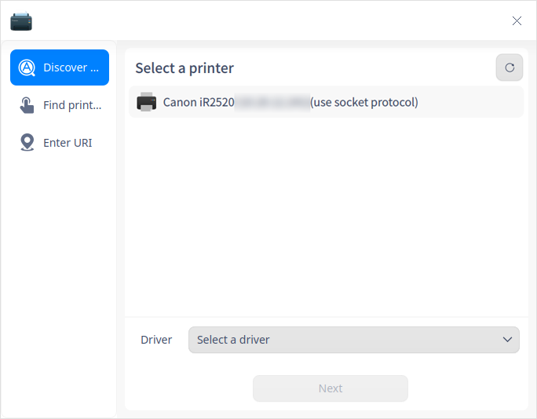

 3. Haga clic en **Instalar controlador** para entrar en la interfaz de instalación.

 #### Buscar impresora

 1. Haga clic en **Buscar impresoras**, introduzca el nombre de usuario o la dirección IP para buscar impresoras a través de diferentes protocolos. 

     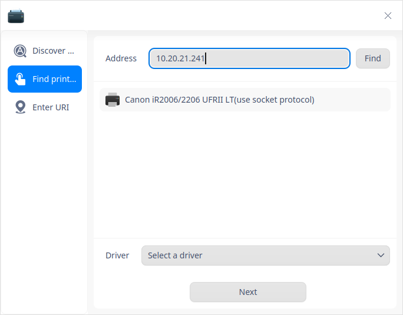

 2. Después de seleccionar una impresora, su lista de controladores se carga a continuación, y el controlador recomendado se selecciona por defecto. Si no se carga ninguna lista, puede elegir "Seleccionar un controlador" en la lista desplegable para entrar en una interfaz para elegir un controlador.

 3. Haga clic en **Instalar controlador** para entrar en la interfaz de instalación. 

 #### Ingresar URI

 1. Si no se encuentran impresoras mediante **Detectar impresoras** y **Buscar impresora**, puede encontrar e instalar el controlador de la impresora ingresando el URI.  

 2. Haga clic en **Ingresar URI** e introduzca el URI de la impresora.

    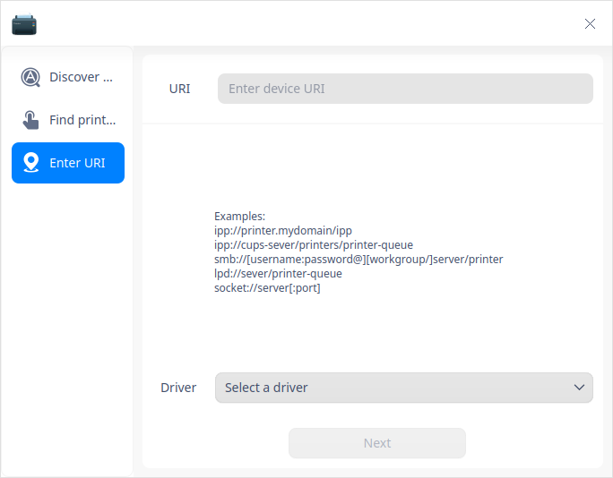

 3. La opción establecida por defecto es "Seleccionar un controlador". Haga clic en **Siguiente** para entrar en la interfaz de instalación del controlador.  

 4. Seleccione el controlador correcto y haga clic en **Instalar controlador** para acceder a la interfaz de instalación. 

 >  Nota:  El requisito previo para esta operación es que el usuario conozca el URI de la impresora y su protocolo operativo.

 ### Seleccionar controladores

 1. Controlador por defecto: El sistema elegirá en primer lugar al controlador (driver) recomendado en caso que este funcione para la impresora seleccionada. 

 2. Seleccionar un controlador: puede elegir "seleccionar un controlador". Incluyen estos proveedores: 

* Controlador local: seleccione el proveedor y el modelo en el cuadro desplegable para consultar los controladores locales.

  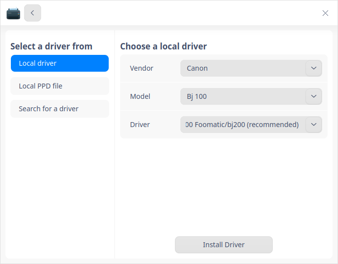

* Archivos PPD locales: arrastre y suelte los archivos PPD locales en esta area o haga clic en **Seleccione un archivo PPD** para encontrar uno en la carpeta local, por ejemplo, puede seleccionar un archivo PPD desde el directorio /usr/share/ppd.  

> Nota: El prerequisito de esta operación es que el usuario haya instalado el controlador localmente. De no hacerlo, obtendrá un aviso "No se pudo instalar el controlador".

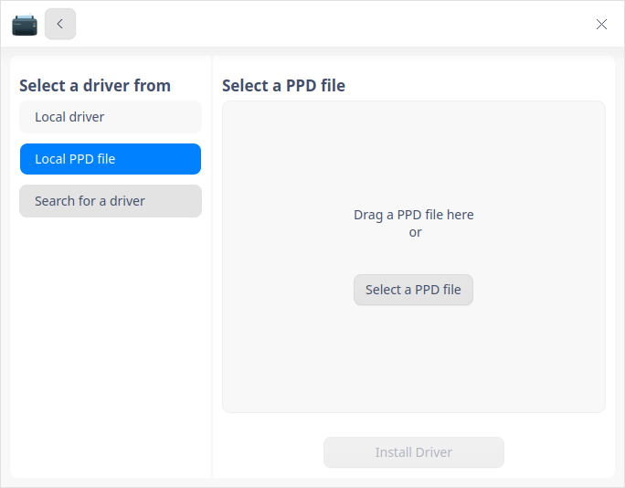

* Buscar controlador: introduzca el fabricante y el modelo, y el sistema buscará en la biblioteca de controladores a fondo. Los resultados aparecerán en el cuadro desplegable. 

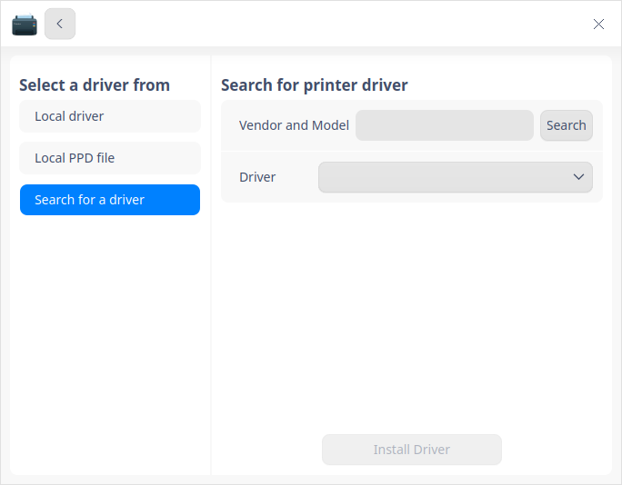

### Instalación de la impresora

Después de añadir una impresora y seleccionar el controlador correcto, haga clic en **Instalar controlador** para entrar en la interfaz de instalación.  

- Instalado exitosamente 
  Aparece una ventana que señala cuando la impresora se ha instalado con éxito, en la que puede hacer clic en **Imprimir página de prueba** para verificar si la impresión funciona normalmente, o bien, puede hacer clic en **Ver impresora** para entrar en la interfaz del Gestor de impresoras. 

  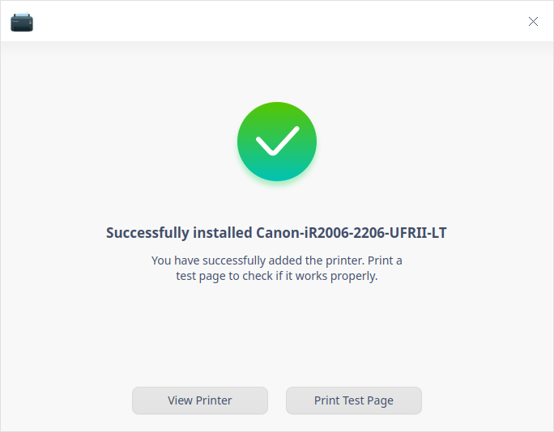

- Instalación fallida
  
  Puede optar por reinstalar si aparece una indicación que dice "Instalación fallida". 

  

### Interfaz de Impresoras

Una vez que una impresora es añadida con éxito, al hacer clic en la impresora en la interfaz del Gestor de impresoras, puede ver los botones de la derecha, que son "Propiedades", "Cola de impresión", "Imprimir página de prueba", "Suministros" y "Solución de problemas". 

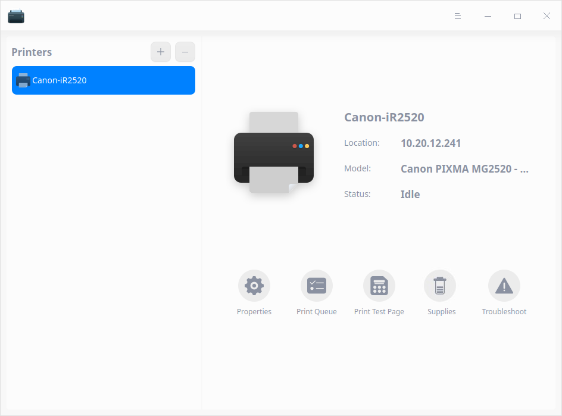

#### Propiedades 

1. Haga clic en **Propiedades** para ver todos los ajustes de la impresora.

2. Puede ver la información sobre el controlador de la impresora, el URI, la ubicación, la descripción, el modo de color y la resolución en lugar de configurarlos.

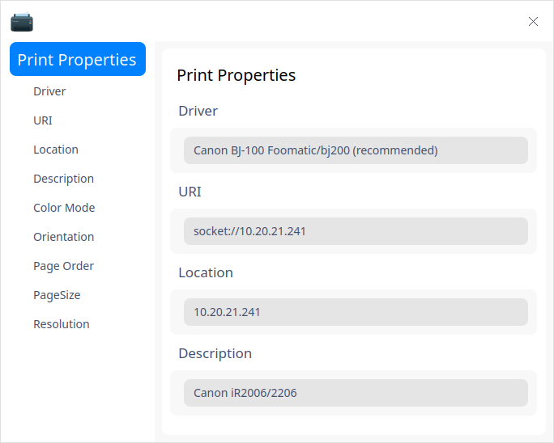

3. Los elementos configurables son: fuente de papel, tipo de papel, tamaño de papel, dúplex, márgenes, orientación, orden de las páginas y encuadernación. 
  - Modo de color: El **color RGB** viene definido por defecto. Puede elegir otras opciones según sus necesidades.

  - Orientación: **Retrato (sin rotación)** está configurado por defecto. También tiene otras tres opciones como **Panorámico (90 grados)**, **Panorámico invertido (270 grados)** y **Retrato invertido (180 grados)**.

  - Orden de las páginas: **Normal** está establecido por defecto. La otra opción es **Inverso**.

  - Tamaño de página: **Carta** está establecido por defecto. Puede elegir otro tamaño según sus necesidades.

  - Resolución: aquí puede elegir la resolución adecuada.

  - Tipo de papel: **Photo Paper Pro Platinum** es la opción predetrminada. Hay muchas otros modelos para elegir. 

  - Origen del papel: **Bandeja trasera** está configurada por defecto. Puede elegir la bandeja de papel según la situación práctica. 

  - Calidad de impresión: Por defecto se recurre al **Estándar**. La otra opción es **Manual**.

  - Resolución: **Automática** está configurada por defecto. Hay muchas otras opciones para elegir. 

  - Reducir la página si es necesario para ajustar los bordes: **Encoger (imprimir toda la página)** está configurado por defecto. Las otras dos opciones son **Recortar (conservar las dimensiones)** y **Expandir (utilizar el área máxima de la página)**.

4. Restablecer valores predeterminados: haga clic en este botón y todos los ajustes se restablecerán a los valores predeterminados. 
   
   > Notas: Las **propiedades** están relacionadas con el modelo de impresora y su controlador. Diferentes modelos de impresora y controladores tienen sus propias propiedades. Puede ajustarlas según su situación práctica. 

#### Cola de impresión

1. Haga clic en **Cola de impresión**, entrará en una interfaz, puede seleccionar opciones como "Todo", "Cola de impresión", "Completado" y "Actualizar". Por defecto se muestra como **Cola de impresión**. 

2. La lista contiene: "Trabajo", "Usuario", "Documento", "Impresora", "Tamaño", "Hora de presentación", "Estado" y "Acción". 

3. Seleccione un trabajo, haga clic con el botón derecho y podrá seleccionar **Cancelar**, **Borrar**, **Pausar**, **Reanudar**, **Imprimir primero** y **Reimprimir**. 

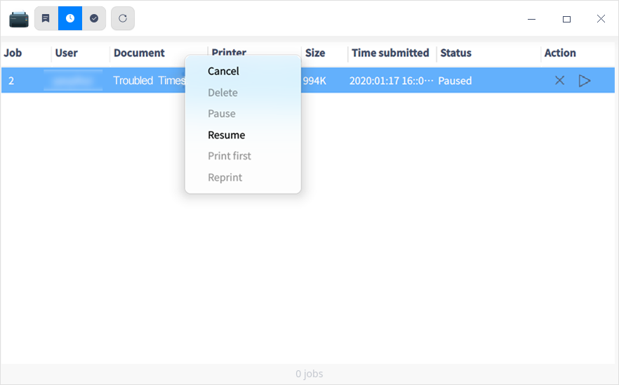

#### Imprimir página de prueba

Haga clic en **Imprimir página de prueba** para comprobar si la impresión se ha completado con éxito. 

  - Imprimir con éxito: si la impresión se completa con éxito, puede continuar con otras tareas.

  - Impresión fallida: si la impresión falla, puede volver a instalar una impresora o iniciar la resolución de problemas. 

#### Suministros

En la interfaz principal de Impresoras, haga clic en **Supplies** para ver el estado de la tinta/tóner. Si es insuficiente, es necesario reemplazarlo.

#### Solución de problemas

Si la impresión falla, puede hacer clic en **Solución de problemas**, la lista de comprobación incluye los siguientes elementos: 

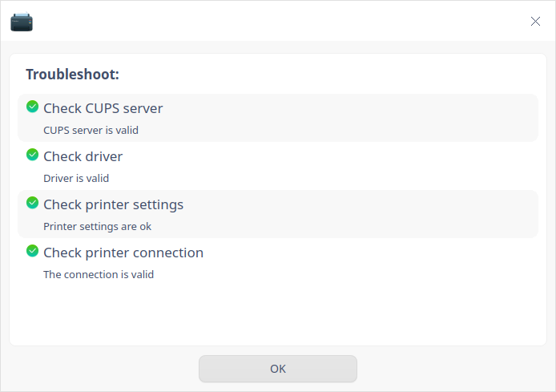

  - Comprueba si el servidor CUPS es válido.

  - Comprueba si el controlador es válido.

  - Comrpueba si la configuración de la impresora es correcta, es decir, si la impresora se inicia y si se aceptan las tareas.

  - Comprueba si la conexión de la impresora es válida.

    
#### Opciones del botón derecho del ratón 

Seleccione la impresora y haga clic con el botón derecho, tendrá cuatro opciones como "Compartida", "Activada", "Aceptar tareas" y "Establecer como predeterminada". 

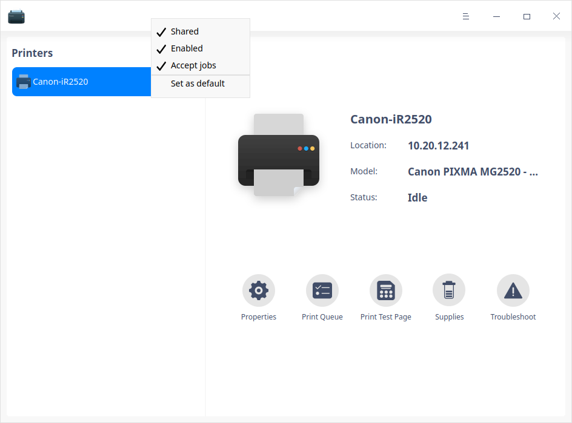

### Quitar impresora

En la interfaz principal, haga clic en  para quitar la impresora seleccionada. 

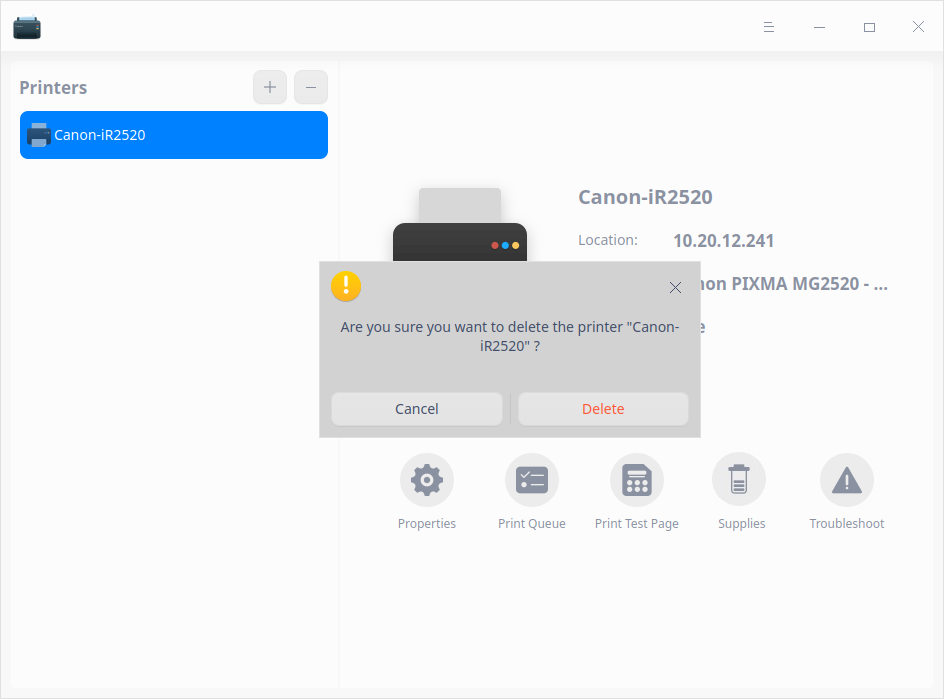

## Menú principal

En el menú principal, puede configurar los servidores básicos, cambiar de tema, ver el manual de ayuda, etc.

### Ajustes

1. Haga clic en en la interfaz.

2. Haga clic en **Ajustes**.

3. La configuración básica del servidor incluye: 

  - Publicar impresoras compartidas conectadas a este sistema: Permitir la impresión por Internet
  - Permitir administración remota
  - Guardar información de depuración para solución de problemas 

  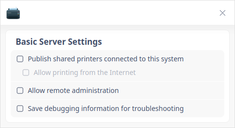

### Tema

El tema de la ventana incluye Tema Claro, Tema Oscuro y Tema del Sistema.

1. Haga clic en en la interfaz.
2. Haga clic en **Tema** para seleccionar uno.

### Ayuda

Haga clic en Ayuda para obtener el manual, que le ayudará a conocer y utilizar mejor Impresoras.

1. Haga clic en en la interfaz.
2. Haga clic en **Ayuda** para ver el manual.

### Acerca de

1. Haga clic en en la interfaz.
2. Haga clic en **Acerca de** para ver la información de la versión y la introducción sobre Impresoras.

### Salir

1. Haga clic en en la interfaz.
2. Haga clic en **Salir**.

