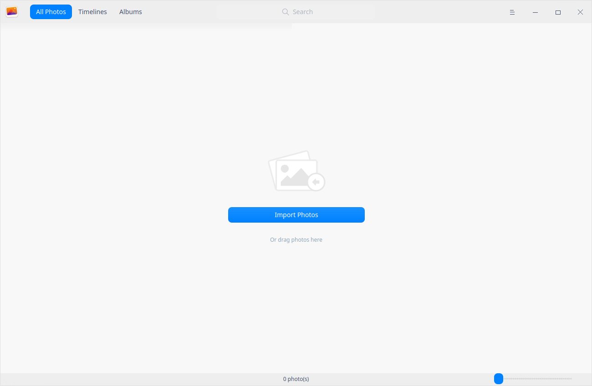
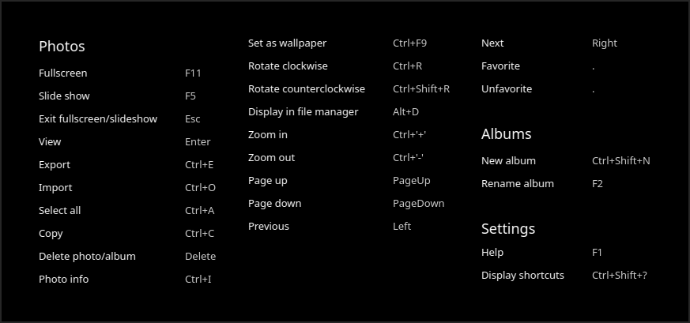
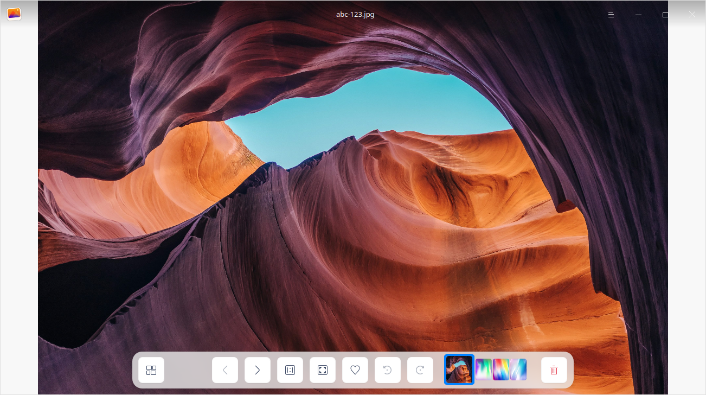
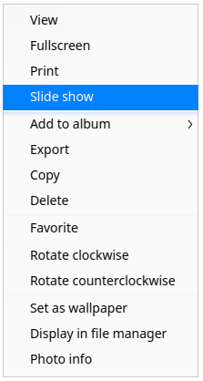
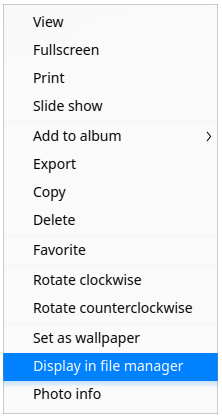
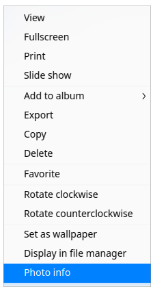
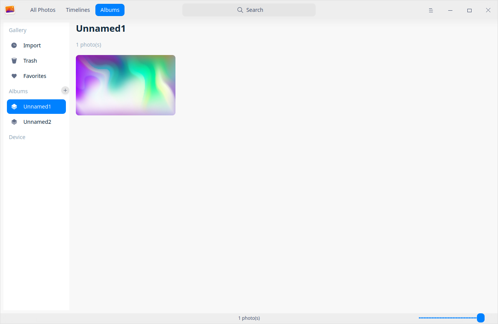
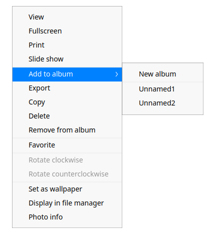

# Álbum|../common/deepin-album.svg|

## Descripción

Álbum es una herramienta de gestión de fotos elegante y fluida, que permite ver y gestionar las imágenes en varios formatos. Puede ordenar sus fotos por fecha o por línea de tiempo como desee, añadirlas a los favoritos o clasificarlas en diferentes álbumes para realizar una gestión ordenada.

## Guía

Puede ejecutar, cerrar o crear accesos directos para el Álbum de las siguientes maneras.

### Iniciar Álbum

1. Haga clic en  en el Muelle y entre en la interfaz del Launcher.
2. Localice  desplazando la rueda del ratón o buscando "álbum" en la interfaz del Lanzador y haga clic en él para ejecutarlo.
3. Haga clic con el botón derecho del ratón en  y podrá
 - Hacer clic en **Enviar al escritorio** para crear un acceso directo al escritorio.
 - Hacer clic en **Enviar al muelle** para fijar la aplicación en el Muelle.
 - Hacer clic en **Añadir al inicio** para añadir la aplicación al inicio y que se ejecute automáticamente cuando se inicie el sistema.

> Consejo: En el Centro de Control, puede establecer Álbum como la aplicación de visualización de fotos por defecto. Consulte [Aplicaciones predeterminadas](dman:///dde#Ajustes de aplicaciones predeterminadas) para conocer las operaciones específicas.

### Salir de Álbum

- En la interfaz de la aplicación, haga clic en para salir de Álbum.
- Haga clic con el botón derecho del ratón en  en el Muelle y seleccione **Cerrar todo** para salir de Álbum.
- En la interfaz de la aplicación, haga clic en  y seleccione **Salir** para salir de Álbum.

### Ver accesos directos

En la interfaz de Álbum, pulse **Ctrl + Shift + ?** para ver los accesos directos. El dominio de los atajos mejorará enormemente su eficiencia.

## Gestión de fotos

Puedes gestionar las fotos por "Líneas de tiempo" y "Álbumes" después de lanzar el Álbum.

### Importar fotos

En la interfaz de Álbum, puede importar fotos de la siguiente manera:
- Haga clic en  > **Importar fotos**.
- Arrastre directamente la foto o la carpeta donde se encuentra la foto a la interfaz del Álbum.
- Importe fotos desde el dispositivo móvil.

> Consejo: También puede importar fotos al Álbum vacío haciendo clic en **Importar fotos** en la interfaz del Álbum.

> Nota:  Los formatos de imagen soportados son BMP, GIF, JPG, PNG, PBM, PGM, PPM, XBM, XPM, SVG, DDS, ICNS,  MNG, TGA, TIFF, WBMP, WEBP, PSD, ICO, JNG, PCD, PCX, TIF, RAS, MRW, DNG, RAF, CR2, RAW, ORF y NEF.
### Buscar fotos

1.  En el cuadro de búsqueda de la parte superior de la interfaz del Álbum, puede hacer clic enpara introducir palabras clave.
   
2.  Pulse la tecla **Intro** del teclado para localizar rápidamente las fotos buscadas.
   - Cuando haya información coincidente, se mostrará una lista de resultados de búsqueda en la interfaz.
   - Si no se encuentra ninguna información, se mostrará "No hay resultados de búsqueda" en la interfaz.

### Ver fotos

Haga clic en la barra de desplazamiento de la interfaz del Álbum para ajustar el tamaño de las miniaturas de las fotos.

Haga doble clic en la foto, o haz clic con el botón derecho en la foto y selecciona **Ver** para entrar en la interfaz de visualización de fotos. Pulse **Esc** en el teclado para salir.

| Icon                                               | Name                    | Description                                                  |
| -------------------------------------------------- | ----------------------- | ------------------------------------------------------------ |
|               | Atrás                    | Vuelve a la interfaz principal.                                  |
|                      | Anterior                | Cambia a la foto anterior.                                |
|                              | Siguiente                    | Cambia a la foto siguiente.                                       |
|                | Tamaño 1:1                | La foto se mostrará en tamaño 1:1 sin cambiar el tamaño de la ventana. |
|                    | Ajustar a ventana           | La foto se redimensionará para adaptarse a la ventana actual.    |
|                        | Favorito                | Añada sus fotos importantes a la sección Favoritos. |
|  | Girar hacia la derecha        | Gira la foto 90 grados en sentido de las agujas del reloj.                       |
|              | Girar hacia la izquierda | Gira la foto 90 grados en sentido contrario a las agujas del reloj.                |
|                          | Borrar                  | Borrar la foto actual.                                    |

&nbsp;&nbsp;&nbsp;&nbsp;&nbsp;&nbsp;&nbsp;&nbsp;&nbsp;&nbsp;&nbsp;&nbsp;&nbsp;

> Consejo: Desplace la rueda del ratón para ampliar la foto. Si el tamaño de la foto supera la ventana, aparecerá una ventana de navegación en la parte inferior. Arrastre el cuadro de la ventana para localizar rápidamente el área de la foto correspondiente. Puede hacer clic en  en la esquina superior derecha de la ventana de navegación para cerrarla. Haga clic con el botón derecho del ratón en la foto y seleccione **Ocultar/Mostrar panel de navegación**.

### Ver líneas de tiempo

En las líneas de tiempo, todas las fotos se ordenan por fecha. Aquellas tomadas en la misma fecha se agrupan y mientras que otras con fechas diferentes se muestran en columnas separadas. Las líneas de tiempo le permiten localizar rápidamente las fotos de un día concreto.

### Imprimir fotos

1. En la interfaz del Álbum, seleccione la foto que desea imprimir y haga clic con el botón derecho para seleccionar **Imprimir**.
2. Seleccione la impresora y configure las opciones de impresión según sea necesario.
3. Haga clic en el icono **Imprimir** para imprimir. 

### Presentación

1.  En la interfaz del Álbum, haga clic con el botón derecho en una foto.
2. Seleccione **Presentación** para reproducir la foto en diapositivas a pantalla completa.
3. Pulse **ESC** en el teclado para salir. 

### Copiar fotos

1.  En la interfaz del Álbum, haga clic con el botón derecho en una foto.
2.  Seleccione **Copiar**.
3.  Haga clic con el botón derecho en el escritorio o en un lugar de destino y seleccione **Pegar** para copiar el archivo de la foto aquí.

### Borrar fotos

Puede eliminar fotos de los álbumes de las siguientes maneras:

- Haga clic en el icono  de la interfaz del Álbum cuando vea las fotos.
- Haga clic derecho en la foto para seleccionar **Borrar**.
- En la interfaz del Álbum, selecciona la foto y pulsa **Borrar** en el teclado.

> Consejo: Las fotos borradas del Álbum no se eliminan permanentemente, sino que se almacenan temporalmente en la "Papelera" (puede verlo al hacer clic en **Álbumes** en la parte superior de la interfaz). Cuando el número que aparece en los días restantes de la foto sea 0, las fotos se eliminarán de forma permanente. Por lo tanto, use la Papelera para restaurar o eliminar la foto.

### Fotos favoritas

1. En la interfaz del Álbum, haga clic con el botón derecho en una foto.
2. Seleccione **Añadir a favoritos** y la foto se añadirá a **"Favoritos "**.
3. 3. Haz clic con el botón derecho del ratón sobre la foto en **Favoritos** para **Quitar de favoritos**.

> Consejo: Cuando vea una foto, haga clic en el icono  para añadir a favoritos y vuelva a hacer clic en  para quitar de favoritos.

### Rotar fotos

1. En la interfaz del Álbum, haga clic con el botón derecho en una foto y seleccione **Girar hacia la izquierda** o **Girar hacia la derecha**.
2. La foto se girará 90 grados en sentido antihorario u horario, según corresponda.

>  Notas: Si utiliza un equipo provisto con pantalla táctil o touchpad, puede utilizar los gestos de la pantalla táctil para operar en lugar del ratón: 
>
> - En la pantalla táctil, coloque dos dedos sobre la foto y mantenga una cierta distancia, y gire los dos dedos al mismo tiempo para girar la foto.
> - En el panel táctil que admite el toque de varios puntos, coloque dos dedos sobre la foto y mantenga una cierta distancia, y gire los dos dedos al mismo tiempo para girar la foto.

### Establecer como fondo de pantalla

1.  Haga clic con el botón derecho del ratón sobre la foto en la interfaz del Álbum.  
2.  Seleccione **Establecer como fondo de pantalla** para establecer la foto actual como fondo de pantalla.

### Visualización en el Gestor de archivos

1.  Haga clic con el botón derecho del ratón sobre la foto en la interfaz del Álbum.  
2.  Seleccione **Mostrar en el gestor de archivos** para abrir la carpeta donde se encuentra la foto.

### Ver información de la foto

1.  Haga clic con el botón derecho del ratón sobre la foto en la interfaz del Álbum. 
2.  Seleccione **Información de la foto** para ver la información detallada de las fotos.

## Organización de álbumes

En la interfaz de Álbum, dispone de la posibilidad de crear nuevos álbumes, gestionar las fotos del álbum y ver todos los álbumes.

> Nota: **Importados**, **Papelera** y **Favoritos** son álbumes generados automáticamente por el sistema en función al estado del contenido, por lo que no se pueden borrar ni renombrar.

### Crear nuevos álbumes

1.  En la interfaz del Álbum, haga clic en  o  > **Nuevo álbum**.
2.  Introduzca el nombre del álbum y haga clic en **Crear**.

> Consejo: Intente crear un nuevo álbum haciendo clic con el botón derecho del ratón en el conjunto creado para seleccionar **Nuevo álbum** o cree un nuevo álbum al añadir fotos a los anteriores.

### Añadir fotos a los álbumes

1.  En la interfaz del Álbum, haga clic con el botón derecho en una foto y seleccione **Añadir al álbum**.
2.  Seleccione un álbum y añada la foto a él.

>Consejo: también podrá añadir fotos a un álbum arrastrando la foto o la carpeta de fotos directamente a él.

### Borrar fotos de los álbumes

1.  En la interfaz del Álbum, haga clic con el botón derecho en una foto de un álbum.
2.  Seleccione **Borrar del álbum** para eliminar la foto del álbum.

### Renombrar álbumes

1.  En la interfaz de Álbumes, haga clic con el botón derecho del ratón en el álbum a renombrar y seleccione **Renombrar**. 
2.  Introduzca el nombre del álbum y pulse la tecla **Intro** del teclado o haga clic en la zona en blanco de la interfaz.

### Exportar álbumes

1.  En la interfaz del Álbum, haga clic derecho en un álbum.
2.  Selecione **Exportar**.

### Borrar álbumes

1.  En la interfaz del Álbum, haga clic derecho en un álbum.
2.  Selecione **Borrar**.

## Menú principal

En el menú principal, puede [Crear nuevos álbumes](#Crear nuevos álbumes), [Importar fotos](#Importar fotos), cambiar los temas de las ventanas, ver la ayuda y obtener más información sobre el álbum.

### Tema

El tema de la ventana incluye el Tema claro, el oscuro y el sistema.

1.  En la interfaz de Álbum, haga clic en .
2.  Haga clic en **Tema** para elegir un tema.

### Ayuda

Haga clic en **Ayuda** para ver el manual.

1.  En la interfaz del Álbum, haga clic en .
2.  Haga clic en **Ayuda** para ver el manual de Álbum.

### Acerca de

1.  En la interfaz de Álbum, haga clic en .
2.  Haga clic en **Acerca de** para ver la versión y las presentaciones de Album.

### Salir

1.  En la interfaz de Álbum, haga clic en .
2.  Haga clic en **Salir** para salir de Álbum.
