# App Store|../common/deepin-appstore.svg|

## Descripción
App Store es una aplicación que integra funciones como la visualización de aplicaciones, la descarga, la instalación, la desinstalación, los comentarios, la valoración y la recomendación. La tienda recopila diferentes tipos de aplicaciones para sus necesidades, cada una de las cuales ha sido instalada y verificada manualmente. Puede buscar las aplicaciones más populares con un solo clic de descarga e instalación automática.           

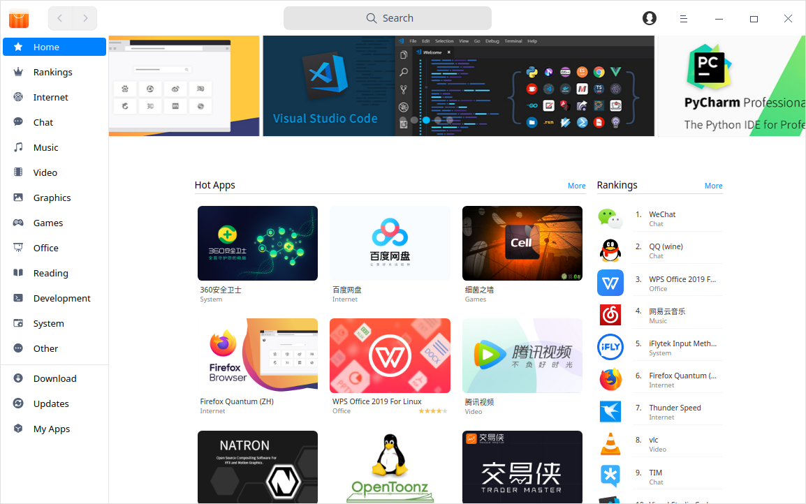

## Guía

Puede ejecutar, cerrar o crear un acceso directo de App Store de la siguiente manera.

### Ejecutar App Store

1. Pulse  en la esquina inferior izquierda del dock para entrar en la interfaz del lanzador.
2. 2. Localice  desplazando la rueda del ratón o buscando "App Store" en la interfaz del Launcher y haga clic en él para ejecutarlo. 
3. Haga clic con el botón derecho del ratón en  para que:
 - Seleccione **Enviar al escritorio** para crear un acceso directo en el escritorio.
 - Seleccione **Enviar al muelle** para fijarlo en el dock.
 - Seleccione **Añadir al inicio** para añadirlo al inicio. Cuando el ordenador se inicia, App Store se ejecuta automáticamente.

>  Nota: App Store se fijó en el muelle por defecto. Haga clic en  en el muelle para ejecutarlo.

### Salir de App Store

- En la interfaz de App Store, haga clic en  para salir.
- Haga clic con el botón derecho en  en el Dock y seleccione **Cerrar todo** o **Forzar cierre** para salir.
- En la interfaz de la App Store, clic en  y seleccione **Salir**.

## Interfaz principal
La interfaz principal consiste en la barra de navegación, el cuadro de búsqueda, el menú principal, la presentación de diapositivas, las nuevas actualizaciones, las aplicaciones más populares, las clasificaciones, las aplicaciones esenciales, los temas candentes, la gestión de descargas, las actualizaciones y mis aplicaciones.

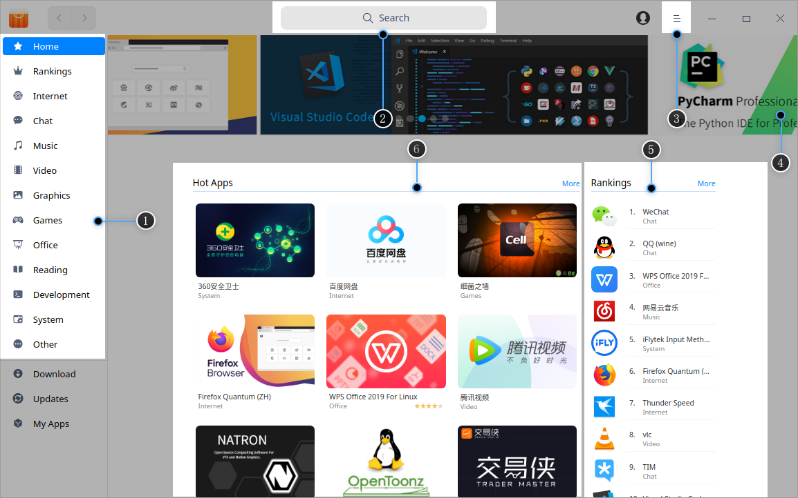

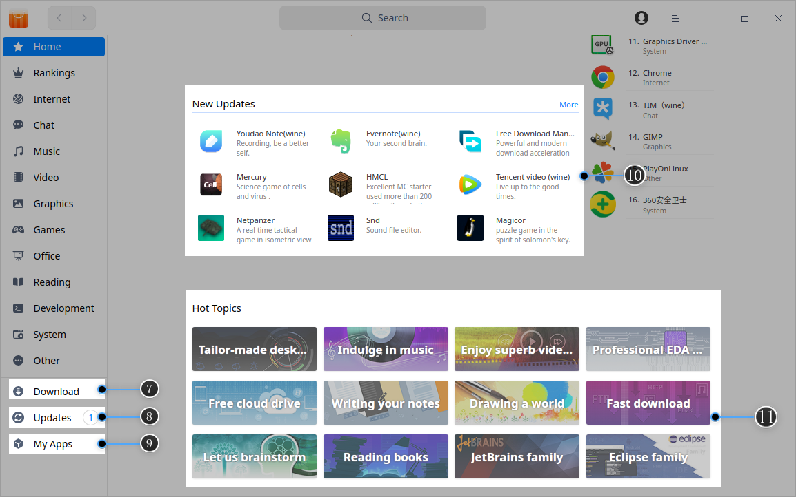

<table class="block1">
    <caption>Interfaz principal</caption>
    <tbody>
        <tr>
            <td width="20px">1</td>
            <td width="100px">Panel izquierdo</td>
            <td>Muestra principalmente la página de inicio, las populares y las categorías de aplicaciones.</td>
        </tr>
        <tr>
            <td>2</td>
            <td>Cuadro de búsqueda</td>
            <td>Encuentre rápidamente la app desde el cuadro correspondiente.</td>
        </tr>
         <tr>
            <td>3</td>
            <td>Menú principal</td>
            <td>Puede borrar la caché, cambiar de tema, ver el contenido de Ayuda y Acerca de, y salir de la App Store.</td>
        </tr>
        <tr>
            <td>4</td>
            <td>Dispositivas</td>
            <td>Las imágenes de las apps recomendadas aparece en dispositiva.</td>
        </tr>
         <tr>
            <td>5</td>
            <td>Populares</td>
            <td>Los rankings de descarga de aplicaciones se muestran en la página de inicio.</td>
        </tr>
        <tr>
            <td>6</td>
            <td>Tendencias</td>
            <td>Aquellas recomendadas y en tendencia se muestran acá.</td>
        </tr>
        <tr>
            <td>7</td>
            <td>Descarga</td>
            <td>Aquí se muestran las tareas que se están descargando y el progreso de la descarga y la instalación. Puede pausar y eliminar cualquier tarea de descarga.</td>
        </tr>
        <tr>
            <td>8</td>
            <td>Actualizaciones</td>
            <td>Aquí puede ver las aplicaciones que se van a actualizar y puede elegir si la cambia a la última versión o no.</td>
        </tr>
        <tr>
            <td>9</td>
            <td>Mis aplicaciones</td>
            <td>Aquí podrá ver todas las aplicaciones instaladas y desinstalar las que ya no necesite.</td>
        </tr>
            <tr>
            <td>10</td>
            <td>Nuevas actualizaciones</td>
            <td>Aquí se muestran las aplicaciones recién añadidas a la App Store.</td>
        </tr>
             <tr>
            <td>11</td>
            <td>Tópicos populares Topics</td>
            <td>Apps solicitadas en categorías se muestran al final.</td>
        </tr>
   </tbody>
   </table>

 ## Gestión de aplicaciones
Puede buscar, descargar e instalar diferentes categorías de aplicaciones, y también, puede explorar más aplicaciones espléndidas a través de la presentación de diapositivas, nuevas actualizaciones, aplicaciones esenciales, aplicaciones populares, recomendaciones, temas candentes, clasificaciones, comentarios de los usuarios y otras formas. 

 ### Buscar aplicaciones
 1. La función de búsqueda está incorporada en la App Store, puede hacer clic para introducir palabras clave;

 2. Cuando introduzca una palabra clave, todas las aplicaciones que la contengan se mostrarán automáticamente a continuación, entonces podrá ver todas las aplicaciones que contengan esa palabra clave.

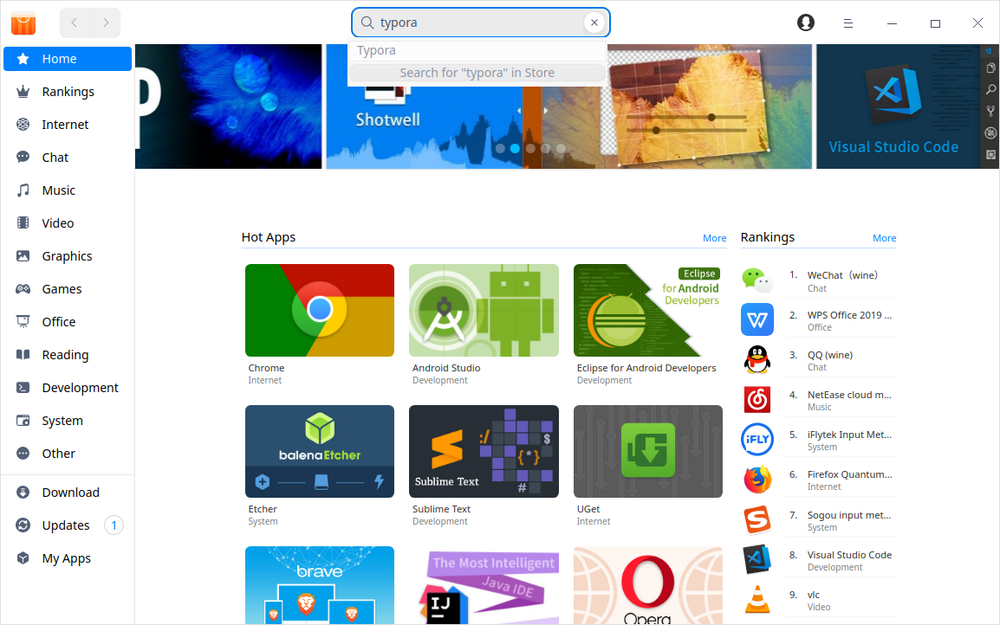

### Descarga/Instalación de aplicaciones
App Store ofrece la descarga e instalación de aplicaciones con un solo clic. Durante el proceso de descarga e instalación, puede pausar y eliminar, así como ver el progreso actual.

App Store admite la sincronización de aplicaciones. Después de iniciar sesión, puede sincronizar las aplicaciones instaladas en otros dispositivos con el mismo ID, e instalar las aplicaciones en la nube con un solo clic.

> Notas: Si no ha iniciado sesión, las aplicaciones instaladas sólo se mostrarán en las aplicaciones locales.

#### Local Applications

1. En la interfaz de la App Store, puede pasar directamente el cursor sobre el icono o el nombre de la aplicación y, a continuación, hacer clic en .

2. Haga clic en **Descargar** en el panel izquierdo para ver el progreso de la descarga/instalación.

   > Consejos: puede hacer clic en el icono o el nombre de la aplicación para entrar en la página de información para ver la información básica y, a continuación, hacer clic en .

   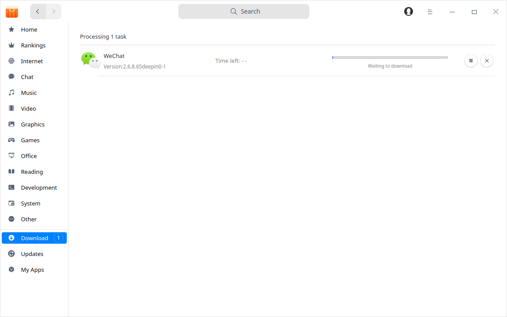

3. Tras la instalación, las aplicaciones instaladas se muestran sólo como aplicaciones locales. Haga clic en **Filtro de aplicaciones** para filtrar las aplicaciones en función de las categorías.

   

   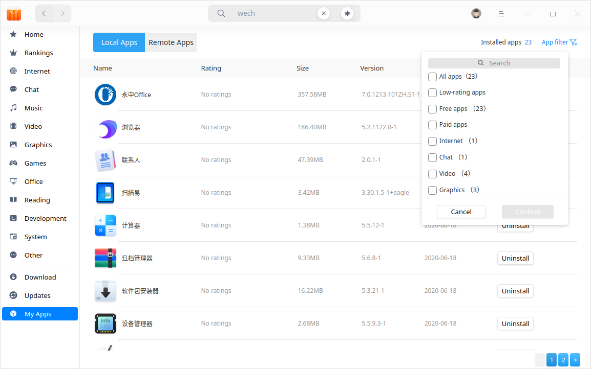

   

#### Sincronizar aplicacioness

1. Inicie sesión con su ID de Deepin, seleccione **Mis Aplicaciones** para mostrar la interfaz de Mis Aplicaciones desde el Centro Personal.
2. Haga clic en **Aplicaciones remotas** para ver todas las aplicaciones en la nube instaladas por el ID.
3. Seleccione las que quieras instalar y haz clic en  .
4. Tras la instalación, las apps se mostrarán tanto en las apps locales como en la nube de forma sincronizada.
5. Si desea instalar las aplicaciones por lotes, puede elegir **Instalar todo**. Marque todas las aplicaciones en la nube que desee instalar y haga clic en **Iniciar la instalación**.

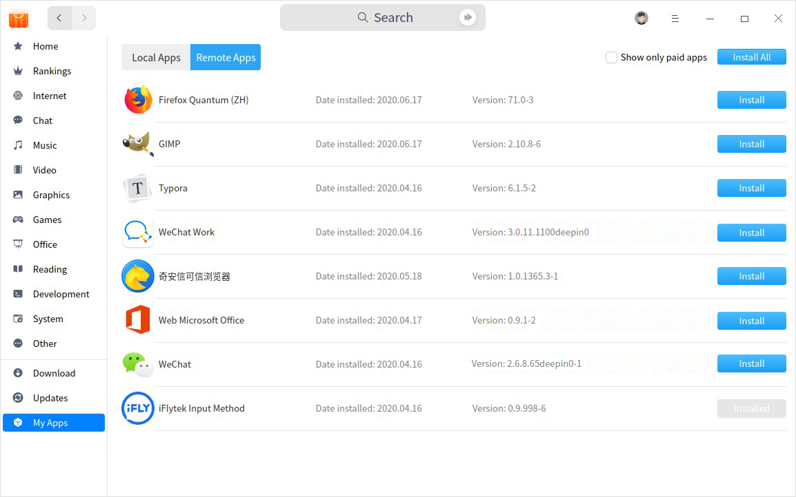

### Actualizar aplicaciones

Seleccione **Actualizaciones** en la interfaz para ver las aplicaciones que se van a actualizar aquí y puede elegir si desea conseguir la última versión o no.

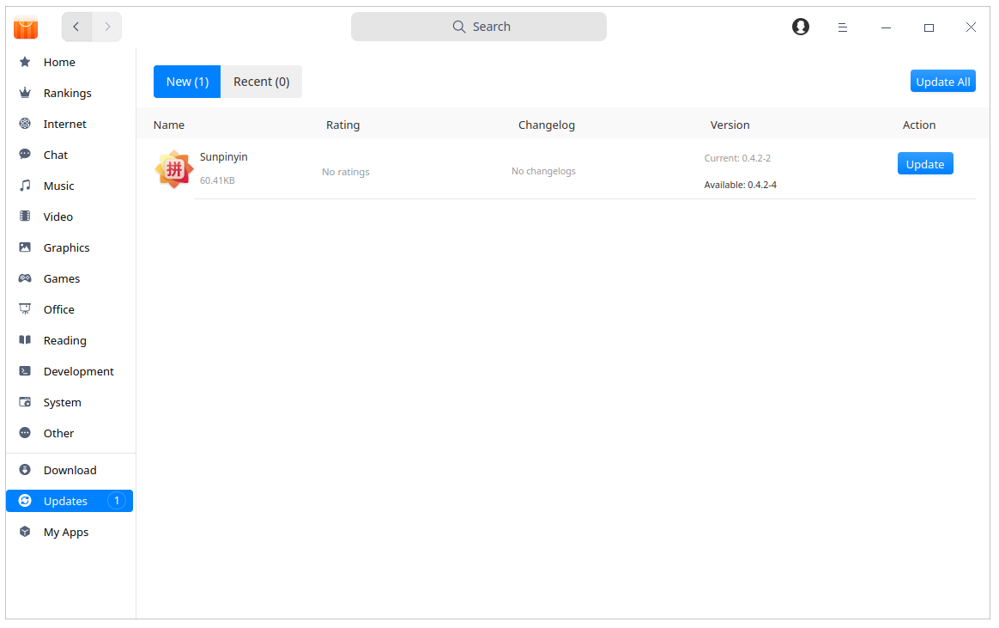

> Consejo: También puede actualizar/actualizar aplicaciones en el Centro de control. Consulte [Ajustes de actualización](dman:///dde#Ajustes de actualización) para conocer las operaciones concretas.

### Desinstalar aplicaciones

Además de desinstalar aplicaciones en el Lanzador (las operaciones específicas se refieren a [Desinstalar aplicaciones](dman:///dde#Desinstalar aplicaciones)) puede desinstalar directamente las aplicaciones en App Store.

En la interfaz de **Mis aplicaciones**, haga clic en **Aplicaciones locales**, busque las aplicaciones que desea desinstalar, y pulse en  .

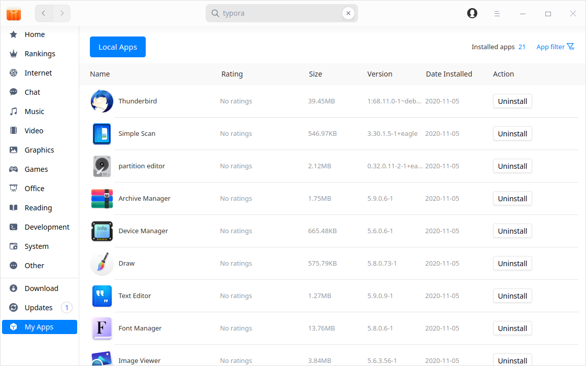

## Página de la aplicación

### Detalles de la aplicación
Puede abrir la página de información de cualquier aplicación para ver sus valoraciones, tiempos de descarga, categoría, versión, tamaño del paquete, fecha de actualización e información como etiquetas de la aplicación, fuentes, breve introducción y comentarios.

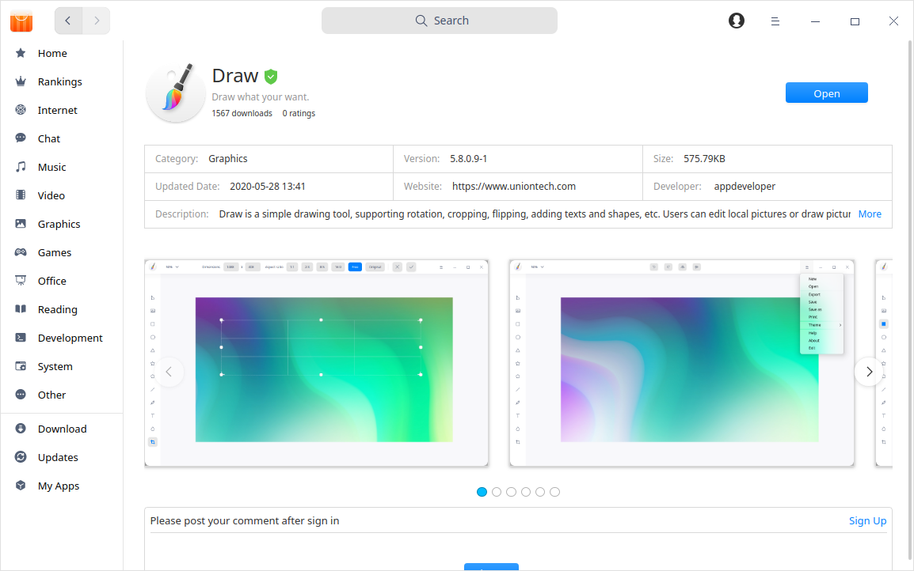

### Comentar y evaluar

- Después de iniciar sesión con su ID de Deepin, puede comentar y calificar las aplicaciones. Haga clic en **Informar de un error** para comentar los errores de software. También podrá dar "me gusta" a los comentarios de otros usuarios. 

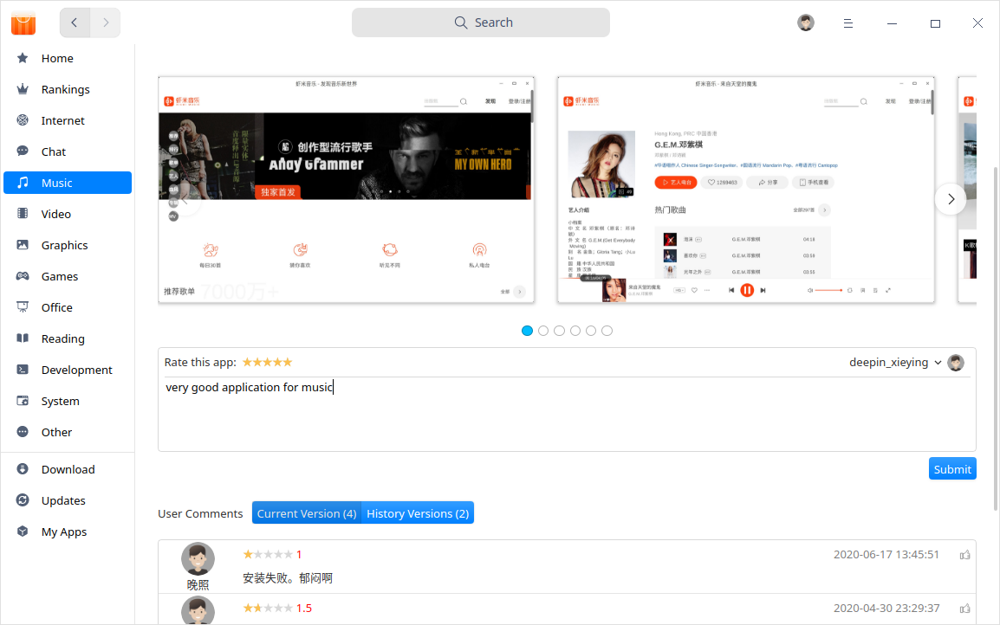

- Haz clic en el avatar de la barra de título y selecciona **Mis comentarios** para ver y editar todas tus valoraciones y comentarios. Si no has iniciado sesión, sólo podrás ver los comentarios y las valoraciones.

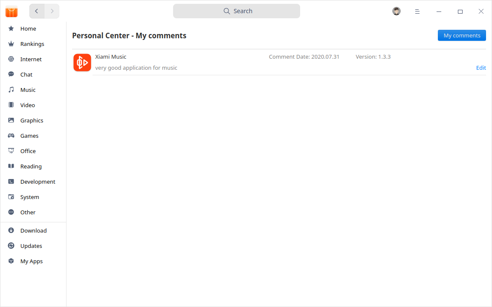

## Menú principal

### Iniciar sesión
1. En la interfaz de la App Store, haz clic en el avatar de la barra de título.
2. En la ventana emergente, introduzca el nombre de usuario, correo electrónico o número de teléfono registrado y la contraseña.

3. Clic **Iniciar sesión**.

> Atención: Si todavía no tiene un ID de deepin, haga clic en **Registrarse** en el cuadro emergente para crear su cuenta. 

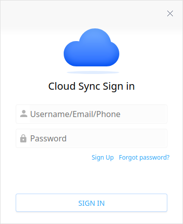

### Limpiar caché
1. Haga clic en  en la interfaz principal.
2. Haga clic en **Borrar caché** para borrar las cachés de los paquetes.

### Tema

El tema de la ventana incluye el tema claro, el tema oscuro y el tema del sistema.

1. Haga clic en  en la interfaz principal.
2. Haga clic en **Tema** para elegir un tema.

### Ayuda

Haga clic en Ayuda para obtener el manual, que le ayudará a conocer y utilizar mejor la App Store.

1. Haga clic en  en la interfaz principal.
2. Haga clic en **Ayuda** para ver el manual de App Store.

### Acerca de
1. Haga clic en  en la interfaz principal.
2. Haga clic en **About** para ver la información de la versión de App Store.

### Salir
1. Haga clic en  en la interfaz principal.
2. Haga clic en **Salir**.
