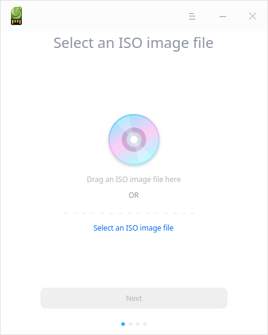
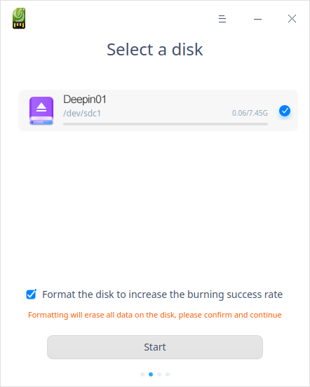
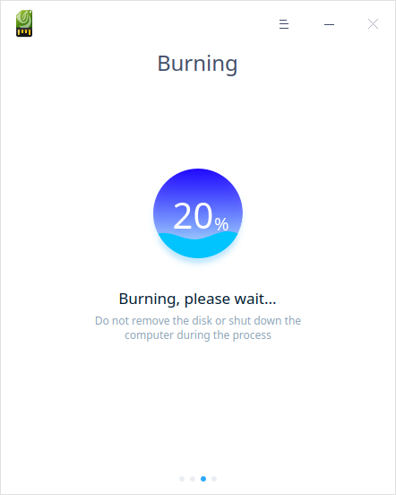
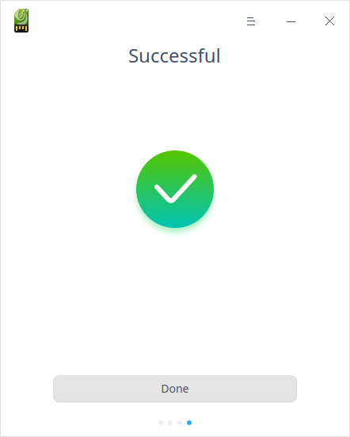
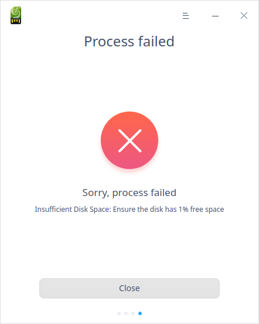

# Creador de arranque|../common/deepin-boot-maker.svg|

## Vistazo

El creador de arranque es una herramienta fácil de usar con una interfaz sencilla que le ayudará a grabar los archivos de imagen del sistema en un medio de instalación como CDs y discos USB.

## Guía

### Ejecutar Creador de arranque

1. Haga clic en  en el Muelle para entrar en la interfaz del lanzador.

2. 2. Localice  desplazando la rueda del ratón o buscando "Creador de arranque" en la interfaz del Lanzador y haga clic en él para ejecutarlo. 

3. Haga clic con el botón derecho del ratón en  para:

   - Seleccionar **Enviar al escritorio** para crear un acceso directo en el escritorio.
   - Seleccionar **Enviar al muelle** para fijarlo en el muelle.
   - Seleccionar **Añadir al inicio** para que se ejecute automáticamente al encender el ordenador.

### Salir del Creador de arranque

- En la interfaz principal, haz clic en  para salir.
- Haga clic con el botón derecho del ratón en  en el Dock, seleccione **Cerrar todo** o **Forzar salida** para salir.
- En la interfaz del Gestor de dispositivos, haga clic en  y seleccione **Salir** para salir.

## Operaciones

### Preparación

1. Descargue el último archivo de imagen oficial del sitio web oficial.
2. Prepare un disco USB vacío (8GB).
3. Ejecute Creador de arranque.
 - Creador de arranque está incorporado en el sistema por defecto, así que puede encontrarlo en el Launcher rápidamente.
 - Para el sistema Windows, también puede extraer xxx-boot-maker.exe del archivo de imagen.
 - Puede descargar su versión especificada desde el sitio web oficial.

### Seleccionar el archivo de imagen

Hay dos maneras de seleccionar el archivo de imagen:

1. Haga clic en **Seleccionar un archivo de imagen ISO** para seleccionar el archivo descargado y, a continuación, haga clic en **Siguiente**.

2. Arrastre un archivo de imagen ISO y suéltelo en la interfaz, luego haga clic en **Siguiente**.

> Notas: Por favor, compruebe si la suma de comprobación MD5 del archivo de imagen es la misma que la del sitio web oficial por adelantado. El fallo se produciría debido a los archivos de imagen ISO que no se descargan desde el sitio web oficial o no se descargan completamente.

### Seleccionar disco

Seleccione la unidad USB o disco y haga clic en **Inicar**.

> Consejo: Se sugiere marcar la casilla **Formatear el disco para aumentar la tasa de éxito de la grabación**.

### Grabado con éxito

El disco de arranque tarda unos minutos en crearse. Por favor, espere pacientemente. No retire el disco USB ni apague el ordenador. Cuando la barra de progreso está llena, aparece el mensaje **Listo**, lo que significa que el disco de arranque se ha hecho con éxito.  

### Grabado fallido

Las causas más comunes de este fallo serían:

- Formato de disco incorrecto
- Espacio de disco incorrecto 
- Montaje incorrecto del disco (sólo aplicable a Linux)
- Error de distracción de la imagen
- Error de ejecución del comando
- Error no identificado

> Notas: Haga clic en **Comentarios** cuando vea este botón, luego vaya a la página de comentarios de los usuarios del sitio web de la comunidad, y el sistema cargará el registro de errores automáticamente. 

## Menú principal

En el menú principal, puedes cambiar de tema, ver el manual, etc.

### Tema

El tema de la ventana incluye el tema claro, el tema oscuro y el tema del sistema.

1. Haga clic en en la interfaz.
2. Haga clic en **Theme** para seleccionar uno.

### Ayuda

Puede hacer clic para ver el manual, que le ayudará a conocer y utilizar mejor el Boot Maker.

1. Haga clic en en la interfaz.
2. Haga clic en **Ayuda**.
3. Consulte el manual.

### Acerca de

1. Haga clic en en la interfaz.
2. Haga clic en **Acerca de**.
3. Vea la descripción de la versión.

### Salir

1. Haga clic en en la interfaz.

2. Haga clic en **Salir**.
