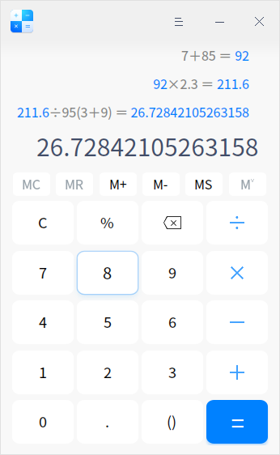
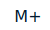
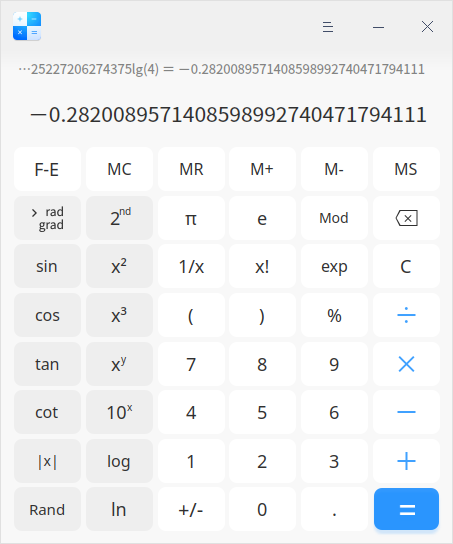
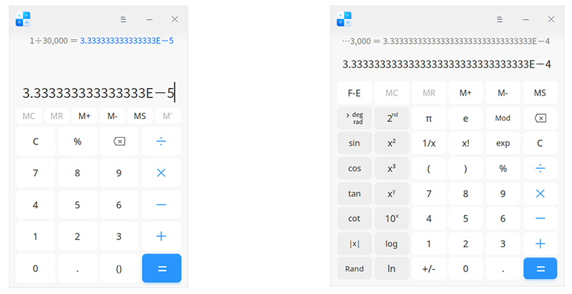

# Calculadora|../common/deepin-calculator.svg|

## Vistazo

La calculadora es una sencilla y fácil de usar herramienta de escritorio. Soporta el modo estándar y el modo científico, con la entrada del teclado perfectamente adaptada, así como la computación simbólica tolerante a fallos y la vinculación de los resultados de los cálculos.

## Operaciones

Haga clic en  > **Modo** para seleccionar el modo estándar o el modo científico. En el modo estándar, puede ejecutar las cuatro operaciones fundamentales de la aritmética (suma, resta, multiplicación y división). Y en el modo científico, puede calcular operaciones de alto nivel como la función, el exponente, la raíz, etc. El modo estándar está configurado por defecto.

### Modo estándar

​                            

| Icon                                | Nombre                                              | Description                                                  |
| ----------------------------------- | :-------------------------------------------------- | ------------------------------------------------------------ |
| 0~9                                 | Teclado numérico                                    | Números arábigos básicos                                     |
|                   | Tecla de vaciado                                    | Vacía todo lo memorizado                                     |
|                   | Tecla de almacenamiento                             | Llamar a la memoria                                          |
|                   | Tecla de almacenamiento                             | Añadir a la memoria; clic en  para añadir el número actual de forma acumulativa a la memoria e interrumpir la entrada digital. |
|                   | Tecla de almacenamiento                             | Quitar de la memoria; clic en  para sustraer el número actual de la memoria e interrumpir la entrada digital. |
|                   | Tecla de almacenamiento                             | Almacenamiento de la memoria; clic en  para añadir el valor numérico del cuadro de entrada a la lista de memoria. |
| / | Tecla de almacenamiento                             | Haga clic en para ampliar la lista de memorias; haga clic en  para plegar la lista de memorias. La memoria se vaciará cuando se cierre la Calculadora. |
| C                                   | Borrar todo                                         | Pulse una vez para borrar el contenido actual y pulse dos veces para borrar todo. |
| %                                   | Signo de porcentaje                                 | Para introducir el signo de porcentaje                       |
|           | Borrar                                              | Haga clic una vez para eliminar un carácter hacia adelante   |
| +-×÷                                | Addition, subtraction, multiplication, and division | Suma, resta, multiplicación y división                       |
| .                                   | Punto decimal                                       | Para introducir el punto decimal                             |
| ()                                  | Paréntesis                                          | Para introducir paréntesis izquierdo y derecho completado automáticamente. |
| =                                   | Signo igual                                         | Para obtener el resultado                                    |

### Modo científico

| Icon                                                         | Name       | Description                                                         |
| ------------------------------------------------------------ | :--------- | ------------------------------------------------------------ |
| F-E                                                          | Notación E (exponencial)         | Clic en F-E para iniciar notación en E. Haga clic en  para cerrar la notación en E. |
| // | Conversiones angulares           | Pulse este botón para calcular el ángulo, el gradiente y el radián respectivamente. |
| sin, cos, tan, cot                                        | Funciones trigonométricas        | Haga clic en estos botones para calcular el seno, el coseno, la tangente y la cotangente del valor numérico respectivamente. |
| sin-1, cos-1, tan-1, cot-1 | Funciones arcotrigonométricas    | Son los segundos botones de la interfaz de funciones. Haga clic en ellos para calcular las funciones antitrigonométricas de sen, cos, tan y cot respectivamente. |
| &#124;x&#124;, Rand                                         | Funciones F                      | Haga clic en estos botones para calcular el valor absoluto del valor y mostrar aleatoriamente un número de 31 bits. |
| 2nd                                               | tecla de 2da function | Haga clic en 2nd para pasar a la función arcotrigonométrica y abrir la interfaz de operaciones de raíz; haga clic en  para pasar a las funciones trigonométricas y a las operaciones de potencia. |
| x2, x3 , xy | Funciones de potencia            | Haga clic en este botón para calcular el cuadrado, el cubo y la potencia de los valores numéricos. |
|  10x, 2x, ex  | Funciones exponenciales          | Haz clic en estos botones para calcular la potencia x de 10, la potencia x de 2 y la potencia x de e respectivamente. 2 x  y e x  son los segundos botones de la interfaz de funciones. |
| , ,  | Funciones de raíz                | Son los segundos botones de la interfaz de funciones. Haga clic en ellos para calcular la raíz cuadrada, la raíz cúbica y la raíz y-ésima de X respectivamente. |
| log, In, logyx                      | Función logarítmica              | Haga clic en estos botones para calcular los logaritmos basados en 10 y E, respectivamente. logyx es el segundo botón de la interfaz de funciones. |
| π                                                          | PI                                      | Equivale aproximadamente a 3,14159......, que puede tener una precisión de 31 dígitos después del punto decimal. |
| e                                                            | Constante | Equivale aproximadamente a 2,71828....., que puede tener una precisión de 31 dígitos después del punto decimal. |
| Mod                                                          | Módulo                           | Haga clic en este botón para mostrar el módulo o resto de x / y. |
| 1/x                                                          | Función proporcional inversa     | Haga clic en este botón para calcular el recíproco del valor mostrado. |
| x!                                                           | Factorial | Haga clic en este botón para calcular el factorial del número mostrado. |
| exp                                                          | Exponente | Haga clic en él para introducir números en notación científica. |

> Consejo: Puede hacer clic en  > **Historia** para ver las expresiones históricas y la lista de memorias, y también para borrar la historia.

### Computación simbólica tolerante a fallos

Calculadora Deepin soporta operaciones en teclado y computación de simbólica tolerante a fallos, además de los números normales y símbolos de operación.

- Procesamiento de la multiplicación con tolerancia a fallos: Introduzca un asterisco (*) o la letra x para activar la multiplicación;
- Procesamiento de la división con tolerancia a fallos: Introduzca de la división (/) para activar la división;
- Procesamiento de la suma con tolerancia a fallos: Introduzca de la adición (+) para activar la adición;
- Procesamiento de la resta con tolerancia a fallos: Introduzca menos (-) o subrayado (_) para activar la sustracción;
- Procesamiento del signo de porcentaje con tolerancia a fallos: Introduzca el signo de porcentaje (%) para activar el signo de porcentaje restante;
- Procesamiento del punto decimal con tolerancia a fallos: Introduzca un punto decimal inglés (.) o un punto chino (。) para activar el punto decimal.
- Procesamiento del símbolo del paréntesis con tolerancia a fallos: Introduzca corchetes abiertos y cerrados para activar el corchete;
- Procesamiento del signo igual con tolerancia a fallos: Introduzca = en inglés y chino o pulse la tecla Enter para activar el signo igual;
- Procesamiento del símbolo de borrado con tolerancia a fallos: Pulse Esc para activar el borrado;
- Procesamiento del símbolo de borrado con tolerancia a fallos: Pulse la tecla Backspace para activar el borrado;

### Expresión

- Expresión histórica

  - Haga clic en = en el área de entrada de la expresión actual o pulse la tecla **Enter** del teclado para realizar el cálculo y mostrar el resultado calculado en el cuadro de entrada actual. La expresión se convierte en expresión histórica. No hay límite en el número de expresiones históricas.
  - Reeditar: Haga clic en una sola expresión para reeditarla. La expresión se muestra en el área de entrada de expresiones. Después de editarla, pulse la tecla **Enter** o = en el teclado o haga clic en = en el área de entrada de expresiones para modificar el resultado de la expresión histórica y la expresión de enlace.
  - Error de expresión: Si la expresión introducida es incorrecta, no está disponible para realizar el cálculo y se muestra "Error de expresión".

- Expresión introducida

  - Los caracteres grandes muestran la expresión que se está introduciendo en el área.

  - Pulse **Ctrl + C** en el teclado para copiar el resultado del cálculo de la expresión actual en el portapapeles del sistema. Si hay un error de expresión, la expresión actual se copiará en el portapapeles del sistema.
  - Las expresiones sin símbolo de operación real no aparecerán en el registro del historial.

- Notación científica

  Cuando el resultado del cálculo es superior a 16 dígitos / 32 dígitos respectivamente, se mostrará en notación científica, es decir, tomando los primeros 16 dígitos / 32 dígitos multiplicados por 10 a la potencia de más o menos n.

  - Cuando el resultado del cálculo es positivo y superior a 16 dígitos / 32 dígitos, se mostrará en el siguiente formato: número + números de 15 dígitos / 31 dígitos después del punto decimal+E+número.

  - Cuando el resultado del cálculo es decimal y mayor de 16 dígitos / 32 dígitos, se muestra en el siguiente formato: número + números de 15 dígitos / 31 dígitos después del punto decimal+E-número.

  

### Enlazado digital

- Está disponible para continuar introduciendo el operador después de que una expresión muestre su resultado numérico. El primer número de la expresión es ahora el resultado del cálculo del anterior.  Tome la expresión actual 10 + 20 = 30 por ejemplo. El resultado mostrado es 30.  Introduce + y el número 9 y se formará una nueva expresión, 30 + 9. Pulse la tecla **Enter** y el resultado del cálculo de la nueva expresión será 39.
- Una vez enlazadas las dos expresiones, modifica los números y operadores de la expresión anterior. Si el resultado del cálculo cambia, afectará al resultado de la nueva expresión enlazada. Por ejemplo, las dos expresiones 10 + 20 = 30 y 30 +9 = 39 están vinculadas. Si el operador + de la primera expresión se cambia por *, la expresión será 10 x 20 = 200. La segunda expresión se cambiará a 200 + 9 = 209 automáticamente. Se admiten hasta 9 enlaces de expresiones según esta regla.
- En el proceso de reedición de una expresión que contenga números enlazados, si la expresión de los números enlazados o los números enlazados se modifican de forma incorrecta, se puede liberar el enlace. 

>Notas: Esta función sólo es compatible con el modo estándar.

## Menú principal

En el menú principal, puede cambiar los temas de las ventanas, ver el manual de ayuda y obtener más información sobre la Calculadora.

### Historial 

Esta función sólo está disponible en el modo científico.
1. En la interfaz de la Calculadora, haga clic en .
2. Haga clic en **Historia** para ver las expresiones históricas y la lista de memorias.

>Notas: el historial se borrará al cerrar la Calculadora.

### Tema

El tema de la ventana incluye Tema claro, Tema oscuro y Tema del sistema.

1.  En la interfaz de la Calculadora, haga clic en .
2.  Haga clic en **Theme** para seleccionar un tema.

### Ayuda

Vea la Ayuda para obtener más información sobre la Calculadora.

1.  En la interfaz de la Calculadora, haga clic en .
2.  Seleccione **Ayuda**.
3.  Consulte el manual.

### Acerca de

1. En la interfaz de la Calculadora, haga clic en .
2. Seleccione **Acerca de**.
3. Vea la descripción de la versión.

### Salir

1. En la interfaz de la Calculadora, haga clic en .
2. Haga clic en **Salir** para salir.
