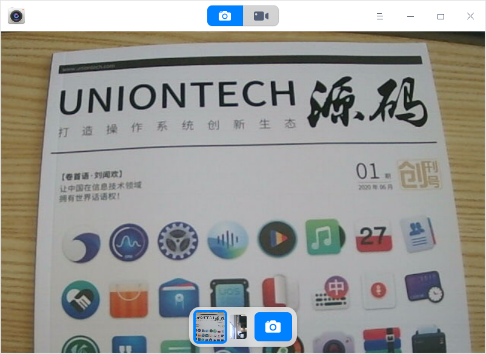
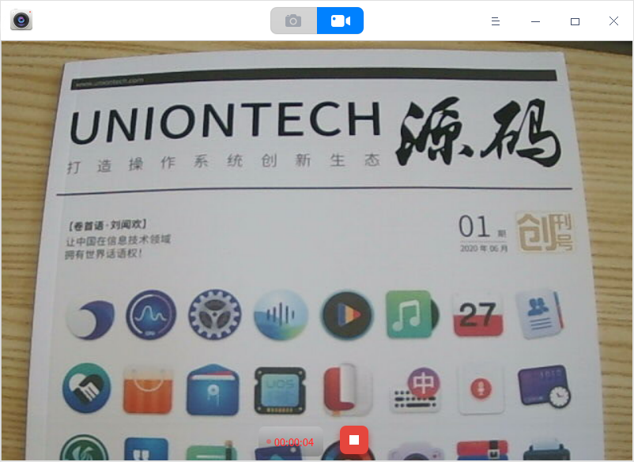
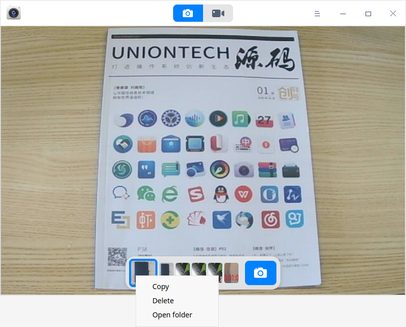
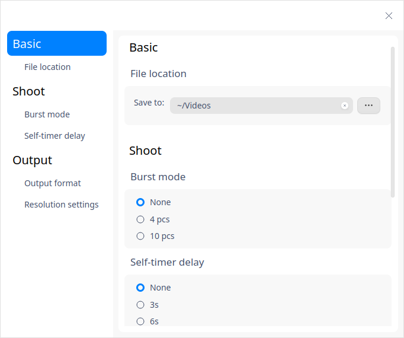
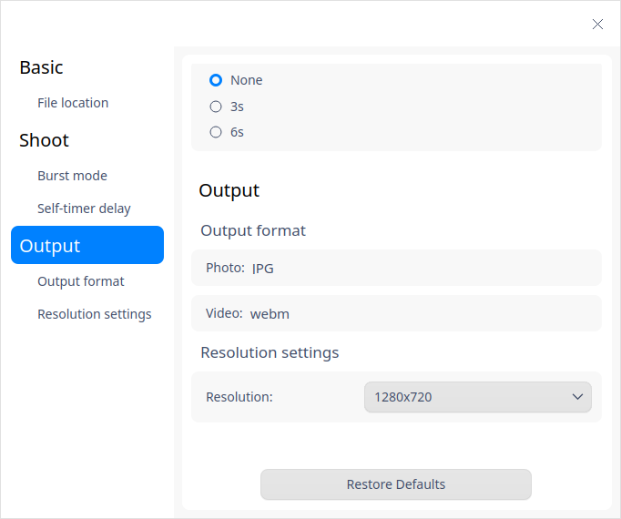

# Cámara|../common/camera.svg|

## Descripción

Camera es una aplicación de cámara fácil de usar que soporta múltiples funciones como tomar fotos, grabar vídeos y cambiar entre varios dispositivos de cámara.

## Guía

Puede ejecutar, cerrar o crear accesos directos para Cámara de las siguientes maneras.

### Ejecutar Cámara

1. Haga clic en  en el Muelle y entre en la interfaz del Lanzador.
2. Localice  desplazando la rueda del ratón o buscando "camera" en la interfaz del Lanzador y haga clic en él para ejecutarlo.
3. Haga clic con el botón derecho del ratón en  y podrá:

 - Hacer clic en **Enviar al escritorio** para crear un acceso directo al escritorio.
 - Hacer clic en **Enviar al muelle** para fijar la aplicación en el muelle.
 - Hacer clic en **Añadir al inicio** para añadir la aplicación al inicio y que se ejecute automáticamente cuando se inicie el sistema.

### Salir de la Cámara

- En la interfaz de la Cámara, haga clic en para salir de la Cámara.
- Haga clic con el botón derecho del ratón en  en el muelle y seleccione **Cerrar todo** para salir de la cámara.
- En la interfaz de la cámara, haga clic en  y seleccione **Salir** para salir de la cámara.

## Operaciones

Puede utilizar la aplicación Cámara si su ordenador viene con una cámara o está conectado a una videocámara. Seleccione el modo de foto o vídeo en la interfaz de la Cámara después de ejecutarla.

### Tomar fotos

El modo foto está predeterminado cuando se inicia la Cámara. Haga clic en el icono  para tomar fotos, y las fotos se mostrarán en la interfaz.

### Grabar vídeos

En la interfaz de la cámara, haga clic en el icono  para entrar en el modo de vídeo. Haga clic en el icono  para iniciar la grabación, y haga clic en el icono  para detener la grabación una vez finalizada la misma. Los archivos de vídeo se mostrarán en la interfaz, y también se guardarán en la ruta predeterminada.

### Procesar fotos y vídeos

En la interfaz de la cámara, haga clic con el botón derecho en las fotos o los archivos de vídeo para seleccionar copiar, eliminar y abrir carpeta.

* Copiar: copia la foto seleccionada a otra ruta.

* Eliminar: borra la foto seleccionada.

* Abrir carpeta: abre la carpeta donde se encuentran las fotos y los vídeos.

## Menú principal

En el menú principal, puede cambiar la configuración de la cámara, cambiar los temas de las ventanas, ver el manual de ayuda y obtener más información sobre la cámara.

### Ajustes

1. En la interfaz de la Cámara, haga clic en .
2. Haga clic en **Ajustes** para ajustar las configuraciones **Básica**, **Disparo** y **Salida**.

   - Ajustes **básicos**: establece la **ubicación del archivo** para las fotos y los vídeos.
   - Ajuste de **disparo**: configura las opciones de **Modo de ráfaga** y **Temporizador**.

     

   - Ajuste de **salida**: configura el **formato de salida** y los **ajustes de resolución** para las fotos y los vídeos.
   
     

#### Tema

El tema de la ventana ofrece tres tipos de temas, a saber, Tema claro, Tema oscuro y Tema del sistema.

1.  En la interfaz de la cámara, haga clic en .
2.  Haga clic en **Tema** para seleccionar un tema.

### Ayuda

1.  En la interfaz de la Cámara, haga clic en .
2.  Haga clic en **Ayuda** para ver el manual de Cámara.

### Acerca de

1.  En la interfaz de la Cámara, haga clic en .
2.  Haga clic en **Acerca de** para ver la versión y la introducción de la cámara. 

### Salir

1.   En la interfaz de la Cámara, haga clic en . 
2.  Haga clic en **Salir** para salir de la aplicación.