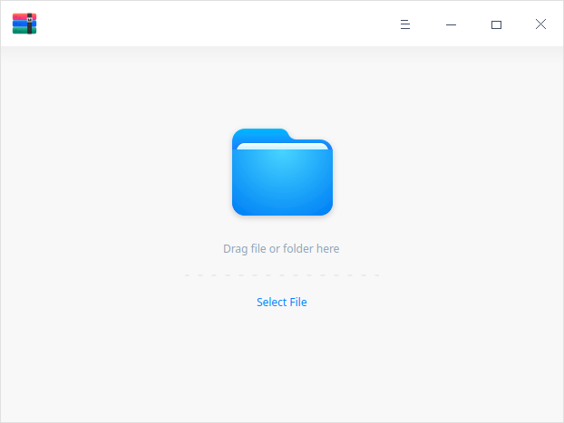
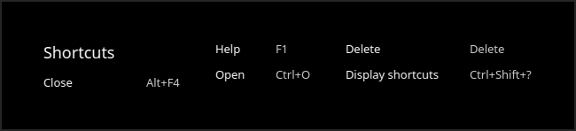
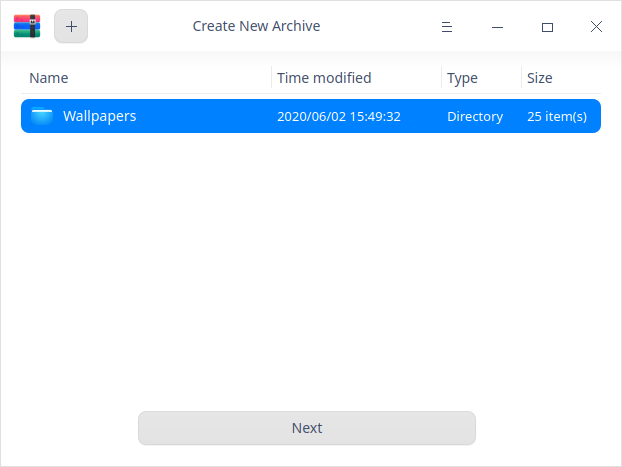
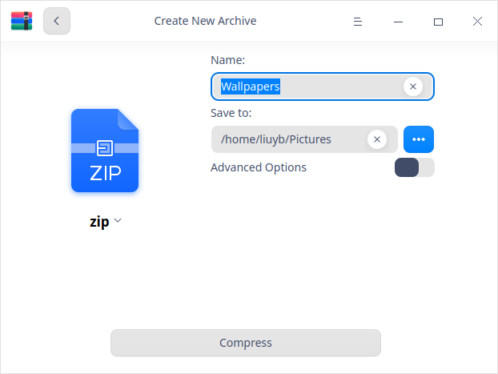
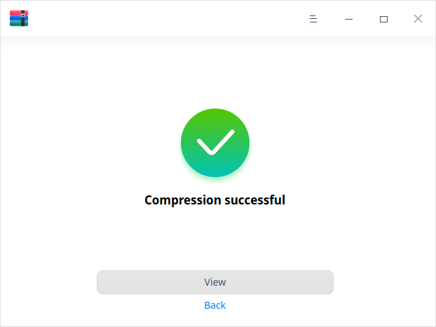
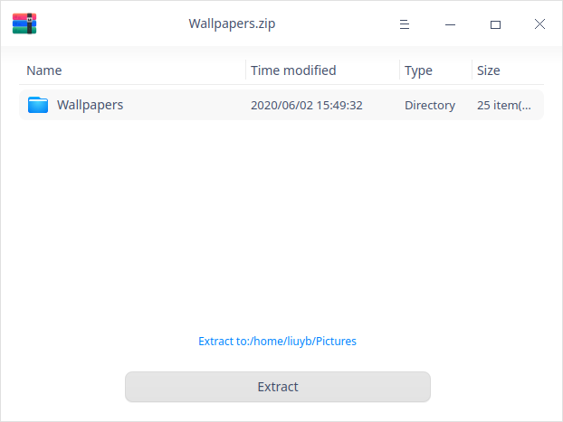
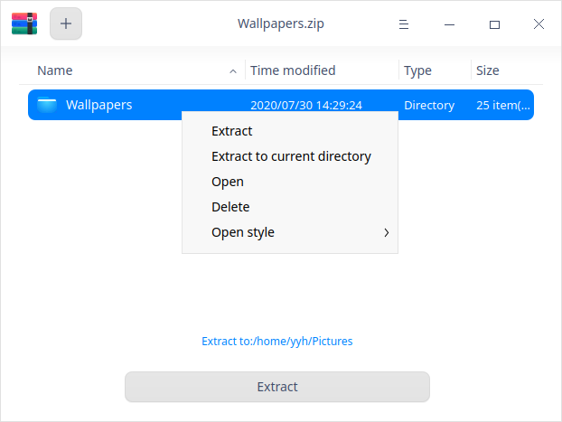

# Compresor de archivos|../common/deepin-compressor.svg|

## Descripción

Compresor de archivos es un software de compresión y descompresión fácil de usar, que soporta múltiples formatos de compresión como 7z, jar, tar, tar.bz2, tar.gz, tar.lz, tar.lzma, tar.lzo, tar.xz, tar.Z, tar.7z, zip y otros, así como ajustes de compresión cifrados.

## Guía

Puede ejecutar, salir o crear un acceso directo para Compresor de archivos de las siguientes maneras.

### Ejecutar Compresor de archivos

1.  Haga clic en  en el muelle para entrar en la interfaz del Lanzador.
2.  Localice  desplazando la rueda del ratón o buscando Compresor de archivos en la interfaz del Lanzador y haga clic en él para ejecutarlo.
3.  Haga clic con el botón derecho del ratón en  y podrá:
 - Hacer clic en **Enviar al escritorio** para crear un acceso directo en el escritorio.
 - Hacer clic en **Enviar al muelle** para fijarlo en el muelle.
 - Hacer clic en **Añadir al inicio** para añadirlo al inicio y que se ejecute automáticamente al arrancar el sistema.

> Consejos: Puede establecer Compresor de archivos en el centro de control como el visor de compresión y descompresión por defecto. Por favor, consulte [Aplicaciones por defecto](dman:///dde#Ajustes de aplicaciones predeterminadas) para más detalles.

### Salir de Compresor de archivos

- Haga clic en  en la interfaz de Compresor de archivos para salir de Compresor de archivos.
- Haga clic con el botón derecho del ratón en en el muelle y seleccione **Cerrar todo** para salir.
- Haga clic en  en la interfaz del Compresor de archivos y seleccione **Salir** para salir.

### Ver accesos directos

En la interfaz del Compresor de archivos, pulsa **Ctrl+Shift+?** en el teclado para ver los atajos. El dominio de los atajos mejorará enormemente su eficiencia.

## Operaciones

### Comprimir

Está disponible para comprimir un solo archivo/carpeta/paquete o una colección de múltiples archivos/carpetas/paquetes.

1. En la interfaz del Compresor de archivos, haga clic en **Seleccionar archivo** para seleccionar el archivo a comprimir y haga clic en **Abrir**.

   > Consejo: Puede arrastrar uno o varios archivos directamente a la interfaz del Compresor de archivos para comprimirlos.
   
2.  Haga clic en  o haga clic en  > **Abrir archivo** para añadir los archivos a comprimir.

   

3.  Haga clic en **Siguiente**.

4.  Establezca el nombre del archivo comprimido, la ubicación de almacenamiento, el formato del paquete, etc.

5.  Si habilita el modo de opción avanzada, podrá configurar el cifrado de archivos, el cifrado de listas y la compresión de volúmenes.
   > Notas: 
      + El empaquetado por defecto es bajo formato .zip.
      + Los formatos disponibles para el cifrado de archivos son .7z y .zip.
      + El formato disponible para el cifrado de listas es .7z; la contraseña de cifrado del archivo es la misma que la de la codificación de listas.
      + El formato disponible para la compresión de volúmenes es .7z. 
   
   

6.  Haga clic en **Comprimir**.

7.  Una vez que la compresión haya finalizado con éxito, puede:

   - Hacer clic en **Ver** para ver la ubicación de almacenamiento específica.
   - Hacer clic en **Atrás** para volver a la interfaz principal después de la compresión exitosa.
   
   > Consejo: También puede hacer clic derecho en **Comprimir** para comprimir el archivo.
   
   

### Descompresión

1.  En la interfaz del Compresor de archivos, haga clic en **Seleccionar archivo** para seleccionar el archivo a descomprimir y haga clic en **Abrir**.
2.  Haga clic en **Extraer a:  /home/xxx/Desktop** para personalizar la ruta de extracción.

  >Nota: "xxx" se refiere a su nombre de usuario del sistema.

3.  Haga clic en **Extraer** para extraer los archivos a la ruta predeterminada.

  > Nota: Cuando el archivo a extraer está cifrado, es necesario introducir la contraseña para completar la extracción.

4.  Haga clic en **Ver** después de la extracción exitosa para ver la ubicación de almacenamiento específica de los archivos extraídos o haga clic en **Atrás** para volver a la interfaz principal.

  > Consejo: También puede hacer clic con el botón derecho del ratón en **Extraer** para descomprimir el archivo.

  

 ### Extraer archivos

 En la interfaz del Compresor de archivos, seleccione un archivo a extraer, haga clic con el botón derecho y seleccione **Extraer** o **Extraer al directorio actual** para extraer los archivos al directorio correspondiente. 

 > Nota: Cuando el archivo a extraer está encriptado, es necesario introducir la contraseña para abrir y extraer los archivos. 

## Menú principal

En el menú principal, puede abrir la interfaz de compresión, cambiar los temas de las ventanas, ver el manual de ayuda y obtener más información sobre Compresor de archivos.

### Abrir archivo
1.  Haga clic en  en la interfaz de Compresor de archivos.
2.  Seleccione **Abrir archivo** y seleccione el archivo que desea comprimir o extraer en el selector de archivos.

### Ajustes

1.  Haga clic en  en la interfaz del Compresor de archivos.
2.  Haga clic en **Ajustes**.
   - Extracción:
      + Establezca el directorio al que van los archivos extraídos;
      + Marcar o desmarcar **Crear automáticamente una carpeta para múltiples archivos extraidos**;
      + Marque o desmarque **Mostrar los archivos extraídos al finalizar**.
   - Gestión de archivos:
      + Establecer si **Borrar archivos después de la extracción**, tiene opciones como **Nunca**, **Pedir confirmación** y **Siempre**.
      + Marcar o desmarcar **Borrar archivos después de la compresión**.
   - Archivos asociados:
      + Marcar o desmarcar los tipos de archivos asociados.
3.  Haga clic en **Restablecer valores predeterminados** en la interfaz para restaurar la configuración inicial.

### Tema

El tema de la ventana incluye el tema claro, el tema oscuro y el tema del sistema.

1.   En la interfaz del Compresor de archivos, haga clic en.
2.   Haga clic en **Tema** para seleccionar un tema.

### Ayuda

Vea la Ayuda para obtener más información sobre el Compresor de archivos.

1.  En la interfaz de Compresor de archivos, haga clic en .
2.  Haga clic en **Ayuda**.
3.  Consulte el manual.

### Acerca de

1.   En la interfaz del Compresor de archivos, haga clic en  . 
2.  2. Haga clic en **Acerca de**.
3.   Vea la descripción de la versión.

### Salir

1.  En la interfaz del Compresor de archivos, haga clic en  .
2.  Haga clic en **Salir** para salir.