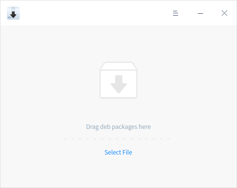
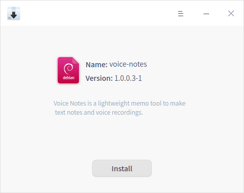
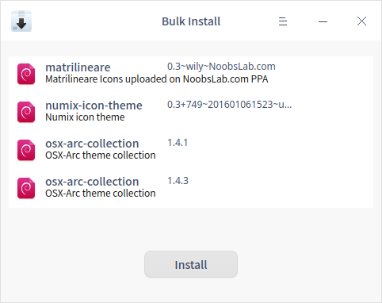
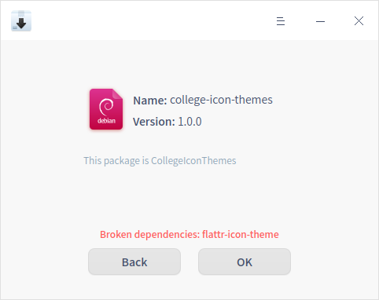
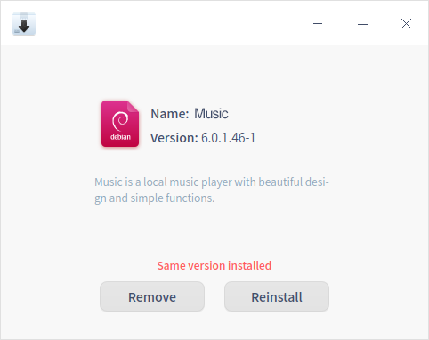

# Instalador de paquetes |../common/deepin-deb-installer.svg|

## Descripción

Instalador de paquetes es una herramienta de gestión de paquetes .deb fácil de usar con una interfaz sencilla para que los usuarios puedan instalar rápidamente aplicaciones personalizadas no incluidas en la App Store, con soporte para la instalación en lote, la identificación de versiones y la autocompletación.  

## Operaciones

### Ejecutar el Instalador de paquetes

- Haga doble clic en un paquete .deb para ejecutarlo.
- Haga clic en el icono del Instalador de paquetes desde el Lanzador para ejecutarlo. 

### Instalar

El Instalador de paquetes es capaz de instalar una una o varias aplicaciones.

### Instalación individual

1. En la interfaz del Instalador de paquetes, haga clic en **Seleccionar archivo** para añadir un paquete .deb.
2. La aplicación detectará el estado del paquete:
   - Recién instalado, seleccione **Instalar** para continuar.
   - Otra versión instalada, seleccione **Reinstalar** para continuar o **Quitar** para desinstalar.
3. Se requiere una contraseña para continuar al hacer clic en **Instalar** o **Reinstalar**.
4. Haga clic en  o  para mostrar o colapsar el proceso de instalación.
5. Haga clic en **Atrás** para volver a añadir o haga clic en **Aceptar** para salir.

> Nota: También puede arrastrar y soltar el archivo al Instalador de paquetes para añadirlo.

### Instalación en lote

Para instalar varios paquetes .deb a la vez, puede hacer clic en **Seleccionar archivo** o arrastrar los archivos al Instalador de paquetes. Por favor, consulte [Instalación individual](#Instalación individual) para conocer los pasos de la operación. Preste atención a lo siguiente:

- Puede ver el proceso de instalación cuando se realiza una instalación múltiple.
- Sólo se muestra el botón **Instalar** en la ventana. La instalación se realizará para los paquetes de las otras versiones que se hayan instalado localmente con anterioridad. La reinstalación se hará para los paquetes de las mismas versiones que se han instalado localmente antes.
- Para eliminar un paquete de la lista, haga clic con el botón derecho del ratón y seleccione **Borrar**. 

### No disponible para instalar

El Instalador de paquetes es capaz de identificar los paquetes que no se han podido instalar automáticamente.

Por favor, lea atentamente el aviso, las causas más comunes son: 

- Dependencias rotas.
- Arquitectura de paquetes no coincidente.

### Desinstalación

Instalador de paquetes se utiliza para desinstalar paquetes .deb de los que ya se han instalado versiones iguales o diferentes. 

1. En la interfaz del Instalador de paquetes, haga clic en **Seleccionar archivo** para añadir un paquete .deb.
2. La aplicación detectará el estado del paquete:
   - Recién instalado, seleccione **Instalar** para continuar.
   - Otra versión instalada, seleccione **Reinstalar** para continuar o **Quitar** para desinstalar.
3. Haga clic en **Desinstalar**, luego habrá un aviso y haga clic en **Confirmar** para desinstalar.
4. Haga clic en **Aceptar** para salir.

> Atención: El sistema u otras aplicaciones se verán afectadas si ha desinstalado algunas aplicaciones. Por favor, actúe con cuidado. 

## Menú principal

En el menú principal, puede cambiar los temas de las ventanas, ver el manual y obtener más información sobre el Instalador de paquetes.

### Tema

El tema de la ventana incluye el tema claro, el tema oscuro y el tema del sistema.

1.   Haga clic en  en la interfaz.
2.   Haga clic en **Tema** para seleccionar un tema.

### Ayuda

Puede hacer clic para ver el manual, que le ayudará a conocer y utilizar el Instalador de paquetes.

1. Haga clic en  en la interfaz.
2. Haga clic en **Ayuda**.
3. Consulte el manual.

### Acerca de

1. Haga clic en en la interfaz.
2. Haga clic en **Acerca de**.
3. Vea la descripción de la versión.

### Salir

1. Haga clic en  en la interfaz.
2. Haga clic en **Salir**.
