# Centro de seguridad|../common/deepin-defender.svg|

## Descripción 

El Centro de seguridad es un software de seguridad preinstalado con funciones como el examen del sistema, el cortafuegos, la gestión de los programas de inicio y la seguridad del sistema, que le ayuda a mejorar la seguridad general del sistema.

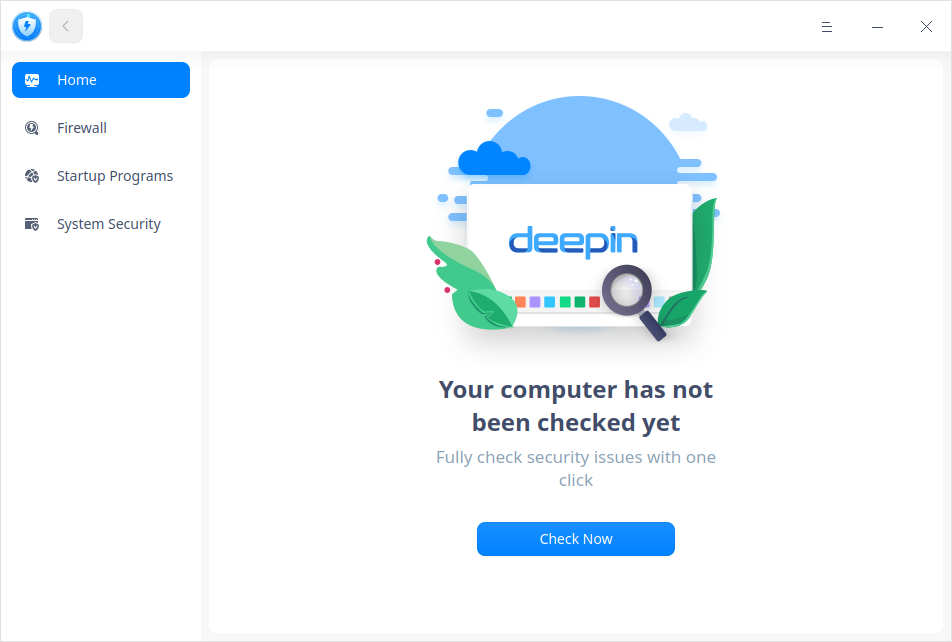

## Guía

Puede ejecutar, cerrar y crear un acceso directo para el Centro de seguridad de las siguientes maneras.

### Ejecutar el Centro de seguridad

1. Haga clic en  en el muelle para entrar en la interfaz del Lanzador.
2. Localice  desplazando la rueda del ratón o buscando por "Centro de seguridad" en la interfaz del Lanzador.
3. Haga clic con el botón derecho del ratón en , puede que:

   - Haga clic en **Enviar al escritorio** para crear un acceso directo al escritorio.
   - Haga clic en **Enviar al muelle** para fijar la aplicación en el muelle.
   - Haga clic en **Añadir al inicio** para añadir la aplicación al inicio, se ejecutará automáticamente cuando se inicie el sistema.

### Salir del Centro de seguridad

- En la interfaz del Centro de seguridad, haga clic en  para salir.
- Haga clic con el botón derecho del ratón en  en el muelle, seleccione **Cerrar todo** para salir.
- Haga clic en  y seleccione **Salir**.

## Operaciones

### Página de inicio

Abra el Centro de seguridad, haga clic en **Inicio** en el panel izquierdo, puede hacer clic en **Comprobar ahora** para examinar el sistema. 

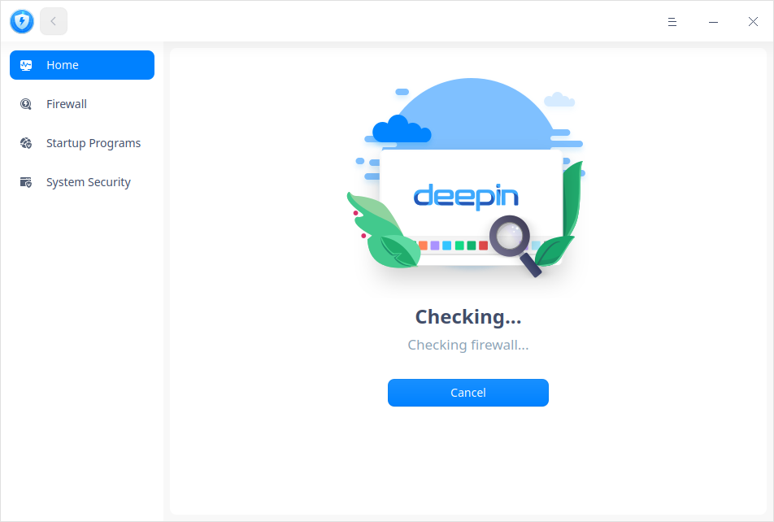

Una vez finalizado el examen del sistema, puede elegir si desea mejorar el nivel de seguridad del sistema de acuerdo con las indicaciones, tales como "su sistema no está actualizado". O bien, puede hacer clic en **Ir a Ajustes** para rehacer los ajustes.

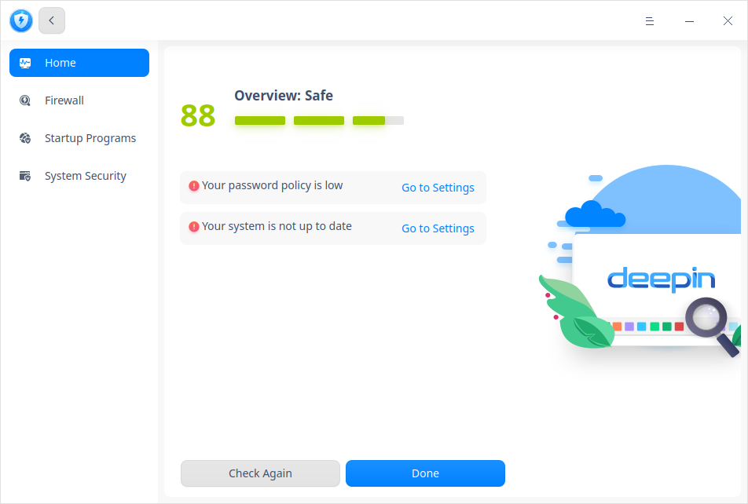

### Cortafuegos

Abra el Centro de seguridad, haga clic en **Cortafuegos** en el panel de la izquierda, puede configurar el acceso a Internet, la conexión remota y ver el uso de datos. 

#### Ajustes globales

En la interfaz del Cortafuegos, puede configurar el acceso a Internet y la conexión remota para todas las aplicaciones y servicios. También puede restablecer el cortafuegos, lo que restaurará el **acceso a Internet** y la **conexión remota** a **preguntarme siempre**. 

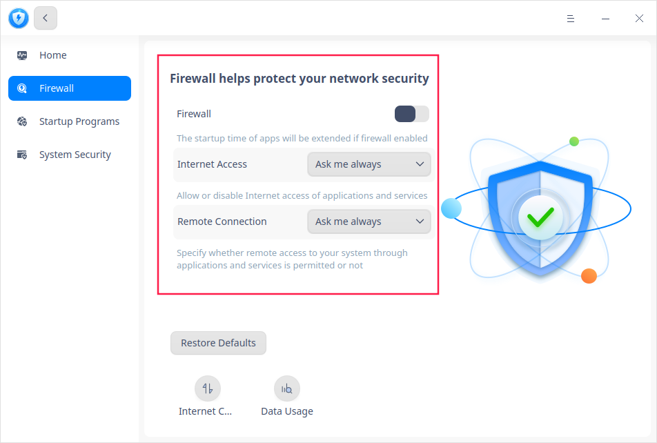

**Activar/desactivar el cortafuegos**

Este interruptor controla cuando se activa el **Acceso a Internet** y la **Conexión remota**; sin embargo, el **Uso de datos** no se ve afectado por él. El cortafuegos está desactivado aquí por defecto.

Desactivado: El **Acceso a Internet** y la **Conexión Remota** están desactivados.

Activado: **Acceso a Internet** y **Conexión remota** están activados. Puede seguir configurándolos de la siguiente manera.

**Acceso a Internet**

Este elemento controla la configuración por defecto del acceso a Internet de todas las aplicaciones y servicios. Hay tres opciones en el cuadro desplegable.

1. Preguntarme siempre (por defecto): cuando una aplicación se conecta a Internet, aparece un aviso que dice **xxx quiere conectarse a Internet**. Y puede seleccionar **Permitir una vez**, **Permitir siempre** o **Desactivar**. 
   
   - Permitir una vez: se permite la conexión a Internet esta vez sin modificar su configuración de acceso a Internet.
   - Permitir siempre: la configuración de acceso a Internet de la aplicación se modifica a **Permitir**, y se autoriza su conexión a Internet esta vez. No aparecerá ningún aviso cuando se conecte a Internet después de este tiempo. 
   - Desactivar: la conexión de la aplicación a Internet se desactiva esta vez. No se modifica la configuración de acceso a Internet de la aplicación. 
   
2. Desactivar siempre: cuando una aplicación se conecta a Internet, aparece un aviso que dice **El cortafuegos ha bloqueado la conexión de xxx a Internet**, puede seleccionar **Ir a Ajustes** o **Aceptar**.

3. Permitir siempre: la aplicación siempre tiene permiso para conectarse a Internet, y no aparecerá ningún aviso. 

   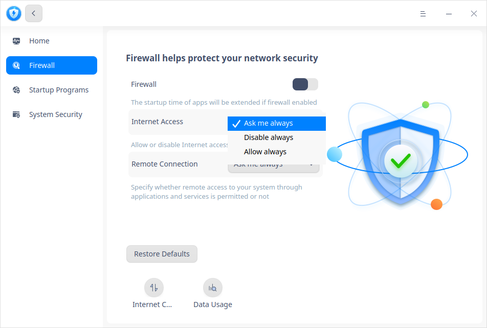

**Conexión remota**

Este elemento especifica si el acceso remoto a su sistema a través de aplicaciones y servicios está permitido o no. Hay tres opciones en el cuadro desplegable.

1. Preguntarme siempre (por defecto): cuando una aplicación inicia la escucha del puerto, aparece un aviso que dice **xxx quiere iniciar la conexión remota**. Y puedes seleccionar **Permitir una vez**, **Permitir siempre** o **Desactivar**. 

   - Permitir una vez: el acceso remoto a su sistema se permite esta vez sin modificar su configuración de conexión remota.
   - Permitir siempre: la configuración de la conexión remota de la aplicación se modifica a **Permitir**, y el acceso remoto a su sistema se permite esta vez. No aparecerá ningún aviso cuando la aplicación inicie la conexión remota después de este tiempo. 
   - Desactivar: el acceso remoto a su sistema se desactiva esta vez. No se modifica la configuración de la conexión remota de la aplicación. 
2. Desactivar siempre: cuando una aplicación inicia la escucha de puertos, aparece un mensaje que dice **El cortafuegos ha bloqueado la conexión remota de xxx**. Y puede seleccionar **Ir a Ajustes** o **Aceptar**. 
3. Permitir siempre: cuando una aplicación inicia la conexión remota cada vez, se permite por defecto. No aparecerá ningún aviso. 

**Restablecer valores predeterminados.**

Haga clic en **Restablecer valores predeterminados**, todos los ajustes de acceso a Internet y conexión remota se restablecerán a **Preguntar siempre**.

#### Control de Internet

En la página principal del Cortafuegos, haga clic en **Control de Internet** en la parte inferior.  Su función es establecer el estado de la conexión a Internet de todas las aplicaciones en el Lanzador. Hay 4 opciones en el cuadro desplegable de cada aplicación. 

- Preguntar:  Si elige esta opción, cuando una aplicación se conecte a Internet, aparecerá un aviso para pedirle permiso siempre.  

- Permitir: Si elige esta opción, la conexión de la aplicación a Internet está siempre permitida, no aparece ningún aviso.

- Desactivar:  Si elige esta opción, la conexión de la aplicación a Internet se desactiva siempre, y aparece un aviso.  

- Predeterminado(xxx): significa la configuración de acceso a Internet por defecto de la aplicación. 

   > Consejo: Puede ordenar el "Nombre" y el "Estado" con un solo clic, de menor a mayor: permitir, preguntar, deshabilitar, por defecto(xx); de mayor a menor: deshabilitar, preguntar, permitir y por defecto(xx).  

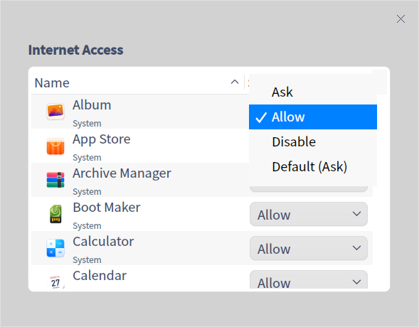

#### Uso de datos

En la página de inicio de Cortafuegos, haz clic en **Uso de datos** en la parte inferior. Puede ver los detalles de **Aplicaciones y Servicios** y **Clasificaciones**. 

- En la página de **Aplicaciones y servicios**, puede ver todas las aplicaciones en ejecución con su velocidad de descarga/carga y sus ajustes. Haga clic en el icono de ajustes  en cada línea para saltar a la página de "Acceso a Internet". 

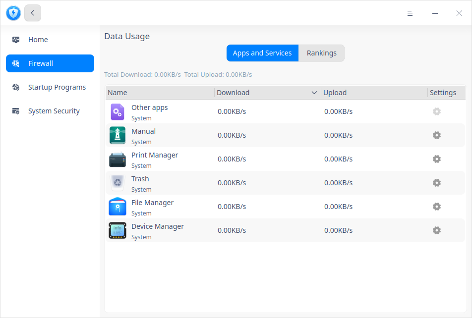

- En la página de **Clasificaciones**, puede ver que todas las aplicaciones en ejecución están clasificadas por "Descargado", "Cargado" y "Datos utilizados".  Hay cuatro opciones en la esquina superior derecha: hoy, ayer, este mes y el mes pasado. 

   > Consejo: Puedes hacer clic en "Nombre", "Descargado", "Subido" y "Datos utilizados" para ordenar. 

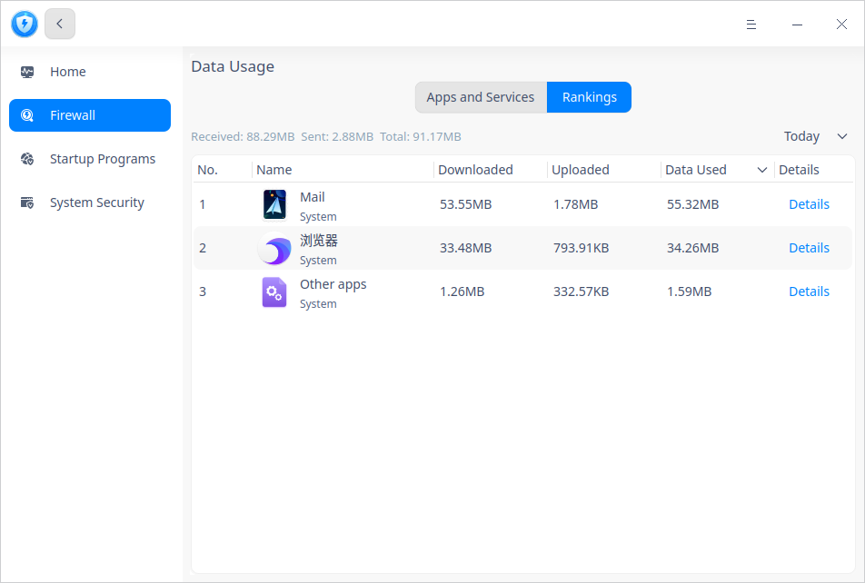 

 

### Programas de inicio

En la interfaz del Centro de seguridad, haga clic en **Programas de inicio** en el panel izquierdo. Sólo se muestran las aplicaciones del Lanzador y se detallan por "Nombre", "Inicio automático" y "Acción". Puede elegir "Permitir" o "Eliminar" para cada aplicación. 
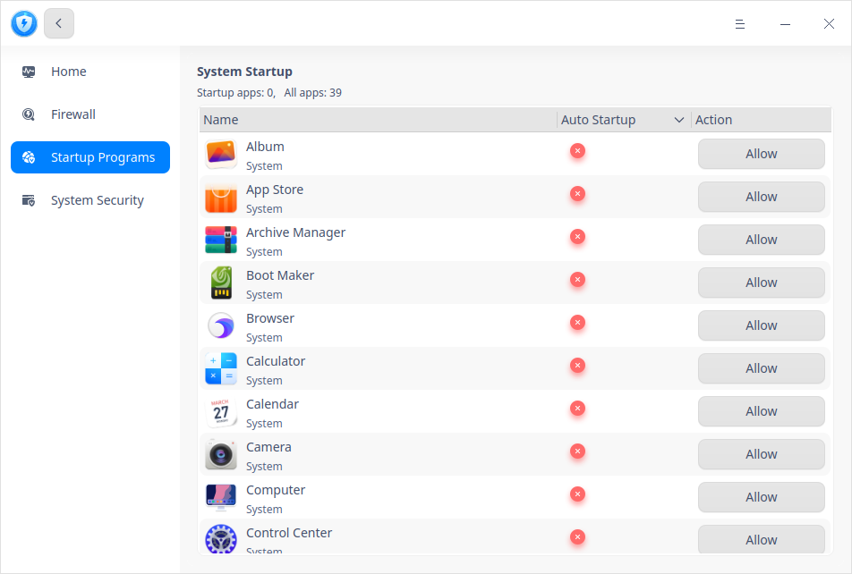 

### Seguridad del sistema
En la interfaz del Centro de seguridad, haga clic en **Seguridad del sistema** en el panel izquierdo. Puede realizar ajustes para los niveles de seguridad de las contraseñas, la protección de la pantalla y la política de actualización. 

#### Seguridad de inicio de sesión
En la interfaz de Seguridad del sistema, haga clic en **Seguridad de inicio de sesión**. Puede configurar los niveles de seguridad de las contraseñas y el periodo de notificación antes de que la contraseña caduque y cambiar la contraseña regularmente. 
- **Alto** o **Medio**: Si ha elegido uno de ellos, cuando modifique la contraseña en el Centro de Control o configure la contraseña al crear un nuevo ID, la contraseña que establezca no se guardará correctamente si no cumple con los requisitos del nivel correspondiente. Puede ir al Centro de control para restablecer la contraseña o modificar el nivel de seguridad en el Centro de seguridad. 
- **Bajo**:  Si ha elegido esta opción, cuando modifique la contraseña en el Centro de Control o configure la contraseña al crear un nuevo ID, la nueva contraseña se guardará directamente. 

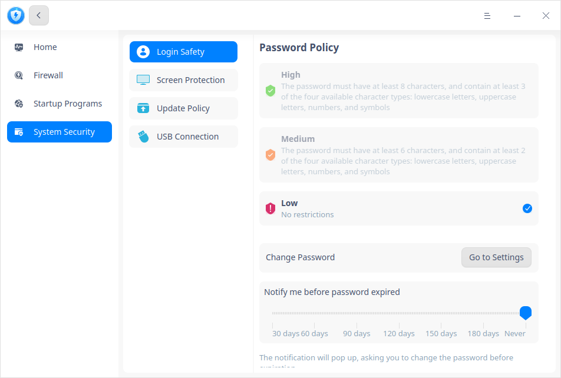

#### Protección de pantalla

En la interfaz de Seguridad del sistema, haga clic en **Protección de pantalla**. Puede realizar ajustes como el periodo de bloqueo automático de la pantalla, el fondo de pantalla de bloqueo, los ajustes de energía y el protector de pantalla. 

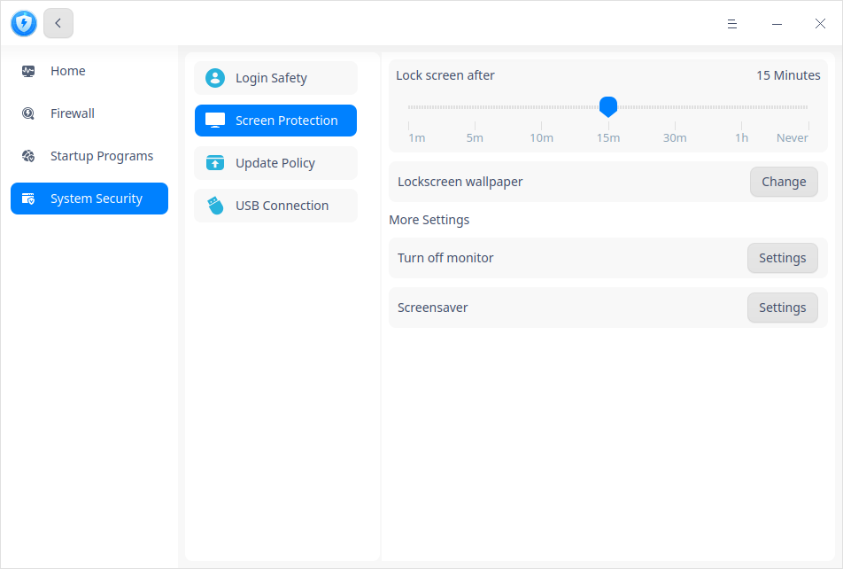

Haga clic en **Ajustes** después de "Apagar el monitor", saltará a la página "Conectado" del Centro de Control. 

#### Política de actualización

En la interfaz de seguridad del sistema, haga clic en **Política de actualización** para ver si el sistema está actualizado, puede elegir si desea actualizar el sistema y también puede activar la "Notificación de actualizaciones" y la "Descarga automática de actualizaciones". 

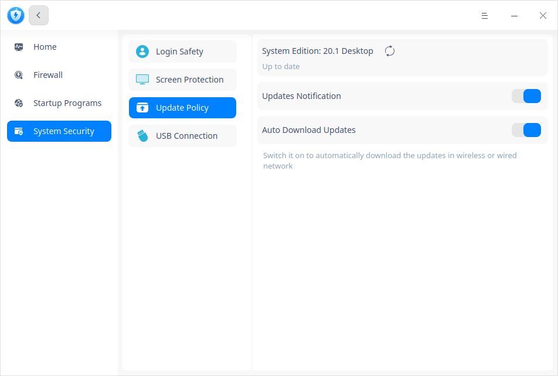

#### Conexión USB

En la interfaz de Seguridad del Sistema, haga clic en **Conexión USB**. Puede activar **Guardar registro de conexión de dispositivos USB** para ver todo el historial de dispositivos USB con función de almacenamiento que se conectan a su ordenador.

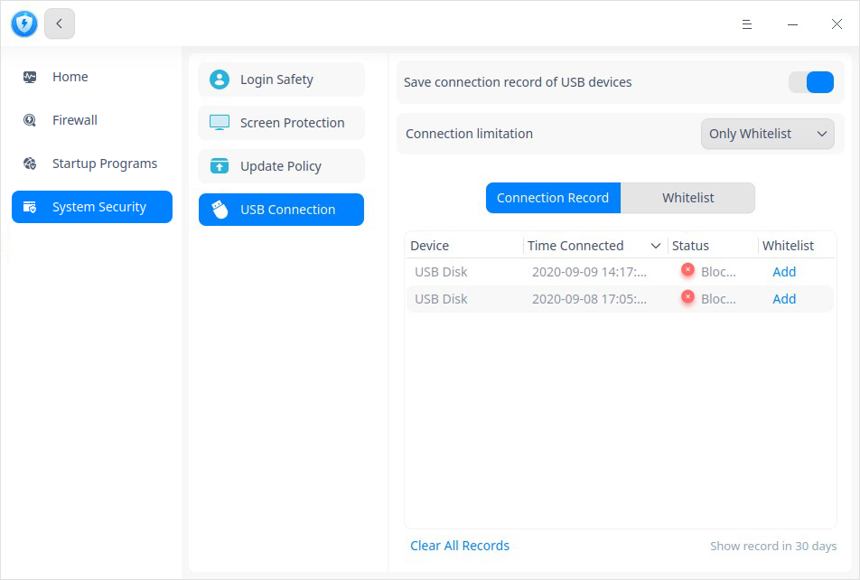

También puede añadir el dispositivo USB utilizado muy a menudo en la lista blanca, y seleccionar **Sólo lista blanca** en **Limitación de la conexión** para evitar la violación de datos.

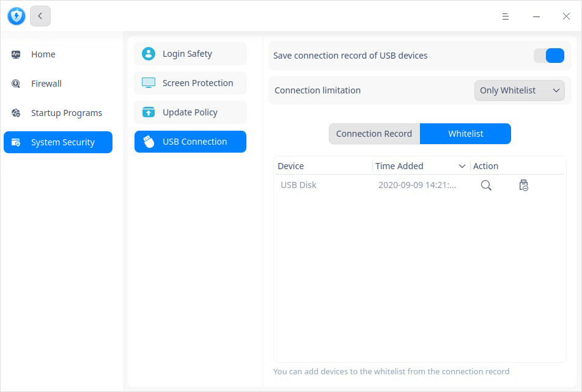

## Menú principal

Puede cambiar de tema, ver el manual y la información de la versión en el menú principal.

### Tema

El tema de la ventana incluye el claro, el oscuro y el del sistema.

1. Haga clic en en la interfaz.
2. Haga clic en **Tema** para seleccionar uno.

### Ayuda

Consulte el manual que le ayudará a conocer y utilizar mejor el Centro de seguridad.

1. Haga clic en en la interfaz.
2. Haga clic en **Ayuda** para ver el manual.

### Acerca de

1. Haga clic en en la interfaz.
2. Haga clic en **Acerca de** para ver la información de la versión y la introducción sobre el Centro de seguridad.

### Salir

1. Haga clic en en la interfaz.
2. Haga clic en **Salir**.

