# Gestor de dispositivos|../common/deepin-devicemanager.svg|

## Descripción 

Gestor de dispositivos es una herramienta para ver y gestionar los dispositivos de hardware, a través de la cual puede ver todo tipo de parámetros y exportar datos de todos los dispositivos de hardware que se ejecutan en el sistema operativo, también puede desactivar / activar algunas unidades de hardware. 

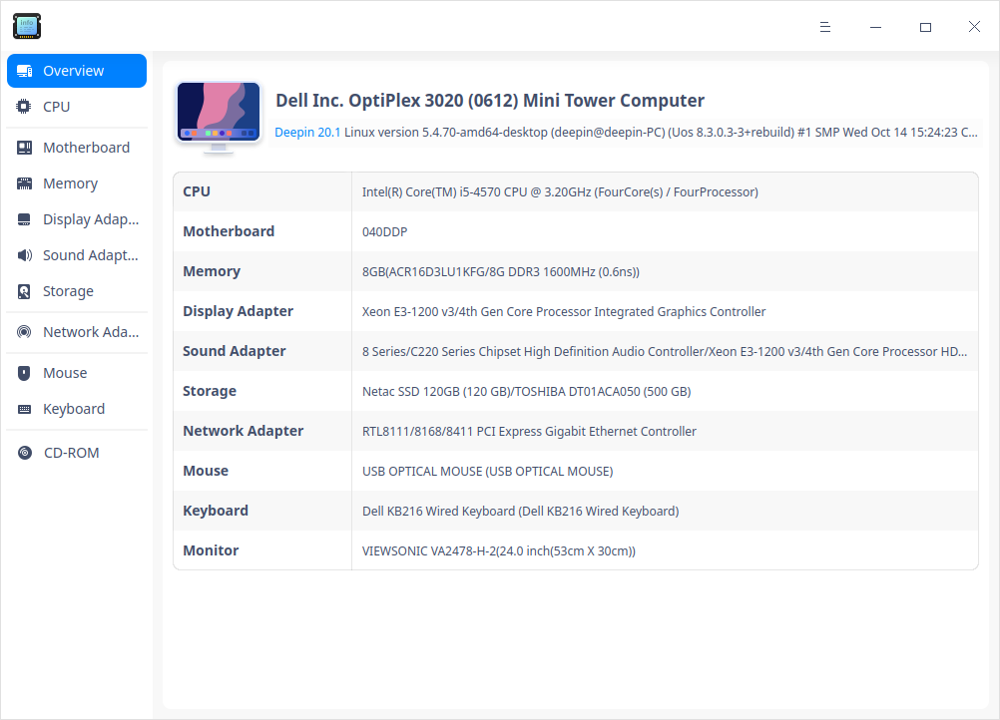

## Guía

Puede ejecutar, cerrar o crear un acceso directo para el Gestor de dispositivos de la siguiente manera.

### Ejecutar el Gestor de dispositivos

1. Haga clic en  en el Muelle para entrar en la interfaz del Lanzador.

2. Localice  desplazando la rueda del ratón o buscando "Gestor de dispositivos" en la interfaz del Lanzador y haga clic en él para ejecutarlo. 

3. Haga clic con el botón derecho del ratón en  para:

   - Seleccionar **Enviar al escritorio** para crear un acceso directo en el escritorio.

   - Selecciona **Enviar al muelle** para fijarlo en el muelle.

   - Seleccionar **Añadir al inicio** para que se ejecute automáticamente al encender el ordenador.

   

### Salir del Gestor de dispositivos

- En la interfaz principal, haga clic en  para salir.
- Haga clic con el botón derecho del ratón en  en el muelle, seleccione **Cerrar todo** o **Forzar cierre** para salir.
- En la interfaz del Gestor de dispositivos, haga clic en  y seleccione **Salir** para salir.

## Operaciones

La siguiente información sobre el dispositivo de hardware es sólo de referencia. Si no hay ratón, teclado y otros dispositivos insertados en su ordenador, la información de hardware correspondiente no se mostrará en el gestor de dispositivos.

### Resumen

1. En la interfaz principal, haga clic en **Resumen**.
2. Puede ver una lista que contiene **CPU**, **Tarjeta madre**, **Memoria** y demás en esta interfaz, así como información particular como marcas, nombres, modelos y especificaciones. 

### CPU

1. En la interfaz principal, haga clic en **CPU**.
2. Puede ver una lista de CPUs e información detallada como nombre, proveedor, arquitectura, modelo, etc. 

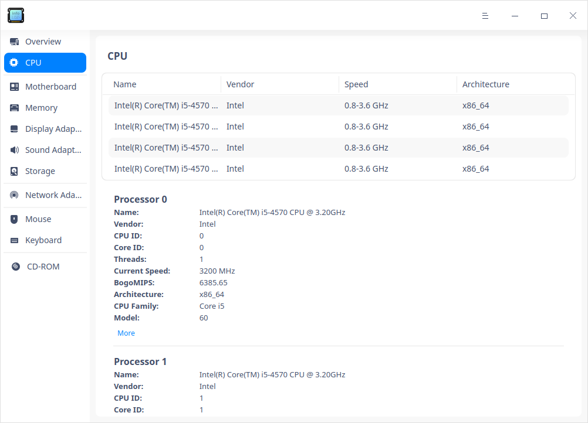

### Tarjeta madre 

1. En la interfaz principal, haga clic en **Tarjeta madre **. 
2. Puede ver información sobre la placa base, el banco de memoria, el sistema, la BIOS, el chasis, etc.

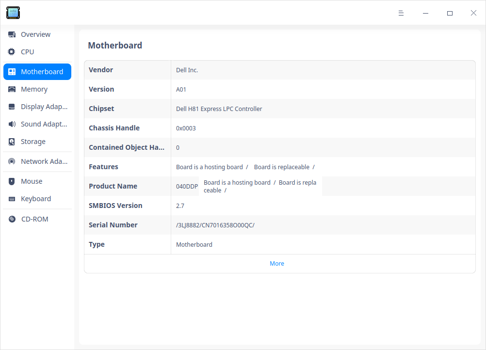

### Memoria

1. En la interfaz principal, haga clic en **Memoria**.
2. Puede ver una lista de memorias e información particular como el nombre, el proveedor, el tamaño, el tipo, la velocidad, etc.

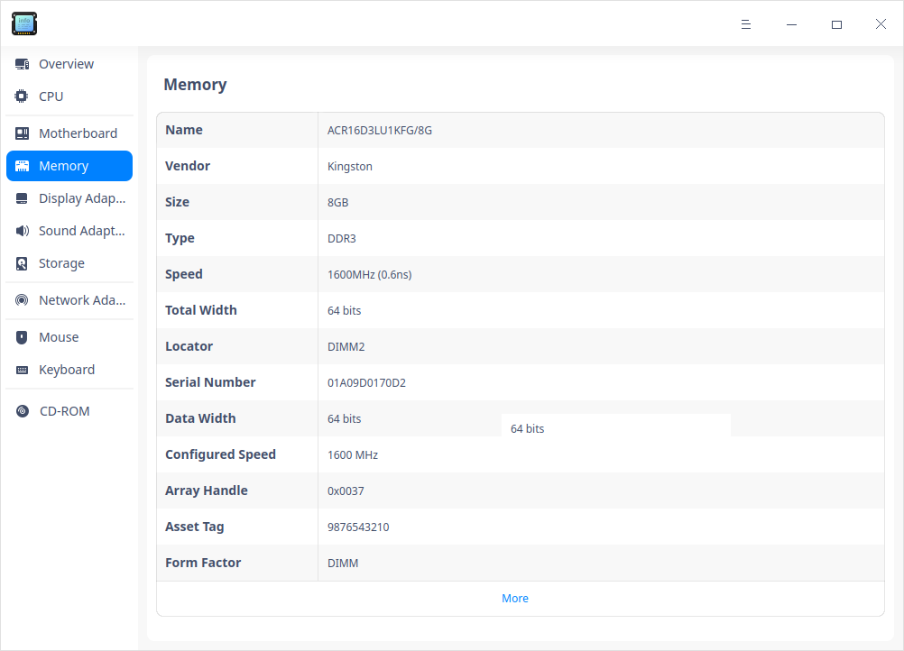

### Adaptador de pantalla

1. En la interfaz principal, haga clic en **Adaptador de pantalla**.
2. Puede ver información sobre el adaptador de pantalla, como el nombre, el proveedor, el modelo, etc.

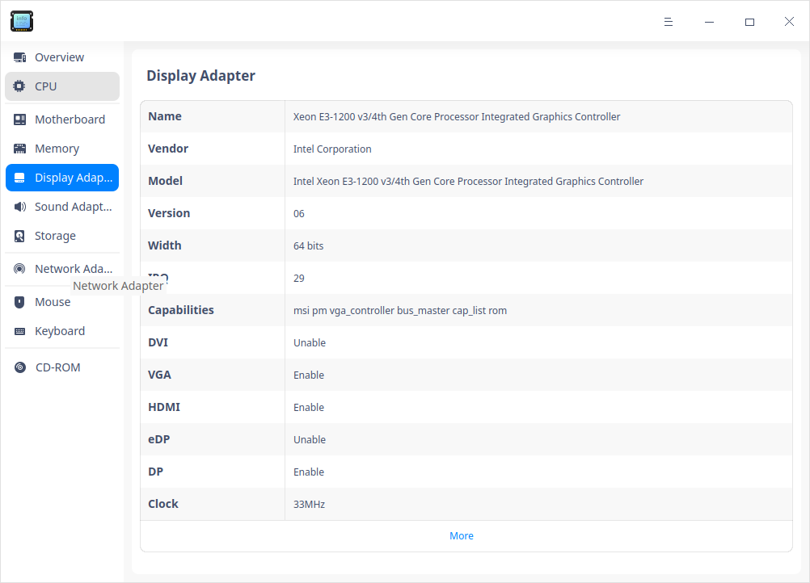

### Adaptador de sonido

1. En la interfaz principal, haga clic en **Adaptador de sonido**.
2. Puede ver una lista de adaptadores de audio e información como el nombre, el proveedor, el modelo, etc.

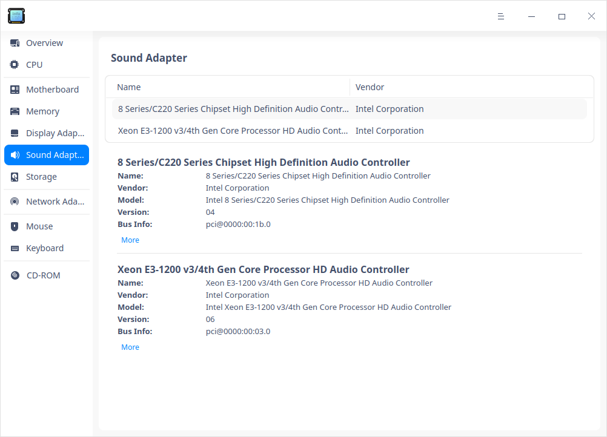

### Almacenamiento

1. En la interfaz principal, haga clic en **Almacenamiento**.
2. Puede ver una lista de dispositivos de almacenamiento e información particular como el modelo, el proveedor, el tipo de soporte, el tamaño, etc.

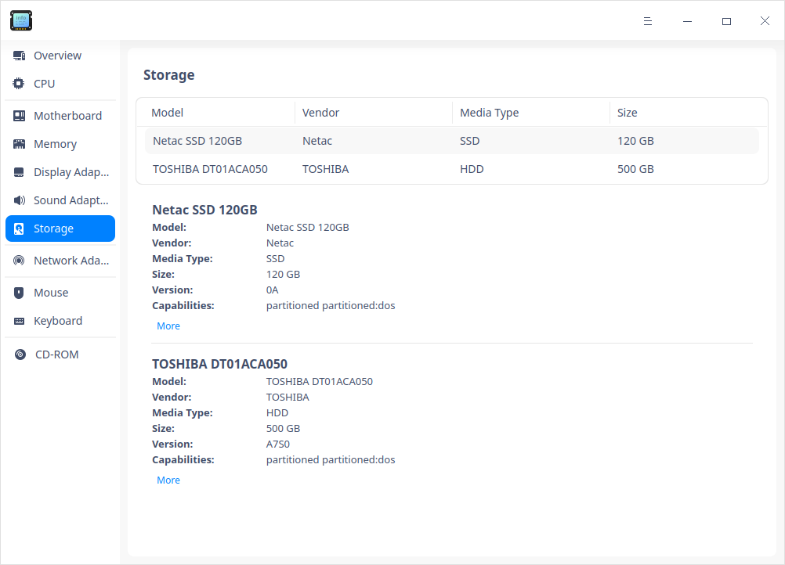

### Adaptador de red

1. En la interfaz principal, haga clic en **Adaptador de red**.
2. Puede ver información sobre el adaptador de red, como el nombre, el proveedor, el tipo, el controlador, etc.

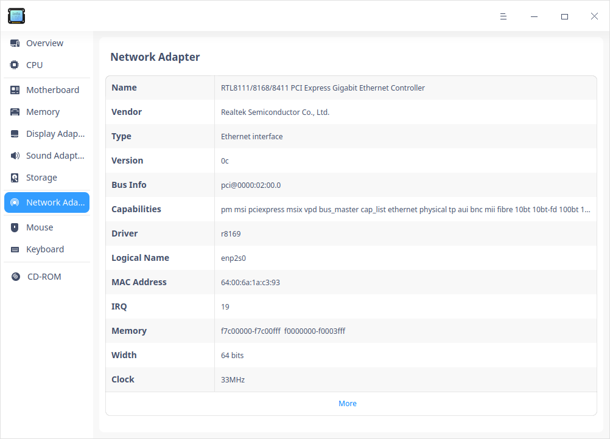

### Ratón

1. En la interfaz principal, haga clic en **Ratón**.
2. Puede ver información como el nombre, el proveedor, la información del bus, el controlador, la velocidad, etc.

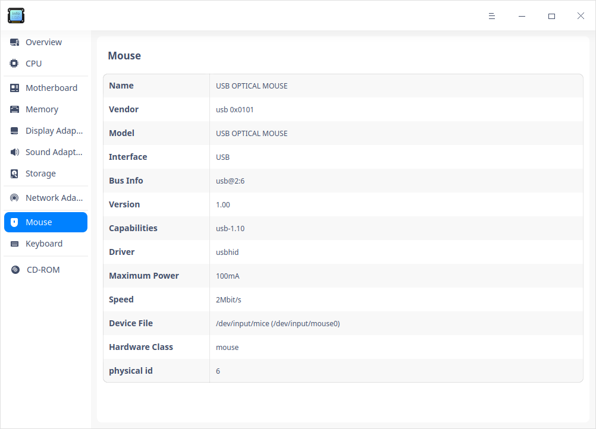

### Teclado

1. En la interfaz principal, haga clic en **Teclado**.
2. Puede ver información como el nombre, el proveedor, el modelo, la información del bus, el controlador, etc.

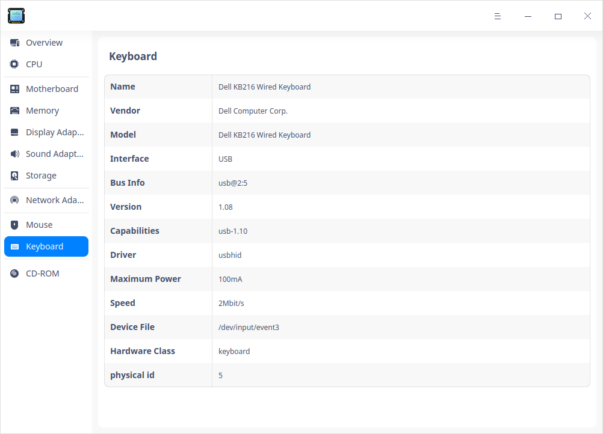

### Monitor

1. En la interfaz principal, haga clic en **Monitor **.
2. Puede ver información sobre el monitor, como el nombre, el proveedor, el tipo, etc.

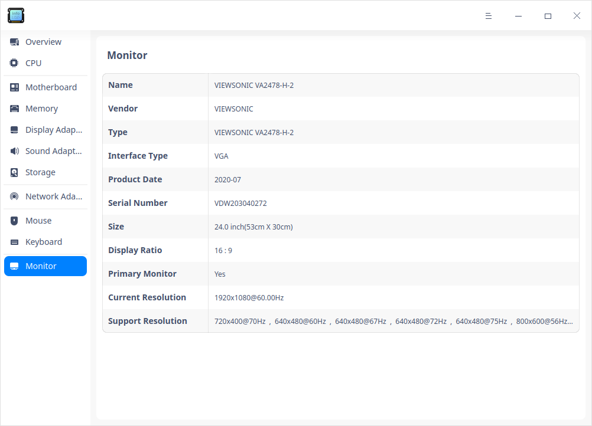

### Impresora

1. En la interfaz principal, haga clic en **Impresora**.
2. Puede ver una lista de impresoras conectadas e información como el nombre, el modelo, el proveedor, el URI, etc.

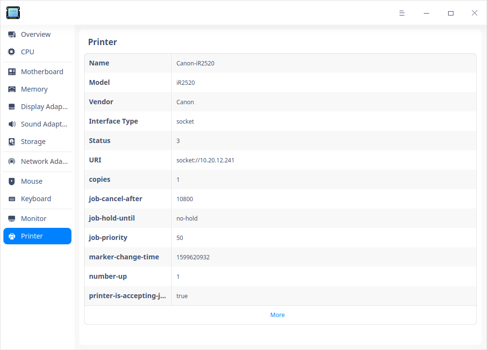

### Operaciones con el botón derecho del ratón 

**Copiar**: Para copiar el contenido seleccionado por el cursor, haga clic con el botón derecho para seleccionar **Copiar**.

**Desactivar/Habilitar**: Puede desactivar algunas unidades de hardware. Puede juzgar si el dispositivo de hardware soporta la función de desactivación según las opciones del menú del botón derecho. 

**Actualizar**: Haga clic con el botón derecho y seleccione **Refrescar** para recargar la información de todos los dispositivos del sistema operativo. También puede utilizar el atajo de teclado F5 para realizar esta función.

**Exportar**: Puede exportar la información de los dispositivos a la carpeta especificada, se admiten formatos como txt/docx/xls/html. 

## Menú principal

En el menú principal, puede cambiar de tema, ver el manual, entre otros.

### Tema

El tema de la ventana incluye el tema claro, el tema oscuro y el tema del sistema.

1. Haga clic en en la interfaz.
2. Haga clic en **Tema** para seleccionar uno.

### Ayuda

Haga clic en Ayuda para obtener el manual, que le ayudará a conocer y utilizar mejor el Gestor de dispositivos.

1. Haga clic en en la interfaz.
2. Haga clic en **Ayuda** para ver el manual.

### Acerca de

1. Haga clic en en la interfaz.
2. Haga clic en **Acerca de** para ver la versión y la introducción sobre el Gestor de dispositivos.

### Salir

1. Haga clic en en la interfaz.
2. Haga clic en **Salir**.

