# Dibujo|../common/deepin-draw.svg|

## Descripción

Dibujo es una herramienta de dibujo simple, que soporta la rotación, el recorte, el volteo y la adición de textos y formas entre otras funciones. Puedes editar imágenes locales o dibujar libremente.

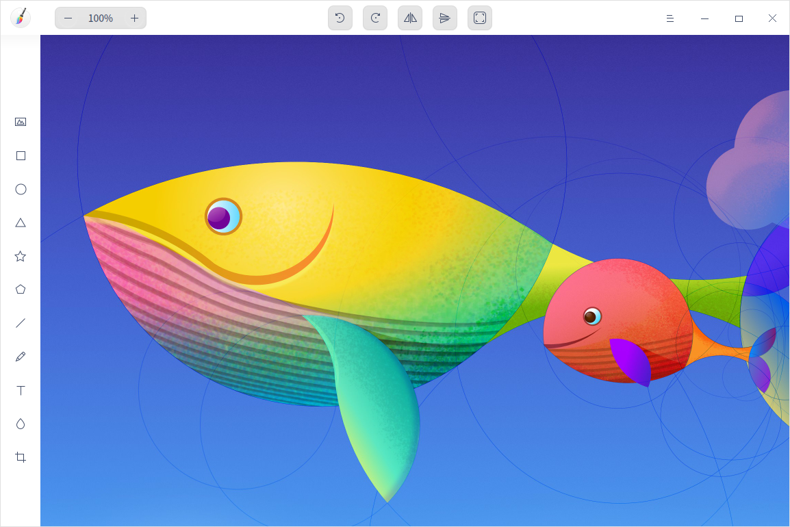

## Guía

Puede ejecutar, cerrar y crear accesos directos para Dibujo de las siguientes maneras.

### Ejecutar Dibujo

1.   Haga clic en  en el Muelle para entrar en la interfaz del Lanzador.
2.   Localice  desplazando la rueda del ratón o buscando "dibujo" en la interfaz del Lanzador.
3.   Haga clic con el botón derecho del ratón en  y el usuario podrá:
 - Hacer clic en **Enviar al escritorio** para crear un acceso directo al escritorio.
 - Hacer clic en **Enviar al muelle** para fijar la aplicación en el muelle.
 - Hacer clic en **Añadir al inicio** para añadir la aplicación al inicio y que se ejecute automáticamente cuando se inicie el sistema.

Consejo: En el Centro de control, puede indicar a Dibujo como el visor de imágenes predeterminado. Por favor, consulte [Aplicaciones por defecto](dman:///dde#Ajustes de aplicaciones predeterminadas) para operaciones específicas.

### Salir de Dibujo

- En la interfaz de Dibujo, haga clic en  para salir de Dibujo.
- Haga clic con el botón derecho del ratón en  en el muelle y seleccione **Cerrar todo** para salir de Dibujo.
- Haga clic en  en la interfaz de Dibujo y seleccione **Salir** para salir de Dibujo.

### Ver atajos de teclado

En la interfaz de Dibujo, presione **Ctrl** + **Mayús** + **?** en el teclado para ver los atajos. El dominio de los atajos mejorará enormemente su eficiencia.

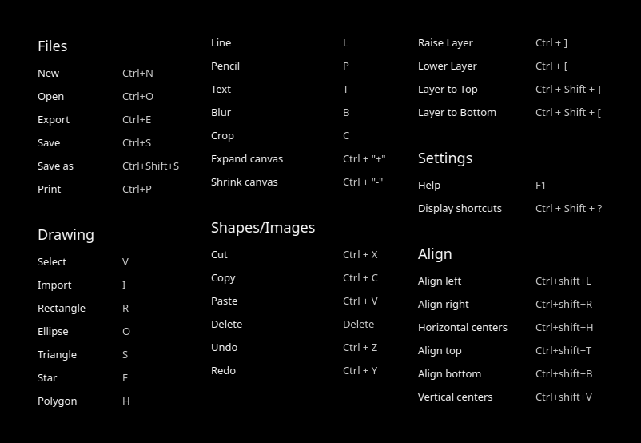

## Funciones básicas

Con Dibujo, podrá procesar imágenes importadas y dibujar imágenes libremente. También puede guardar las imágenes en múltiples formatos.

### Crear pestañas

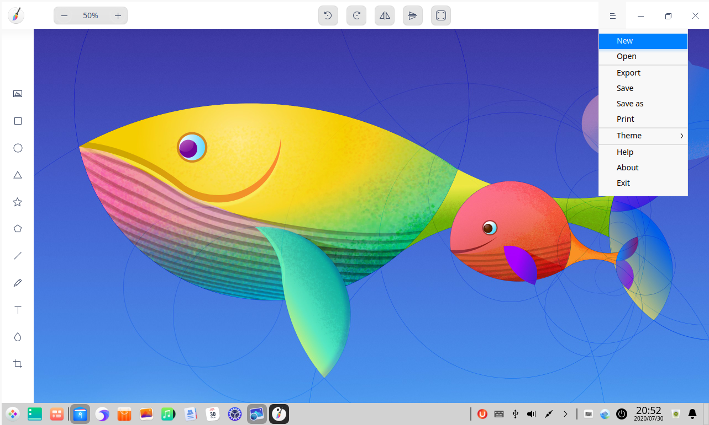

&nbsp;&nbsp;&nbsp;&nbsp;&nbsp;&nbsp;&nbsp;&nbsp;&nbsp;&nbsp;&nbsp;&nbsp;&nbsp;

- En la interfaz de Dibujo, haga clic en  > **Nuevo** para crear una nueva pestaña.
- También puede hacer clic en  para crear una nueva pestaña cuando haya dos o más pestañas en la ventana.

Cuando hay varias pestañas, puede ajustar el orden de las mismas arrastrando la pestaña o haciendo clic en los iconos  o .

### Cerrar pestañas

- Haga clic en una pestaña. Haga clic en  para cerrar la pestaña actual.
- Haga clic con el botón derecho en una pestaña. Seleccione **Cerrar pestaña** o **Cerrar otras pestañas**. 

### Abrir imágenes

1.   En la interfaz de Dibujo, haga clic en o  > **Abrir**.
2.   Seleccione la imagen que desea importar y haga clic en **Abrir**.

Actualmente, se pueden exportar un máximo de 30 imágenes. Se admiten formatos como JPG, PNG, TIF, BMP y DDF.

### Exportar imágenes

1.  En la interfaz de Dibujo, haga clic en > **Exportar**.
2.  Establezca los parámetros, incluyendo el nombre del archivo, la ruta, el formato y la calidad de la imagen. 
3.  Haga clic en **Guardar**. 

### Guardar imágenes

1.   En la interfaz de Dibujo, haga clic en > **Guardar** o > **Guardar como**.
2.   Establezca el nombre y el formato del archivo que se va a guardar y haga clic en **Guardar**.

> Nota: Cuando se omita el sufijo en el nombre del archivo se puede omitir se guardará bajo el formato seleccionado automáticamente. 

### Imprimir imágenes

1.  En la interfaz de Dibujo, haga clic en > **Imprimir**.
2.  Seleccione la impresora y configure los parámetros de impresión.
3.  Haga clic en **Imprimir**.

> Nota: Haga clic en **Avanzado** para personalizar los parámetros de impresión.

## Herramientas de dibujo

Con las herramientas de dibujado de la aplicación Dibujo, puede dar rienda suelta a su imaginación y creatividad para realizar dibujos gráficos gratis. 

### Herramienta de selección

Después de dibujar entidades con la herramienta de dibujo de gráficos, puede realizar las siguientes operaciones:

- Seleccione los gráficos dibujados, los textos o las áreas borrosas.
- Realice la selección de la marquesina y todos los gráficos dentro del área de selección de la marquesina se pondrán en estado seleccionado.
- Arrastre para ajustar el tamaño del gráfico dentro del área seleccionada.
- Mantenga pulsada la tecla **Mayúsculas** y haga clic para seleccionar varios gráficos.

> Nota: Haga clic en el área en blanco del Dibujo para cancelar los gráficos seleccionados.

### Herramienta de forma

1.   En la interfaz de Dibujo, haga clic en ,  , ,  o .
2.   Puede configurar los parámetros de los gráficos de la siguiente manera:
 - Haga clic en **Rellenar** para establecer el color de relleno y la transparencia de los gráficos.
 - Haga clic en **Trazo** para establecer el color de trazo y la transparencia de los gráficos.
 - Elija y defina la anchura del trazo en la lista desplegable situada a la derecha del botón **Trazo**.
 - Haga clic en **Puntas** (de 3 a 50) y **Radio** (de 0% a 100%) para establecer los puntos y el radio sólo para los gráficos de estrellas.
 - Haga clic en **Lados** para establecer los lados sólo para los gráficos de polígonos. El número de lados oscila entre 4 y 10, que puede ajustarse haciendo clic en el icono de ajuste hacia arriba y hacia abajo o introduciendo el valor manualmente.
3.   Arrastre el ratón para dibujar los gráficos en el área de Dibujo. 

>Consejo: ¡Con la ayuda de las teclas **Mayúsculas** o **Mayúsculas + Alt** del teclado, puede dibujar un cuadrado, un círculo perfecto, un triángulo equilátero, un pentagrama regular y un pentágono regular al dibujar gráficos con ,  , ,  y .

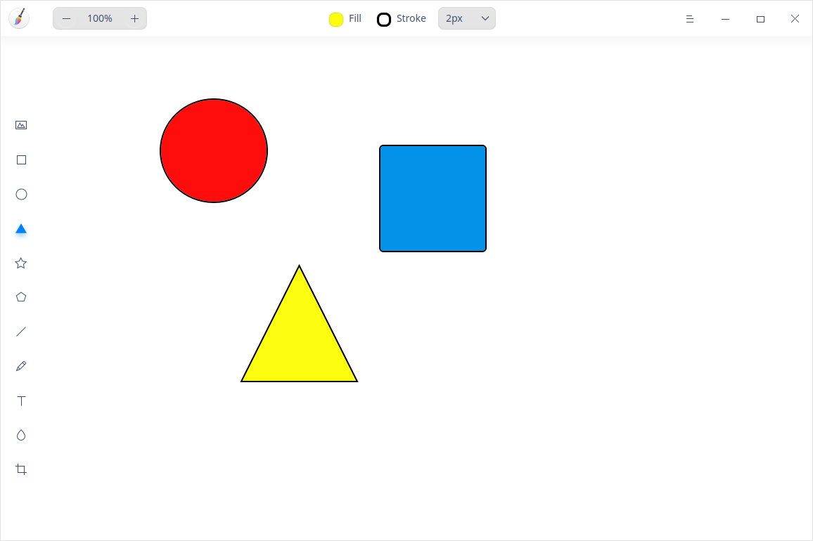

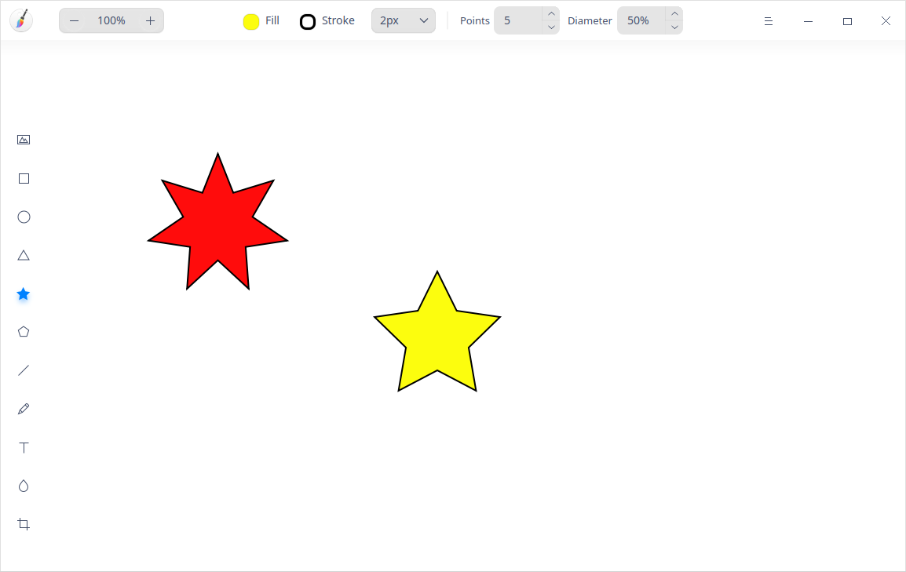

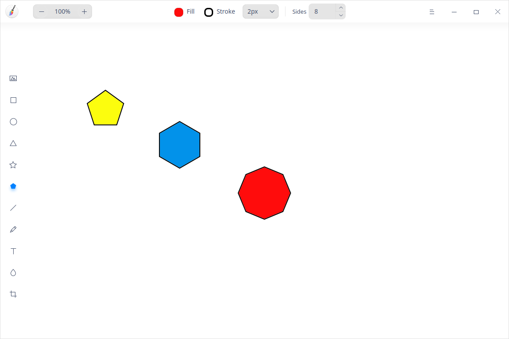

### Herramienta de línea/lápiz

1.   En la interfaz de Dibujo, haga clic en  o .
2.   Intente configurar los parámetros de su lápiz de la siguiente manera:

   - Haga clic en **Color** para establecer el color y la transparencia del lápiz.
   - Seleccione el peso del lápiz en la lista desplegable. 
   - Haga clic en **Inicio** y **Fin** para elegir el estilo del punto inicial y del punto final de los gráficos, incluyendo diferentes tipos de flechas y círculos.
3. Arrastre el ratón en el área de dibujo para dibujar líneas.

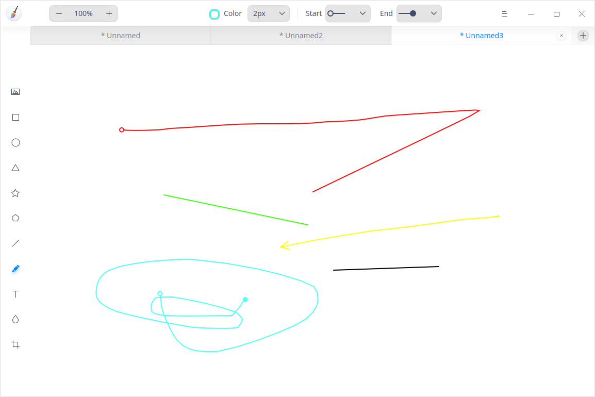

### Herramienta de texto

1. En la interfaz de Dibujo, haga clic en .

2.   Puede configurar los estilos de texto de la siguiente manera:
   - Haga clic en **Color** para establecer el color de relleno y la transparencia de los textos.
   - Seleccione el estilo de fuente en la lista desplegable **Fuente**.
   - Seleccione la fuente normal o la negrita en la lista desplegable.
   - Ajuste el **Tamaño** introduciendo un valor manualmente o seleccionando un tamaño en la lista desplegable.
   
3. Haga clic en el área de dibujo para introducir textos en el cuadro de texto.

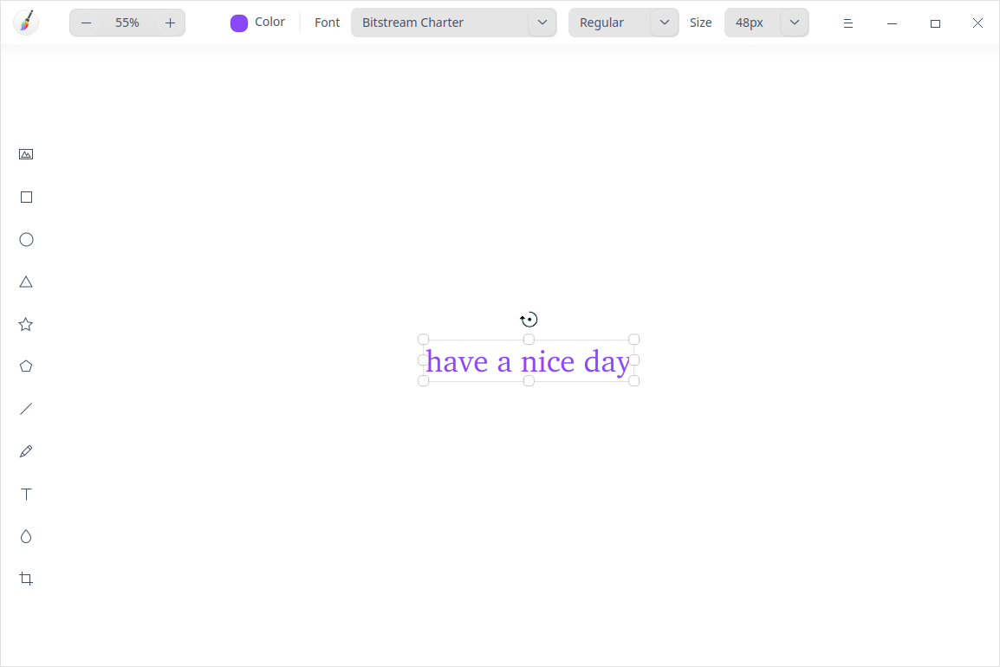
&nbsp;&nbsp;&nbsp;&nbsp;&nbsp;&nbsp;&nbsp;&nbsp;&nbsp;&nbsp;&nbsp;&nbsp;&nbsp;&nbsp;&nbsp;;

>Consejo: Puede utilizar los accesos directos para ajustar el tamaño de la fuente. Cuando la fuente está en edición, seleccione o haga clic en la fuente **Tamaño** y haga clic en la tecla  del teclado para ampliar el tamaño de una escala; también puede seleccionar o hacer clic en la fuente **Tamaño** y hacer clic en la tecla  del teclado para reducir el tamaño de una escala.

### Herramienta de desenfoque

1.   En la interfaz de Dibujo, haga clic en .
2.   Seleccione el **Tipo** de desenfoque.
3.   Cambie el ancho del área de desenfoque haciendo clic en la flecha hacia arriba o hacia abajo en la lista desplegable **Ancho**.
4.   Arrastre el ratón en el área de dibujo para desenfocar el área según sea necesario.

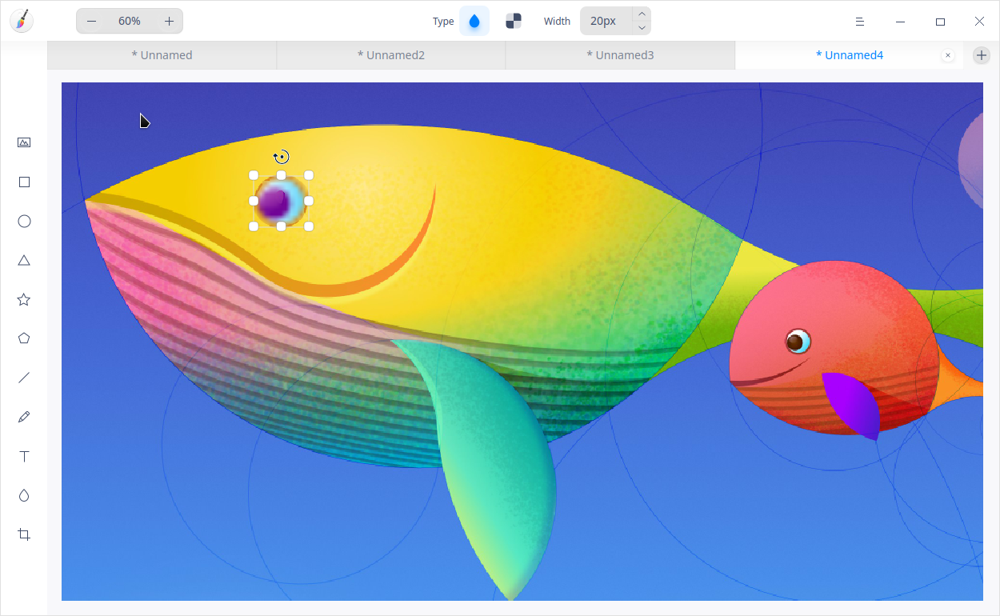

## Funciones de edición

Puede copiar, recortar y girar los gráficos con las funciones de edición, y también ajustar la capa y los textos.

### Copiar y pegar

1.  En la interfaz de dibujo, seleccione los gráficos que desea copiar.
2.  Haga clic con el botón derecho del ratón para seleccionar **Copiar** o utilice los accesos directos **Ctrl + C** para copiar los gráficos en el portapapeles.
3.  Haga clic derecho para seleccionar **Pegar** o utilice los accesos directos **Ctrl + V** para pegar los gráficos en Dibujo.

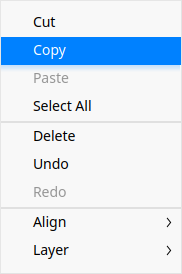

### Recortar

1.  En la interfaz de Dibujo, seleccione una imagen importada.
2.  Haga clic en  para entrar en el modo de recorte.
  - Libre: introduzca la dimensión manualmente o ajuste el área a recortar arrastrando el borde de recorte para realizar un recorte personalizado.
  - Original: recorta en proporción a la imagen original con una relación de 1:1, 2:3, 8:5 y 16:9 respectivamente.

3.  Seleccione el modo de recorte y seleccione el área a recortar.
4.  Pulse la tecla **Intro** para recortar los gráficos del área seleccionada.

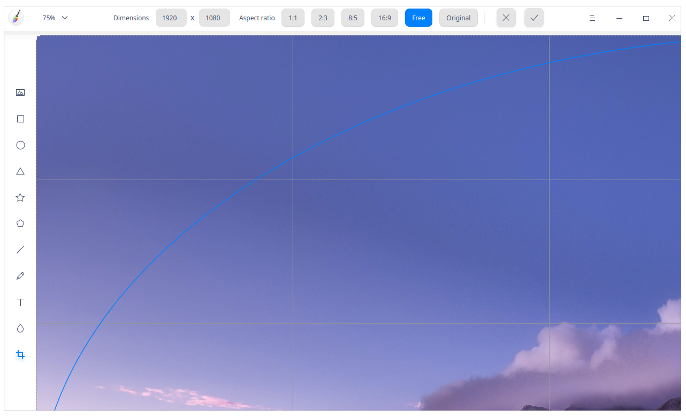

### Voltear

1. En la interfaz de Dibujo, seleccione una imagen importada.
2.  Haga clic en  o  para voltear la imagen vertical u horizontalmente.

### Rotar

1.  En la interfaz de dibujo, seleccione una imagen importada.
2.  Haga clic en  o  para girar la imagen 90 grados en el sentido de las agujas del reloj o en sentido contrario. O gire la imagen haciendo clic en el  de la imagen.

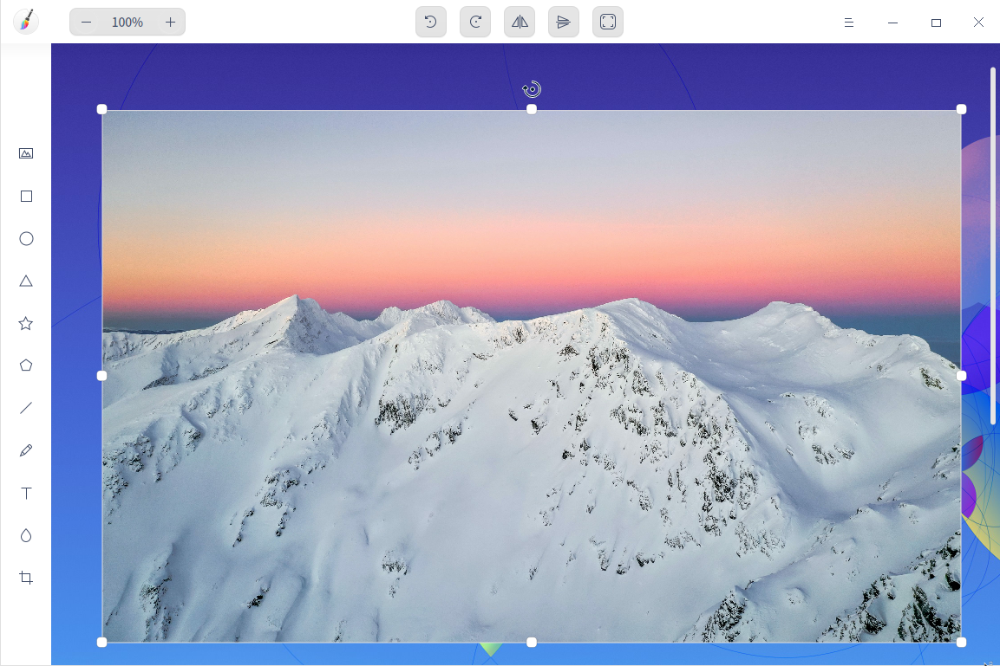
&nbsp;&nbsp;&nbsp;&nbsp;&nbsp;&nbsp;&nbsp;&nbsp;&nbsp;&nbsp;&nbsp;&nbsp;&nbsp;

>    Nota: Si utiliza un ordenador equipado con una pantalla táctil, puede utilizar los gestos de la pantalla táctil para operar en lugar del ratón. Haga clic para seleccionar la imagen con un dedo y mantenga pulsado  para girar la imagen libremente.

### Autoajustar

1.  En la interfaz de Dibujo, seleccione una imagen importada.
2.  Haga clic en  para ajustar el tamaño del lienzo en función de la imagen.
    - Si elige una imagen, el tamaño del lienzo se ajusta según la anchura y la altura de esa imagen.
    - Si elige varias imágenes a la vez, el tamaño del lienzo se ajusta según el mayor rango de bordes.

### Borrar

1.  En la interfaz de Dibujo, seleccione una imagen importada.
2.  Haga clic con el botón derecho para seleccionar **Borrar** o utilice la tecla  del teclado para borrar la imagen seleccionada.

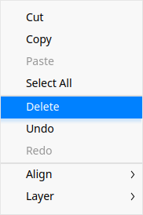

### Ajustar capas

1.  En la interfaz de Dibujo, seleccione una imagen importada.
2.  Haga clic con el botón derecho del ratón en **Capa** para seleccionar **Subir capa**, **Bajar capa**, **Capa al frente** o **Capa al fondo** para ajustar el orden de las capas.

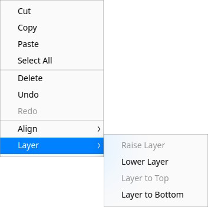

### Alinear capas

1. En la interfaz de Dibujo, seleccione uno o varios gráficos.

2. Haga clic con el botón derecho del ratón y seleccione **Alinear**. Ahora tiene que elegir **Alinear a la izquierda**, **Centrar horizontalmente**, **Alinear a la derecha**, **Alinear arriba**, **Centrar verticalmente**, **Alinear abajo**, **Voltear horizontalmente** o **Distribuir espacios verticalmente**. 

>Notas: 
   - Si selecciona un gráfico, la capa se alineará con el lienzo.
   - Cuando se seleccionan 3 o más gráficos, **Voltear horizontalmente** y **Distribuir espacios verticalmente** están disponibles.

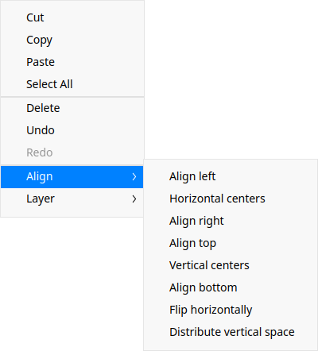

### Alinear textos

1.  En la interfaz de Dibujo, haga clic en  y ajuste el tamaño del cuadro de texto.
2.  Seleccione el texto de destino. 3. Haga clic con el botón derecho del ratón y seleccione **Alinear texto a la izquierda**, **Alinear texto a la derecha** o **Alinear texto al centro** para alinear los textos según sea necesario.

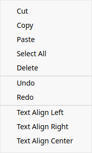

## Menú principal

En el menú principal, puede crear un nuevo dibujo, [Abrir imágenes](#Abrir imágenes), [Exportar imágenes](#Exportar imágenes), [Guardar imágenes](#Guardar imágenes), [Imprimir imágenes](#Imprimir imágenes), cambiar los temas de las ventanas, ver la ayuda y obtener más información sobre Dibujo.

### Nuevo

Puede crear un nuevo dibujo.

1.  En la interfaz de Dibujo, haga clic en .
2.  Haga clic en **Nuevo** para añadir un nuevo dibujo.

### Tema

El tema de la ventana ofrece tres tipos de temas, a saber, Tema claro, Tema oscuro y Tema del sistema.

1. En la interfaz de Dibujo, haga clic en .
2. Haga clic en **Tema** para seleccionar un tema.

### Ayuda

1.  En la interfaz de Dibujo, haga clic en .
2.  Haga clic en **Ayuda** para ver el manual de Dibujo.

### Acerca de

1.   En la interfaz de Dibujo, haga clic en .
2.  Haga clic en **Acerca de** para ver la versión y la introducción de Dibujo.

### Salir

1.  En la interfaz de Dibujo, haga clic en .
2.  Haga clic en **Salir** para salir de Dibujo.

