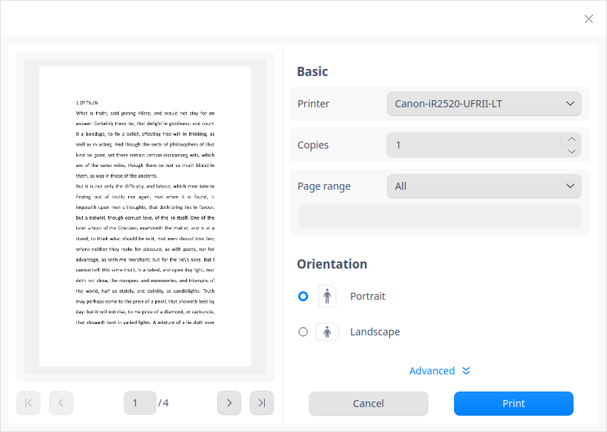

# Editor de texto|../common/deepin-editor.svg|

## Descripción

Editor de texto es una sencilla herramienta de edición de texto. Puede usarlo para escribir un simple documento de texto, o convertirlo en una herramienta de edición de código con sus características avanzadas que soportan el resaltado de sintaxis de código.

## Guía

### Ejecutar Editor de texto

1. Haga clic en  en el muelle para entrar en la interfaz del Lanzador. 
2. Localice el Editor de texto desplazando la rueda del ratón o buscando "editor de texto" en la interfaz del Lanzador y haga clic en él para ejecutarlo.
3. En el Lanzador, haga clic con el botón derecho en Editor de texto y podrá que:

  - Haga clic en **Enviar al escritorio** para crear un acceso directo al escritorio.
  - Haga clic en **Enviar al muelle** para fijarlo en el muelle.
  - Haga clic en **Añadir al arranque** para añadirlo al inicio y que se ejecute automáticamente al arrancar el sistema.

### Salir del Editor de texto

- En la interfaz del Editor de texto, haga clic en  para salir.
- En la interfaz del Editor de texto, haga clic en  > **Salir** para cerrar.
- Haga clic con el botón derecho del ratón en  en el muelle y seleccione **Cerrar todo** para salir.

### Ver atajos de teclado

En la interfaz del Editor de texto, pulse **Ctrl + Shift + ? ** para ver todos los atajos. También puede ver los atajos en Ajustes. El dominio de los atajos mejorará enormemente su eficiencia.

## Operaciones básicas

### Crear archivos

Haga clic en  en la barra de título, o pulse **Ctrl + N**, o haga clic en > **Nueva ventana** o **Nueva pestaña** para crear un documento en blanco en el Editor de texto.

### Abrir archivos

Puede abrir uno o varios archivos de texto a la vez de las siguientes maneras, y el archivo seleccionado se abrirá en la nueva pestaña:

- Arrastre el archivo directamente a la interfaz del Editor de texto o a su icono.
- Haga clic derecho en el archivo y ábralo con el Editor de texto. Después de seleccionar Editor de texto como aplicación predeterminada para los archivos de texto en el Centro de control, puede hacer doble clic en el archivo para abrirlo directamente.
- En la interfaz del Editor de texto, haga clic en **Abrir archivo** y seleccione el archivo.
- En la interfaz del Editor de texto, utilice **Ctrl + O** para abrir el archivo.

### Guardar archivos

- Pulse **Ctrl + S** para guardar el documento actual.
- Clic en > **Guardar** para guardar el archivo.

- Pulse **Ctrl + Shift + S** para guardar el archivo como uno nuevo.

### Cerrar archivos

- Pulse **Ctrl + W** para cerrar el archivo.
- Mueva el cursor hasta el título y haga clic en el botón  allí o bien en el botón central del ratón para cerrar el archivo.
- Haga clic con el botón derecho en el título y seleccione **Cerrar pestaña** o **Cerrar otras pestañas**.
- Haga clic con el botón derecho del ratón en el título y seleccione **Más opciones**.
   - Seleccione **Cerrar pestañas a la izquierda** para cerrar todas las pestañas a la izquierda de la pestaña actual.
   - Seleccione **Cerrar pestañas a la derecha** para cerrar todas las pestañas a la derecha de la pestaña actual.
   - Seleccione **Cerrar pestañas sin modificar** para cerrar todas las pestañas no modificadas.

> Nota: Si realiza cambios en el archivo pero no los guarda, el Editor de texto le pedirá que los guarde antes de cerrar el archivo.

### Imprimir archivos

Para imprimir un archivo en el Editor de texto, primero debe conectar y configurar la impresora.

1. Haga clic en > **Imprimir**, o pulse **Ctrl + P** para abrir la interfaz de vista previa de impresión.
2. En la interfaz de vista previa, previsualice el documento，seleccione una impresora y configure la página de impresión. 
3. Haga clic en la opción **Avanzado** en la interfaz de vista previa para seleccionar los parámetros, incluidos el tamaño del papel y el diseño.  
4. Haga clic en **Imprimir** para iniciar la impresión.

### Gestionar pestañas

En el Editor de texto, puede reordenar las pestañas dentro de la misma ventana arrastrándolas. También puede eliminar la pestaña para crear una nueva ventana, o mover la pestaña de una ventana a otra.

#### Accesos directos a las pestañas

| Función | Atajo de teclado |
| ---------------------------------- | ------------ |
| Nueva pestaña | Ctrl + T |
| Pestaña siguiente | Ctrl + Tab |
| Pestaña anterior | Ctrl + Shift + Backtab |
| Cerrar pestaña | Ctrl + W |
| Cerrar otras pestañas | Ctrl + Shift + W |
| Restaurar pestaña (Reabrir pestaña cerrada) | Ctrl + Shift + T |

## Editar textos

### Mover el cursor

Además de las teclas de flecha y los clics del ratón, también puede utilizar los siguientes atajos para mover el cursor rápidamente:

| Función | Atajo de teclado |
| --------------- | ------------ |
| Guardar la posición del cursor | Ctrl + Shift + > |
| Restablecer la posición del cursor (saltar a la última posición guardada del cursor) | Ctrl + Shift + < |
| Avanzar una palabra (Saltar una palabra hacia adelante) | Ctrl + Derecha |
| Avanzar una palabra (Saltar una palabra hacia atrás) | Ctrl + Izquierda |
| Desplazarse al final de la línea | End |
| Desplazarse al principio de la línea | Home |
| Ir al final del texto | Ctrl + Fin |
| Mover al principio del texto | Ctrl + Inicio |
| Mover a la sangría de la línea | Ctrl + M |
| Adelantar sobre un par (saltar hacia adelante a partir del paréntesis derecho) | Alt + P |
| Retroceder sobre un par (saltar hacia atrás a partir del paréntesis izquierdo) | Alt + N |

### Cambiar mayúsculas y minúsculas

Esta opción le ayuda a cambiar la capitalización del texto seleccionado. Puede cambiarlo a minúsculas, mayúsculas o poner la inicial en mayúsculas.

1. Seleccione el texto.
2. Haga clic con el botón derecho del ratón y seleccione **Cambiar mayúsculas y minúsculas**.
3. Elija **Mayúsculas**, **Mayúsculas** o **Capitalizar**. Los cambios surtirán efecto inmediatamente.

También puede utilizar **Alt** + **U / L / C** para cambiar rápidamente las mayúsculas.

### Resaltar textos
El Editor de texto permite resaltar diferentes tipos de textos.

Haga clic en el símbolo del triángulo en la esquina derecha de la barra de estado en la parte inferior, y seleccione el tipo de texto que desea resaltar. El contenido correspondiente del texto se resaltará automáticamente.

### Borrar textos

Además de borrar los caracteres uno a uno, puede eliminar rápidamente los caracteres utilizando los siguientes atajos:

| Función | Atajo de teclado |
| --------------- | ------------ |
| Borrar hasta el final de la línea | Ctrl + K |
| Borrar la línea actual| Ctrl + Shift + K |
| Borrar una palabra anterior | Alt + Shift + N |
| Borrar una palabra posterior | Alt + Shift + M |

### Deshacer

Si realiza una operación incorrecta, pulse **Ctrl + Z** para deshacerla, o haga clic con el botón derecho para seleccionar **Deshacer**.

### Buscar textos

1. Haga clic en  y seleccione **Buscar**, o pulse **Ctrl** + **F** para abrir el cuadro "Buscar" que aparece a continuación.
2. Introduzca el texto que desee encontrar. 
3. Haga clic en **Siguiente**, **Anterior** para encontrar cada coincidencia, o pulse la tecla **Intro** para encontrar la siguiente coincidencia.
4. Pulse la tecla **Esc** o haga clic en el botón de cierre para cerrar el cuadro de diálogo.

> Consejo: Seleccione el texto y luego pulse **Ctrl + F** y el texto se mostrará automáticamente en el cuadro **Buscar**.

### Reemplazar textos
1. Haga clic en , y seleccione **Reemplazar**, o pulse **Ctrl + H** para abrir el cuadro **Reemplazar** que aparece a continuación.
2.  Introduzca el texto a sustituir y el nuevo texto.
3.  Haga clic en **Reemplazar** para reemplazar las coincidencias una por una y haga clic en **Reemplazar el resto** y **Reemplazar todo** para reemplazar el resto o todas las coincidencias a la vez. Haga clic en **Saltar** para omitir el texto coincidente actual.
4.  Pulse **Esc** o haga clic en el botón de cierre para cerrar el cuadro de diálogo.

### Ir a la línea
Utilice Ir a la línea para saltar a la línea específica directamente.
Haga clic con el botón derecho del ratón y seleccione **Ir a la línea**, o pulse **Ctrl + G** y luego introduzca el número de línea para ir a esa línea.

### Editar Línea

Utilice los siguientes atajos para editar fácilmente las líneas:

| Función | Atajo de teclado |
| ------------ | ------------ |
| Nueva línea encima (Inserta una línea superior) | Ctrl + Enter |
| Nueva línea debajo (Inserta una línea inferior) | Ctrl + Shift + Enter |
| Duplicar línea | Ctrl + Shift + D |
| Subir línea (Cambia la línea actual con la superior) | Ctrl + Shift + Up |
| Bajar línea (Cambia la línea actual con la inferior) |Ctrl + Shift + Down|
| Desplazar una línea hacia arriba | Super + Shift + Up |
| Desplazar una línea hacia abajo | Super + Shift + Down |
| Resaltar                                             | Alt + H |
| No resaltar                                          | Alt + Shift + H |
| Copiar línea | Super + C |
| Cortar línea | Super + X |
| Combinar líneas | Ctrl + J |

### Activar/desactivar modo de sólo lectura

1. Abra el documento con el Editor de texto y haga clic con el botón derecho para seleccionar **Activar modo de sólo lectura**.

&nbsp;&nbsp;&nbsp;&nbsp;&nbsp;&nbsp;&nbsp;&nbsp;&nbsp;&nbsp;&nbsp;&nbsp;&nbsp;

2.  Haga clic con el botón derecho del ratón para seleccionar **Desactivar modo de sólo lectura** cuando está en ese modo.

&nbsp;&nbsp;&nbsp;&nbsp;&nbsp;&nbsp;&nbsp;&nbsp;&nbsp;&nbsp;&nbsp;&nbsp;&nbsp;

### Usar modo de columna

Puede introducir contenido idéntico o eliminar contenido de múltiples líneas de código utilizando la función de modo columna de forma eficiente. 

- Edite contenido en múltiples líneas al mismo tiempo: Mantenga pulsada la tecla **Alt**, arrastre el ratón para seleccionar varias líneas y edite el contenido.
- Elimine el contenido de varias líneas al mismo tiempo: Mantenga pulsada la tecla **Alt**, arrastre el ratón para seleccionar varias líneas y haga clic con el botón derecho para seleccionar **Borrar** o haga clic en **Borrar** en el teclado para eliminar el contenido.

### Resaltar

Seleccione el texto a marcar en el Editor de texto, haga clic con el botón derecho para seleccionar **Resaltador** y seleccione las opciones correspondientes en la lista desplegable según sea necesario.

&nbsp;&nbsp;&nbsp;&nbsp;&nbsp;&nbsp;&nbsp;&nbsp;&nbsp;&nbsp;&nbsp;&nbsp;&nbsp;

- Seleccione **Resaltar** para colorear una determinada línea o un párrafo de textos. Puede elegir entre 8 colores que se muestran a través de iconos.
   - Coloque el cursor en cualquier línea y podrá marcar la línea actual.
   - Seleccione un párrafo de textos y podrá marcar los textos seleccionados.
- Seleccione **Resaltar todo** para colorear todo el contenido en el Editor de texto, o marcar todo el contenido coincidente de los textos seleccionados en el Editor de texto. Puede elegir entre 8 colores que se muestran a través de iconos.
   - Coloque el cursor en cualquier línea y podrá marcar todos los contenidos.
   - Seleccione cualquier contenido y podrá marcar el mismo contenido en todo el documento. 
- Seleccione **Borrar último resalte** para revertir la última operación de marcado.
- Seleccione **Borrar todo lo resaltado** para revertir todas las marcas actuales.

### Gestionar marcadores

Puede añadir un marcador para cualquier línea actual en la interfaz del Editor de texto. El icono  aparece cuando se desplaza el cursor a cualquier línea de la columna de la izquierda, y el icono  aparecerá después de añadir un marcador con éxito.

- Añadir marcador

   + Haga clic en  para añadir un marcador para la línea.
   + Haga clic con el botón derecho del ratón en  y seleccione **Añadir marcador** para añadir un marcador para la línea.
   + Situar el cursor en cualquier línea y pulsar **Ctrl + F2** para añadir un marcador para la línea.

- Borrar marcador  

   + Haga clic en el icono del marcador de color  para eliminar el marcador de la línea directamente.
   + Haga clic con el botón derecho del ratón en el icono del marcador de color  para seleccionar **Cancelar marcador** para eliminar el marcador de la línea.
   + Haga clic con el botón derecho en un marcador para seleccionar **Borrar marcador** para eliminar todos los marcadores del texto.
  > Nota: El icono del marcador sólo aparece cuando el cursor se sitúa a la izquierda del número de línea en la columna de la izquierda; cuando se mueve más allá de la columna del marcador de la izquierda, el icono del marcador desaparecerá. Haga clic en el icono cuando aparezca y se llenará de color, después de lo cual este icono de color lleno permanecerá sin importar si el cursor se cierne cerca de la columna del marcador.

### Gestionar comentarios 

Puede añadir comentarios a cualquier texto con un sufijo de tipo de código, como cpp, java, entre otros.

- Añadir comentario
  - Seleccione el texto necesario y pulse el botón derecho del ratón para seleccionar **Añadir comentario**.
  - Seleccione el texto necesario y pulse **Alt + A** para añadir el comentario.

- Cancelar comentario
     - Seleccione el texto necesario y haga clic con el botón derecho para seleccionar **Cancelar comentario**.

     - Seleccione el texto necesario y pulse **Alt + Z** para cancelar el comentario.

> Nota: Esto admite comentarios en diferentes lenguajes. Consulte las condiciones existentes para obtener información detallada. Por ejemplo, el símbolo de comentario para C, C# y Java es // y el símbolo de comentario para Python es #.

## Menú principal

En el menú principal, puede [Crear nuevas ventanas](#Crear archivos), [Crear nuevos archivos](#Crear archivos), buscar el contenido a reemplazar, guardar archivos, cambiar los temas de las ventanas, ver el manual de ayuda y obtener más información sobre el Editor de texto.

### Ajustes

Puede establecer la información básica, los accesos directos y la información avanzada en los ajustes.

#### Ajustes básicos

Haga clic en > **Ajustes** y podrá realizar lo siguiente en la ventana de Ajustes:

- Seleccione la fuente y el tamaño de la fuente.
- Marque o desmarque **Ajuste de línea**.
- Marque **Marcador para contraer el código** y  o  se muestran en el área de edición. Haga clic con el botón derecho del ratón para seleccionar **Mostrar/ocultar el nivel actual** o **Mostrar/ocultar todo** para realizar las operaciones correspondientes.
- Marque **Mostrar números de línea** para numerar las líneas en el área de edición.
- Marque **Mostrar espacios en blanco y tabulaciones** para mostrar todos los espacios en blanco y tabulaciones. También puede introducir o eliminar manualmente los espacios en blanco y los tabuladores.

> Consejos: También puede utilizar **Ctrl + "+"/ "-" ** para ajustar el tamaño de la fuente, y pulsar **Ctrl + 0** para restaurar el tamaño de la fuente por defecto.

#### Ajustes de los atajos de teclado
1. Haga clic en > **Ajustes** para ver el acceso directo actual en la opción **Atajos de teclado**.
2. Seleccione un mapa de teclas en **Atajos de teclado** y vea los accesos desde el teclado.
3. Puede hacer clic y personalizar nuevos accesos directos.

> Nota: Puede elegir un mapa de teclado adecuado a sus hábitos, incluyendo el mapa de teclado estándar, el mapa de teclado de Emacs, o personalizarlo a su gusto.

#### Ajustes avanzados

1. Haga clic en > **Ajustes**.
2. En la opción **Avanzada**, puede establecer:
   - Tamaño de la ventana: Normal, Máximo o Pantalla completa;
   - Ancho del tabulador: El ancho de la sangría al pulsar el tabulador.

> Atención: Al hacer clic en **Restablecer valores predeterminados** se restablecerán todos los ajustes al estado predeterminado.

### Tema

El tema de la ventana ofrece tres tipos de tema, a saber, Tema claro, Tema oscuro y Tema del sistema.

1. En la interfaz del Editor de texto, haga clic en .

2.  Haga clic en **Tema** para seleccionar un tema.

### Ayuda

1.  En la interfaz del Editor de texto, haga clic en .
2.  Seleccione **Ayuda** para ver el manual del Editor de texto.

### Acerca de

1. En la interfaz del Editor de texto, haga clic en .
2.  Seleccione **Acerca de** para ver la versión y la introducción del Editor de texto.

### Salir

1. En la interfaz del Editor de texto, haga clic en .
2. Haga clic en **Salir** para salir del Editor de texto.  
