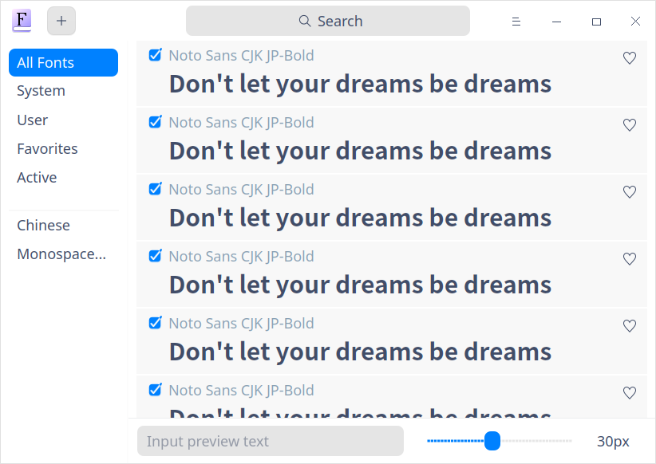
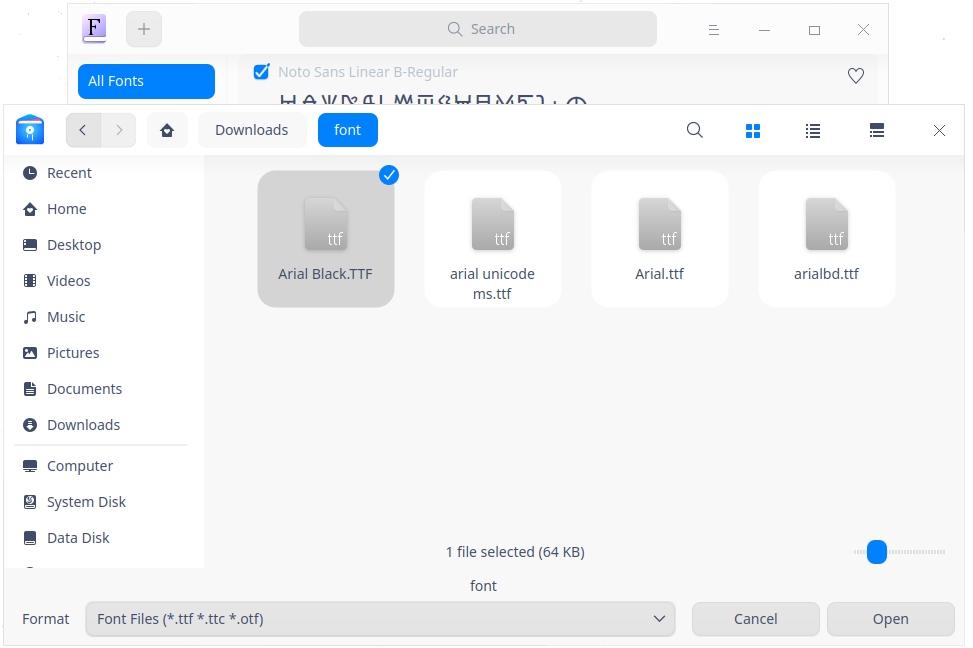
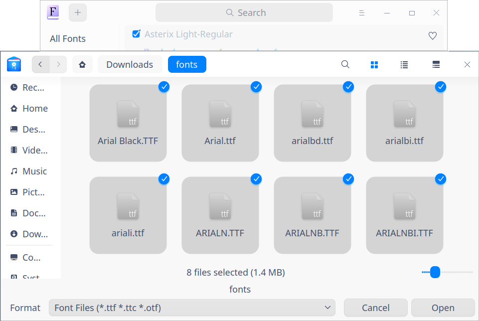
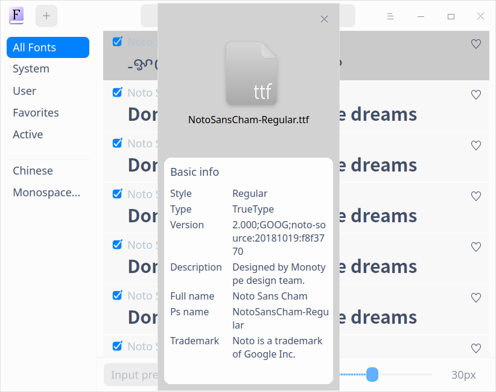
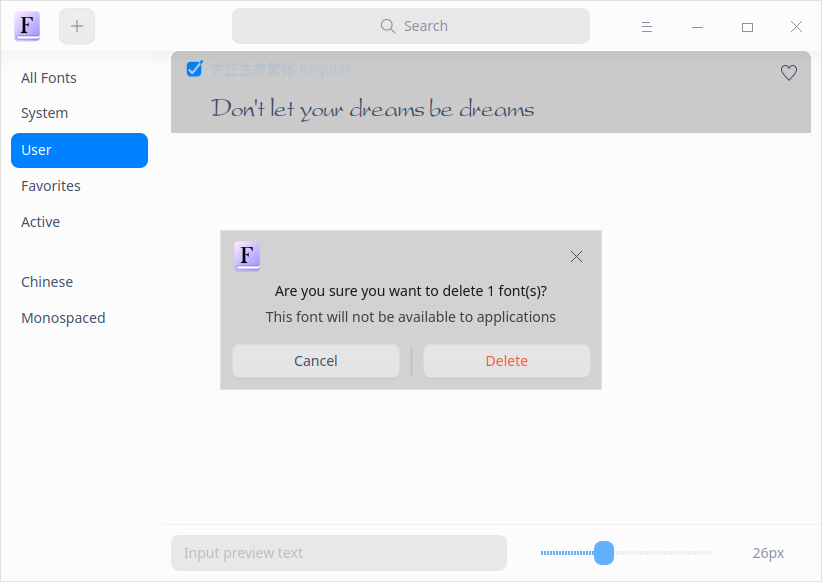

# Administrador de fuentes|../common/deepin-font-manager.svg|

## Descripción

El Administrador de fuentes es una potente herramienta de gestión de fuentes. Con el Administrador de fuentes, no sólo puede buscar, instalar, activar, desactivar y eliminar fuentes, entre otras cosas, sino también previsualizar las fuentes introduciendo textos y ajustando el tamaño del texto.  

Admite fuentes en formatos ttf, ttc y otf.

## Guía

Puede ejecutar, salir o crear un acceso directo para el Administrador de Fuentes de las siguientes maneras.

### Ejecutar el Administrador de Fuentes

1.   Haga clic en  en el muelle para entrar en la interfaz del Lanzador.
2.   Localice  desplazando la rueda del ratón o buscando "administrador de fuentes" en la interfaz del Lanzador y haga clic en él para ejecutarlo.
3.   Haga clic con el botón derecho del ratón en  y puede que:

   - Haga clic en **Enviar al escritorio** para crear un acceso directo al escritorio
   - Haga clic en **Enviar al muelle** para fijarlo en el Muelle.
   - Haga clic en **Añadir al inicio** para añadir la aplicación al inicio y que se ejecute automáticamente cuando se inicie el sistema.

### Salir del Administrador de Fuentes

- Haga clic en  en la interfaz del Administrador de fuentes para salir del Administrador de fuentes.
- Haga clic con el botón derecho del ratón en  en el muelle y seleccione **Cerrar todo** para salir.
- Haga clic en  en la interfaz del Administrador de fuentes y seleccione **Salir** para salir.

## Operación

### Interfaz introductiva

| Name       | Description                                                  |
| ---------- | ------------------------------------------------------------ |
| Todas las fuentes | Una colección de fuentes del sistema y de usuario, con todas las fuentes mostradas por defecto. |
| Sistema | Listas de fuentes que vienen con el sistema. Las fuentes de este conjunto de fuentes no se pueden eliminar. |
| Usuario | Listas de fuentes instaladas por el usuario.                            |
| Favoritos | Las listas de fuentes favoritas del usuario, es decir, la colección de fuentes seleccionadas de otros conjuntos de fuentes. |
| Activo | Todas las colecciones de fuentes bajo el estado de inicio |
| Chino | Los caracteres chinos en todos los conjuntos de fuentes, mostrando los nombres en chino |
| Monospaced | Todas las fuentes con la misma anchura de caracteres |

### Instalar fuentes

Con el Administrador de fuentes, no sólo puede instalar una sola fuente, sino también instalar varias fuentes en un lote.

#### Instalación de una fuente

1.  En la interfaz del Administrador de fuentes, haga clic en  o seleccione > **Añadir fuente**.
2. Seleccione el archivo de fuentes que desea instalar, haga clic con el botón derecho y seleccione **Abrir**, o haga doble clic en el archivo de fuentes para abrir el Administrador de fuentes para su instalación.
3.  Introduzca la contraseña de autorización en la ventana emergente de autorización (si la hay).
4.  Haga clic con el botón derecho del ratón en el archivo de fuentes después de la instalación correcta y seleccione **Mostrar en el Administrador de archivos** para ver la ubicación específica de la instalación.

> Consejo: También puede hacer clic con el botón derecho del ratón en el archivo de fuentes y seleccionar **Abrir con** >  **Administrador de fuentes** para entrar en la interfaz del Administrador de fuentes e instalar la fuente.

> Nota: El Administrador de fuentes detectará sus fuentes automáticamente. Si la fuente ha sido instalada localmente, aparecerá un mensaje para avisarle de que ya se ha instalado una versión idéntica. Puede seleccionar **Salir** o **Continuar** para salir o continuar la instalación.

#### Instalación en lote

Puede añadir varias fuentes en un lote a la vez arrastrando o seleccionando archivos en el Administrador de fuentes. Consulte los pasos de instalación en [Instalación de una fuente](#Instalación de una fuente). Preste atención a los siguientes puntos durante la instalación por lotes:

- Puede instalar una sola fuente o fuentes por lotes después de una instalación por lotes exitosa.
- La reinstalación puede realizarse para las fuentes que ya están instaladas localmente durante la instalación por lotes.

> Nota: Si desea utilizar la fuente instalada como fuente del sistema, puede abrir el **Centro de control**, hacer clic en **Fuente** en **Personalización** y establecer la fuente como **Fuente estándar**.

### Buscar fuentes

1.   En el cuadro de búsqueda de la parte superior de la interfaz del Administrador de fuentes, puede hacer clic en  para introducir palabras clave.

2.  Pulse la tecla Intro del teclado para realizar la búsqueda.
   - Cuando haya información coincidente, se mostrarán las listas de resultados de la búsqueda en la interfaz. 
   - Cuando no haya información coincidente, se mostrará **Sin resultados de búsqueda** en la interfaz.
3.   Cuando hay fuentes coincidentes, puede previsualizar los contenidos que coinciden con los criterios de búsqueda introduciendo textos en el cuadro de previsualización de texto inferior y arrastrando la barra de control horizontalmente para ajustar el tamaño de la fuente.
4.   Haga clic en  o borre la información introducida en el cuadro de búsqueda para borrar los criterios de búsqueda actuales o cancelar la búsqueda.

### Exportar fuentes

1. En la interfaz del Administrador de fuentes, haga clic con el botón derecho en la fuente y seleccione **Exportar**.
2. Aparece un mensaje de aviso **La fuente exportada a su escritorio** y desaparece varios segundos después.

La fuente exportada se guarda por defecto en la carpeta del escritorio, con el nombre de carpeta Font por defecto.

> Nota: Se admite la exportación de fuentes individuales y por lotes. Sólo se exporta la última versión de la misma fuente. No se exportará ninguna copia. La fuente del sistema no se puede exportar.

### Ver la información básica de las fuentes

Puede ver la información básica de las fuentes a través del Administrador de fuentes.

1. Haga clic con el botón derecho para seleccionar **Detalles** en la lista de conjuntos de fuentes de la interfaz del Administrador de fuentes.
2. Puede ver el icono de la fuente, el nombre, el estilo, el tipo, la versión y la información de la descripción.

### Ver la ubicación de la instalación de la fuente

Cuando la fuente se ha instalado correctamente, puede ver su ubicación de instalación a través del Administrador de archivos.

Haga clic con el botón derecho en una fuente de la lista de conjuntos de fuentes y seleccione **Mostrar en el administrador de archivos** en la interfaz del Administrador de fuentes para ver la ubicación de instalación específica.

### Vista previa de las fuentes

Cada bloque de texto de la fuente en los conjuntos de fuentes presenta el estilo de fuente correspondiente y puede ver el efecto de visualización mediante la vista previa de las fuentes.

La copia de vista previa por defecto es **Don't let your dreams be dreams** (***No dejes que tus sueños sean sueños***) y se muestra en inglés.

1.   Introduzca los textos en el cuadro de entrada de la vista previa de la fuente en la parte inferior en la interfaz del Administrador de fuentes.

2.   Ajuste el tamaño de la fuente arrastrando la barra de control horizontalmente.

3. Vea el efecto de visualización en la lista de conjuntos de fuentes.

   > Nota: Arrastre la barra de control hacia la izquierda para reducir el tamaño de la fuente y arrástrela hacia la derecha para ampliarlo. El tamaño de la fuente va de 6px a 60px.

### Añadir/quitar fuentes a favoritos

Puede marcar como favorita o desfavorable una fuente a través del Administrador de fuentes.
1.   Haga clic en **Todas las fuentes** en la interfaz del Administrador de fuentes.

2.   Haga clic en el icono  a la derecha de una fila de la lista.

3.  Vea la fuente en la lista de **Favoritas**. El estado cambia a **Añadir a favoritas** .

4.   Haga clic en el icono  en la lista **Todas las fuentes**. La fuente no favorita no se mostrará en la lista **Favoritas** y el estado mostrado en otras listas de conjuntos de fuentes se cambia a **Quitar de favoritas** .

5.   En la lista **Todas las fuentes**, también puede hacer clic con el botón derecho para seleccionar **Añadir a favoritas** o **Quitar de favoritas**.

> Nota: Añadir/Quitar están disponibles para una sola fuente y para un lote de fuentes.

### Activar/Desactivar fuentes

Puede activar o desactivar una fuente a través del Administrador de fuentes.

1.   Seleccione la fuente con estado **Desactivado** en la lista **Usuario** de la interfaz del Administrador de fuentes.

2.   Marque la fuente. La fuente se habilitará y se mostrará en la lista **Activa**. 

3.   Haga clic en la fuente marcada en la lista **Activa** para desactivar la fuente.

   La fuente desactivada no se mostrará en la lista **Activa** y aparecerá en gris en otras listas de conjuntos de fuentes con un estado **Desactivada**.

4.   También puede hacer clic con el botón derecho del ratón en **Activar** o **Desactivar** en la lista **Usuario** para realizar la operación correspondiente. 

> Nota: Activar/Desactivar están disponibles para una sola fuente y para un lote de fuentes. La fuente del sistema y la que se está utilizando actualmente no se pueden desactivar.

### Eliminar fuentes

Puede eliminar una fuente a través del Administrador de fuentes.

> Nota: La eliminación está disponible para una sola fuente y para un lote de fuentes. La fuente del sistema y la fuente que se está utilizando actualmente no se pueden eliminar.

1. Seleccione una fuente en la lista **Usuario** de la interfaz del Administrador de fuentes y haga clic con el botón derecho del ratón en **Eliminar**.
2.  Haga clic en **Borrar** en el cuadro emergente.
3.  Introduzca la contraseña de autorización en el cuadro de diálogo de autorización emergente (si existe) para eliminar la fuente.

## Menú principal

En el menú principal, puede cambiar los temas de las ventanas, ver el manual de ayuda y obtener más información sobre el Administrador de fuentes.

### Tema

El tema de la ventana ofrece tres tipos de temas, a saber, claro, oscuro y sistema.

1.   En la interfaz del Administrador de fuentes, haga clic en .
2.   Haga clic en **Tema** para seleccionar un tema.

### Ayuda

1.   En la interfaz del Administrador de fuentes, haga clic en .
2.   Haga clic en **Ayuda** para ver el manual del Administrador de fuentes.

### Acerca de

1.   En la interfaz del Administrador de fuentes, haga clic en .
2.   Haga clic en **Acerca de** para ver la versión y la introducción del Administrador de fuentes.

### Salir

1.   En la interfaz del Administrador de fuentes, haga clic en .
2.   Haga clic en **Salir** para salir del Administrador de fuentes.

