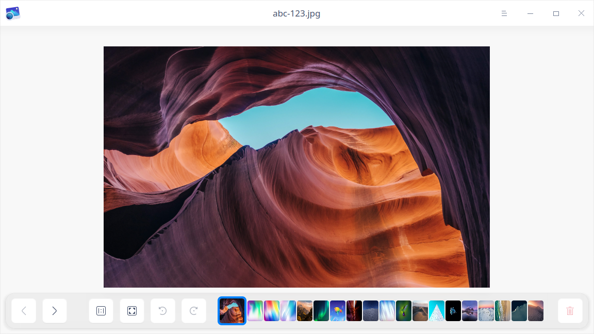
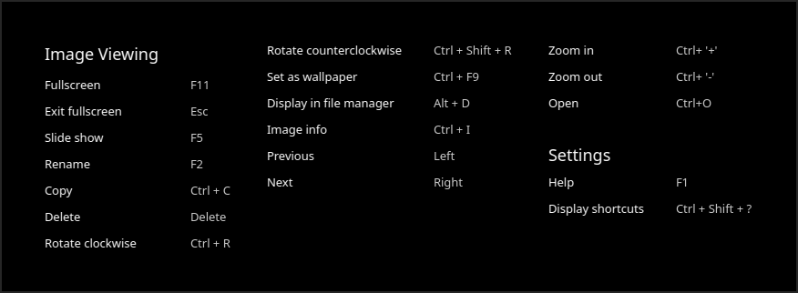
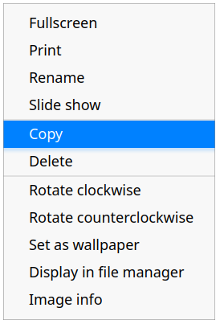
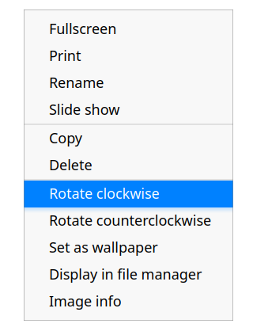
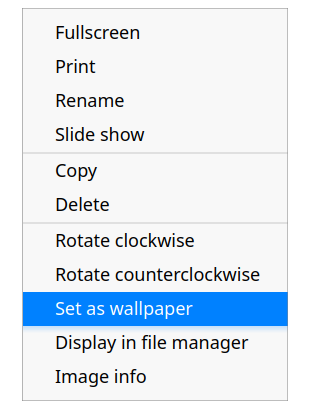
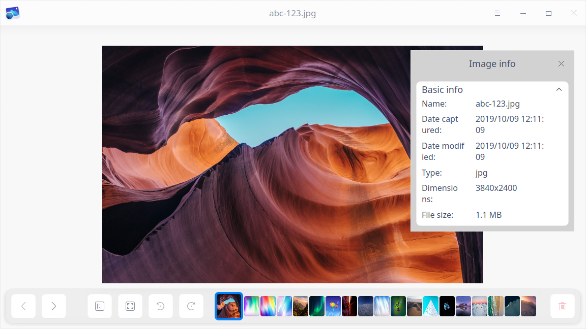

# Visor de imágenes|../common/deepin-image-viewer.svg|

## Descripción

El Visor de imágenes es un visualizador de gráficos ligero con un aspecto moderno y un rendimiento fluido. Soporta una amplia gama de formatos de imagen, es más que fácil de usar. 

## Guía

Puede ejecutar, cerrar y crear accesos directos para el Visor de imágenes de las siguientes maneras.

### Ejecutar el Visor de imágenes

1. Haga clic en  en el muelle para entrar en la interfaz del Lanzador.
2. Localice  desplazando la rueda del ratón o buscando "Visor de imágenes" en la interfaz del Lanzador.
3. Haga clic con el botón derecho del ratón en  y el usuario podrá:
 - Hacer clic en **Enviar al escritorio** para crear un acceso directo al escritorio.
 - Hacer clic en **Enviar al muelle** para fijar la aplicación en el muelle.
 - Hacer clic en **Añadir al arranque** para añadir la aplicación al inicio y que se ejecute automáticamente cuando se inicie el sistema.

### Salir del Visor de imágenes

1. En la interfaz del Visor de imágenes, haga clic en  para salir del Visor de imágenes.
2. Haga clic con el botón derecho del ratón en  en el muelle y seleccione **Cerrar todo** para salir del Visor de imágenes.
3. Haga clic en  en la interfaz del Visor de imágenes y seleccione **Salir** para salir del Visor de imágenes.

### Ver atajos de teclado

En la interfaz del Visor de imágenes, pulse **Ctrl + Shift + ?** en el teclado para ver los atajos de teclado. 

## Visualización de imágenes

### Abrir imágenes
Puede utilizar una de las siguientes formas para abrir archivos de imagen:

- Haga clic con el botón derecho en una imagen y seleccione **Abrir con** > **Visor de imágenes**. 
- Haga doble clic en una imagen para abrirla si el Visor de imágenes ha sido configurado como la aplicación predeterminada para la visualización de imágenes.
- Abrir el Visor de imágenes. Haga clic en **Abrir imagen** y seleccione el archivo de imagen para abrirlo.
- Abra el Visor de imágenes y arrastre la imagen a la interfaz para abrirla.
- Arrastre la imagen al icono del Visor de imágenes en el escritorio o muelle para abrirla.

> Consejos:
>
> En el Centro de control, puede establecer el Visor de imágenes como el visor de imágenes predeterminado. Consulte [Aplicaciones predeterminadas](dman:///dde#Ajustes de aplicaciones predeterminadas) para conocer las operaciones específicas.
>
> Se admiten los siguientes formatos de imagen: BMP, ICO, JPG/JPE/JPEG, PNG, TGA, TIF/TIFF, XPM, GIF, SGI, RAW, WEBP, CR2, NEF, DNG, RAF, MEF, MRW, XBM, SVG, ORF y MNG.

>Notas: Si utiliza un equipo provisto de pantalla táctil o touchpad, puede utilizar gestos en lugar del ratón para acercar o alejar las imágenes que se están visualizando:
>
>- En la pantalla táctil, abre los dos dedos para acercarte y pellízcalos para alejarte.
>- En el panel táctil que admite el toque de varios puntos, abre los dos dedos para acercar la imagen y pellízcalos para alejarla.

### Interfaz principal

| Icono                                                | Nombre                    | Descripción                      |
| -------------------------------------------------- | ----------------------- | ------------------------------------------------------------ |
|                      | Anterior | Retrocede a la imagen anterior.                                |
|                             | Siguiente | Pasa a la siguiente imagen.                                    |
|  | Tamaño 1:1 | La imagen se mostrará en tamaño 1:1 sin cambiar el tamaño de la ventana. |
|  | Ajustar a la ventana | La imagen se redimensionará para adaptarse a la ventana actual.    |
|  | Girar a la derecha | Gira la imagen 90 grados en el sentido de las agujas del reloj.                    |
|              |  Girar a la izquierda | Gira la imagen 90 grados en sentido contrario a las agujas del reloj.                |
|  | Borrar | Borra la imagen actual.                                    |

> Consejo: Si el tamaño de la imagen excede la ventana, aparecerá una ventana de navegación en la esquina inferior izquierda de la interfaz, que le ayudará a movilizar rápidamente en las áreas de la imagen. Si no desea que se muestre la ventana de navegación automáticamente, puede cerrarla haciendo clic en **X** en la esquina superior derecha de la ventana. Puede hacer clic con el botón derecho para seleccionar **Ocultar/Mostrar ventana de navegación** en la interfaz del Visor de imágenes.

> Nota: Los iconos de Girar y Borrar aparecerán desactivados y en gris para las imágenes del sistema.

### Imprimir imágenes

Puede imprimir imágenes en el Visor de imágenes.

1. Haga clic con el botón derecho del ratón sobre la imagen en la interfaz del Visor de imágenes y seleccione **Imprimir**.
2. Seleccione la impresora y configure los parámetros de impresión.
3. Haga clic en **Imprimir** para enviar la imagen a la impresora.

### Cambiar el nombre de las imágenes

1. Haga clic con el botón derecho del ratón sobre la imagen en la interfaz del Visor de imágenes y seleccione **Renombrar**.
2. Introduzca un nuevo nombre en la ventana emergente.
3. Haga clic en **Confirmar** para cambiar el nombre.

> Nota: Las imágenes del sistema no pueden ser renombradas.

### Mostrar en diapositivas

1. Haga clic con el botón derecho del ratón sobre la imagen en la interfaz del Visor de imágenes.
2. Seleccione **Presentación** y todas las imágenes se reproducirán como diapositivas en pantalla completa. 
3. Pulse la tecla **Esc** para salir de la presentación de diapositivas.

### Copiar imágenes

Puede copiar imágenes en el Visor de imágenes.

1. Haga clic con el botón derecho del ratón sobre la imagen en la interfaz del Visor de imágenes y seleccione **Copiar**.
2. En el escritorio o en el lugar de destino, haga clic con el botón derecho del ratón en el área en blanco y seleccione **Pegar** para copiar la imagen en ese lugar.

> Consejo: Tanto la ruta como el contenido de la imagen se duplican.

### Borrar Imágenes

Puede eliminar imágenes del Visor de imágenes de las siguientes maneras.

- Haga clic en el icono  de la interfaz del Visor de imágenes. 
- Haga clic con el botón derecho en la imagen y seleccione **Borrar**.
- Pulse la tecla **Borrar** del teclado.

### Girar imágenes

1. Haga clic con el botón derecho del ratón sobre la imagen en la interfaz del Visor de imágenes y seleccione **Girar hacia la derecha** o **Girar hacia la izquierda**.
2. La imagen girará 90 grados en el sentido de las agujas del reloj o en sentido contrario.

> Nota: Si utiliza un ordenador equipado con pantalla o panel táctil, puede recurrir a gestos en lugar del ratón: 
>
> - En la pantalla táctil, coloque dos dedos sobre la foto y mantenga una cierta distancia, y gire los dos dedos al mismo tiempo para girar la foto.
> - En el panel táctil que admite el toque de varios puntos, coloque dos dedos sobre la foto y mantenga una cierta distancia, y gire los dos dedos al mismo tiempo para girar la foto.

### Establecer como fondo de pantalla

Puede establecer una imagen como fondo de pantalla. Haga clic con el botón derecho del ratón sobre la imagen en la interfaz del Visor de imágenes y seleccione **Establecer como fondo de pantalla**.

### Visualización en el Administrador de Archivos

1. Haga clic con el botón derecho del ratón sobre la imagen en la interfaz del Visor de imágenes y seleccione **Mostrar en el Administrador de archivos**.
2. La carpeta que contiene la imagen se abrirá y se mostrará.

### Ver información de la imagen

Puede ver información detallada de la imagen.
1. Haga clic con el botón derecho del ratón sobre la imagen en la interfaz del Visor de imágenes y seleccione **Información de la imagen**.
2. La ventana de información de la imagen aparecerá mostrando la información detallada de la imagen.

## Menú principal

En el menú principal, puede cambiar los temas de las ventanas, ver el manual de ayuda y obtener más información sobre el Visor de imágenes.

### Tema

El tema de la ventana ofrece tres tipos de temas, a saber, claro, oscuro y sistema.

1. En la interfaz del Visor de imágenes, haga clic en .
2. Haga clic en **Tema** para seleccionar un tema.

### Ayuda
1. En la interfaz del Visor de imágenes, haga clic en .
2. Haga clic en **Ayuda** para ver el manual del Visor de imágenes.

### Acerca de

1. En la interfaz del Visor de imágenes, haga clic en .
2. Haga clic en **Acerca de** para ver la versión y la introducción del Visor de imágenes.

### Salir

1. En la interfaz del Visor de imágenes, haga clic en .
2. Haga clic en **Salir** para salir del Visor de imágenes.
