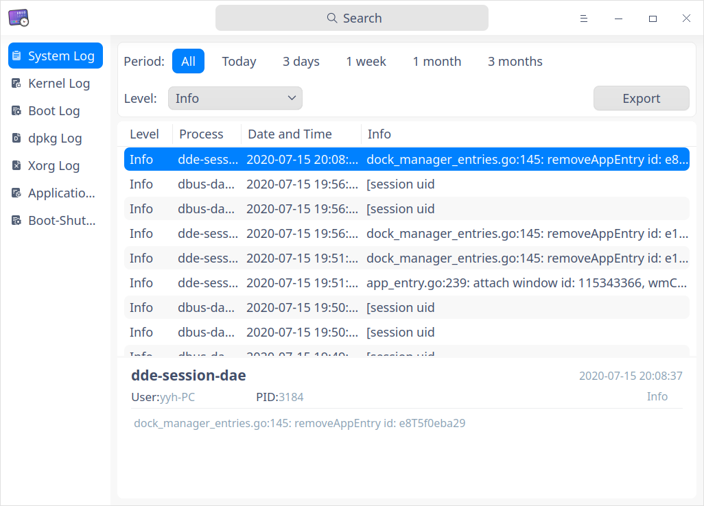
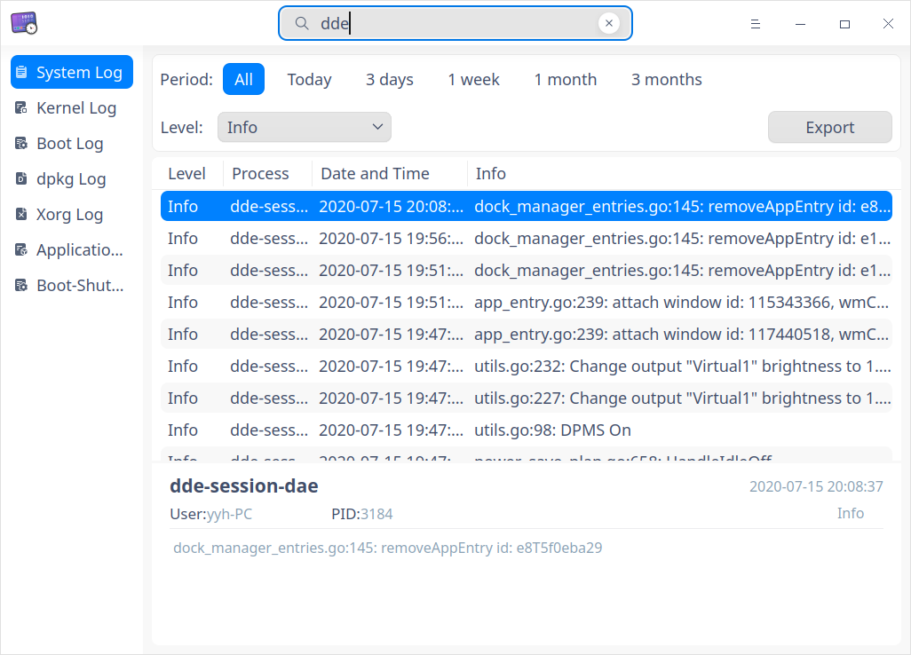
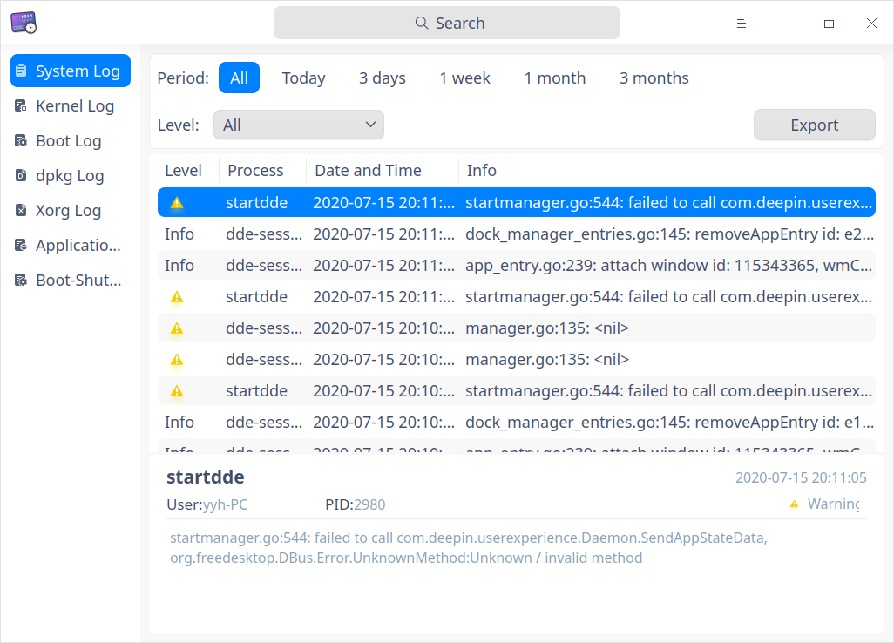
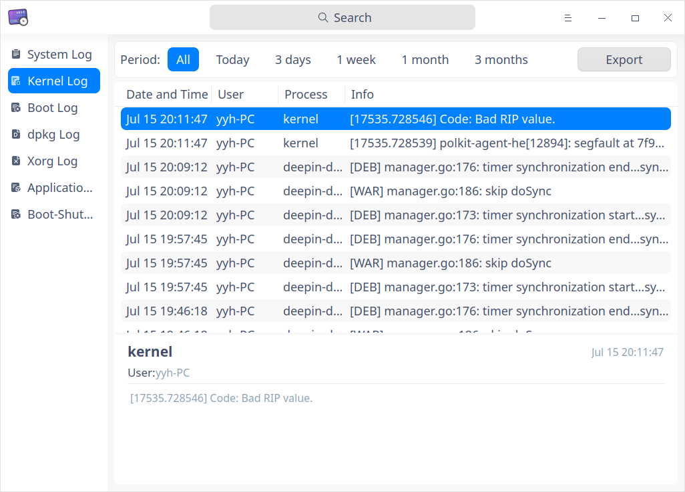
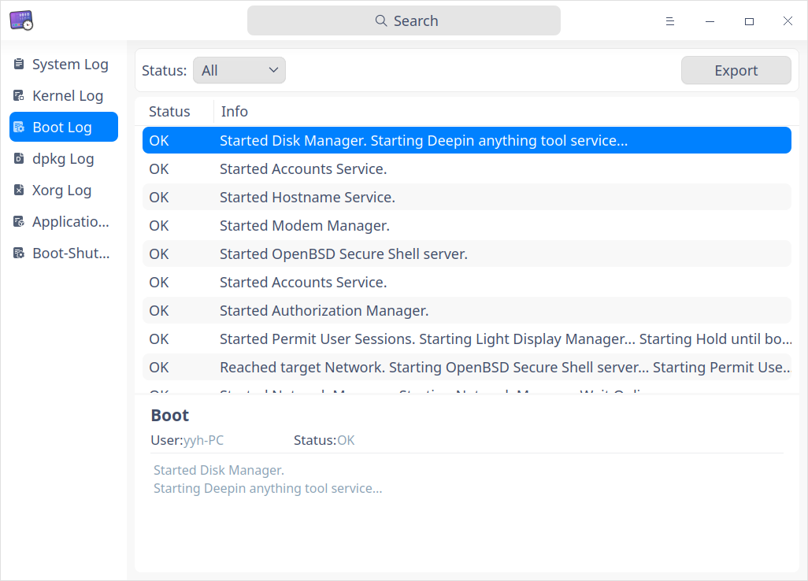
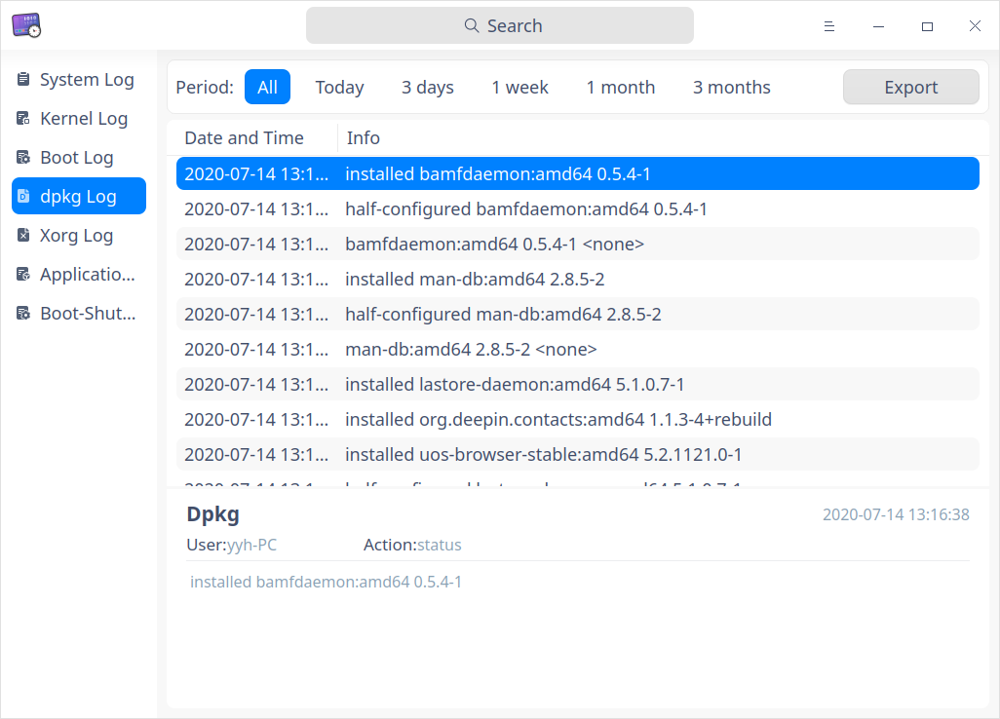
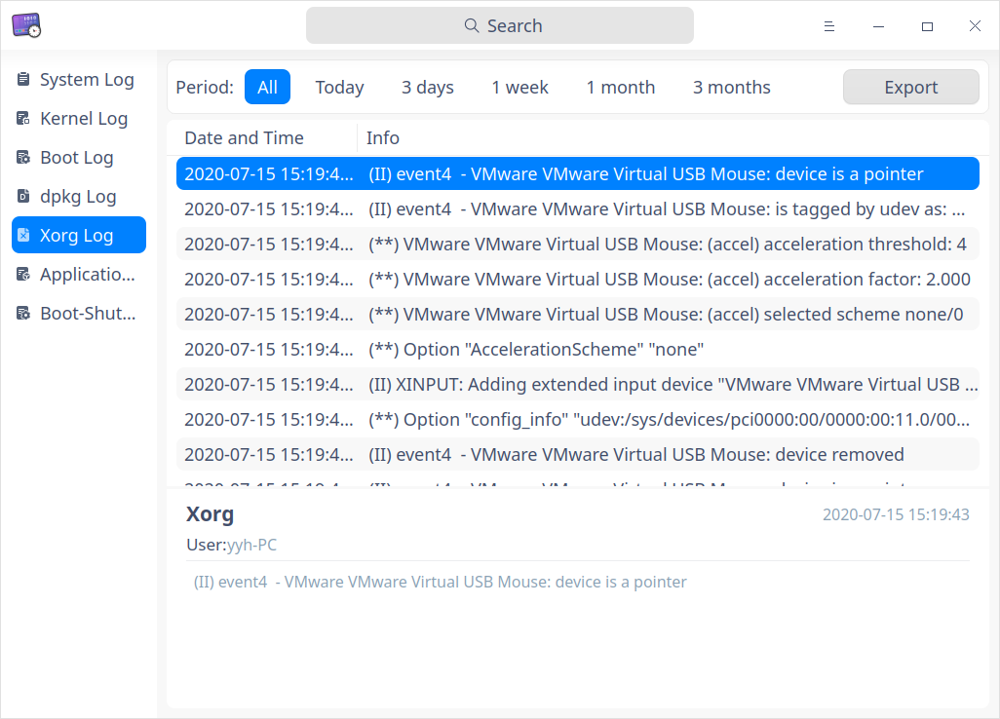
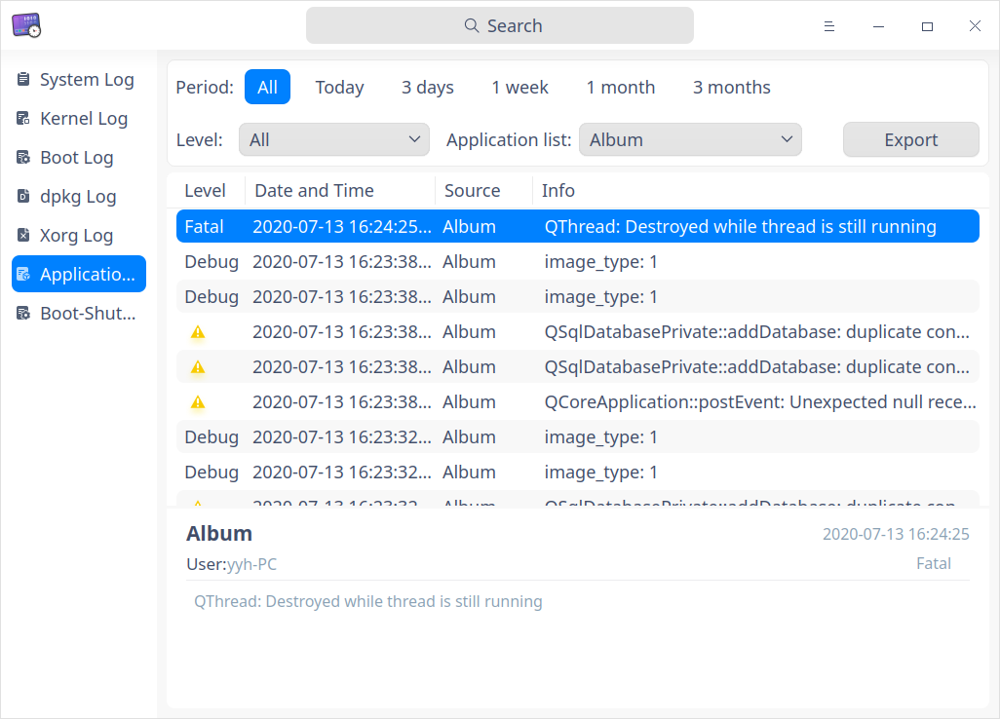
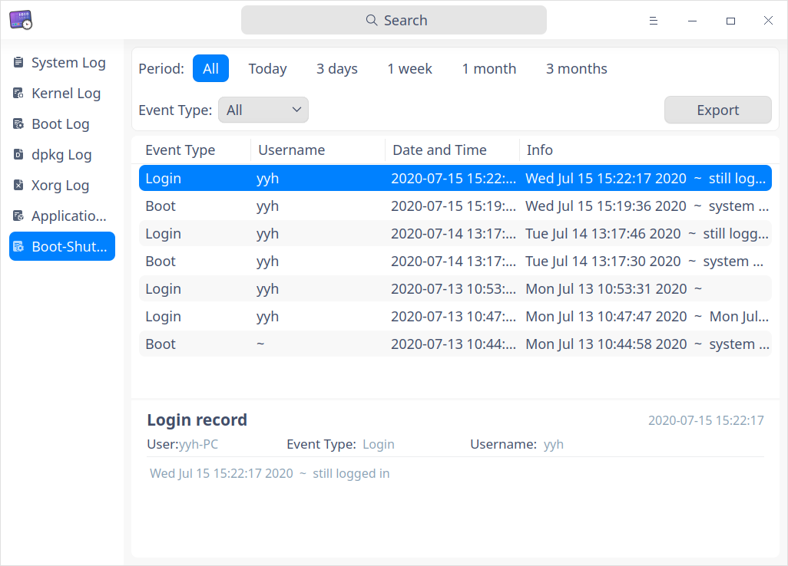
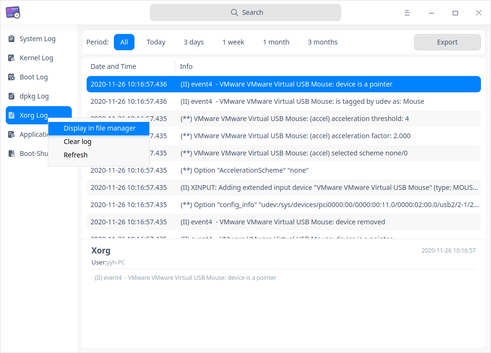

# Visor de registros|../common/deepin-log-viewer.svg|

## Descripción 

Visor de registros es una herramienta que recoge los registros generados cuando una aplicación se está ejecutando, por ejemplo, los registros generados cuando el sistema operativo y las aplicaciones se inician y ejecutan. Puede realizar la localización de problemas y resolverlos rápidamente analizando los registros. 

## Guía

Puede ejecutar, cerrar o crear un acceso directo para el Visor de registros.

### Ejecutar el Visor de registros 

1. Haga clic en en el Muelle para entrar en la interfaz del Lanzador.
2. Localice  desplazando la rueda del ratón o buscando "Visor de registros" en la interfaz del Lanzador y haga clic en él para ejecutarlo.
3. Haga clic con el botón derecho del ratón en  para que:
   - Seleccione **Enviar al escritorio** para crear un acceso directo en el escritorio.

   - Seleccione **Enviar al muelle** para fijarlo en el muelle.

   - Seleccione **Añadir al inicio** para que se ejecute automáticamente al encender el ordenador.

### Salir del Visor de registros 

- En la interfaz principal, haga clic en  para salir.
- Haga clic con el botón derecho del ratón en  en el muelle, seleccione **Cerrar todo** o **Forzar salida** para salir.
- En la interfaz del Visor de registros, haga clic en  y seleccione **Salir** para salir.

## Operaciones

### Búsqueda

1. Visor de registros admite la búsqueda por palabras clave.
   - Haga clic en para introducir las palabras clave.
2. Los resultados se muestran después de la entrada. Si no se encuentra ningún servicio que coincida, aparecerá una pista **Sin resultados de búsqueda**.
3. Haga clic en  para cerrar la búsqueda actual.

### Filtro

 Los parámetros de filtrado incluyen **periodo**, **nivel**, **estado**, **lista de aplicaciones** y **tipo de evento**.

  - Filtrado por periodo: Filtrado en el orden de la fecha de generación del registro.

    Las opciones son: "Todos", "Hoy", "3 días", "1 semana", "1 mes" y "3 meses". La opción por defecto es "Todos".

    Aplicable para: "período" no se muestra sólo para los registros de arranque, otros tipos de registros admiten el filtrado por período.

  - Filtrado por nivel: filtrado por niveles de gravedad de los eventos.

    Las opciones son: "Todos", "Emergencia", "Alerta", "Crítico", "Error", "Advertencia", "Aviso", "Info "y "Depuración". La opción por defecto es "Info".

    Aplicable a: registros del sistema y registros de la aplicación

  - Filtrado por estado: 

    sólo aplicable a los registros de arranque, las opciones son "Todos", "Aceptar" y "Fallido". La opción por defecto es "Todos".

  - Filtrado por lista de aplicaciones: 

    sólo aplicable para los registros de aplicaciones, se utiliza para filtrar los archivos de registro de las aplicaciones, la opción por defecto es la primera. 

  - Filtrado por tipo de evento: 

    sólo aplicable para eventos de arranque-apagado, las opciones son:  "All", "Login", "Reboot" y "Shutdown", la opción por defecto es "all".  

    

### Registro del sistema

1. En la interfaz principal, haga clic en **Registro del sistema**. 
2. Puede ver una lista de registros del sistema que se detallan por "Nivel", "Proceso", "Fecha y hora", e "Información".
3. Haga clic en un registro, puede ver su información particular debajo de la lista, incluyendo el proceso, el usuario, el PID, la hora y la información.

### Registro del kernel

1. En la interfaz principal, haga clic en **Registro del kernel**.
2. Puede ver una lista de registros del kernel que están detallados por "Fecha y hora", "Usuario", "Proceso" e "Información".
3. Haga clic en un registro, puede ver su información particular debajo de la lista, incluyendo la hora, el usuario, el proceso y la información.
> Nota: Para ver el registro del kernel, aparece un aviso diciendo **Se requiere autenticación para ver el registro**, puede introducir la contraseña de acceso para continuar viendo.

### Registro de arranque

1. En la interfaz principal, haga clic en **Registro de arranque**.
2. Puede ver una lista de registros de arranque que se detallan por "Estado" e "Información".
3. Haga clic en un registro y podrá ver su información particular debajo de la lista, incluyendo el proceso, el usuario, el estado y la información.
> Nota: Para ver el registro de arranque, aparece un aviso diciendo **Se requiere autenticación para ver el registro**, puede introducir la contraseña de inicio de sesión para continuar viendo.

### Registro de dpkg

1. En la interfaz principal, haga clic en **Registro de dpkg**. 
2. Puede ver una lista de registros de la herramienta dpkg que están detallados por "Fecha y hora" e "Información".
3. Haga clic en un registro y podrá ver su información particular debajo de la lista, incluyendo el proceso, el usuario, la acción, la hora y la información.

### Registro Xorg

1. En la interfaz principal, haz clic en **Registro Xorg**.
2. Puedes ver una lista de los registros del utilitario Xorg que están detallados por "Fecha y hora" e "Información".
3. Haga clic en un registro, puede ver su información particular debajo de la lista, incluyendo el proceso, el usuario, la hora y la información.

### Registro de aplicaciones

1. En la interfaz principal, haga clic en **Registro de aplicaciones**.
2. Puede ver una lista de registros de aplicaciones que se detallan por "Nivel", "Fecha y hora", "Fuente" e "Información".
3. Haga clic en un registro y podrá ver su información particular debajo de la lista, incluyendo la fuente, el usuario, la hora, el nivel y la información.

### Evento arranque-apagado

1. En la interfaz principal, haga clic en **Evento de apagado de arranque**.
2. Puede ver una lista de eventos de apagado de arranque que se detallan por "Tipo de evento", "Nombre de usuario", "Fecha y hora" e "Información".
3. Haga clic en un registro, puede ver su información particular debajo de la lista, incluyendo el usuario, el tipo de evento, el nombre de usuario y la información detallada.

### Exportar

Puede exportar los registros y guardarlos en formato txt/doc/xls/html.

1. En la interfaz principal, haga clic en **Exportar**. 
2. Aparece una interfaz del Administrador de archivos. Introduzca un nombre de archivo y seleccione un formato. 
3. Haga clic en **Guardar**. 

### Mostrar en el Administrador de archivos

1. En la interfaz del Administrador de archivos, seleccione un tipo de registro en el panel izquierdo y haga clic con el botón derecho.
2. Seleccione **Mostrar en el administrador de archivos**, se abrirá la ruta de la carpeta del registro actual. 

> Nota: **Mostrar en el Administrador de archivos** sólo es aplicable para el registro del kernel, el registro de arranque, el registro de dpkg, el registro Xorg y el registro de aplicaciones.

### Limpiar registro

1. En la interfaz del Administrador de archivos, seleccione un tipo de registro en el panel izquierdo y haga clic con el botón derecho.
2. Seleccione **Limpiar registro**, haga clic en el botón **Confirmar** en la ventana emergente para borrar los registros actuales.
3. Si aparece la ventana de autenticación, introduzca la contraseña para finalizar la operación.
> Notas: **Limpiar registro** sólo es aplicable al registro del kernel, al registro de arranque, al registro de dpkg, al registro de Xorg y al registro de aplicaciones.

### Actualizar
1. En la interfaz del Administrador de archivos, seleccione un tipo de registro en el panel izquierdo y haga clic con el botón derecho.
2. Seleccione **Actualizar** para recargar el registro y actualizar la lista de registros.

## Menú principal

En el menú principal, puede cambiar de tema, ver el manual de ayuda, etc.

### Tema

El tema de la ventana incluye el tema claro, el tema oscuro y el tema del sistema.

1. Haga clic en en la interfaz.
2. Haga clic en **Theme** para seleccionar uno.

### Ayuda

Haga clic en Ayuda para obtener el manual, que le ayudará a conocer y utilizar Visor de registros.

1. Haga clic en en la interfaz.
2. Haga clic en **Ayuda** para ver el manual.

### Acerca de

1. Haga clic en en la interfaz.
2. Haga clic en **Acerca de** para ver la información de la versión y la introducción sobre Visor de registros.

### Salir

1. Haga clic en en la interfaz.
2. Haga clic en **Salir**.

