# Correo|../common/deepin-mail.svg|

## Descripción

Correo es un cliente de correo electrónico de escritorio fácil de usar, preinstalado en el sistema, que puede gestionar varias cuentas de correo al mismo tiempo.

## Guía

Puede ejecutar, cerrar o crear un acceso directo a Correo de la siguiente manera.

### Ejecutar Correo

1. Haga clic en  en la esquina inferior izquierda del muelle para entrar en la interfaz del lanzador.
2. Localice  desplazando la rueda del ratón o buscando "Correo" en la interfaz del Lanzador y haga clic en él para ejecutarlo. 
3. Haga clic derecho en para que:
   - Seleccione **Enviar al escritorio** para crear un acceso directo en el escritorio.
   - Seleccionar **Enviar al muelle** para fijarlo en el muelle.
   - Seleccione **Añadir al arranque** para añadirlo al inicio. Cuando el ordenador se inicia, Correo se ejecuta automáticamente.

### Salir de Correo

- En la interfaz de Correo, haga clic en  para salir.
- Haga clic con el botón derecho del ratón  en el muelle y seleccione **Cerrar todo** o **Forzar cierre** para salir.
- En la interfaz de Correo, haga clic en  y seleccione **Salir**.

## Iniciar sesión

1. Abra el Correo, introduzca su dirección de correo electrónico y su contraseña y haga clic en **Iniciar sesión**. 

   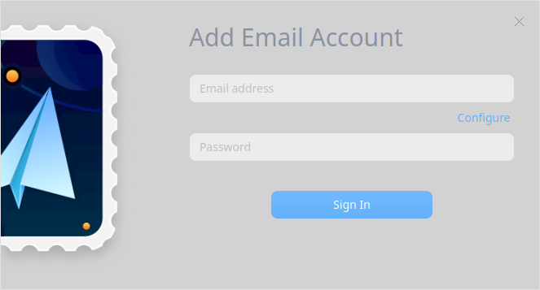

2. El programa detectará automáticamente si el sufijo de la dirección de correo electrónico introducido está en la base de datos del servidor: 

   - Si lo está, puede iniciar la sesión directamente;

   - Si no lo está, puede hacer clic en **Configurar** para añadirlo.

     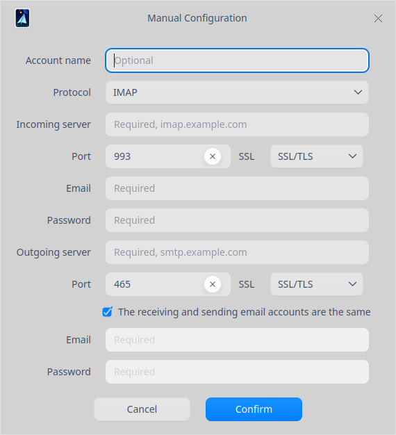
> Nota: Los buzones de correo como el de QQ, el de Netease (163.com y 126.com), el de Sina, y otros más, sólo pueden utilizarse en el Correo una vez que se hayan habilitado los servicios POP3 / IMAP / exchange y otros. Después de habilitar el servicio, el servidor generará un código de autorización. Introduzca la dirección de correo electrónico y el código de autorización en la interfaz de inicio de sesión para acceder al Correo. Si falla, haga clic en **Ayuda** para ver más información.
>
> 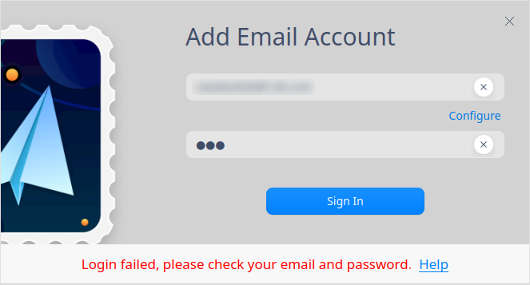

## Interfaz principal

La interfaz principal de Correo se compone de elementos y funciones como la cuenta, el directorio del buzón, la lista de correo, el cuerpo del correo, la composición, la obtención de nuevos correos y la búsqueda. 

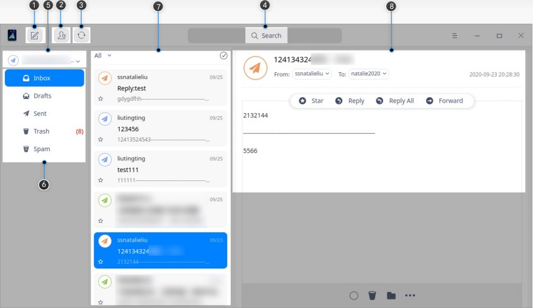

<table class="block1">
    <caption>Interfaz principal</caption>
    <tbody>
        <tr>
            <td width="20px">1</td>
            <td width="100px">Redactar</td>
            <td>Puede escribir un correo rápidamente.</td>
        </tr>
        <tr>
            <td>2</td>
            <td>Contactos</td>
            <td>Aquí se muestra una lista de contactos. También puede añadir información como el número de teléfono y la dirección del contacto.</td>
        </tr>
         <tr>
            <td>3</td>
            <td>Obtener nuevos correos</td>
            <td>Sincroniza los datos del buzón desde el servidor, incluyendo correos, libreta de direcciones, calendario, etc.</td>
        </tr>
        <tr>
            <td>4</td>
            <td>Búsqueda</td>
            <td>Para encontrar rápidamente todos los mensajes con esta palabra clave.</td>
        </tr>
         <tr>
            <td>5</td>
            <td>Cuenta</td>
            <td>Muestra una lista de todas las cuentas de correo añadidas.</td>
        </tr>
        <tr>
            <td>6</td>
            <td>Directorio del buzón</td>
            <td>El directorio del buzón se utiliza para clasificar los datos de correo. Las distintas categorías de directorios de buzones pueden ser diferentes. Además del directorio fijo general, los demás son creados por los usuarios.</td>
        </tr>
         <tr>
            <td>7</td>
            <td>Lista de correo</td>
            <td>Muestra todos los correos del directorio del buzón, incluyendo el remitente, el asunto, el resumen, la hora de envío y el estado de la estrella.</td>
        </tr> 
          <tr>
            <td>8</td>
            <td>Cuerpo del correo</td>
            <td>Muestra el título del correo electrónico, la información del remitente y del destinatario, la hora y el contenido.</td>
        </tr> 
   </tbody>
   </tabla>

## Componer

1. En la interfaz principal, haga clic en para entrar en la página de composición del correo.
2. Introduzca la cuenta de correo del receptor o haga clic en  para añadir un receptor, también puede elegir si aparece como "CC" o "BCC". 
3. El cuerpo del correo electrónico admite la edición de texto enriquecido, incluyendo la inserción de imágenes, enlaces y funciones @, y se puede diversificar para editar el texto.
4. Una vez terminada la edición, haga clic en **Enviar**. 

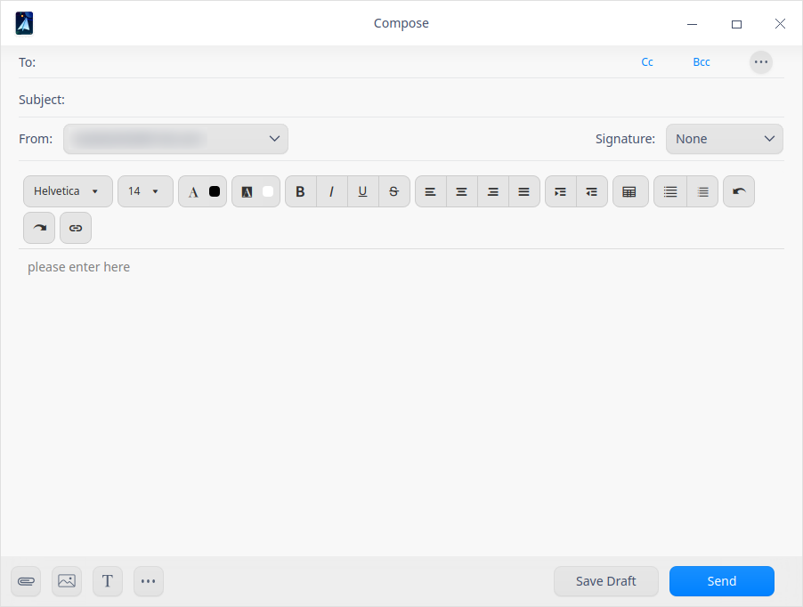

## Obtener nuevos correos

"Obtener nuevos correos" sirve para sincronizar los datos del buzón desde el servidor, incluyendo el correo, la libreta de direcciones, el calendario y otra información. El sistema sincroniza los datos del buzón cada 15 minutos por defecto. Hay dos maneras de recibir el correo electrónico:

- Seleccione una cuenta y haga clic en el botón de actualización .
- Seleccione una cuenta y haga clic con el botón derecho, seleccione **Obtener nuevos correos**.

## Ver correos

1. Después de seleccionar un correo en la lista de correos, el área del cuerpo del correo muestra su información relevante, incluyendo el asunto del mensaje, la información de recepción y envío, la hora y el contenido.

2. Haga clic en el buzón del remitente o del destinatario para ver los detalles del remitente y la correspondencia, y añadirlos a los contactos.

   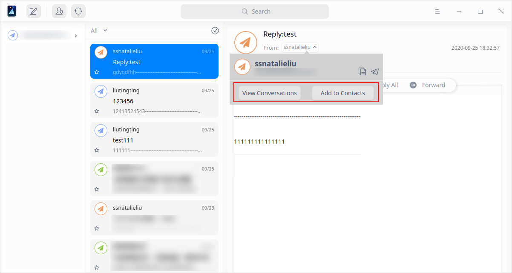

3. En el área del cuerpo del correo, puede editar, reenviar, marcar con una estrella, mover, eliminar e imprimir el correo.  

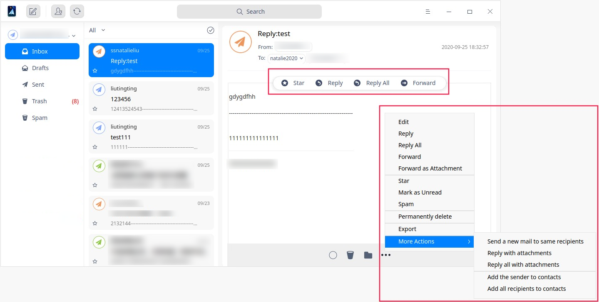

## Filtrado del correo

Las funciones de filtrado le ayudan a encontrar rápidamente el correo que necesita. 

1. Haga clic en **Todos**, puede ver opciones como "Todos", "No leídos", "Con estrellas", "Adjuntos" y "@yo". 

   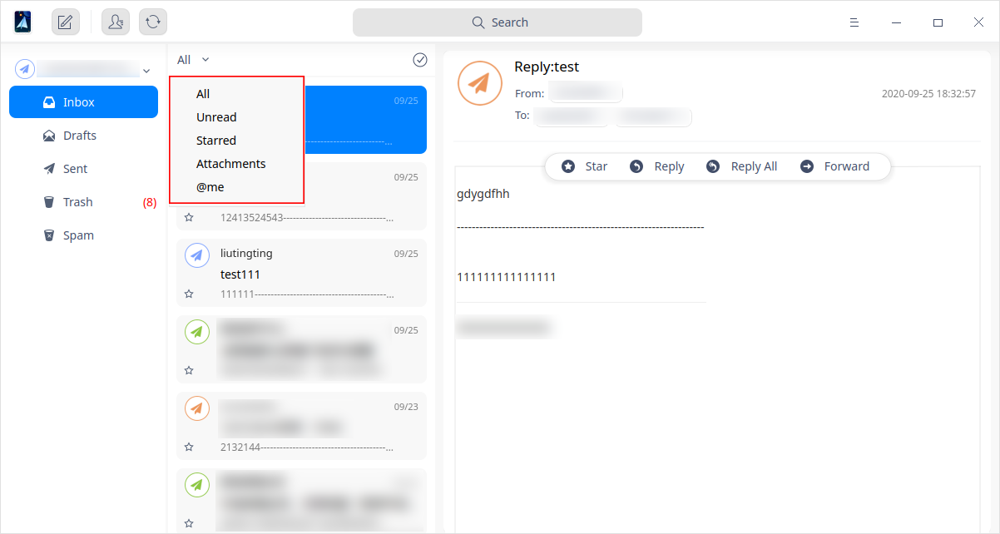

2. Cuando se selecciona un elemento de filtro, la lista de correos muestra sólo los que cumplen los criterios. 

> Notas: Si necesita una búsqueda más precisa, haga clic en para introducir palabras clave.  

3. En la lista de correo, puede seleccionar uno o varios correos.

   - Para seleccionar un solo correo: haga clic en un solo correo;

   - Para seleccionar varios correos:

      - Pulse la tecla **Ctrl**, haga clic en los correos que necesite uno por uno al mismo tiempo.

      - Haga clic en el correo A, y luego presione la tecla **shift**, y luego haga clic en el correo B, puede seleccionar todos los correos entre A y B. 

## Borrar correos

La eliminación de mensajes puede ser individual o por lotes. Generalmente, los mensajes borrados se almacenarán en la **Papelera**. También puede optar por eliminarlos permanentemente.

### Borrar un correo

Hay dos formas de eliminar un correo. Los mensajes borrados se almacenarán en la **Papelera**.

- Seleccione un correo en la lista de correos y haga clic con el botón derecho, seleccione **Borrar**. 
- En el área del cuerpo del correo, haga clic en .

Después de eso, puede borrarlo permanentemente en la **Papelera**. 

### Borrar por lotes

Seleccione el directorio especificado para ser borrado y haga clic con el botón derecho, y seleccione **Borrado en masa**. Puede eliminar el correo según el rango de tiempo, por ejemplo, hace una semana o un mes.

## Importar correos

En la lista de directorios del buzón, seleccione un directorio y haga clic con el botón derecho para seleccionar **Importar correos**. Aparece la interfaz del Administrador de archivos, seleccione los correos que desea importar y haga clic en **Abrir** para importar el directorio especificado.

## Exportar correos

Los correos se pueden exportar por separado o por lotes.

### Exportar un correo

Hay dos maneras de exportar un correo: 

- Seleccione un correo en la lista de correos y haga clic con el botón derecho, seleccione **Exportar**. 

- En el área del cuerpo del correo, haga clic en , y luego seleccione **Exportar**.

Seleccione una ruta de almacenamiento en el Administrador de archivos y luego haga clic en **Guardar**. 

### Exportar por lotes

Seleccione el directorio especificado y haga clic con el botón derecho, y seleccione **Exportar correos**. Aparece la interfaz del Administrador de archivos, seleccione una ruta de almacenamiento y haga clic en **Guardar**. 

## Contactos

En la interfaz principal, haga clic en el botón de contacto  para acceder a los contactos. Puede ver la lista de contactos y la información, y complementar el número de teléfono del contacto, la dirección y otra información. Haga clic en para añadir un nuevo contacto. 

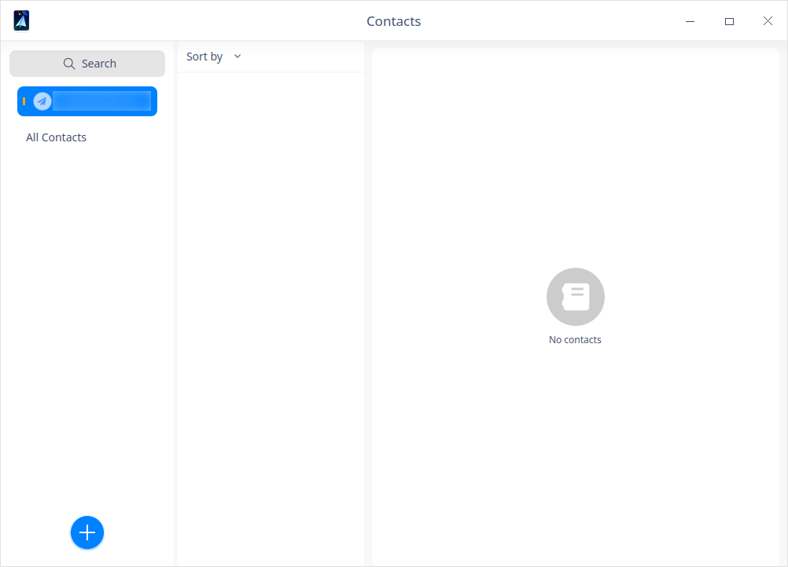

## Menú principal

En el menú principal, puede configurar el buzón, cambiar los temas de las ventanas y ver el manual de ayuda. 

### Ajustes

Haga clic en  en la interfaz principal y haga clic en **Ajustes**. Puede configurar las cuentas, los ajustes básicos, el antispam y los ajustes avanzados. 

#### Cuentas

- Cuentas de correo electrónico: puede añadir o eliminar cuentas. Haga clic en **Añadir cuenta** para añadir más cuentas. Haga clic en **Editar** para eliminar cuentas. 

- Información de la cuenta: puedes ver el avatar, el nombre y el protocolo, también puedes cambiar el avatar y los ajustes del servidor. 

- Firma: Se utiliza principalmente para proporcionar al destinatario más información de contacto e información adicional de la marca. Puede elegir la firma de la empresa, la firma personal o la firma personalizada según sus necesidades.

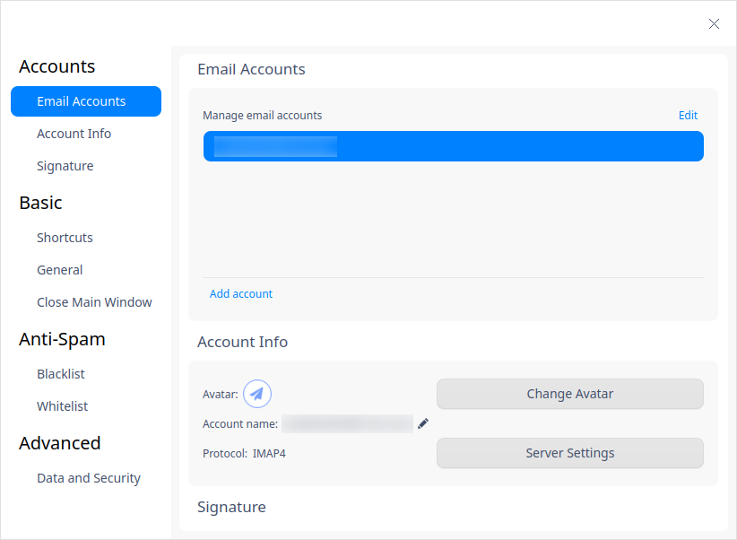

#### Básico

- Atajos de teclado: las teclas de acceso rápido para operaciones comunes.

- General: Ajustes para iniciar o recibir el correo. 

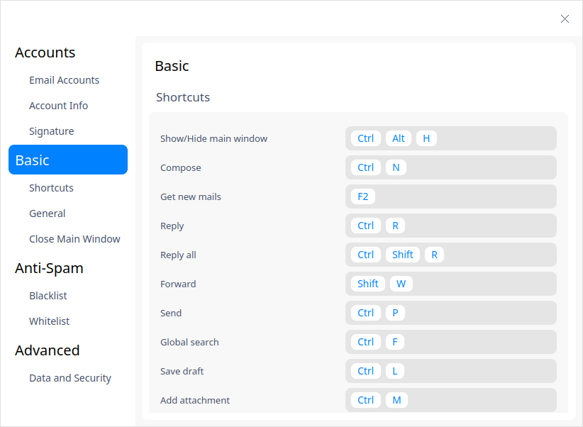

#### Anti-Spam

- Lista negra: Todos los correos enviados desde los buzones listados en la lista negra son rechazados. Puede añadir, exportar e importar la lista negra.

- Lista blanca: Se reciben todos los correos enviados desde los buzones listados en la lista blanca. Puede añadir, exportar e importar la lista blanca.

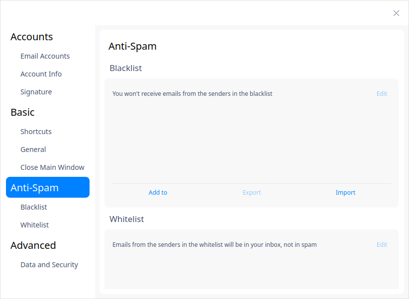

#### Avanzado

Puede activar la contraseña de seguridad. Si no hay actividad en 15 minutos, el Correo se bloqueará automáticamente y deberá introducir la contraseña para desbloquearlo. 

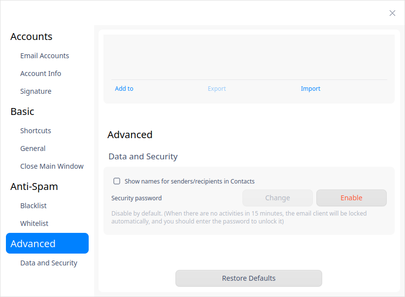

#### Restablecer los valores predeterminados

Haga clic en **Restablecer los valores predeterminados** para restablecer todos sus ajustes a los valores predeterminados.

### Tema

El tema de la ventana incluye el Claro, el Oscuro y el del Sistema (por defecto).

1. Haga clic en  en la interfaz principal.
2. Haga clic en **Tema** para elegir un tema.

### Ayuda

Haga clic en Ayuda para obtener el manual, que le ayudará a conocer y utilizar mejor el Correo.

1. Haga clic en  en la interfaz principal.
2. Haga clic en **Ayuda** para ver el manual de Correo.

### Acerca de

1. Haga clic en  en la interfaz principal.
2. Haga clic en **Acerca de** para ver la información de la versión de Correo.

### Salir

1. Haga clic en  en la interfaz principal.
2. Haga clic en **Salir**.

