# Video|../common/deepin-movie.svg|

## Descripción

Video comparte consigo un agradable tiempo de ocio. Video es un reproductor multimedia que soporta muchos formatos de videografía con varias características. Con su sencilla interfaz y sus abundantes atajos, podrá realizar todas las operaciones con un solo teclado, despidiéndote del ratón de forma sencilla. 

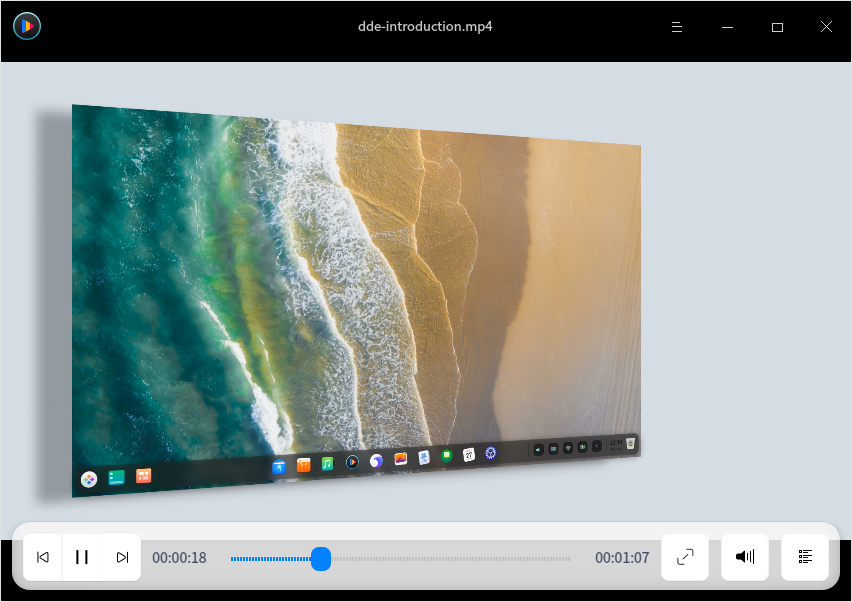

## Guía

### Ejecutar Video

1.  Ejecuta  en el muelle para entrar en la interfaz del Lanzador.
2.  Localice  desplazando la rueda del ratón o buscando la película en la interfaz del Lanzador y haga clic en ella para ejecutarla.
3.  Haga clic derecho en  y puede que:
 - Haga clic en **Enviar al escritorio** para crear un acceso directo al escritorio.
 - Haga clic en **Enviar al muelle** para fijarlo en el Muelle.
 - Haga clic en **Añadir al arranque** para añadirlo al inicio y que se ejecute automáticamente cuando se inicie el sistema.

### Salir de Video
- En la interfaz de Video, haga clic en  para salir.
- Haga clic con el botón derecho del ratón en  en el muelle y seleccione **Cerrar todo** para salir.
- Haga clic en  en la interfaz de Video y seleccione **Salir** para salir.

### Ver accesos directos

En la interfaz de Video, pulsa **Ctrl + Shift + ?** para ver los accesos directos. El dominio de los accesos directos mejorará enormemente su eficacia.

> Consejo: Puedes abrir la interfaz de vista previa de los atajos en cualquier momento durante la reproducción del vídeo.

 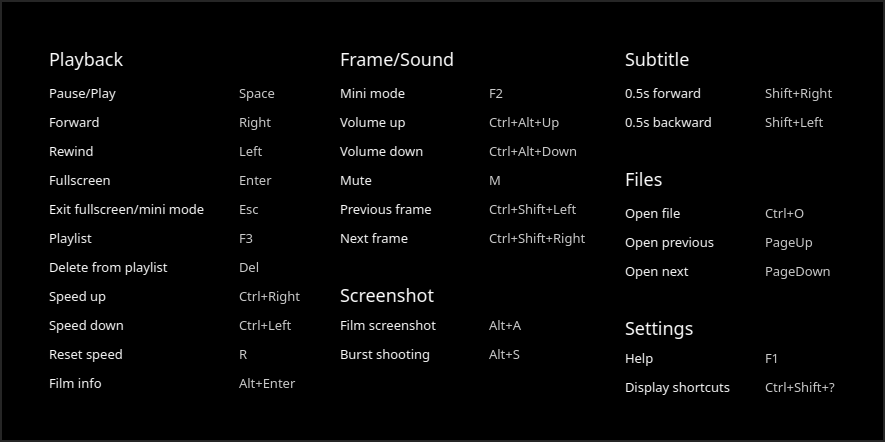

## Interfaz principal

Sumérgete en el puro placer de los vídeos maravillosos a través de las funciones más utilizadas.

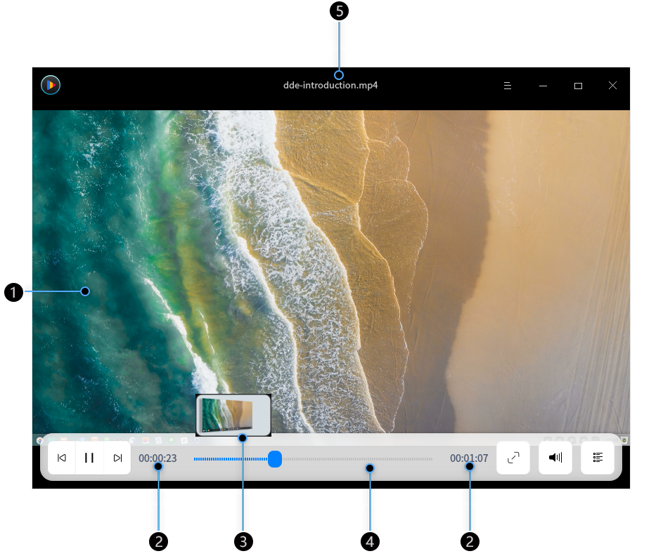

| Número | Nombre | Descripción                                                  |
| ------ | -------------- | ------------------------------------------------------------ |
| 1 | Ventana de reproducción | Muestra el contenido del vídeo. La información del vídeo y los iconos de función se mostrarán después de que el puntero del ratón se mueva a la ventana de reproducción. De lo contrario, se ocultarán. La ventana de reproducción no tiene marco. Puede arrastrar libremente la ventana de reproducción para ajustar manualmente su tamaño. |
| 2 | Visualización del tiempo | Muestra el tiempo total y el tiempo de reproducción del vídeo actual. |
| 3 | Ventana de vista previa | Muestra la vista previa del vídeo. Puedes ver el contenido del vídeo en un momento dado a través de la ventana de vista previa. |
| 4 | Barra de progreso | Muestra el progreso de la reproducción. Arrastre la barra de progreso para cambiar el progreso de la reproducción. La ventana de vista previa del vídeo se mostrará cuando el puntero del ratón se sitúe sobre la barra de progreso. |
| 5 | Título del vídeo | Muestra el nombre del vídeo que se está reproduciendo.              |

&nbsp;&nbsp;&nbsp;&nbsp;&nbsp;&nbsp;&nbsp;&nbsp;&nbsp;&nbsp;&nbsp;&nbsp;&nbsp;

> Nota: La ventana de vista previa se mostrará por defecto cuando el ratón se sitúe sobre la barra de progreso. Si no necesita mostrar la ventana de vista previa, puede entrar en los ajustes y cambiarlos en consecuencia. Consulte la sección [Ajustes básicos](#Ajustes_básicos) para obtener más detalles.

### Explicación de íconos

| Ícono                                                  | Nombre       | Ícono                                                 | Nombre      |
| ----------------------------------------------------- | ---------- | ---------------------------------------------------- | --------- |
|      | Anterior   |     | Siguiente      |
|      | Reproducir       |  | Pausar     |
|   | Pantalla completa |   | Volumen    |
|  | Listra reproducción   |            | Menú principal |
|              | Minimizar   |             | Maximizar  |
|            | Cerrar      |                                                      |           |

### Reproducir vídeos

Puede reproducir películas de las siguientes maneras:
- Cuando no haya archivos en la lista de reproducción, haga clic en  y abra el selector de archivos para seleccionar un archivo de película.
- En la interfaz de Video, haga clic con el botón derecho del ratón o haga clic en  para seleccionar **Abrir archivo** y abrir el selector de archivos para seleccionar un archivo de película.
- En la interfaz de Video, haga clic con el botón derecho del ratón o haga clic en  para seleccionar **Abrir carpeta**. Todos los archivos audiovisuales de la carpeta se muestran en la lista de reproducción y se reproducen sucesivamente. 
- En la interfaz de Video, haga clic con el botón derecho para seleccionar **Abrir URL** y pegue la dirección en línea para reproducir la película.
- En la interfaz de Video, haga clic con el botón derecho para seleccionar **Abrir CD/DVD** para reproducir las películas en CD/DVD.
- Arrastre el archivo/carpeta directamente a la interfaz de Video para reproducir películas locales.

> Nota: Si utiliza un ordenador equipado con una pantalla táctil, puede utilizar los gestos de la pantalla táctil para operar en lugar del ratón. Mantenga pulsado el archivo de la película con un dedo y arrástrelo a la interfaz de Video para reproducir la película.

> Atención: Por favor, asegúrate de que tu red está bien conectada antes de reproducir vídeos online con Video.

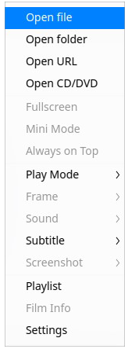

### Adelantar/Retroceder

1.  En la interfaz de Video, pulse  en el teclado para avanzar rápidamente la película.
2.  En la interfaz de Video, pulse  en el teclado para rebobinar la película.

>  Nota: Si utiliza un equipo provisto de pantalla táctil, puede utilizar los gestos de la pantalla táctil para operar en lugar del ratón: Desliza un dedo hacia la izquierda en la zona de la imagen de vídeo para rebobinar y hacia la derecha para avanzar.

### Acelerar/Anular la velocidad

1.  En la interfaz de Video, pulse **Ctrl** +  en el teclado para acelerar la reproducción de la película.
2.  Pulse **Ctrl** +  en el teclado para acelerar la reproducción de la película.
3.  Si desea recuperar la velocidad de reproducción original, pulse **R** en el teclado.

> Nota: La velocidad de subida/bajada es relativa a la velocidad de reproducción original. La velocidad de reproducción del vídeo aumenta/disminuye en 0,1 veces de forma predeterminada cada vez que se acelera/desacelera. Mantenga pulsado **Ctrl** +  o  en el teclado y la velocidad de reproducción aumentará o disminuirá rápidamente. La velocidad máxima de reproducción es de 2.0 veces del original y la velocidad mínima de reproducción es 0.1 veces del original (o 10 veces más lenta).

## Funciones

### Ajustar la ventana

Puede ajustar el tamaño de la ventana como desee durante la reproducción.

 Haga clic con el botón derecho del ratón en la interfaz de Video:
- Seleccione **Pantalla completa** para reproducir en pantalla completa.
- Seleccione **Modo mini** para reproducir en modo mini.
- Seleccione **Siempre en la parte superior** para poner la ventana en la capa superior.
- También puedes arrastrar el borde de la ventana para ajustar su tamaño.

> Nota: Haz doble clic en la ventana para cambiar entre **pantalla completa** y **ventana normal**.

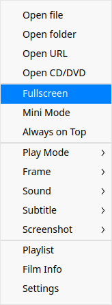

### Ajustar el modo de reproducción

1.  Haga clic con el botón derecho del ratón en la interfaz de Video.
2.  Seleccione **Modo de reproducción** y podrá:
 - Seleccionar **Reproducción en orden** y las películas de la lista de reproducción se reproducirán ordenadamente hasta la última.
 - Seleccione **Reproducción aleatoria** y las películas de la lista de reproducción se reproducirán de forma aleatoria. El modo de reproducción aleatoria en bucle continuará después de reproducir todos los archivos de la lista de reproducción.
 - Seleccione **Reproducción única** y el reproductor se detendrá después de reproducir la película actual.
 - Seleccione **Bucle simple** y la película se reproducirá una y otra vez.
 - Seleccione **Bucle de lista** y toda la lista de reproducción se reproducirá una y otra vez.

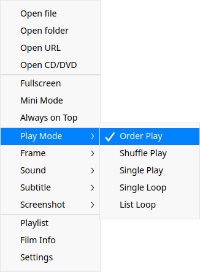

### Ajustar cuadro
1.  Haga clic con el botón derecho del ratón en la interfaz de Video.
2. Seleccione **Cuadro** y puede que:
 - Ajuste la relación de aspecto de la película entre 4:3, 16:9, 16:10, 1,85:1 y 2,35:1.
 - Gire el fotograma de la película en el sentido de las agujas del reloj o en sentido contrario.
 - Salte al fotograma anterior o al siguiente.

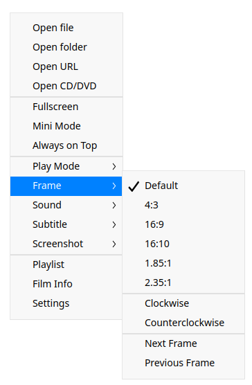

### Ajustar el sonido
1.  Haga clic con el botón derecho del ratón en la interfaz de Video.
2.  Seleccione **Sonido** y puede que:
 - Seleccione **Canal** y seleccionar el canal en el que se reproduce la película.
 - Seleccione **Pista** y seleccionar la pista de reproducción de la película.

>  Nota: 
>
> Si utiliza un ordenador equipado con una pantalla táctil, puede utilizar los gestos de la pantalla táctil para operar en lugar del ratón: Desliza un dedo hacia arriba en la zona de la imagen de vídeo para subir el volumen y hacia abajo para bajarlo.

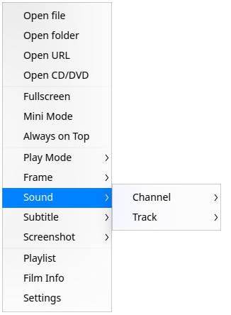

### Ajustar subtítulos
1. Haga clic con el botón derecho del ratón en la interfaz de Video.
2. Seleccione **Subtítulos** y podrá:
 - Seleccionar **Cargar** para cargar manualmente los subtítulos.
 - Seleccionar **Buscar en línea** para buscar subtítulos en línea para la película y cargar los subtítulos automáticamente después de una coincidencia exitosa.
 - Seleccionar **Seleccionar** para cambiar entre varios subtítulos para la película.
 - Seleccionar **Ocultar** para ocultar los subtítulos de la película actual.
 - Seleccionar **Codificación de datos** para seleccionar una codificación para la película y resolver el problema de los subtítulos ilegibles en algunos casos.

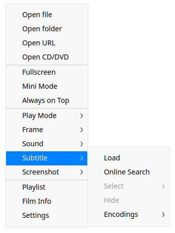

### Tomar capturas de pantalla
1.  Haga clic con el botón derecho del ratón en la interfaz de Video.
2.  Seleccione **Captura de pantalla** y podrá:
 - Seleccionar **Captura de pantalla de la película** para hacer una captura de pantalla de la película en el fotograma actual.
 - Seleccionar **Captura en ráfaga** para tomar 15 fotogramas de la película en diferentes momentos para ilustrar la sinopsis.
 - Seleccionar **Abrir carpeta de capturas de pantalla** para ver las capturas guardadas.
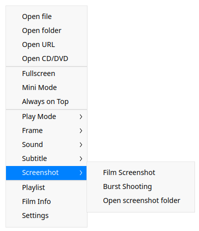

### Ver información de la película

1.  Haga clic con el botón derecho del ratón en la interfaz de Video.
2.  Seleccione **Información de la película** y podrá ver la información de la película, la información del códec y la información de audio de la película. 

## Gestión de la lista de reproducción

Puedes entrar en la lista de reproducción para añadir o eliminar los archivos de vídeo.

### Añadir películas a la lista de reproducción

Puede añadir películas a la lista de reproducción de las siguientes maneras:
- Haga clic con el botón derecho en la interfaz de Video y seleccione **Abrir archivo/Abrir carpeta/Abrir URL/Abrir CD/DVD** o haga clic en > **Abrir archivo/Abrir carpeta** para añadir películas a la lista de reproducción.
- También puede arrastrar archivos/carpetas directamente a la lista de reproducción.

### Borrar película de la lista de reproducción

1.  Haga clic en   en la interfaz de Video.
2. Pase el puntero del ratón por encima del archivo de vídeo y haga clic con el botón derecho para seleccionar **Borrar de la lista de reproducción**.

> Consejo: En la interfaz de la lista de reproducción, pase el puntero del ratón por encima del archivo de vídeo y haga clic en  para eliminarlo.

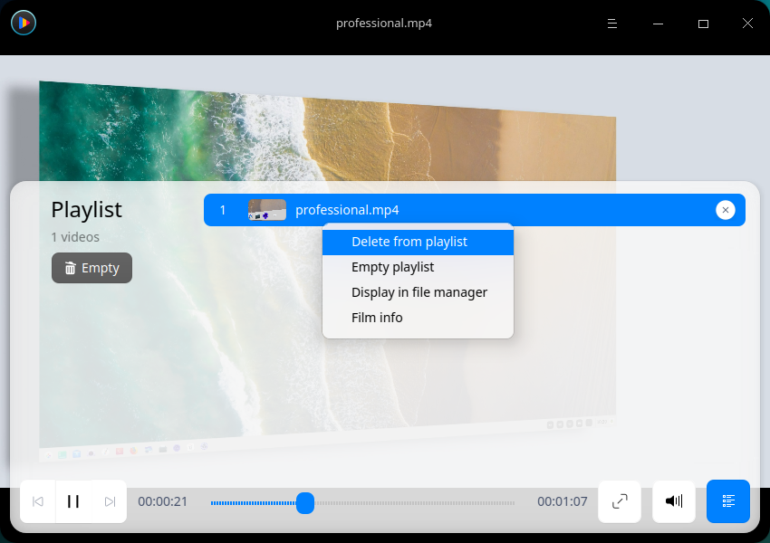

### Borrar lista de reproducción

1.  Haga clic en  en la interfaz de Video.
2.  Haga clic en el icono **Vaciar** debajo de la lista de reproducción o haga clic con el botón derecho para seleccionar **Vaciar lista de reproducción**.

### Visualización en el Administrador de Archivos

1.   Haga clic en  en la interfaz de Video.
2.  Pase el puntero del ratón por encima del archivo de vídeo y haga clic con el botón derecho para seleccionar **Mostrar en el administrador de archivos** para mostrar el archivo de la película en el Administrador de archivos.

## Menú principal

En el menú principal, puede abrir archivos/carpetas, cambiar los temas de las ventanas, ver el manual de ayuda y obtener más información sobre Video.
### Ajustes

Puede configurar la información básica, las teclas de acceso directo y los subtítulos.

#### Ajustes básicos

1.  Haga clic con el botón derecho del ratón o pulse  en la interfaz de Video.
2.  Haga clic en **Ajustes** > **Básico**.
3.  En la opción **Reproducción**, puede:
  - Marcar la casilla **Borrar lista de reproducción al salir** para borrar la lista de reproducción al salir de Video.
  - Marcar la casilla **Recordar posición de reproducción** para reanudar la película automáticamente desde la última posición reproducida cuando se ejecuta Video.
  - Marque la casilla **Añadir automáticamente archivos similares a la reproducción** para añadir los archivos de películas similares en la misma carpeta a la lista de reproducción para reproducirlos en orden.
  - Marque la casilla **Mostrar vista previa de vídeo al pasar el ratón** para mostrar la vista previa de la película al pasar el ratón por encima de la barra de progreso.
  - Marque la casilla **Mostrar miniaturas en la barra de progreso**, se mostrará una ventana de vista previa cuando pase el ratón por encima de la barra de progreso.

Notas: Esta función sólo está disponible en la plataforma X86. 

  - Marque la opción **Pausa al minimizar** para pausar la reproducción automáticamente al minimizar la ventana de Video.
  - Marque la casilla **Modo de reproducción predeterminado**, seleccione un modo en la lista desplegable **Modo de reproducción predeterminado** para que la próxima vez Video se ejecute en ese modo.
4.  En la opción **Captura de pantalla**, puede seleccionar la ruta para guardar las capturas de pantalla que desee.

#### Ajustes de los atajos de teclado

1.  Haga clic con el botón derecho del ratón o haga clic en  en la interfaz de Video.
2.  Seleccione **Ajustes** > **Accesorios**.
3.  Puede seleccionar e introducir nuevos atajos de teclado.

#### Ajustes de subtítulos

1.   Haga clic con el botón derecho del ratón o haga clic en  en la interfaz de Video.
2.  Seleccione **Ajustes** > **Subtítulos**.
3.  Puede ajustar la fuente y el tamaño de la fuente de los subtítulos.
> > Atención: Haga clic en **Restablecer valores predeterminados** en la interfaz para restablecer todos los ajustes.

### Tema

El tema de la ventana ofrece tres tipos de temas. Entre ellos, Tema claro, Tema oscuro y Tema del sistema.

1.  En la interfaz de Video, haga clic en .
2.  Haga clic en **Tema** para seleccionar un tema.

### Ayuda

1.   En la interfaz de Video, haga clic en  .
2.  Seleccione **Ayuda** para ver el manual de ayuda.

### Acerca de

1.  En la interfaz de Video, haga clic en .
2.  Seleccione **Acerca de** para ver la versión y la introducción de Video.

### Salir

1.   En la interfaz de Video, haga clic en .
2.  2. Haga clic en **Salir** para salir de Video.

