# Música|../common/deepin-music.svg|

## Descripción

Música es una aplicación de reproducción de música local con un nuevo diseño de interfaz de usuario y una experiencia de reproducción de última generación con funciones de escaneo de música local y sincronización de letras, etc.

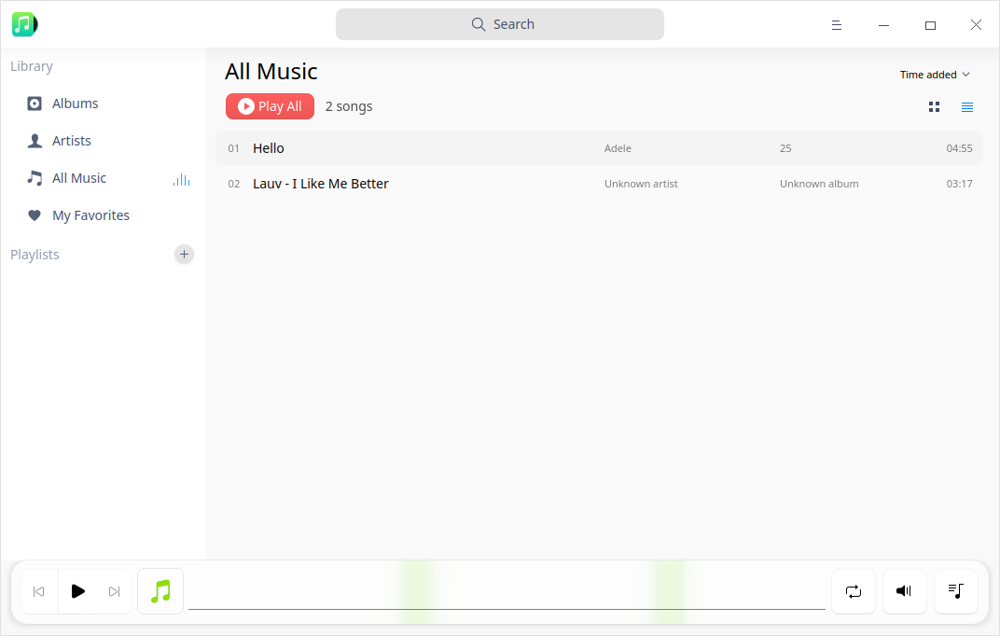

## Guía

Podrá ejecutar, cerrar y crear un acceso directo para Música de las siguientes maneras.

### Ejecutar Música

1. Haga clic en  en el muelle para entrar en la interfaz del Lanzador.
2. Localice  desplazando la rueda del ratón o buscando "musica" en la interfaz del Lanzador.
3. Haga clic con el botón derecho del ratón en el icono de la aplicación Música y podrá:
 - Hacer clic en **Enviar al escritorio** para crear un acceso directo al escritorio.
 - Hacer clic en **Enviar al muelle** para fijar la aplicación en el muelle.
 - Hacer clic en **Añadir al arranque** para añadir la aplicación al inicio y que se ejecute automáticamente cuando se inicie el sistema.

> Nota: Si se ha fijado Música en el Muelle, también puede hacer clic en  en el Muelle para ejecutarla.

### Minimizar a la bandeja del sistema

La app Música puede ser minimizada a la bandeja del sistema.

Haga clic en  en la interfaz de Música para cerrar la ventana principal. Seleccione **Minimizar a la bandeja del sistema** y haga clic en **Confirmar** para minimizar en la bandeja del sistema.

> Notas: Marque **No volver a preguntar** y la ventana emergente dejará de aparecer.

Haga clic con el botón derecho en el icono de la aplicación Música en la bandeja y podrá realizar las siguientes operaciones:

 - Haga clic en **Reproducir/Pausar** para reproducir/pausar la canción.
 - Haga clic en **Anterior** para reproducir la canción anterior.
 - Haga clic en **Siguiente** para reproducir la siguiente canción.
 - Haga clic en **Salir** para cerrar Música.

### Salir de Música

- En la interfaz de Música, haga clic en  y seleccione **Salir** para salir de Música.
- Haga clic con el botón derecho en el icono de la aplicación Música  en el muelle y seleccione **Cerrar todo** para salir de Música.
- Haga clic con el botón derecho del ratón en el icono  de la bandeja del sistema y seleccione **Salir** para salir de Música. 

### Ver accesos directos

En la interfaz de Música, pulse **Ctrl **+ **Mayúsculas** + **?** para ver los accesos directos. El dominio de los atajos mejorará en gran medida tu eficacia.

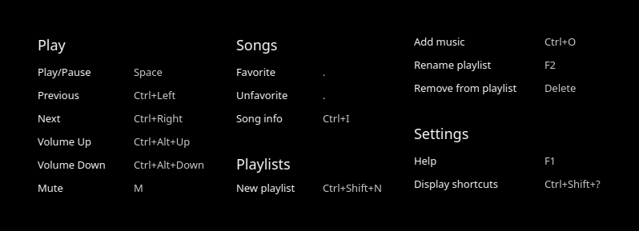

## Interfaz principal

En la interfaz principal, puede elegir entre las opciones habituales, ver la lista de reproducción y obtener información de las canciones.

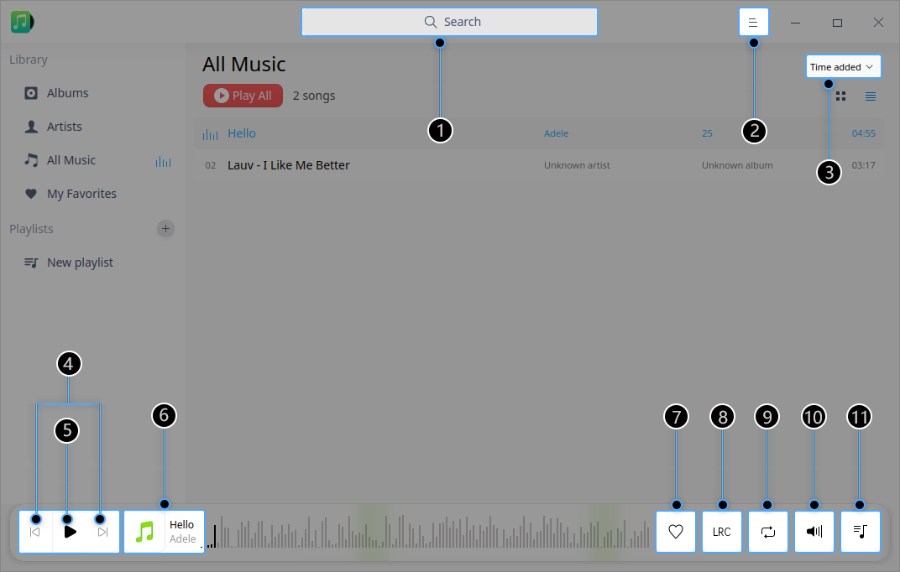

<table class="block1">
    <caption></caption>
    <tbody>
        <tr>
            <td>1</td>
            <td>Caja de búsqueda</td>
            <td>Puede buscar música rápidamente mediante el cuadro de búsqueda.</td>
        </tr>
        <tr>
            <td>2</td>
            <td>Menú principal</td>
            <td>Puede añadir listas de reproducción o pistas, establecer opciones, ver el manual y la información sobre la aplicación y salir de la aplicación mediante el menú principal.</td>
        </tr>
    	<tr>
            <td>3</td>
            <td>Opciones de ordenado</td>
            <td>Puede ordenar la lista por diferentes tipos de orden, incluyendo el tiempo añadido, el título, el artista o el nombre del álbum.</td>
        </tr>
    	<tr>
            <td>4</td>
            <td>Anterior/Siguiente</td>
            <td>Haga clic para cambiar a la música anterior/siguiente.</td>
        </tr>
    		<tr>
            <td>5</td>
            <td>Botón de reproducción/pausa</td>
            <td>Haga clic para reproducir/pausar la música.</td>
        </tr>
    	<tr>
            <td>6</td>
            <td>Cuadro de reproducción</td>
            <td>Muestra el nombre de la canción que se está reproduciendo, la portada y el nombre del álbum.</td>
        </tr>
    	<tr>
            <td>7</td>
            <td>Favorito</td>
            <td>Clic para añadir música a favoritos y vuelva a pulsar para quitarla.</td>
        </tr>
    	<tr>
            <td>8</td>
            <td>Música</td>
            <td>Clic para cambiar a la interfaz de letras de canciones y vuelve a pulsar para cerrar las letras.</td>
        </tr>
    		<tr>
            <td>9</td>
            <td>Modo de reproducción</td>
            <td>Clic para cambiar al modo de reproducción, incluyendo el bucle de lista, el bucle simple y la reproducción aleatoria.</td>
        </tr>
    		<tr>
            <td>10</td>
            <td>Volumen</td>
            <td>Clic para silenciar/desilenciar y muévase para mostrar la barra de volumen para ajustar el volumen.</td>
        </tr>
    		<tr>
            <td>11</td>
            <td>Cola de reproducción</td>
            <td>Clic para mostrar/ocultar la lista de reproducción.</td>
        </tr>
    </tbody>
</table>

&nbsp;&nbsp;&nbsp;&nbsp;&nbsp;&nbsp;&nbsp;&nbsp;&nbsp;&nbsp;&nbsp;&nbsp;&nbsp;

## Operaciones comunes

Puede añadir, eliminar y ver información de la música local en Música.

### Añadir Música

En la interfaz de Música, puede: 
- Hacer clic en **Añadir música** y añadir música local a la lista de reproducción o hacer clic en **Escanear** para añadir música si no hay ningún archivo de música en Música.
- Hacer clic en **Abrir carpeta** para personalizar el directorio local de canciones y añadir archivos de música por lotes si no hay ningún archivo de música en Música.
- Haga clic en  > **Añadir música** para añadir archivos de música a la lista de reproducción.
- Arrastre el archivo/carpeta de música a la interfaz de Música y añada el archivo de música a la lista de reproducción.

>  Nota: Si utiliza un ordenador equipado con pantalla táctil o touchpad, puede utilizar los gestos de la pantalla táctil para operar en lugar del ratón: Mantenga pulsado el archivo de música con un dedo y arrástrelo a la interfaz de Música para añadir música.

### Buscar Música

1. En el cuadro de búsqueda de la parte superior de la interfaz de Música, puede hacer clic en  para introducir palabras clave.

2. Pulse la tecla **Intro** del teclado para realizar la búsqueda.

   - 3. Cuando haya información coincidente, haga clic en **Reproducir todo** en la lista de resultados de la búsqueda para reproducir la música en la lista de resultados de la búsqueda.

   - Cuando no haya información coincidente, se mostrará **Sin resultados de búsqueda** en la lista de resultados de búsqueda.

3. Haga clic en  o borre la información introducida en el cuadro de búsqueda para borrar la información actual o cancelar la búsqueda.

### Reproducir Música

Puede reproducir Música de las siguientes maneras:

- Haga doble clic o haga clic con el botón derecho en una música seleccionada en la lista de reproducción para reproducir la música.
- Seleccione una lista de la lista de reproducción en la barra de navegación izquierda y haga clic con el botón derecho en **Reproducir** para reproducir todas las canciones de la lista según el orden actual.
- Haz clic en **Reproducir todo** para reproducir todas las canciones de la lista según el orden actual. 

> Consejo: En la interfaz de Música, haga clic en  para reproducir la música seleccionada. Haz clic en  para pausar la reproducción. Clic en  o  para pasar a la canción anterior o siguiente según el modo de reproducción actual.

### Añadir música a favoritos

En la interfaz de Música, haga clic en  para añadir música a Mis Favoritos.

Aparece la información **Agregado con éxito a "Mis favoritos "** y la música se añade a la lista de **Mis favoritos**.

> Notas: También puede hacer clic con el botón derecho en la música y hacer clic en **Añadir a la lista de reproducción** > **Mis favoritos** para completar la adición.

### Ver letra

En la interfaz de Música, puedes:

- Hacer clic en  para cambiar a la interfaz de la letra. Hacer clic de nuevo para plegar la interfaz de la letra.

- Haga clic en para cambiar a la interfaz de la letra. Haz clic de nuevo para plegar la interfaz de la letra.

> Nota:  Si la música que se está reproduciendo tiene una imagen de portada, se mostrará como imagen de portada. Haz clic en él para cambiar a la interfaz de la letra y vuelve a hacer clic para plegar la interfaz de la letra.

### Ajustar el modo de reproducción

En la interfaz de Música, haga clic en  ,  o  para ajustar el modo de reproducción.

: Bucle simple

: Aleatorio

: Bucle de lista

### Visualización en el Administrador de Archivos

1. En la interfaz de Música, haga clic con el botón derecho en la música.
2. Haga clic en **Mostrar en el administrador de archivos** y podrá ver el archivo de música en el Administrador de archivos.

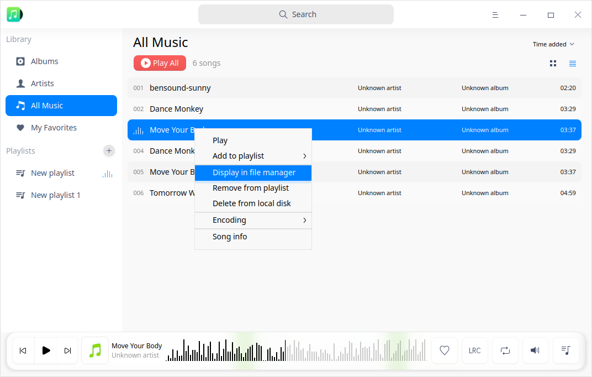

### Borrar Música

En la interfaz de Música, haga clic con el botón derecho en la música y podrá:

1. Hacer clic en **Quitar de la lista de reproducción** para remover la música de la lista de reproducción, pero el archivo de música seguirá guardado en el disco local.

2. Haga clic en **Borrar del disco local** para eliminar la música tanto de la lista de reproducción como del disco local. 

   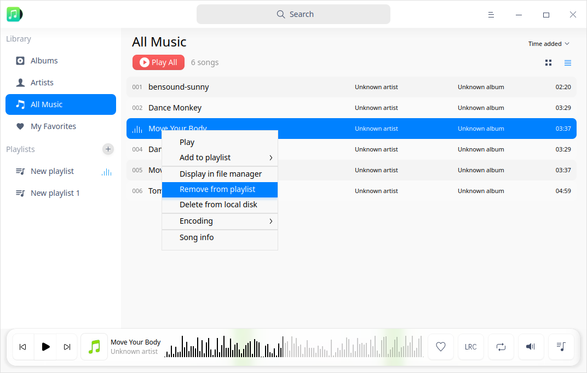

### Seleccionar codificación

1. En la interfaz de Música, haga clic con el botón derecho en la música.
2. Haga clic en **Codificación** y podrá seleccionar la codificación que necesite.

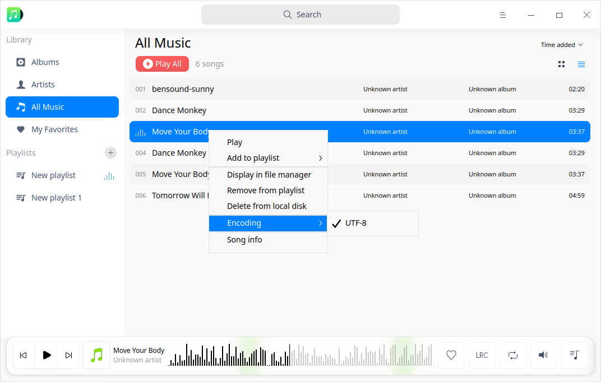

### Ver información de la música

1. En la interfaz de Música, haga clic con el botón derecho en el archivo de música de la lista de reproducción.
2. Haga clic en **Información de canción** para ver el título de la música, el artista, el álbum, el tipo, el tamaño, la duración, la ruta y otra información.

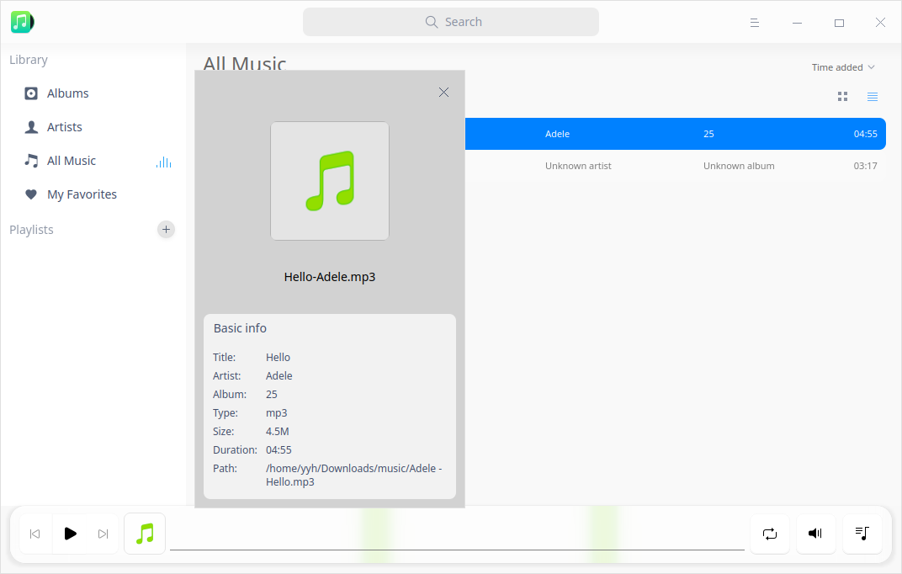

## Gestión de listas de reproducción

En la interfaz de Música, puedes crear, eliminar y cambiar el nombre de las listas de reproducción. También puede añadir música a la lista de reproducción.

> Nota: **Toda la música** y **Mis favoritos** se establecen como listas de reproducción por defecto y no se pueden eliminar. Las listas de reproducción personalizadas son subconjuntos de la lista de reproducción **Toda la música**. La lista de reproducción **Mis favoritos** se puede gestionar directamente o a través del botón de favoritos de la interfaz principal.

### Crear una nueva lista de reproducción

1.  En la interfaz de Música, haga clic en  a la derecha de la lista de reproducción o haga clic en **> Añadir lista de reproducción**.
2.  Introduzca el nombre de la lista de reproducción.
3.  Pulse la tecla **Intro** del teclado.

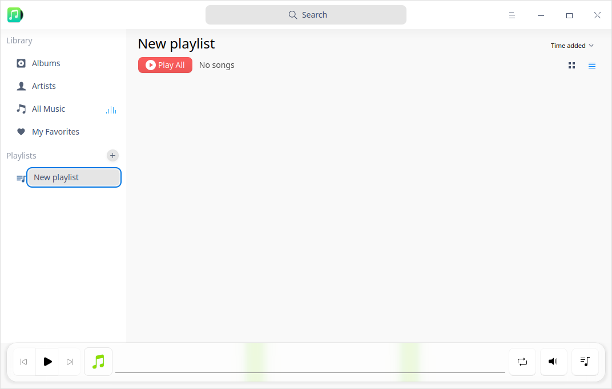

### Cambiar el nombre de la lista de reproducción

1.  Seleccione una lista de reproducción en **Listas de reproducción**.
2.  Haga clic con el botón derecho para seleccionar **Renombrar**.
3.  Introduzca el nombre de la lista de reproducción y pulse la tecla **Intro** del teclado para guardarla.

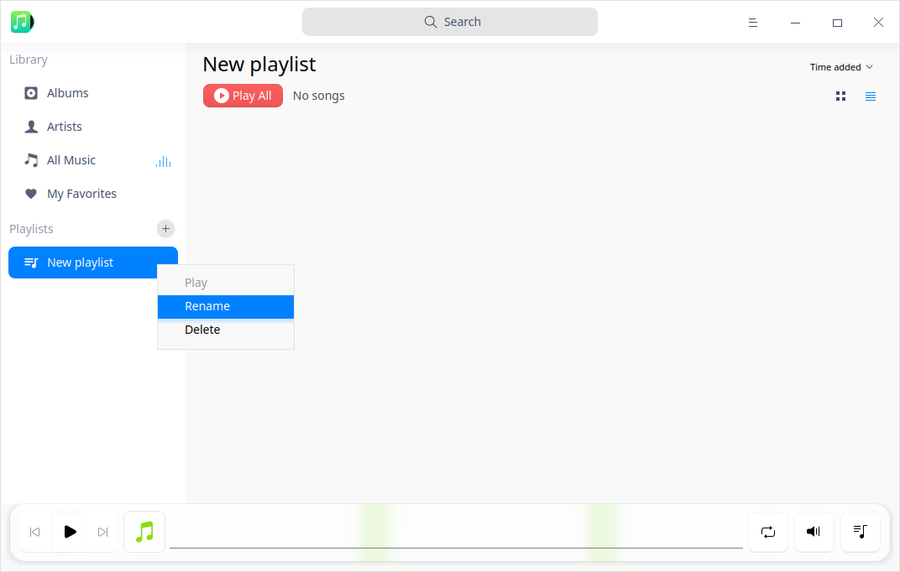

### Añadir música a la lista de reproducción

1. En la interfaz de Música, seleccione la música que desea añadir.
2. Haga clic con el botón derecho para seleccionar **Añadir a la lista de reproducción** y añada la música a la lista de reproducción seleccionada.

> Nota: Puede arrastrar la música local a una lista de reproducción especificada para añadir la música a la lista de reproducción actual y a la lista **Toda la música**. 

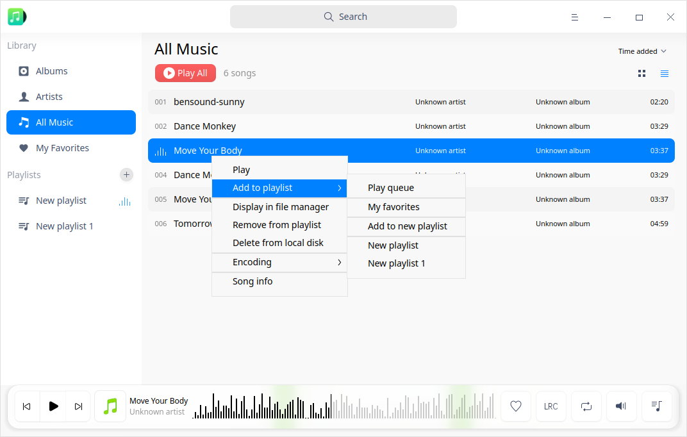

### Quitar Música de la lista de reproducción

1. Seleccione una de las **listas de reproducción** y seleccione la música que desea quitar de ella.
2. Haga clic derecho y seleccione **Quitar de la lista de reproducción** para eliminar la música de la lista de reproducción.

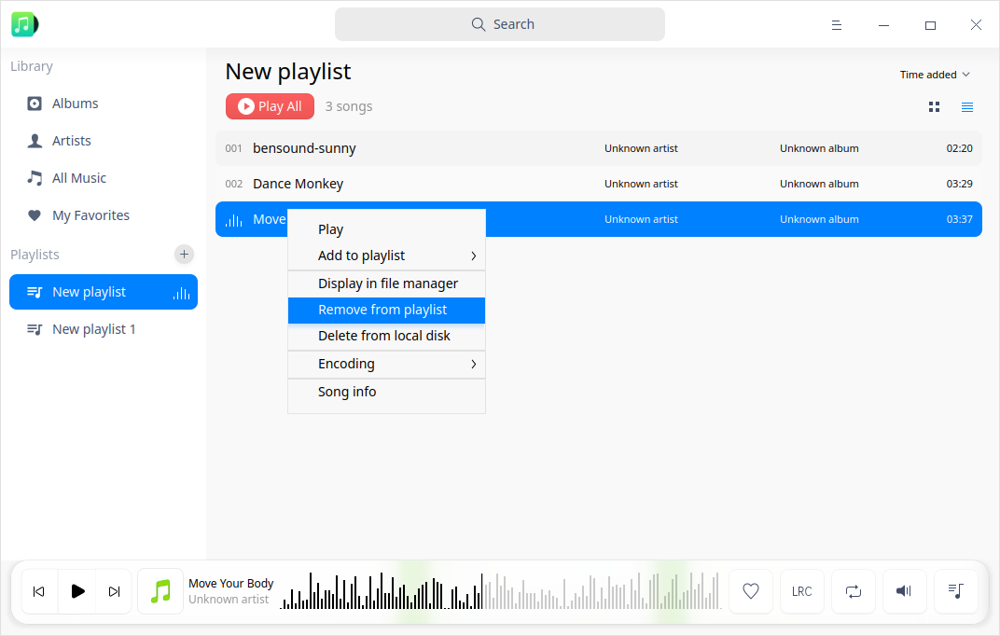

### Borrar lista de reproducción

1. Seleccione una lista de reproducción en **Listas de reproducción**. 
2. Haga clic derecho en la lista de reproducción que desea eliminar y seleccione **Borrar**.
3. En la ventana emergente, seleccione **Borrar** para confirmar la operación.

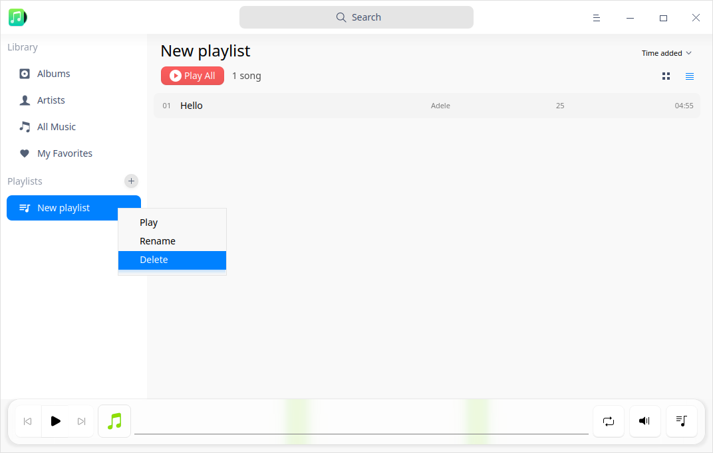

## Menú principal

En el menú principal, puede [Añadir música](#Añadir música), ajustar el ecualizador y las opciones, cambiar los temas de las ventanas, ver el manual de ayuda y obtener más información sobre la Música.

### Ecualizador

Puede configurar su modo de música favorito, como clásico, rock, etc. 

1. En la interfaz de Música, haga clic en .

2. Seleccione **Ecualizador**.

3. Puede activar el ecualizador, personalizar los valores y las frecuencias del **Preamplificador** y hacer clic en **Guardar**; o seleccionar un modo de música de la lista desplegable que será guardado automáticamente por el sistema.

4. Haga clic en **Restablecer valores predeterminados** para restablecer los ajustes por defecto.

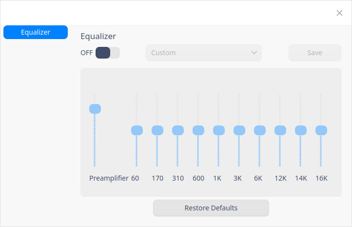

### Ajustes

En los Ajustes puedes configurar la información básica y los accesos directos.

#### Ajustes básicos

1. En la interfaz de Música, haga clic en .
2. 2. Seleccione **Ajustes** > **Básicos**.
   - En la opción **Reproducción**, puede:
        - Marcar la casilla **Reproducción automática** y la música se reproducirá automáticamente cuando se ejecute Música.
        - Marcar la casilla **Recordar posición de reproducción** y la música se reproducirá automáticamente desde la última posición reproducida cuando se ejecute Música.
        - Marque la casilla **Activar desvanecimiento** y la música se fundirá cuando se ejecute Música.

   - En la opción **Cerrar ventana principal**, puede:

        - Seleccionar **Minimizar a la bandeja del sistema** para cerrar la ventana principal y ocultar la Música a la bandeja del sistema.
        - Seleccionar **Salir** para cerrar la ventana principal, y salir de Música. 
        - Seleccionar **Preguntarme siempre** para solicitar una notificación del sistema, y confirmar si se sale de Música cuando se cierra la ventana principal.

3. Haga clic en **Restablecer valores predeterminados** para restaurar la configuración predeterminada.

#### Ajustes de los atajos de teclado

1. En la interfaz de Música, haga clic en .
2. Seleccione **Ajustes** > **Atajos de teclado** para ver los accesos directos.
3. Puede seleccionar y volver a introducir las teclas de acceso directo para personalizarlas.

### Tema

El tema de la ventana ofrece tres tipos de temas, a saber, Tema claro, Tema oscuro y Tema del sistema.

1.  En la interfaz de Música, haga clic en .

2.  Haga clic en **Tema** para seleccionar un tema.

### Ayuda

1.  En la interfaz de Música, haga clic en .

2.  Haga clic en **Ayuda** para ver el manual de Música.

### Acerca de

1. En la interfaz de Música, haga clic en .

2. Haga clic en **Acerca de** para ver la versión y la introducción de Música.

### Salir

1.  En la interfaz de Música, haga clic en .

2.  Haga clic en **Salir** para salir de Música.

