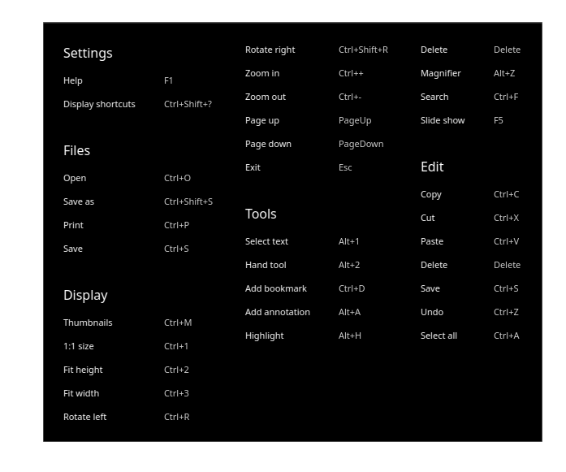
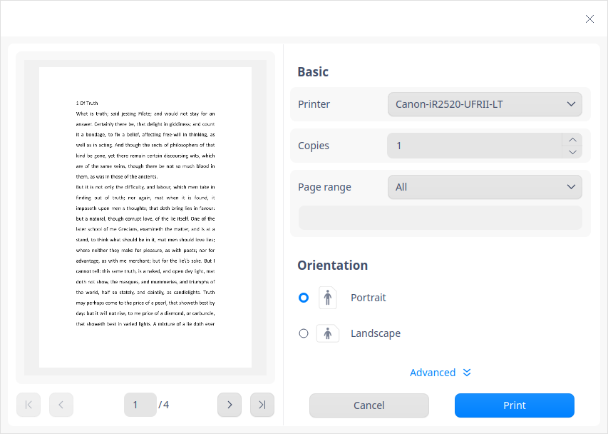
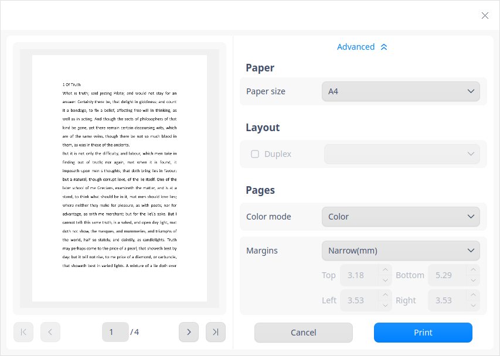

# Visor de documentos|../common/deepin-reader.svg|

## Descripción

Visor de documentos es un software potente y fácil de usar integrado en el sistema para abrir y ver archivos rápidamente, soportando operaciones como añadir marcadores, añadir notas y resaltar algún texto. 

## Guía

Puede ejecutar, cerrar o crear un acceso directo al Visor de documentos de la siguiente manera. 

### Ejecutar el Visor de documentos

1. Haga clic en  en la esquina inferior izquierda del muelle para entrar en la interfaz del Lanzador.
2. Localice  desplazando la rueda del ratón hacia arriba y hacia abajo o buscando en el lanzador, y haga clic en él para ejecutarlo.
3. Haga clic con el botón derecho del ratón en  para que:

 - Seleccione **Enviar al escritorio** para crear un acceso directo en el escritorio.
 - Seleccione **Enviar al muelle** para fijarlo en el muelle.
 - Seleccione **Añadir al arranque** para añadirlo al arranque. Cuando el ordenador se inicia, se ejecuta automáticamente.

> Consejos: Puede establecer el Visor de documentos como la aplicación predeterminada para ver los documentos en el Centro de control, consulte [Aplicaciones predeterminadas](dman:///dde#Ajustes de aplicaciones predeterminadas) para obtener más detalles. 

### Salir del Visor de documentos

- En la interfaz del Visor de documentos, haga clic en  para salir. 
- Haga clic con el botón derecho del ratón en  en el muelle y seleccione **Cerrar todo** o **Forzar cierre** para salir.
- En la interfaz del Visor de documentos, haga clic en  y seleccione **Salir**.

### Ver atajos de teclado

En la interfaz del Visor de documentos, pulse **Ctrl + Shift+ ?** para ver rápidamente todas las teclas de acceso directo, lo que le ayudará a utilizarlas con destreza y a mejorar su eficiencia de trabajo. 

## Funciones básicas

El Visor de documentos realiza la gestión básica de documentos, como abrir archivos, guardar archivos, imprimir archivos, así como gestionar pestañas, marcadores y notas. 

### Abrir archivos

Los formatos soportados por el Visor de documentos son PDF y DJVU. Puede abrir un archivo: 

- Arrastrándolo directamente a la interfaz o al icono. 
- Haciendo clic con el botón derecho y seleccionando **Abrir con** > **Seleccionar programa por defecto**, y luego seleccionando Visor de documentos de la lista.

   > Consejo: El documento se abrirá con el programa por defecto haciendo doble clic directamente sobre él. Puede hacer clic con el botón derecho y seleccionar un programa por defecto haciendo clic en **Propiedades** > **Abrir con**. O puede establecer un programa por defecto para este tipo de documentos en [Aplicaciones predeterminadas](dman:///dde#Ajustes de aplicaciones predeterminadas) desde el Centro de control. 

- Haciendo clic en **Seleccionar archivo** y seleccione un archivo en la interfaz del Visor de documentos.
- En la interfaz del Visor de documentos, pulsando **Ctrl+O** y seleccionando el archivo que desea abrir. 

### Guardar documentos

Para guardar el documento que ha sido editado y modificado, puede que:

- Pulse **Ctrl+S**.
- Haga clic en ** > **Guardar**.
- Pulse **Ctrl + Shift + S** o haga clic en  > **Guardar como**.

### Imprimir documentos

Para imprimir hay que conectar y configurar una impresora. 

1. Abra un documento en el Visor de documentos, haga clic con el botón derecho y seleccione **Imprimir**, o pulse **Ctrl + P** para abrir la página de vista previa.
2. En esta interfaz de previsualización, puede previsualizar y configurar la página de impresión. 
3. En esta interfaz de previsualización, haga clic en **Avanzado** para configurar el tamaño de la página, el método de impresión y otros parámetros. 
4. Haga clic en **Imprimir** y el documento se enviará a la impresora para su impresión. 

### Gestionar pestañas

Para la nueva pestaña

- Haga clic en  > **Nueva pestaña** para añadir una pestaña. 
- Cuando haya dos o más pestañas, verá el botón **+**. Y puede hacer clic en él para añadir nuevas pestañas.

Para cambiar/ajustar las pestañas, puede que:

- Arrastre dentro de la ventana para ajustar la secuencia de pestañas. 
- Haga clic en el botón  o para moverse a la izquierda y a la derecha. 
- Desplace la rueda del ratón para cambiar de pestaña automáticamente.  
- Si sólo hay una ventana en ese momento, haga doble clic o haga clic con el botón derecho en el archivo y seleccione Visor de documentos para abrir el archivo en la ventana que se abrió primero.  

Realizar operaciones entre ventanas

- Arrastre cualquier pestaña para sacarla de la ventana actual y crear una nueva. 
- Arrastre una pestaña de una ventana a otra. 
- Cuando hay varias ventanas, haga doble clic o haga clic con el botón derecho en el archivo y seleccione Visor de documentos para abrir el archivo en la primera ventana.

Regla de arrastre para varias ventanas y pestañas:

- Cuando se arrastran varios archivos al Visor de documentos al mismo tiempo, se abren como varias pestañas en una sola ventana. 
- Se pueden abrir varias ventanas a la vez, y las pestañas se pueden arrastrar de una ventana a otra. 
- No importa cuántas ventanas haya, un archivo sólo puede abrirse una vez. 
- Si no se realiza ninguna operación en un archivo, el botón de guardar no está disponible.

### Gestionar los marcadores

En la interfaz del Visor de documentos, abra un archivo y tendrá dos opciones. 

- Añadir marcador:
   - Haga clic con el botón derecho en cualquier página del Visor de documentos y seleccione **Añadir marcador** para marcar esta página. 
   - Mueva el cursor a la esquina superior derecha de la página hasta que aparezca , haga clic en este icono para añadir un marcador para esta página, y este icono se llenará de color azul.
- Quitar marcador:
   - Haga clic con el botón derecho del ratón en el marcador y seleccione **Quitar de marcador**. 
   - Haga clic en el icono de color del marcador para cancelar/eliminar el marcador.

> Nota: El icono del marcador aparece sólo cuando el cursor se mueve al área correspondiente, y desaparece cuando el cursor se mueve fuera del área. Se coloreará después de hacer clic en él cuando aparezca y se mostrará siempre sin importar dónde esté el cursor.

### Gestionar anotaciones

En la interfaz del Visor de documentos, abra un archivo. y tendrá dos opciones 

- Añadir una anotación

   - Seleccione el texto con la herramienta de selección y haga clic con el botón derecho del ratón, seleccione **Añadir anotación**. El texto seleccionado se resaltará una vez que la anotación se haya añadido correctamente.
   - Haga clic derecho en cualquier área en blanco o en el lugar donde desee añadir una anotación y seleccione **Añadir anotación**. Después de añadir una nota con éxito, aparecerá un icono de nota resaltada.
     
      > Notas: 
      >
      > - Haga clic en cualquier área en blanco fuera de la ventana sin introducir ningún contenido, entonces la nota no se añade con éxito o se elimina automáticamente. 
      > - Haga clic en cualquier área en blanco fuera de la ventana después de introducir algún contenido, el contenido se guardará automáticamente y se mostrará como un pequeño icono. 

- Copiar nota
   - Haga clic derecho en el texto resaltado al que se ha añadido correctamente una nota y seleccione **Copiar** para copiar el contenido.
   - Haga clic derecho en el icono de la nota y seleccione **Copiar** para copiar el contenido.
   - Haga clic en  y en el icono del catálogo  de la izquierda y seleccione una nota, haga clic con el botón derecho y seleccione **Copiar**. 
   
- Mostrar nota  
   1.  Pase el cursor sobre el icono de la nota para mostrar el contenido. 
   2.  Haga clic en el icono de la nota para que aparezca una ventana, en la que podrá ver y reeditar. 

- Borrar nota 
   - Haga clic con el botón derecho del ratón en el texto resaltado al que ha añadido una nota y seleccione **Quitar resaltado**. 
   - Haga clic con el botón derecho del ratón en el icono de la nota y seleccione **Borrar anotación**. 
   - Haga clic en el icono del catálogo  en la columna de la izquierda, y seleccione una nota, haga clic con el botón derecho para seleccionar **Borrar anotación**, esta nota se elimina y también su contenido. 

   > Notas: 
   > + Puede mover el icono de la nota en la página actual.
   > + No se pueden añadir anotaciones a archivos DJVU.

## Operaciones comunes

El Visor de documentos integra muchas funciones para que la gestión de los documentos sea más sencilla y eficaz. 

### Buscar
Esta función sólo es aplicable a la pestaña actual.
1. En la interfaz del Visor de documentos, abra un archivo. 
2. Haga clic con el botón derecho y seleccione **Buscar** o pulse **Ctrl**+**F** para abrir una ventana de búsqueda. 
   
3. En el cuadro de búsqueda, puede hacer clic en  para introducir palabras clave. 
   
4. Pulse **Intro** para localizar rápidamente. 
   - Toda la información que coincida se mostrará en una lista y se resaltará en el documento.
   - Si la búsqueda falla, se mostrará "Sin resultados de búsqueda". 
   
5.  Cuando se encuentren resultados coincidentes, haga clic en  o  para ver los resultados uno por uno. 

6. Si hace clic en un resultado, puede saltar a la página donde se encuentra resaltada. 
> Atención: La búsqueda falla en caso de que el texto esté codificado en imágenes en algunos archivos PDF. 

7. Borre las palabras en el cuadro de búsqueda para borrar todos los resultados. 

> Nota: No se puede buscar en archivos DJVU.

### Mover en archivos

Para moverse en cada página del archivo puede: 

- Desplazar la rueda del ratón hacia arriba y hacia abajo. 
- Arrastrar la barra de desplazamiento hacia arriba y hacia abajo en la ventana. 
- Pulsar la tecla arriba y abajo del teclado. 
- Hacer clic en  > **Herramientas** > **Herramienta de mano**, aparecerá  y arrastrar con el ratón, como si estuviera sujetando la página con la mano. 

### Pasar páginas rápidamente 

Para pasar de una página a otra, puede 

- Hacer clic con el botón derecho y seleccionar **Página anterior** o **Página siguiente**. 
- Pulsar  o  en el teclado. 
- Para ir a una página especializada, tendrá que: 
  - Introducir el número de página y pulsar la tecla **Intro**. 
  - Para ir al principio o al final del archivo, puede hacer clic con el botón derecho y seleccionar **Primera página** o **Última página**. 

### Cambiar de catálogo 

Usando las miniaturas puede cambiar las miniaturas de los archivos del catálogo , del catálogo de archivos , del catálogo de marcadores  y del catálogo de anotaciones . Arrastre el marco del catálogo, las miniaturas varían según el ancho que se puede arrastrar. 

### Pantalla completa

1. En la interfaz del Visor de documentos, haga clic con el botón derecho y seleccione **Pantalla completa** o pulse la tecla de acceso directo **F11**.
2. Mueva el cursor a la parte superior o a la izquierda de la ventana para llamar la barra de herramientas superior o la barra de herramientas izquierda. De lo contrario, la barra de herramientas estará oculta.
3. Después de llamar a la barra de herramientas lateral en el modo **Pantalla completa**, haga clic en  para mantenerla mostrada.
4. Pulse la tecla **Esc** o **F11** para salir del modo **Pantalla completa**.

### Presentación de diapositivas

1. En la interfaz del Visor de documentos, haga clic con el botón derecho y seleccione **Presentación** para mostrar el archivo en forma de diapositivas. 
3. Haga clic en o  para cambiar de página, o haga clic en para hacer una pausa. 
4. Pulse la tecla **Esc** para salir. 

### Acercar y alejar vista

Para acercar o alejar la vista de una página, puede:

- Pulsar **Ctrl +"+"** o **Ctrl +"-"** .
- Pulsar **Ctrl** y desplazar la rueda del ratón hacia arriba y hacia abajo al mismo tiempo. 
- En la interfaz del Visor de documentos, pulse "**+**" o "**-**". 
- Aquí se admite introducir manualmente. Puede elegir el porcentaje de visualización en el cuadro desplegable de la barra de menú: 10%, 25%, 50%, 75%, 100%, 125%, 150%, 175%, 200%, 300%, 400% y 500%, según el cual el archivo se amplía o se reduce.
> Nota: Si utiliza un equipo provisto con una pantalla táctil o un panel táctil, puede utilizar gestos en lugar del ratón:
> - En la pantalla táctil, pellizca con dos dedos para alejar la página; abre dos dedos para acercar la página.
> - En el panel táctil que admite el toque de varios puntos, pellizca con dos dedos para alejar la página; abre dos dedos para acercar la página.  

### Resaltar

1. En la interfaz del Visor de documentos, seleccione un texto y haga clic con el botón derecho, seleccione **Resaltar**, hay varios colores para elegir. 

> Nota: Si no hay texto resaltado, el botón **Quitar resaltado** no está disponible. 

3. Seleccione un color, el texto seleccionado se resaltará en ese color. 

4. Seleccione el texto resaltado, haga clic en **Quitar el resaltado** para devolverlo al estado en que estaba. 

> Nota: 
>
> - El Visor de documentos memoriza el color elegido por el usuario, que será el color principal utilizado cuando el usuario resalte cualquier texto la próxima vez.  Puede cambiar el color como desee. 
> - No se puede resaltar en archivos DJVU.

### Ajustar la vista

Haga clic en  , y en su submenú podrá:

- Hacer clic en **Vista de dos páginas** para leer dos páginas a la vez. 
- Hacer clic en **Tamaño 1:1** para visualizar el archivo en una proporción del 100%.
- Hacer clic en **Ajustar a página** para mostrar una página completa en la ventana actual.
- Haga clic en **Ajustar a lo largo** para mostrar la página en la ventana completamente en dirección vertical. 
- Haga clic en **Ajustar a lo ancho** para mostrar la página en la ventana completamente en dirección horizontal.

### Adaptar ventana

Para que la ventana se adapte a todos los tamaños, puede:

- Arrastrar la ventana, y el archivo se mostrará al variar el tamaño de la ventana automáticamente.
- El tamaño de la columna izquierda del catálogo se adapta al tamaño de la ventana a medida que se modifica. 
- Para la pantalla de alta resolución, el ancho de la columna izquierda de miniaturas se adapta a la resolución y al ancho de la pantalla. 

### Girar

1. En la interfaz del Visor de documentos, abra un documento. 
2. Haga clic con el botón derecho y seleccione **Girar a la izquierda** o **Girar a la derecha** en el submenú, la página girará a la izquierda o a la derecha en 90°. 
> Notas:  Si utiliza un equipo provisto con una pantalla táctil o un panel táctil, puede utilizar gestos en lugar del ratón:
> - En la pantalla táctil, coloque dos dedos sobre la imagen con una cierta distancia y gire los dos dedos al mismo tiempo para girar la página.
> - En el panel táctil que admite el toque de varios puntos, coloque dos dedos en la imagen con una cierta distancia y gire los dos dedos al mismo tiempo para girar la página.

### Información del documento
1. En la interfaz del Visor de documentos, abra un documento. 
2. Haga clic con el botón derecho del ratón y seleccione **Información del documento** para comprobar la información relevante, como las propiedades del documento.

## Menú principal

En el menú principal, puede crear una nueva ventana y nuevas pestañas, [guardar](#Guardar documentos), [buscar](#Buscar), cambiar de tema, ver la ayuda para saber más sobre el Visor de documentos. 

### Visualización en el administrador de archivos

1. Haga clic en  en la interfaz principal.
2. Haga clic en **Mostrar en el administrador de archivos** para abrir y mostrar la ubicación de almacenamiento del archivo en el Administrador de archivos. 

### Lupa 

1. En la interfaz del Visor de documentos, abra un documento. 
2. Haga clic en  > **Lupa**.
3. Mueva el cursor al área que desea ver para ampliar. 
4. Pulse **Esc** o haga clic con el botón derecho para cancelar la ampliación.

### Tema

Hay opciones que incluyen el tema claro, el tema oscuro y el tema del sistema.

   1. Haga clic en  en la interfaz principal.
   2. Haga clic en **Tema** para seleccionar uno.

### Ayuda

Haga clic en Ayuda para obtener el manual, que le ayudará a conocer y utilizar mejor el Visor de documentos.

   1. Haga clic en  en la interfaz principal.
   2. Haga clic en **Ayuda** para ver el manual.

### Acerca de

1. Haga clic en  en la interfaz principal.
2. Haga clic en **Acerca de** para ver la información de la versión y la introducción sobre el Visor de documentos. 

### Salir

1. Haga clic en  en la interfaz principal.
2. Haga clic en **Salir**.

