# Captura de pantalla|../common/deepin-screen-capture.svg|

## Descripción

Captura de pantalla es una herramienta que integra las funciones de captura y grabación de pantalla en una sola. Puede seleccionar ventanas o áreas de forma automática o manual durante la captura o grabación de la pantalla. 

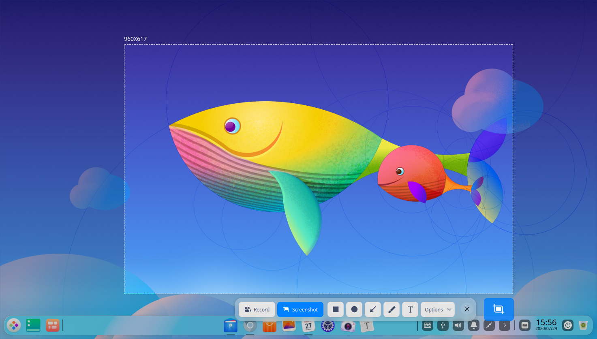

## Guía

Puede ejecutar, cerrar o crear accesos directos para la Captura de pantalla mediante las siguientes operaciones.

### Ejecutar Captura de pantalla

1.  Haga clic en  en el muelle para entrar en la interfaz del Lanzador.
2.  Localice  desplazando la rueda del ratón o buscando **Captura de pantalla** en la interfaz del Lanzador y haga clic en él para ejecutarlo. 
3.  Haga clic con el botón derecho del ratón en el icono deepin-screenshot.svg y podrá que:

    - Haga clic en **Enviar al escritorio** para crear un acceso directo al escritorio.
    - Haga clic en **Enviar al muelle** para fijarlo en el Dock.
    - Haga clic en **Añadir al arranque** para añadirlo al inicio y que se ejecute automáticamente cuando se inicie el sistema.

> Notas: Si Captura de pantalla se ha fijado en el muelle por defecto, puede hacer clic en  en el muelle para ejecutarlo.

### Cerrar Captura de pantalla

- Captura de pantalla se cerrará automáticamente después de que la captura de pantalla o la grabación de pantalla se haya completado.
- En la interfaz de Captura de pantalla, pulse  para salir de Captura de pantalla.
- En la interfaz de Captura de pantalla, pulse **Ctrl + S** o **Esc** en el teclado para guardar la captura de pantalla o salir.
- En la interfaz de Captura de pantalla, haga clic con el botón derecho para seleccionar **Guardar** o **Salir**.

## Operaciones

### Tomar capturas de pantalla

Puede capturar rápidamente la pantalla de las siguientes maneras:

- Pulse la tecla  del teclado para capturar toda la pantalla del monitor.
- Utilice las funciones de captura de pantalla de varias aplicaciones, como Tencent QQ y el navegador Chrome.
- Utilice el software especializado de captura de pantalla para realizar capturas, como el software de Captura de pantalla que viene con el sistema operativo.

#### Accesos directos

En el modo de Captura de pantalla de la interfaz de Captura de pantalla, pulse **Ctrl + Shift + ?** para ver los accesos directos. El dominio de los atajos mejorará en gran medida su eficiencia.

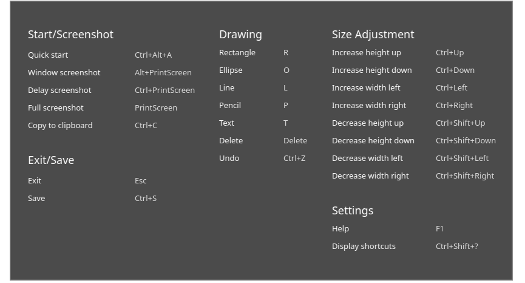

#### Seleccionar el área de captura de pantalla

Hay tres tipos de áreas de captura de pantalla comunes, concretamente la pantalla completa, la ventana del programa y el área personalizada. Cuando se realiza una captura de pantalla, el área seleccionada estará delimitada por una línea blanca discontinua y tendrá un aspecto más brillante que la otra área.

> Nota: Cuando el ordenador está conectado a varios monitores, también puede utilizar la Captura de pantalla para capturar áreas en diferentes monitores.

##### Seleccionar pantalla completa

La selección de pantalla completa se utiliza para identificar toda la pantalla del monitor actual.

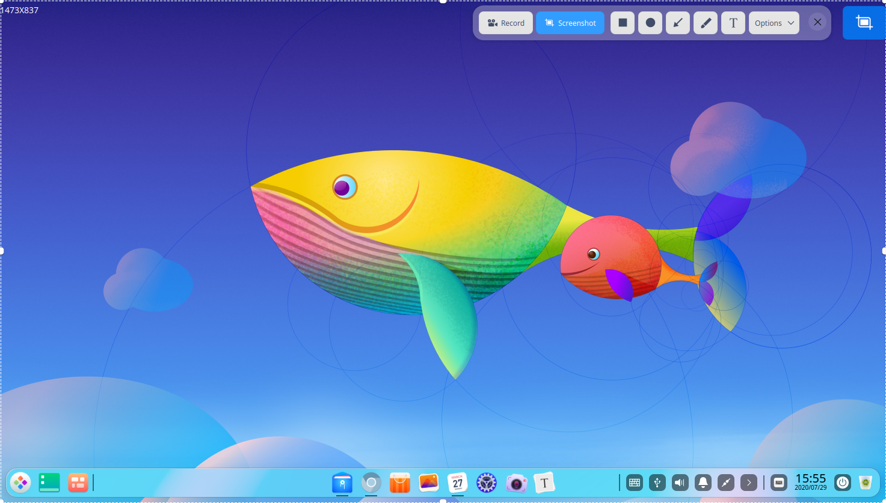

&nbsp;&nbsp;&nbsp;&nbsp;&nbsp;&nbsp;&nbsp;&nbsp;&nbsp;&nbsp;&nbsp;&nbsp;&nbsp;

Puede seleccionar la pantalla completa de las siguientes maneras:

1.  Pulse **Ctrl + Alt + A** en el teclado para entrar en el modo de captura de pantalla.
2.  Mueva el puntero al escritorio y la pantalla completa se seleccionará automáticamente. La dimensión de la captura de pantalla se mostrará en la esquina superior izquierda. 
3.  Haga clic en el escritorio y aparecerá una barra de herramientas.
4.  Haga clic en  en la barra de herramientas o haga clic con el botón derecho para seleccionar **Salir** para salir de la Captura de pantalla.

También puede tomar una captura de pantalla completa directamente de las siguientes maneras:

- Si Captura de pantalla se ha fijado en el muelle, haga clic con el botón derecho en  en el muelle para seleccionar **Captura de pantalla completa**. 
- Pulsa  en el teclado para hacer una captura de pantalla completa.

##### Seleccionar ventana de programa

La selección de la ventana del programa se utiliza para identificar automáticamente la ventana de la aplicación actual.

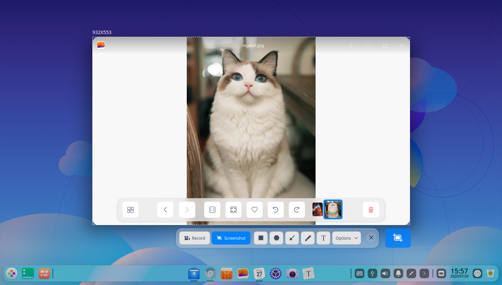

&nbsp;&nbsp;&nbsp;&nbsp;&nbsp;&nbsp;&nbsp;&nbsp;&nbsp;&nbsp;&nbsp;&nbsp;&nbsp;

1.  Pulse **Ctrl + Alt + A** en el teclado para entrar en el modo de captura de pantalla.
2.  Mueva el puntero a la ventana de la aplicación y la ventana se seleccionará automáticamente. La dimensión de la captura de pantalla se mostrará sobre la esquina superior izquierda. 
3.  Haga clic en la ventana y aparecerá una barra de herramientas.
4.  Clic en  en la barra de herramientas o haga clic con el botón derecho para seleccionar **Salir** para salir de la Captura de pantalla.

##### Seleccionar área personalizada

La selección de área personalizada se utiliza para indicar libremente el área de captura al arrastrar el ratón.

&nbsp;&nbsp;&nbsp;&nbsp;&nbsp;&nbsp;&nbsp;&nbsp;&nbsp;&nbsp;&nbsp;&nbsp;&nbsp;

1.  Pulse **Ctrl + Alt + A** en el teclado para entrar en el modo de captura de pantalla.
2.  Mantenga pulsado y arrastre el botón izquierdo del ratón para seleccionar el área de captura de pantalla. La dimensión de la captura de pantalla se mostrará en la parte superior izquierda. 
3.  Suelte el botón izquierdo del ratón para completar la selección del área y aparecerá una barra de herramientas.
4.  Haga clic en  en la barra de herramientas o haga clic con el botón derecho para seleccionar **Salir** para dejar la captura de pantalla.

#### Ajustar el área de captura de pantalla

Puede ajustar el área de captura de pantalla. Por ejemplo, puede ampliar o reducir el área capturada, mover la posición de la captura de pantalla, entre otras funciones. 

##### Ampliar/reducir el área de captura de pantalla

Coloque el puntero sobre el tablero blanco del área de captura de pantalla y el puntero cambiará a Puede:

- Mantener pulsado el botón izquierdo del ratón y arrastrarlo para ampliar o reducir el área de captura de pantalla. 
- Pulsar **Ctrl** +  ,  ,  o  y arrastrar el ratón para ampliar o reducir el área de captura de pantalla vertical u horizontalmente.

##### Mover la posición de la captura de pantalla

Coloque el puntero sobre el área de captura de pantalla y se cambiará a 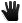. Puede:

- Mantener pulsado el botón izquierdo del ratón y arrastrarlo para mover la posición del área de captura de pantalla.
- Pulsar  ,  ,  o  en el teclado para mover el área de captura de pantalla vertical u horizontalmente.

#### Editar captura de pantalla

Captura de pantalla puede ayudarle a procesar imágenes con una variedad de funciones de edición para tus necesidades diarias, incluyendo el marcado de gráficos, la anotación de texto, etc. También puede pixelar el área para proteger su privacidad. 

Puedes editar las capturas de pantalla de las siguientes maneras:

- Haz clic en el icono de la herramienta en la barra de herramientas. 
- Cambia rápidamente entre varias herramientas de edición a través de accesos directos.
- Haga clic con el botón derecho para elegir las herramientas de edición después de seleccionar el área de la captura de pantalla.

#### Dibujar formas

Puede dibujar algunos gráficos sencillos en las capturas de pantalla, como el rectángulo, la elipse y otras formas.

##### Barra de herramientas

Durante la captura de pantalla, puede hacer clic en los iconos de la barra de herramientas para realizar diversas operaciones. Ejecute Captura de pantalla y la barra de herramientas aparecerá automáticamente debajo del área de captura de pantalla después de seleccionar el área de captura de pantalla. 

> Atención: Sus ajustes en la barra de herramientas y en la columna de atributos, como el ancho de la línea y el tamaño de la fuente, se conservan y se aplican de facto y se reanudarán la próxima vez que inicie la Captura de pantalla. También puede restablecerla. 

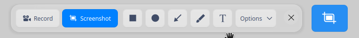

<table class="block1">
    <caption>Descripción del icono</caption>
    <tbody>
        <tr>
            <td></td>
            <td>Rectángulo</td>
            <td class="blank"></td>
            <td></td>
            <td>Elipse</td>
        <td class="blank"></td>
            <td></td>
            <td>Línea</td>
        </tr>
          <tr>
            <td></td>
            <td>Lápiz</td>
            <td class="blank"></td>
            <td></td>
            <td>Texto</td>
            <td class="blank"></td>
            <td></td>
            <td>Salir</td>
        </tr>
    </tbody>
</tabla>

&nbsp;&nbsp;&nbsp;&nbsp;&nbsp;&nbsp;&nbsp;&nbsp;&nbsp;&nbsp;&nbsp;&nbsp;&nbsp;

##### Rectángulo

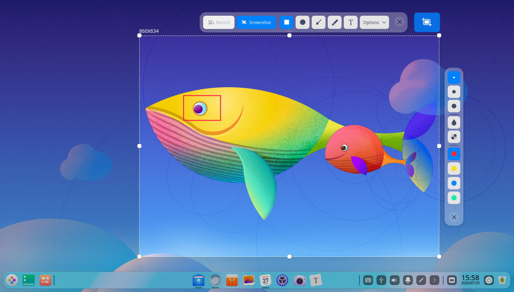
&nbsp;&nbsp;&nbsp;&nbsp;&nbsp;&nbsp;&nbsp;&nbsp;&nbsp;&nbsp;&nbsp;&nbsp;&nbsp;

1.  Haga clic en  en la barra de herramientas que aparece al lado del área de captura de pantalla.
2.  En el panel de extensión de la barra de herramientas, seleccione el ancho del contorno para la forma del rectángulo. 
3.  Coloque el puntero sobre el área de captura de pantalla y el puntero cambiará a .
4.  Mantenga pulsado el botón izquierdo del ratón y arrástrelo para completar el dibujo.
5.  Haga clic en  o  en el panel de extensión de la barra de herramientas para hacer un mosaico de la información privada en la captura de pantalla (si la hay).

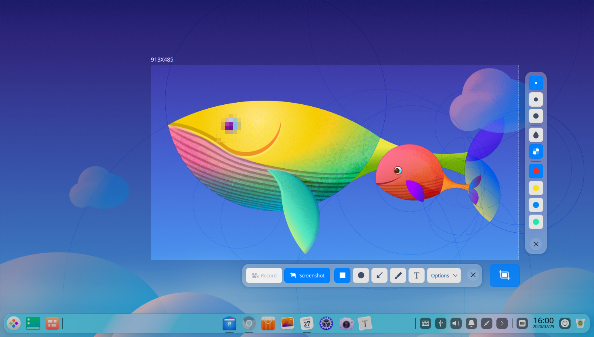

##### Elipse
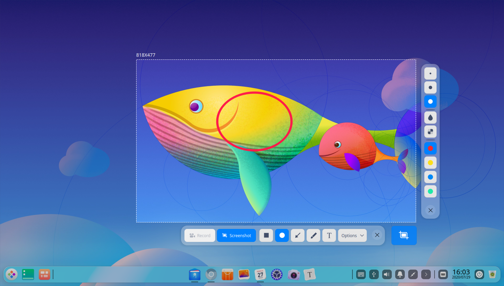
&nbsp;&nbsp;&nbsp;&nbsp;&nbsp;&nbsp;&nbsp;&nbsp;&nbsp;&nbsp;&nbsp;&nbsp;&nbsp;

1.  Haga clic en  en la barra de herramientas que aparece al lado del área de captura de pantalla.
2.  En el panel de extensión de la barra de herramientas, seleccione el peso del contorno para la forma de la elipse. 
3.  Coloque el puntero sobre el área de captura de pantalla y el puntero cambiará a .
4.  Mantenga pulsado el botón izquierdo del ratón y arrástrelo para completar el dibujo.
5.  Haga clic en  o en el panel de extensión de la barra de herramientas para hacer un mosaico de la información privada en la captura de pantalla (si la hay).

##### Líneas recta y flecha
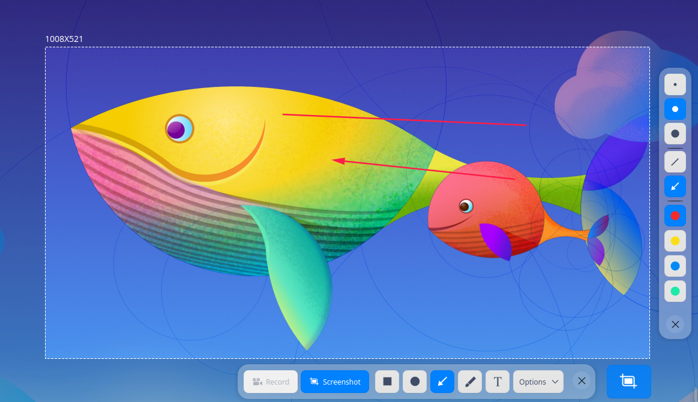
&nbsp;&nbsp;&nbsp;&nbsp;&nbsp;&nbsp;&nbsp;&nbsp;&nbsp;&nbsp;&nbsp;&nbsp;&nbsp;

1.  Haga clic en  en la barra de herramientas que aparece al lado del área de capturas de pantalla.
2.  En el panel de extensión de la barra de herramientas, seleccione el peso de la línea. 
3.  Haga clic en  o  para alternar entre línea recta y flecha.
4.  Coloque el puntero en el área de la captura de pantalla y el puntero cambiará a  o .
5.  Mantenga pulsado el botón izquierdo del ratón y arrástrelo para completar el dibujo.

##### Lápiz
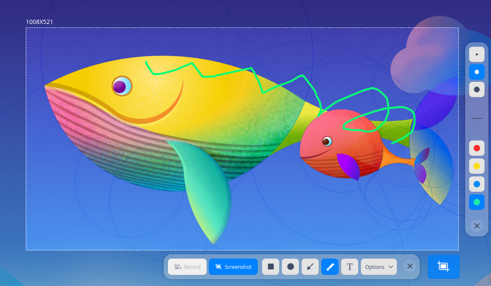
&nbsp;&nbsp;&nbsp;&nbsp;&nbsp;&nbsp;&nbsp;&nbsp;&nbsp;&nbsp;&nbsp;&nbsp;&nbsp;

1.  Haga clic en  en la barra de herramientas junto al área de captura de pantalla.
2.  En el panel de extensión de la barra de herramientas, seleccione el peso del lápiz. 
3.  Coloque el puntero sobre el área de captura de pantalla y el puntero cambiará a .
4.  Mantenga pulsado el botón izquierdo del ratón y arrástrelo para completar el dibujo.

Si necesita dibujar un cuadrado, un círculo u otras formas, puede que:

- Mantenga pulsada la tecla **Shift** del teclado y seleccione  para dibujar un cuadrado.
- Mantenga pulsada la tecla **Shift** del teclado y seleccione  para dibujar un círculo.
- Mantenga pulsada la tecla **Shift** del teclado y seleccione  o  para dibujar una línea recta o una línea recta con flecha horizontal o vertical.

#### Modificar gráficos

Puede modificar y mover los gráficos dibujados en la captura de pantalla.

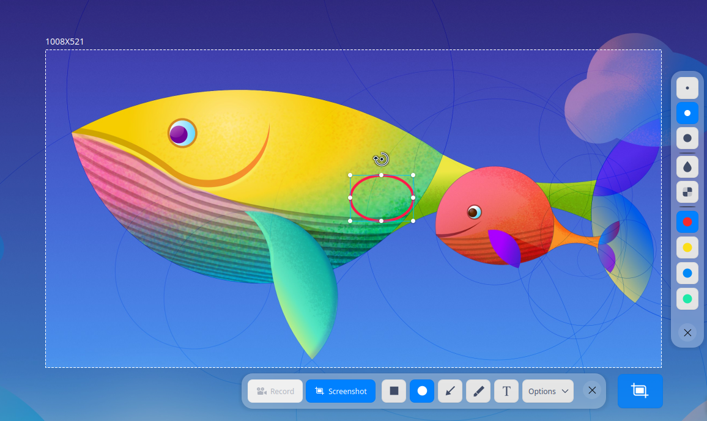
&nbsp;&nbsp;&nbsp;&nbsp;&nbsp;&nbsp;&nbsp;&nbsp;&nbsp;&nbsp;&nbsp;&nbsp;&nbsp;

##### Mover gráficos
1.  Coloque el puntero sobre la línea del borde de los gráficos y el ratón se cambiará a .
2.  Mantenga pulsado el botón izquierdo del ratón y arrastre los gráficos a cualquier lugar del área de captura de pantalla.
3.  Pulse  ,  ,  o  en el teclado para mover los gráficos vertical u horizontalmente.

##### Editar gráficos

1.  Coloque el puntero sobre el contorno de los gráficos.
2.  Haga clic con el botón izquierdo del ratón para entrar en el modo de edición y podrá:
    - Pulsar la tecla **Suprimir** del teclado para eliminar los gráficos.
    - Pulsar **Ctrl + Z** en el teclado para volver al paso anterior.
    - Colocar el puntero sobre el cuadro de edición y el ratón se cambiará a. Amplíe o reduzca el área gráfica arrastrando el puntero.
    - Pulse **Ctrl** +  ,  ,  o  para ampliar la zona gráfica vertical u horizontalmente.
    - Coloque el puntero sobre  en el cuadro de edición y el puntero cambiará a . Rota los gráficos arrastrando el puntero.
3.  Haga clic con el botón izquierdo del ratón fuera del cuadro de edición para salir del modo de edición.

#### Añadir anotación de texto

Añade anotaciones de texto a la captura de pantalla para ayudar a otros a entenderla mejor.

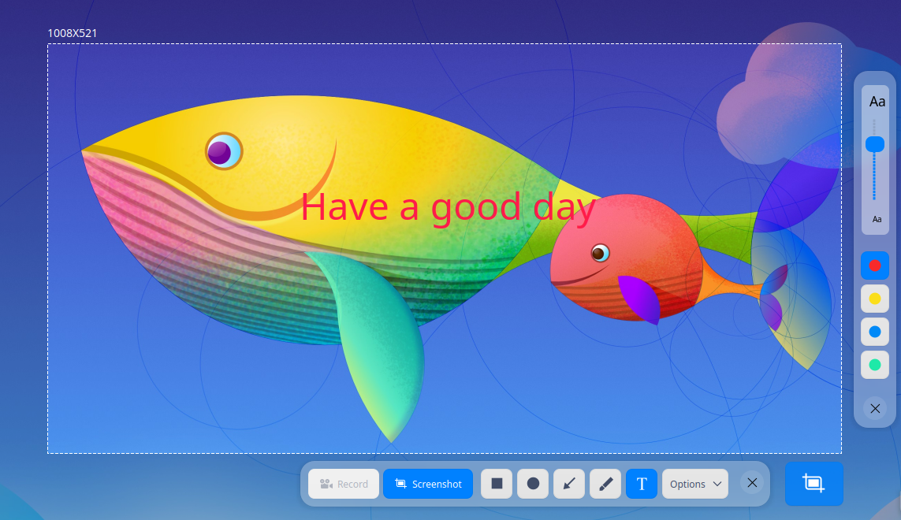
&nbsp;&nbsp;&nbsp;&nbsp;&nbsp;&nbsp;&nbsp;&nbsp;&nbsp;&nbsp;&nbsp;&nbsp;&nbsp;
1.  Haga clic en  en la barra de herramientas que aparece al lado del área de captura de pantalla.
2.  En el panel de extensión de la barra de herramientas, seleccione el tamaño de la fuente mediante la barra de desplazamiento. 
3.  Coloque el puntero sobre la captura de pantalla y el ratón pasará a .
4.  Haz clic donde quieras añadir una anotación y aparecerá un cuadro de texto.
5.  Introduzca el texto en el cuadro correspondiente.

#### Modificar las anotaciones de texto

Puede modificar y mover las anotaciones de texto después de haberlas introducido.

##### Mover anotaciones de texto

1.   Coloque el puntero sobre el texto y el puntero cambiará a .
2.   Mantenga pulsado el botón izquierdo del ratón y arrástrelo para mover el texto a cualquier parte del área de la captura de pantalla.

##### Editar anotaciones de texto

1.  Coloque el puntero sobre el texto y el puntero cambiará a .
2.  Haga clic con el botón izquierdo del ratón para entrar en el modo de edición de texto y podrá:
    - Pulsar **Suprimir** en el teclado para eliminar las anotaciones de texto.
    - Pulsar **Ctrl + Z** en el teclado para volver al paso anterior.
    - Modificar el texto en el cuadro de texto.
3.  Haga clic fuera del cuadro de texto para salir del modo de edición.

#### Ajustar colores

En Captura de pantalla se proporcionan cuatro colores para que marque los gráficos.

1.  Seleccione una herramienta en la barra de herramientas que aparece al lado del área de captura de pantalla.
2.  Haga clic en,,o en el panel de extensión de la barra de herramientas y seleccione un color.

#### Guardar capturas de pantalla

Guarde la captura de pantalla para utilizarla en el futuro.

Cuando la captura de pantalla se guarda correctamente, puede ver un mensaje de aviso en la esquina superior derecha del escritorio. Haga clic en **Ver** para abrir la carpeta donde se encuentra la captura de pantalla.

Puede guardar la captura de pantalla de las siguientes maneras después de iniciar Captura de pantalla y seleccionar el área de captura de pantalla:

- Haga doble clic para guardar la captura de pantalla.
- Haga clic en el  de la barra de herramientas.

> Nota: Si utiliza un ordenador equipado con pantalla táctil o touchpad, puede utilizar los gestos de la pantalla táctil para operar en lugar del ratón: Haz doble clic con un dedo para finalizar las capturas de pantalla.

- Pulse **Ctrl + S** para guardar la captura de pantalla.
- Haz clic con el botón derecho del ratón en la captura de pantalla y selecciona **Guardar** para guardarla.

> Nota: La captura de pantalla se guarda por defecto en el escritorio.

Haga clic en **Opciones** en la barra de herramientas de la interfaz de Captura de pantalla y amplíe la lista desplegable:

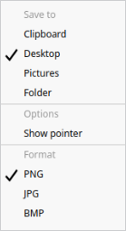
			&nbsp;&nbsp;&nbsp;&nbsp;&nbsp;&nbsp;&nbsp;&nbsp;&nbsp;&nbsp;&nbsp;&nbsp;&nbsp;&nbsp;

- Seleccione **Tablero** para guardar la captura de pantalla en el portapapeles.
- Haga clic en **Escritorio** (por defecto) y la captura de pantalla se guardará en el escritorio.
- Haga clic en **Imágenes** y la captura de pantalla se guardará en la carpeta de imágenes.
- Haga clic en **Carpeta**. Seleccione la carpeta de destino de la captura de pantalla y la captura de pantalla se guardará en el directorio de la carpeta seleccionada por usted. 
- Seleccione **Mostrar puntero** y el puntero se mostrará en el área de la captura de pantalla. Su posición y patrón también se guardarán en la imagen.
- Seleccione **PNG/JPG/BMP** para establecer el formato de la captura de pantalla.

### Grabar una pantalla

#### Instrucciones de la barra de herramientas

&nbsp;&nbsp;&nbsp;&nbsp;&nbsp;&nbsp;&nbsp;&nbsp;&nbsp;&nbsp;&nbsp;&nbsp;&nbsp;&nbsp;&nbsp;

>Nota: 
   - Si el efecto ventana está desactivado en el Centro de Control, la grabación de pantalla estará oculta.
   - La grabación de pantalla no está disponible en las plataformas Loongson y SW.

 <table class="block1">
     <caption>Descripción del icono</caption>
     <tbody>
         <tr>
             <td></td>
             <td>Micrófono</td>
             <td class="blank"></td>
             <td></td>
             <td>Sonido activado</td>
         <td class="blank"></td>
             <td></td>
             <td>Mostrar la pulsación de teclas</td>
         </tr>
           <tr>
             <td></td>
             <td>Cámara web encendida</td>
             <td class="blank"></td>
             <td></td>
             <td>Mostrar clic</td>
             <td class="blank"></td>
             <td></td>
             <td>Salir</td>
         </tr>
     </tbody>
 </table>
 &nbsp;&nbsp;&nbsp;&nbsp;&nbsp;&nbsp;&nbsp;&nbsp;&nbsp;&nbsp;&nbsp;&nbsp;&nbsp;

 #### Seleccionar el área de grabación

Después de ejecutar el grabador de pantalla, puede seleccionar el área de grabación, cuyos elementos son la pantalla completa, la ventana de reconocimiento automático y la ventana personalizada.

 - Pantalla completa y ventana de reconocimiento automático: cuando seleccione el área de grabación, el grabador de pantalla reconocerá automáticamente la ventana en el escritorio junto con el movimiento de su ratón, y habrá un cuadro de selección rectangular en la ventana identificada. Haga clic para seleccionar la grabación de la ventana actual. Como el escritorio también es un tipo de ventana, por lo tanto, cuando el ratón se encuentre en el escritorio, se reconocerá la grabación a pantalla completa.
 - Ventana personalizada: cuando seleccione el área de grabación, se puede utilizar el ratón para seleccionar cualquier área libremente. El área seleccionada estará delimitada por una línea blanca discontinua. Posteriormente, puede ajustar la posición y el tamaño del área seleccionada arrastrando el ratón dentro del área o arrastrando la línea blanca discontinua. A continuación, haga clic para seleccionar la ventana actual para la grabación.

 #### Ajustar el sonido, la pulsación de tecla, la cámara y el seguimiento por clics

 En la barra de herramientas de Captura de pantalla, puedes configurar el sonido, la pulsación de teclas, la cámara, etc. para prepararte para la grabación de vídeo.

 - Grabar sonido: incluyendo el micrófono y el audio incorporado (activado por defecto).
 - Pulsación de teclas: pase el puntero por encima de  y se mostrará la opción **Mostrar pulsación de tecla**. Haga clic en él y se mostrará la pulsación de la operación durante la grabación de la pantalla. Se pueden mostrar hasta cinco pulsaciones recientes al mismo tiempo. Vuelva a hacer clic en el icono para activar **Ocultar pulsaciones** y cancelar la visualización de las pulsaciones.
 - Cámara: pase el puntero por encima del icono  y aparecerá **Encender cámara web**. Haga clic en él y se mostrará la ventana de la cámara en la pantalla de grabación. Arrastre el contorno de la ventana de la cámara para ajustar el tamaño y la posición de la misma. Vuelva a hacer clic en el icono para desactivar la cámara. No se podrá mostrar ninguna imagen, salvo una pantalla negra.
 - Clic: pase el puntero por encima de  y se mostrará **Mostrar clic**. Haga clic en él para mostrar el ratón y la pantalla táctil durante la grabación de la pantalla. Vuelva a hacer clic para cancelar la visualización.

 > Atención: En primer lugar, compruebe si el dispositivo conectado admite la grabación de sonido y las funciones de la cámara.
 >
 > * Si el dispositivo conectado es compatible con las funciones de grabación de sonido y de cámara, podrá realizar las operaciones pertinentes.
 > * Cuando el dispositivo conectado no es compatible con las funciones de grabación de sonido y cámara, los iconos aparecen en gris y no podrá realizar estas operaciones.

 #### Ajustar el formato de grabación y los FPS (fotogramas por segundo)

 Haga clic en **Opciones** para ampliar la lista desplegable de la barra de herramientas de **Captura de pantalla**. Seleccione las opciones y podrá grabar vídeos en formato GIF, MP4 y MKV. También puedes configurar los FPS.

 > Nota: Inicie la grabación de vídeo después de realizar cambios en los ajustes si la configuración predeterminada no satisface sus necesidades.

 #### Grabar vídeos

 Puede personalizar el área de grabación y seleccionar el formato de grabación antes de grabar.

 1. Haga clic en  **Grabar** para seleccionar el área de grabación después de iniciar el grabador de pantalla.

 2. Seleccione el formato de grabación.

 3. Haga clic en **Iniciar grabación** y aparecerá el icono parpadeante de **Grabación** en la bandeja del sistema.

 4. Haz clic en el icono del muelle o de la bandeja del sistema para completar la grabación.

 El vídeo grabado se guardará en el escritorio automáticamente.

 > Nota: Durante la grabación de vídeo, si se conectan varios monitores, tanto si la pantalla múltiple está en modo de duplicado como en modo extendido, sólo se graba la pantalla de funcionamiento actual.

 ### Ver ayuda

Pulse  en el teclado para ver el manual de ayuda después de iniciar la Captura de pantalla.