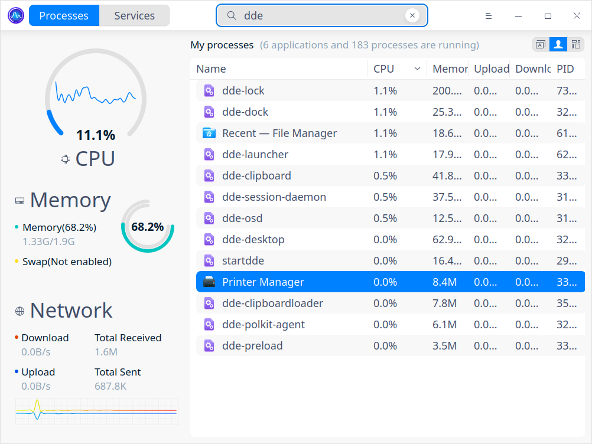
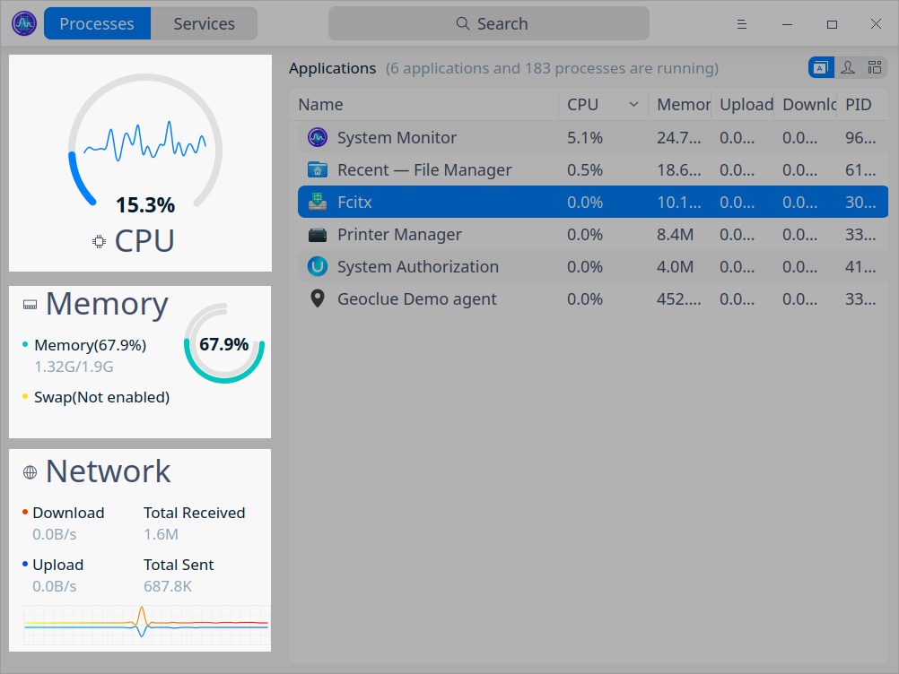
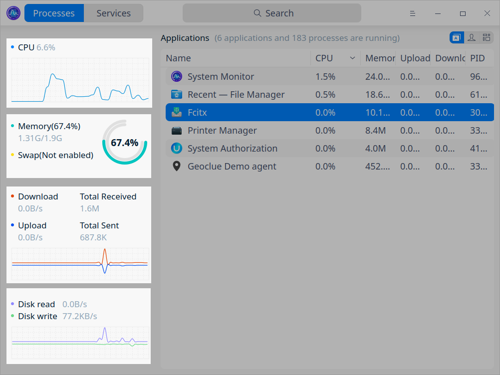
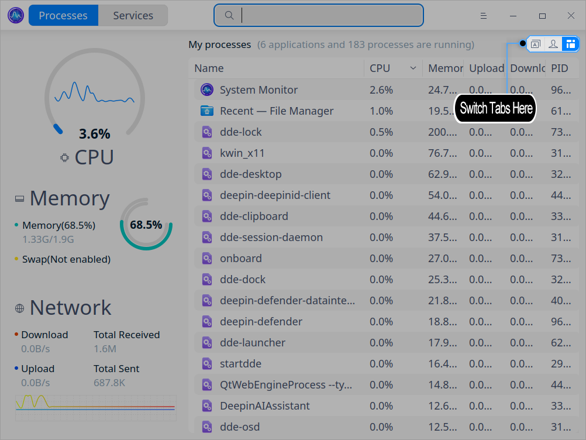
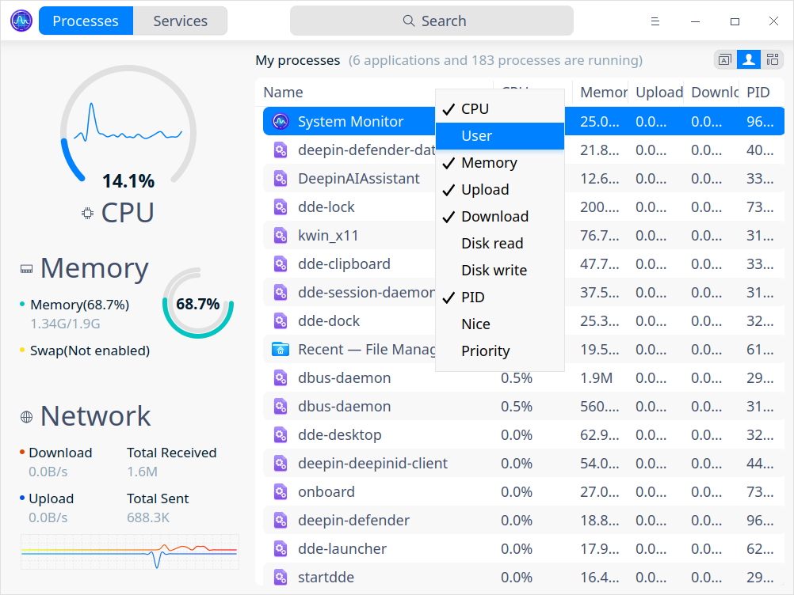
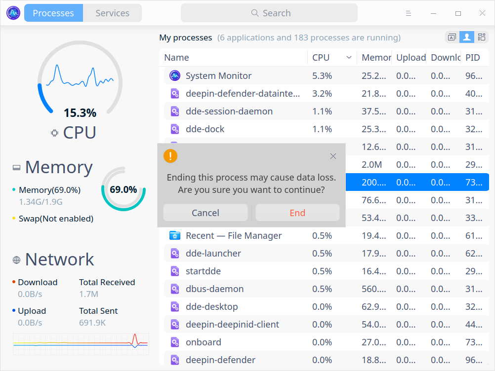
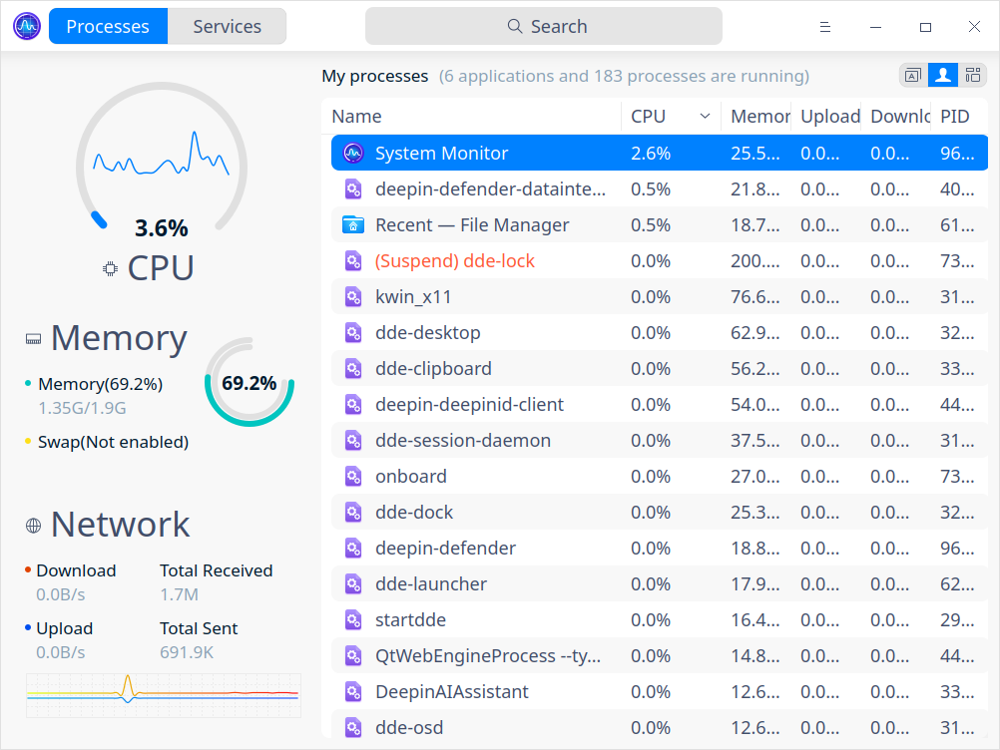
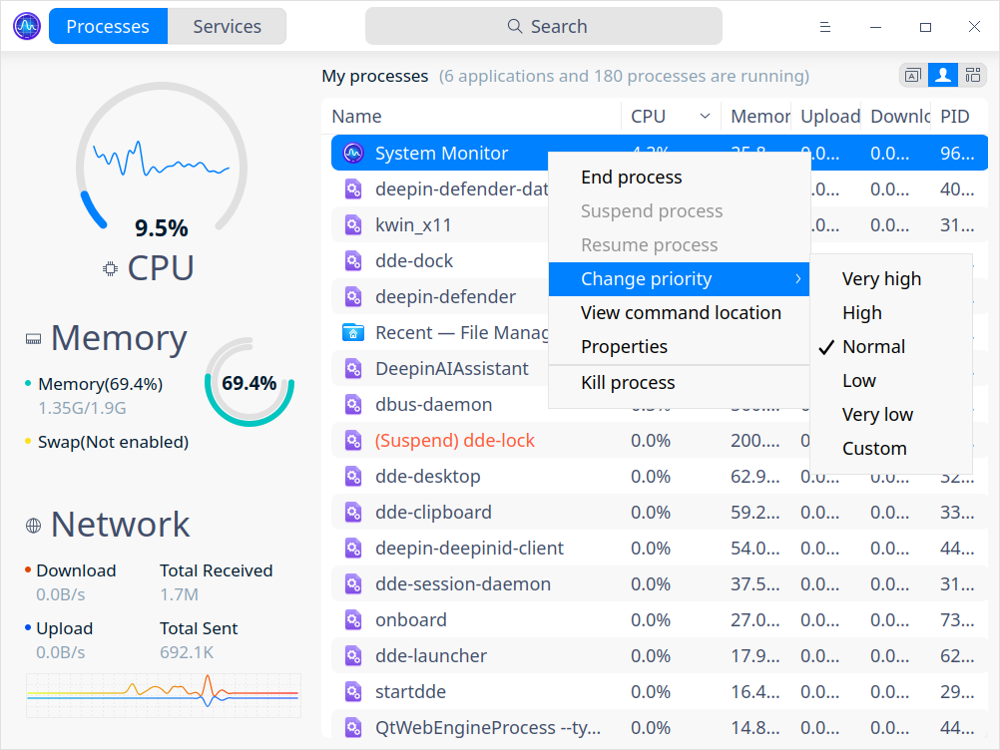
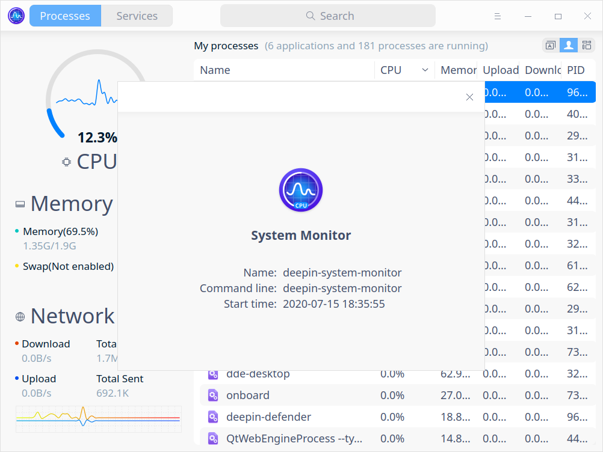

# Monitor del sistema |../common/deepin-system-monitor.svg|

## Descripción

Monitor del sistema es una herramienta de monitorización y gestión de la carga del hardware, la ejecución de programas y los servicios del sistema. Soporta la monitorización en tiempo real del estado de la CPU, el uso de la memoria y la velocidad de carga/descarga, ayuda a gestionar los procesos del sistema y de las aplicaciones, y permite buscar y forzar la finalización de los procesos.

## Operaciones básicas

### Buscar proceso

1. En el cuadro de búsqueda, haga clic en  para introducir las palabras clave. 
2. Pulse la tecla **Intro** del teclado para localizar rápidamente. 
   - Cuando haya información coincidente, se mostrará una lista de resultados de búsqueda en la interfaz.
   - Si no se encuentra ninguna información, se mostrará **ningún resultado de búsqueda** en la interfaz.

### Monitorización del hardware

El Monitor del sistema puede vigilar el estado de la CPU, la memoria y la red de su sistema:

- Monitorización de la CPU: puede ver el uso de la CPU y las tendencias recientes de uso a través de gráficos, pantallas numéricas y curvas.

  - En la **vista extendida**, la carga de la CPU se muestra en un gráfico con forma de rosquilla con porcentaje. La curva dentro del gráfico muestra el resumen de la carga reciente de la CPU, cuya altura se ajusta automáticamente a la altura interior del gráfico. 
  
  - En la **vista compacta**, la carga de la CPU se muestra en forma de oscilograma con porcentaje. La curva muestra el resumen de la carga reciente de la CPU, cuya altura se ajusta automáticamente a la altura del oscilograma. 
  
- La monitorización de la memoria muestra el uso en tiempo real de la memoria, la memoria total y el uso actual, el espacio de intercambio total y el uso actual en porcentaje y gráficos.
- La monitorización de la red muestra la velocidad actual de descarga y subida, y la tendencia reciente de dichas actividades en gráfico lineal.
- La monitorización del disco muestra la velocidad de lectura y escritura actual, y la tendencia reciente de dichas actividades en gráfico lineal.

### Gestión de procesos

#### Cambiar las pestañas de los procesos

Haga clic en las pestañas de la parte superior derecha de la interfaz de monitorización del sistema para ver **Aplicaciones**, **Mis procesos** y **Todos los procesos**.

- Haga clic en  para cambiar a **Aplicaciones**. 
- Haga clic en  para pasar a **Mis procesos**. 
- Haga clic en  para pasar a **Todos los procesos**.

#### Ajustar el orden de los procesos

Puede ajustar el orden de los procesos por Nombre, CPU, Usuario, Memoria, Carga, Descarga, Lectura en disco, Escritura en disco, PID, Niza y Prioridad.

- En la interfaz del Monitor del sistema, haga clic en las pestañas de la parte superior de la lista de procesos para ordenarlos. Múltiples clics permiten ordenar de menor a mayor o de mayor a menor.
- Haga clic derecho en las pestañas superiores para marcar o desmarcar las opciones que desee ver u ocultar.

#### Finalizar proceso

El Monitor del sistema se puede utilizar para finalizar procesos.

1. En la interfaz del Monitor del sistema, haga clic con el botón derecho del ratón en el proceso que desea finalizar.
2. Seleccione **Finalizar proceso**.
3. Haga clic en **Finalizar** en la ventana emergente para confirmar.

#### Terminar la aplicación

1. En la interfaz del Monitor del sistema, haga clic en .

2. Seleccione **Forzar cierre de aplicación**.
> Nota: Esta función sólo puede finalizar procesos con interfaz gráfica.

3. Haga clic en la ventana de la aplicación que desea cerrar según el aviso.

4. Haga clic en **Forzar cierre** en la ventana emergente para confirmar.

> Consejo: Puede finalizar un proceso seleccionando un proceso, haciendo clic con el botón derecho y seleccionando **Finalizar proceso**. 

#### Suspender/Reanudar proceso

1. En la interfaz del Monitor del sistema, haga clic con el botón derecho en el proceso que desea suspender.
2. Seleccione **Suspender proceso**. El proceso será etiquetado con **(Suspendido)** y se volverá rojo en la lista. 
3. Vuelva a hacer clic con el botón derecho del ratón y seleccione **Reanudar proceso** para reanudarlo.

#### Cambiar la prioridad del proceso 

1. En la interfaz del Monitor del sistema, haga clic con el botón derecho en un proceso.

2. Seleccione **Cambiar prioridad** y seleccione un nivel de prioridad.

Nota: También puede seleccionar el nivel de prioridad **Personalizado**.

#### Ver ubicación del proceso

1. En la interfaz del Monitor del sistema, haga clic con el botón derecho del ratón en el proceso que desee ver.
2. Seleccione **Ver ubicación del proceso** para abrir la ubicación en el Administrador de archivos. 

#### Ver las propiedades del proceso

1. En la interfaz del Monitor del sistema, haga clic con el botón derecho en el proceso que desee ver.
2. Seleccione **Propiedades** para ver el nombre, la línea de comandos y la hora de inicio del proceso.

### Gestión de servicios del sistema

Puede iniciar, detener, reiniciar, establecer el tipo de inicio y actualizar los procesos de los servicios del sistema.
En la lista de servicios del sistema, está prohibido forzar la finalización de la aplicación.

>Atención: Para un mejor funcionamiento del sistema, por favor, no finalice ningún proceso de los servicios del sistema ni de los procesos root.

#### Iniciar el servicio del sistema
1. Seleccione la pestaña **Servicios** en la interfaz del Monitor del sistema.
2. Seleccione un proceso que aún no se haya iniciado, haga clic con el botón derecho y seleccione **Iniciar**. Introduzca la contraseña si aparece la ventana de autenticación.
3. En la columna **Activo** se muestra el servicio **activo**.
4. Haga clic con el botón derecho del ratón en el servicio y seleccione **Tipo de inicio** para elegir entre las opciones **Auto** y **Manual**.
5. Haga clic con el botón derecho del ratón en el servicio y seleccione **Actualizar**.

#### Detener el servicio del sistema

1. Seleccione la pestaña **Servicios** en la interfaz del Monitor del sistema.
2. Seleccione un proceso ya iniciado, haga clic con el botón derecho del ratón y seleccione **Detener**. Introduzca la contraseña si aparece la ventana de autenticación.
3. En la columna **Activo** se muestra el servicio **inactivo**.
4. Haga clic con el botón derecho en el servicio y seleccione **Actualizar**.

También puede hacer clic con el botón derecho en un proceso del sistema y seleccionar **Reiniciar**. 

## Menú principal

En el menú principal, puede cambiar los modos y temas de monitorización, ver el manual de ayuda y obtener más información del Monitor del sistema.

### Tema

El tema de la ventana ofrece tres tipos de temas, a saber, Tema claro, Tema oscuro y Tema del sistema.

1. En la interfaz de Monitor del sistema, haga clic en .
2. Haga clic en **Tema** para seleccionar un tema.

### Vista

Monitor del sistema ofrece la vista Expandir y la vista Compacta para su elección.

1. En la interfaz de Monitor del sistema, haga clic en .

2. Haga clic en **Vista** para seleccionar un modo.

> Nota: La vista compacta y la vista expandida sólo están disponibles para los procesos. 

### Ayuda

1. En la interfaz del Monitor del sistema, haga clic en .
2. Haga clic en **Ayuda** para ver el manual del Monitor del sistema.

### Acerca de

1.  En la interfaz de Monitor del sistema, haga clic en .
2.  Haga clic en **Acerca de** para ver la versión y la presentación del Monitor del sistema.

### Salir

1. En la interfaz de Monitor del sistema, haga clic en .
2. Haga clic en **Salir** para cerrar el Monitor del sistema.
