# Terminal|../common/deepin-terminal.svg|

## Descripción

Terminal es un emulador de texto con una interfaz sencilla que proporciona potentes funciones diversificadas, como multiventana, espacio de trabajo, gestión remota y modo Quake, entre otras. Puede iniciar y cerrar la Terminal de forma instantánea y sin problemas como cualquier ventana de archivo normal, lo que le evita limitaciones y molestias al escribir comandos. Pruebe el modo Quake, que le permitirá navegar por otras ventanas mientras introduce comandos en una pantalla. Cuando hay varias tareas, puede añadir pestañas en el terminal para crear más espacios de trabajo como en el navegador o dividir el espacio de trabajo en varias ventanas. También es muy fácil subir y descargar archivos con la gestión remota. Hay más funciones potentes esperando a que las explores.

 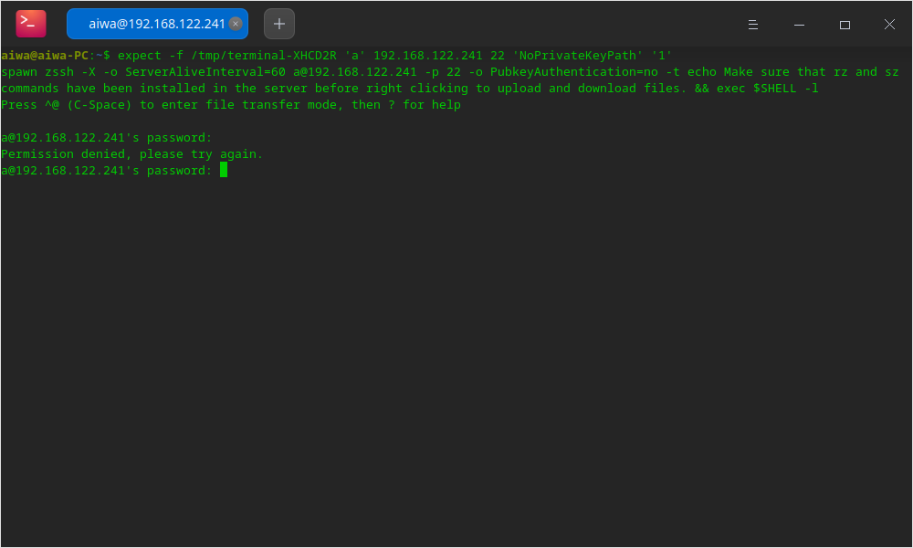

## Guía

Puedes ejecutar, salir o crear accesos directos para la Terminal.

### Ejecutar Terminal 

1. Pulse  en el muelle para entrar en la interfaz del Lanzador.
2. Localice  desplazando la rueda del ratón o buscando "terminal" en la interfaz del Lanzador y haga clic en él para ejecutarlo.
3. Haga clic con el botón derecho del ratón en  para que: 
 - Seleccione **Enviar al escritorio** para crear un acceso directo al escritorio.
 - Seleccione **Enviar al muelle** para fijarlo en el muelle.
 - Seleccione **Añadir al arranque** para añadir la aplicación al inicio y que se ejecute automáticamente cuando se inicie el sistema.

> Nota: También puede pulsar **Ctrl** + **Alt** + **T** para abrir la Terminal.

### Salir de la Terminal 

1. En la interfaz de la Terminal, haga clic en  para salir.

2. Haga clic con el botón derecho del ratón en  en el muelle y seleccione **Cerrar todo** o **Forzar cierre** para salir.

3. En la interfaz de la Terminal, haga clic en  para seleccionar **Salir**.

> Nota: Se mostrará un aviso cuando los programas sigan ejecutándose en la Terminal para evitar la pérdida de datos.

### Ver atajos de teclado

En la interfaz de la Terminal, pulse **Ctrl + Shift + ?** para ver los atajos. El dominio de los atajos mejorará en gran medida su eficiencia.

 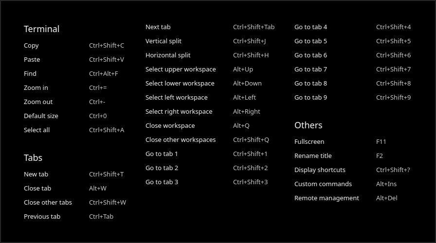

## Operaciones básicas

Puede hacer clic con el botón derecho del ratón en la interfaz de la Terminal para las operaciones diarias.

 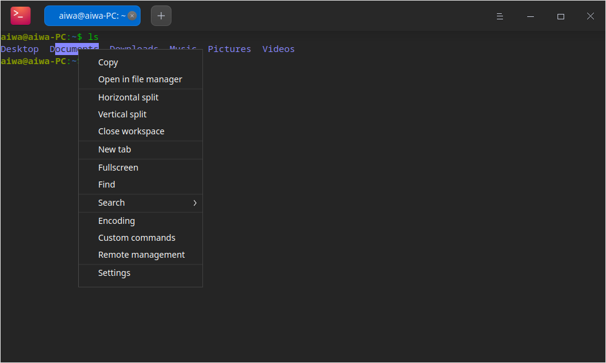

### Buscar 

Puede utilizar la función **Buscar** para buscar rápidamente contenidos en el terminal.

1. Haga clic con el botón derecho del ratón en la interfaz de la Terminal para seleccionar **Buscar** o haga clic en la tecla **Ctrl** + **Alt ** +**F** del teclado.
2. Escriba la palabra en el cuadro de búsqueda.
3. Pulse la tecla **Intro** del teclado y los resultados de la búsqueda quedarán resaltados.
4. Presione **Esc** en el teclado o haga clic en cualquier área en blanco de la interfaz de la Terminal para ocultar la búsqueda.

> Consejo: Pulse **Intro** para buscar debajo de la ubicación actual. También puede buscar haciendo clic en  y  en la interfaz.

### Búsqueda en la web 

Puede utilizar el navegador en la Terminal para realizar una rápida y cómoda búsqueda en la web con respecto al contenido seleccionado en la interfaz de la Terminal. 

1. En la interfaz de la Terminal, seleccione el contenido que desea buscar.
2. Haga clic con el botón derecho del ratón para seleccionar **Buscar en Internet**.
3. Seleccione un sitio web de búsqueda.
4. Su navegador aparecerá y comenzará a buscar en base al contenido seleccionado en la interfaz de la Terminal.

### Copiar/Pegar 

- Copiar
   - En la interfaz de la Terminal, seleccione el contenido que desea copiar y pulse **Ctrl** + **Shift** + **C**.
   - En la interfaz de la misma, seleccione el contenido que desea copiar, haga clic con el botón derecho y seleccione **Copiar**.
- Pegar
   - En la interfaz de la Terminal, pulse **Ctrl** + **Shift** + **V**.
   - En la interfaz de la misma, haga clic con el botón central del ratón para pegar.
   - En la interfaz de la misma, haga clic con el botón derecho y seleccione **Pegar**.

> Consejos: 
    > - Si quiere copiar un hipervínculo, no necesita seleccionar ningún contenido. Simplemente cópielo con el clic derecho.
    > - Marque **Copiar al seleccionar** en **Ajustes** en el menú principal para copiar el texto seleccionado en el portapapeles automáticamente.

### Modo Quake 

El Modo Quake es una función exclusiva de Terminal. Pulsa **Alt** + **F2** para abrir una ventana de quake, y vuelve a pulsar para ocultarla.

> Consejo: También puede hacer clic con el botón derecho en  en el muelle para seleccionar **Quake Terminal** para abrir una ventana de quake.

### Abrir archivos y aplicaciones

En la interfaz de la Terminal, seleccione el archivo en el directorio actual y haga clic con el botón derecho para **Abrir** por aplicación del sistema.

1. En la interfaz de la Terminal, introduzca **ls -al** para mostrar los archivos en el directorio actual.
2. Haga doble clic para seleccionar el nombre del archivo.
3. Haga clic con el botón derecho y seleccione **Abrir**.
4. El archivo se abrirá con la aplicación adecuada.

 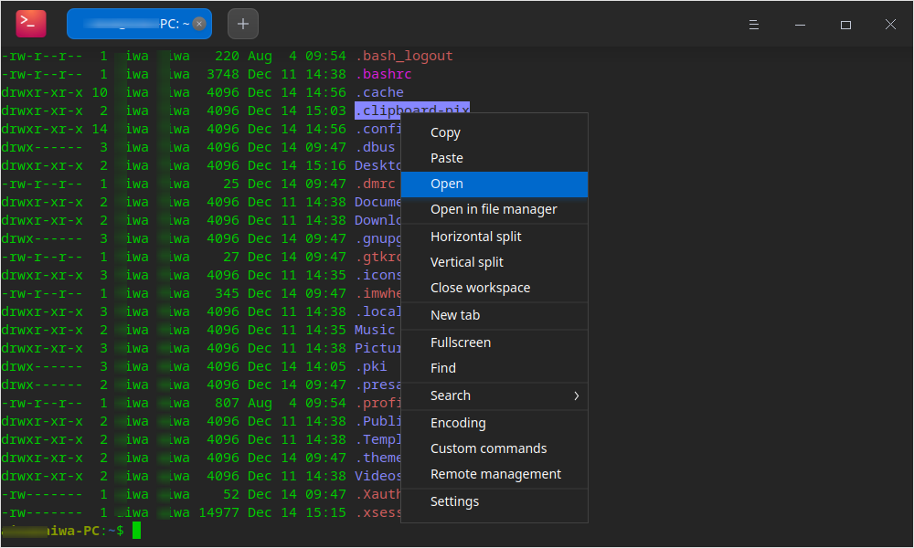

### Ajustar el método de codificación

Cuando hay un código desordenado o un error de visualización, puede cambiar la codificación para resolverlo.

1. En la interfaz de la Terminal, haga clic con el botón derecho del ratón para seleccionar **Codificación**.
2. Seleccione una codificación de la lista para ver si el contenido se muestra correctamente.
3. Repita el paso 2 hasta que el contenido se muestre correctamente.

> Nota: Normalmente, los métodos de codificación correctos se emparejan automáticamente en la Terminal. Si aparece algún error en algunas circunstancias especiales, puede ajustar los métodos de codificación manualmente. Puede elegir directamente el método de codificación correcto si está seguro de ello. Si no está seguro, puede probar varias veces.  

## Operaciones de la ventana

La ventana sirve como base para sus operaciones en la Terminal. Una ventana se crea cuando usted lanza la terminal. Puede crear muchas pestañas en una ventana y dividir una pestaña o ventana en múltiples espacios de trabajo.

### Crear nueva ventana

Puede crear una nueva ventana de las siguientes maneras:

- Abra la Terminal y haga clic en > **Nueva ventana**.

- Haga clic en  en el muelle para seleccionar **Nueva ventana**.

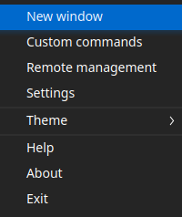

### Ventana dividida ###

1. Abra la Terminal en el Lanzador.
2. En la interfaz de Terminal, haga clic con el botón derecho para:

- Seleccionar **División vertical** para dividir la interfaz en columnas izquierda y derecha.

- Seleccionar **División horizontal** para dividir la interfaz en filas superior e inferior.

3. Puede introducir comandos en cada ventana de terminal y ver los resultados de la ejecución de diferentes comandos en diferentes ventanas simultáneamente.

> Consejo: También puede pulsar **Ctrl **+ **Shift** +**J** en el teclado para dividir las ventanas verticalmente, y pulsar **Ctrl** + **Shift** + **H** para dividirlas horizontalmente.

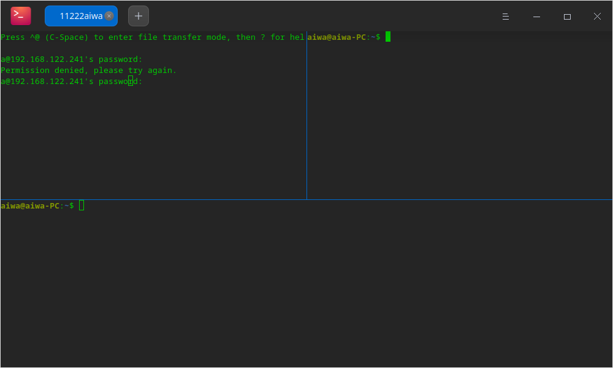

### Mostrar la ventana en pantalla completa ###

1. Abra la Terminal en la interfaz del Lanzador.

2. Pulse **F11** para mostrar la Terminal en pantalla completa.

3. Si quiere volver a la pantalla normal, pulse **F11**.

> Nota: También puede hacer clic con el botón derecho para seleccionar **Pantalla completa** o **Salir de la pantalla completa** en la interfaz de la Terminal.

### Cerrar espacio de trabajo

Puede cerrar múltiples espacios de trabajo divididos en los siguientes pasos:

1. En la interfaz de la Terminal, mueva el cursor sobre uno de los espacios de trabajo divididos.

2. Haga clic con el botón derecho del ratón para:

- Seleccionar **Cerrar espacio de trabajo** para cerrar este espacio de trabajo dividido.

- Seleccionar **Cerrar otros espacios de trabajo** para cerrar otros espacios de trabajo divididos excepto el actual.

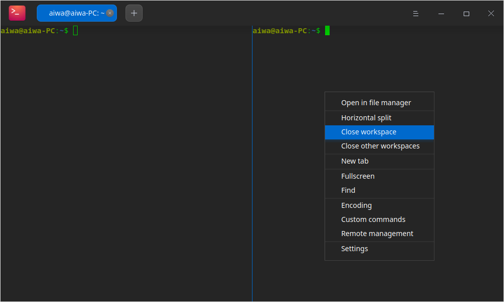

## Operaciones de pestañas

### Crear pestaña

Puede crear nuevas pestañas de la siguiente manera:

- En la interfaz de la Terminal, haga clic con el botón derecho y seleccione **Nueva pestaña** para crear una nueva pestaña.

- Haga clic en  en la parte superior para crear una pestaña.
- Pulse **Ctrl** + **Shift** + **T** en el teclado para crear una nueva pestaña.

### Cambiar/ajustar pestaña

Puede cambiar libremente entre varias pestañas mediante los siguientes métodos:

- Pulse **Ctrl** + **Tab** o desplace la rueda del ratón sobre el título de la pestaña para cambiar en secuencia.
- Pulse **Ctrl** + **Mayúsculas** + **1~9** de las teclas numéricas para seleccionar la pestaña. Si hay más de 9 pestañas, se seleccionará la última pestaña en lugar de la novena.
- Arrastre una pestaña para cambiar de secuencia en una ventana.
- Arrastre una pestaña fuera de la ventana actual para crear una nueva ventana.
- Arrastre una pestaña fuera de la ventana actual para crear una nueva ventana.

### Cerrar pestaña

Puede cerrar la pestaña de la siguiente manera:

1. Seleccione la pestaña que desea cerrar y haga clic en  .
2. Haga clic con el botón derecho en cualquier pestaña para:
- Seleccionar **Cerrar pestaña** para cerrarla.
- Seleccionar **Cerrar otras pestañas** para cerrar otras pestañas que no sean la actual.

> Consejo: Cuando sólo haya una pestaña en el espacio de trabajo, puede también hacer clic derecho y seleccionar **Cerrar espacio de trabajo** para cerrar la pestaña.

### Cambiar el nombre de la pestaña

1. En la interfaz de la Terminal, haga clic con el botón derecho en una pestaña y seleccione **Renombrar título**.

- Formato del título de la pestaña: Seleccione un formato en la lista desplegable **Insertar** y podrá personalizar el título de la pestaña actual según sea necesario.

- Formato del título de la pestaña remota: Seleccione un formato en la lista desplegable **Insertar** y podrá personalizar el título de la pestaña remota según sea necesario.

2. Haga clic en **Confirmar**.

> Consejo: También puede pulsar **F2** para cambiar el nombre del título de la ventana.

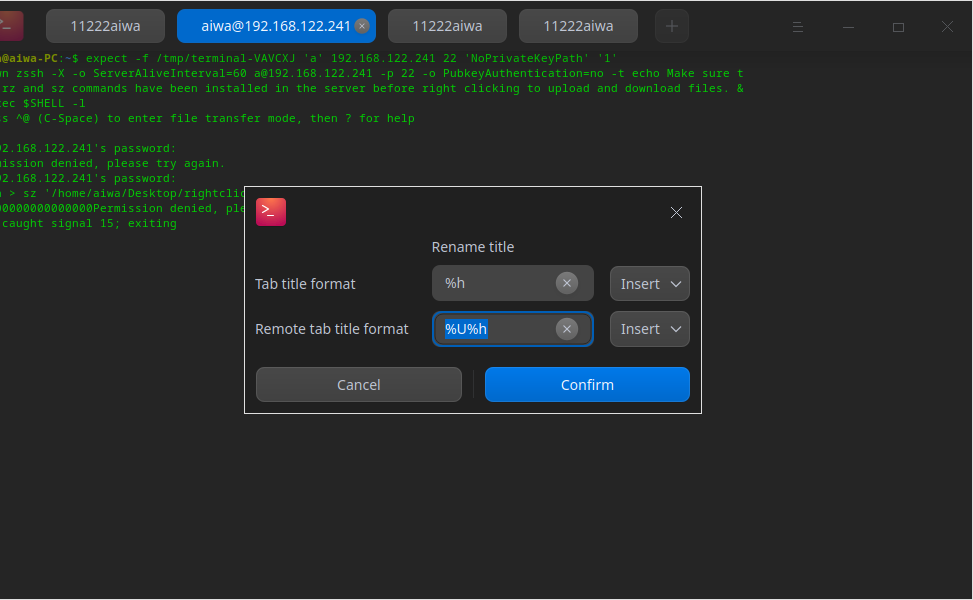

## Conexión remota del servidor

Puede abrir el panel de gestión remota para añadir servidores remotos a través del menú principal o del menú del botón derecho. El panel de gestión remota se ocultará automáticamente cuando se ajuste el tamaño de la ventana. Una vez que un servidor remoto se añade a la lista de gestión, puede iniciar sesión automáticamente con un solo clic. 

### Añadir servidor

1. En la interfaz de la Terminal, haga clic en > **Conexión remota**.
2. Haga clic en **Añadir servidor** y se mostrará un cuadro emergente.
3. Rellene **Nombre del servidor**, **Dirección**, **Nombre de usuario** y **Contraseña**.
4. Haga clic en **Añadir**.

 > Nota: Si necesita configurar más parámetros, haga clic en **Opciones avanzadas**. O bien, puede mantener los valores por defecto y editarlos cuando lo necesite.

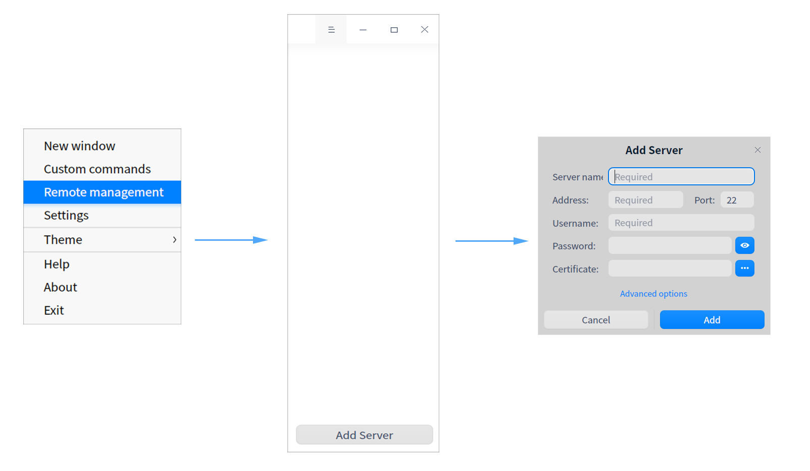

### Editar Servidor

1. En la interfaz de conexión remota, haga clic en  en el servidor.
2. Edite la información del servidor según sea necesario.
3. Haga clic en **Guardar**.

> Nota: Para una mejor identificación y uso, también puede personalizar el nombre del servidor.

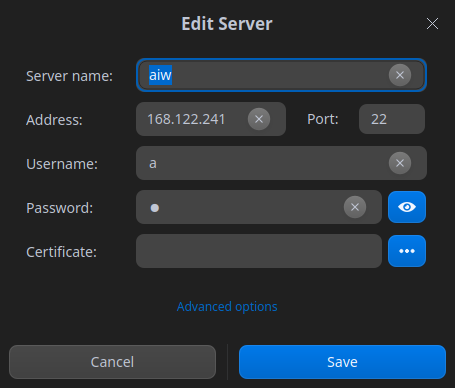

### Añadir servidores al grupo

Al establecer un grupo para un servidor, éste se añadirá en el grupo correspondiente y se mostrará en el panel de gestión remota de la derecha.

1. En la interfaz del terminal, haga clic en el icono **Añadir servidor** para abrir el diálogo homónimo o haga clic en el icono junto a un servidor existente para abrir el diálogo Añadir servidor.
2. Haga clic en **Opciones avanzadas**.
3. Introduzca la información del **Grupo**.
4. Haga clic en **Guardar**.

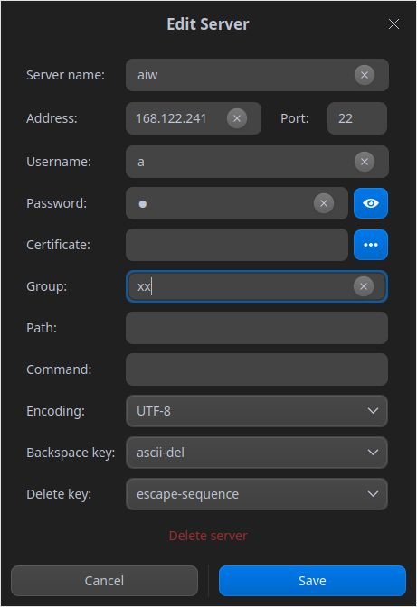

### Búsqueda de servidores

Cuando hay varios servidores o grupos, el cuadro de búsqueda se mostrará en la parte superior, para que pueda buscar rápidamente en todos los servidores.

1. En la interfaz de la Terminal, haga clic con el botón derecho del ratón y seleccione **Gestión remota**. 
3. Introduzca las palabras clave y pulse **Intro**.
4. Se mostrarán los resultados de la búsqueda.

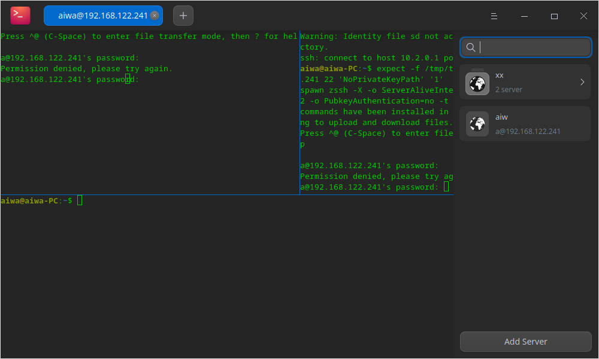

### Subir/Descargar archivo 

Puede cargar y descargar archivos después de iniciar sesión en un servidor remoto.

#### Subir archivos

1. En el panel de Conexión remota, seleccione un servidor para iniciar la sesión.
2. En la interfaz de la Terminal, haga clic con el botón derecho del ratón para seleccionar **Subir archivo**.
3. Seleccione el archivo a cargar en la ventana emergente.
4. Haga clic en **Subir** y el archivo se cargará en el servidor remoto.

> Consejo: Puede arrastrar el archivo directamente a la interfaz del terminal para cargarlo después de conectarse al servidor remoto.

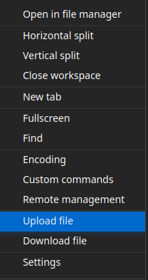

#### Descargar archivos

1. En el panel de Conexión remota, seleccione un servidor para iniciar la sesión.
2. En la interfaz de la Terminal, haga clic con el botón derecho del ratón para seleccionar **Descargar archivo**.
3. Seleccione la ubicación de almacenamiento.
4. Introduzca la ruta del archivo a descargar. El archivo se descargará en la ubicación especificada.

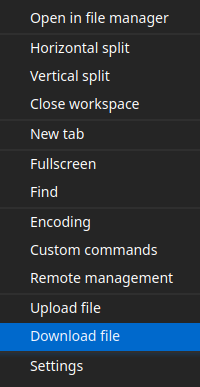

### Borrar servidor ###

1. Acceda a la interfaz **Editar servidor**.
2. Haga clic en **Opciones avanzadas**.
3. Seleccione **Borrar servidor**.
4. Haga clic en **Borrar** en la ventana emergente para confirmar.

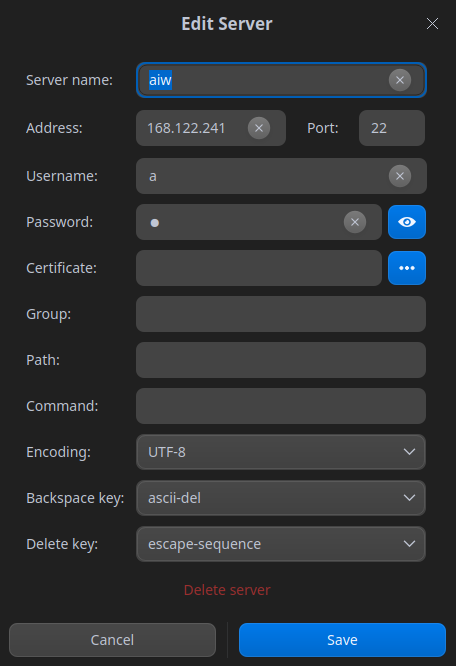

## Menú principal

En el Menú Principal, puede [crear una nueva ventana](#Crear nueva ventana), personalizar los comandos, cambiar de tema, ver el manual de ayuda y obtener más información sobre Album.

## Tema ###

El tema de la ventana ofrece múltiples temas.

1. En la interfaz de la Terminal, haga clic en .
2. Haga clic en **Tema** para elegir un tema.

### Comandos personalizados

1. En la interfaz de la Terminal, haga clic en .

2. Seleccione **Comandos personalizados**.

3. Seleccione **Añadir comando**.

4. Introduzca el **Nombre**, el **Comando** y los **Atajos**.

5. Haga clic en **Añadir**.

### Ajustes

#### Ajustes básicos

1. En la interfaz de la Terminal, haga clic en **Ajustes**.

2. En las opciones **Básicas**, puede:

 - Establecer **Opacidad** para el fondo.
 > Nota: si el Efecto Ventana está desactivado en el Centro de Control, la **Opacidad** de la barra de desplazamiento no aparecerá.

 - Establezca el tipo y el tamaño de la fuente.

 Haga clic en el icono "+" o "-" o desplace la rueda del ratón en el cuadro de edición del tamaño de la fuente para ajustar el tamaño de la misma.

3. En las opciones de **Títulos de las pestañas**, puede establecer el nombre de todas las pestañas y de las pestañas remotas del terminal.

#### Ajustes de los atajos de teclado

1.  En la interfaz de la Terminal, haga clic en > **Ajustes**.

2. En las opciones de **Atajo de teclado**, puede:

  - Modificar los atajos: Hacer clic en los atajos a modificar e introducir nuevos accesos directos a través del teclado en el cuadro de entrada editable.

  - Desactivar los atajos: Haga clic en los atajos a modificar y el cuadro de entrada será editable.  Pulse **Retroceso** en el teclado para desactivar el acceso directo.

#### Ajustes avanzados ####

1. En la interfaz de la Terminal, haga clic en > **Ajustes**.

2. En las opciones **Avanzados**, puede:

  - Establecer el estilo del cursor.
  - Activar o desactivar el **parpadeo del cursor**.
  - Activar o desactivar **Copiar al seleccionar**.
  - Activar o desactivar el **Desplazamiento al pulsar una tecla**.
  - Activar o desactivar **Desplazamiento en la salida**.
  - Configurar el modo de inicio de la ventana .
  - Habilitar o deshabilitar **Ocultar la ventana después de perder el foco**.
  - Activar o desactivar **Desenfocar el fondo**.
   >Notas: si el Efecto Ventana está desactivado en el Centro de Control, la opción **Desenfocar fondo** estará oculta.

  - Activar o desactivar el control de flujo mediante **Ctrl** + **S** y **Ctrl** + **Q**
  - **Restablecer los valores predeterminados**: Haga clic en este botón para restaurar todos los ajustes por defecto.  

### Ayuda

1. En la interfaz de la Terminal, haga clic en .
2. Haga clic en **Ayuda** para ver el manual de Terminal.

### Acerca de

1. En la interfaz de la Terminal, haga clic en .

2. Haga clic en **Acerca de** para ver la versión y la introducción de Terminal.

### Salir

1. En la interfaz de la Terminal, haga clic en .

2. Haga clic en **Salir** para salir de la Terminal.
