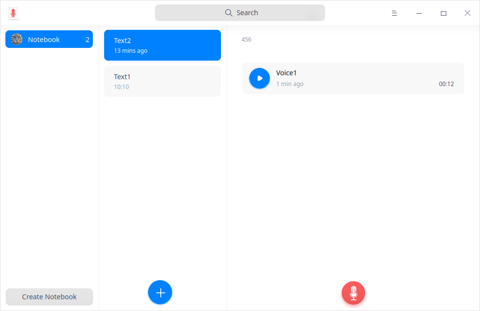
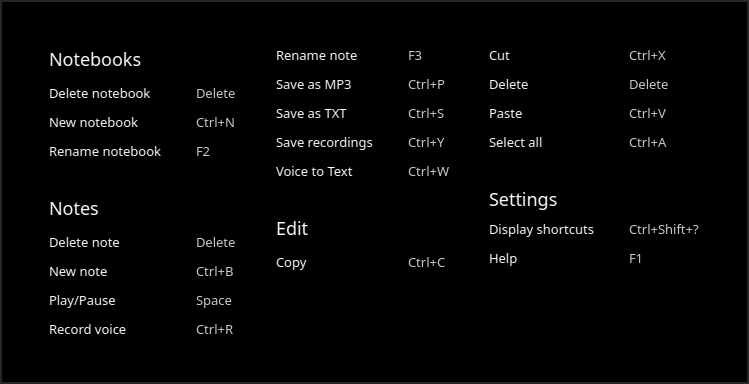
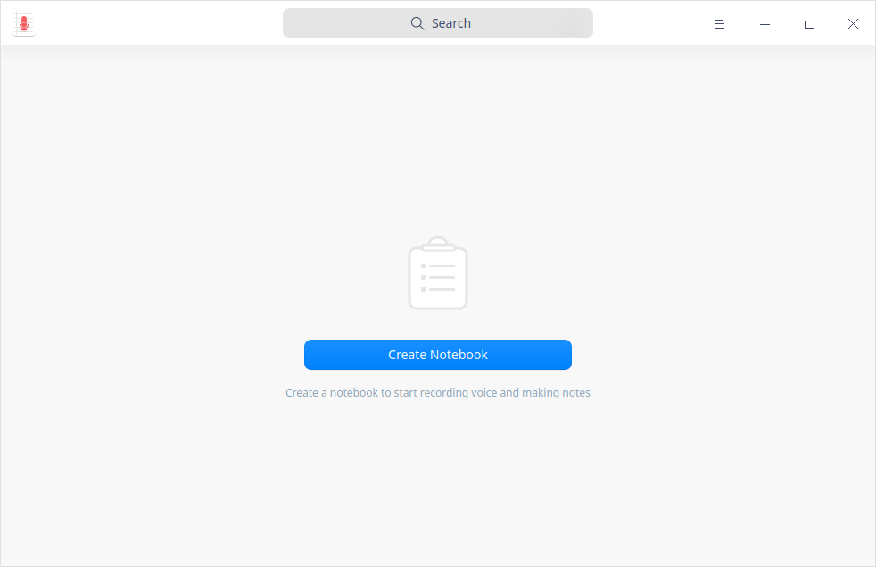
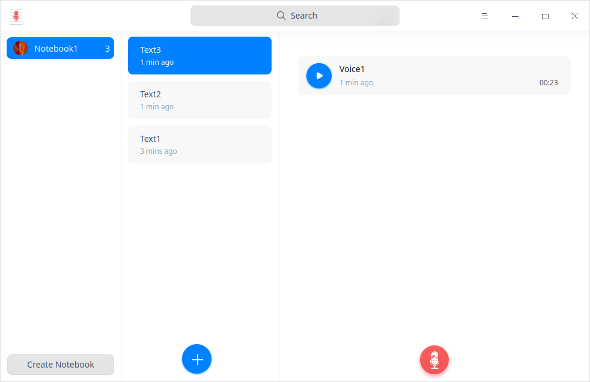
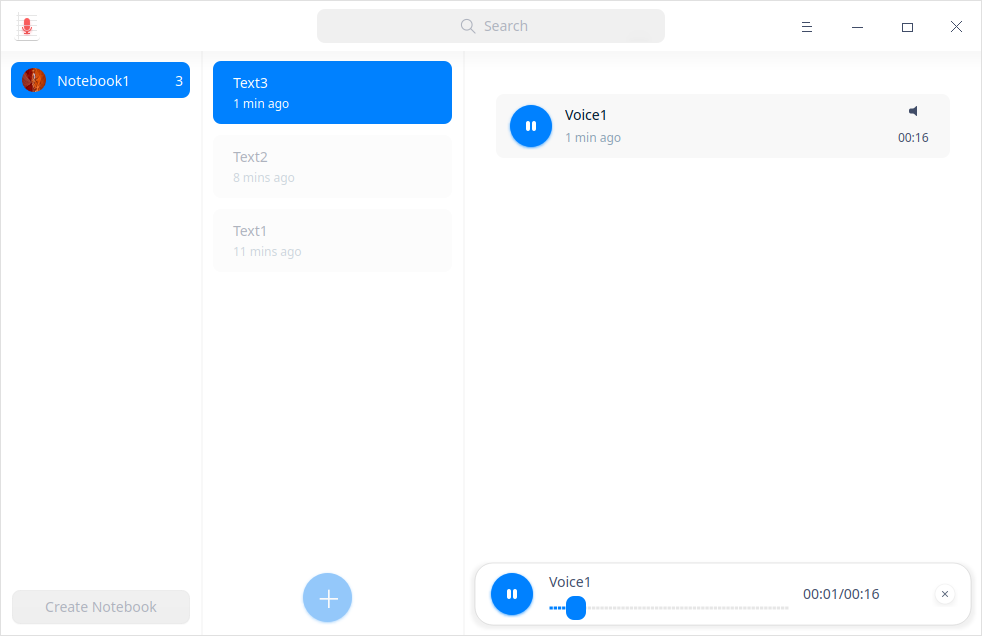
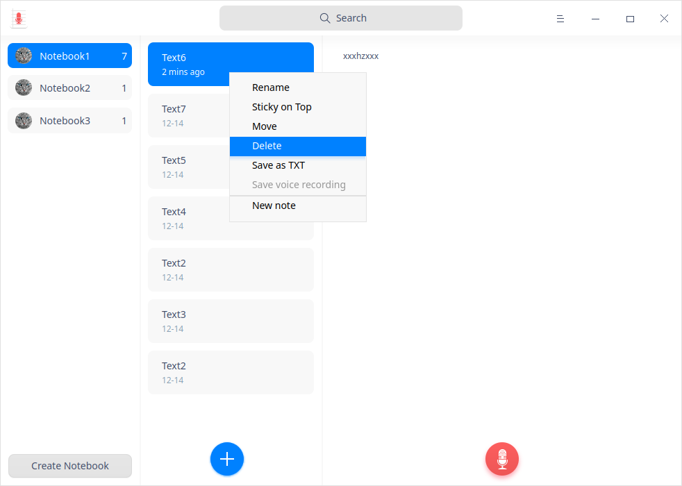
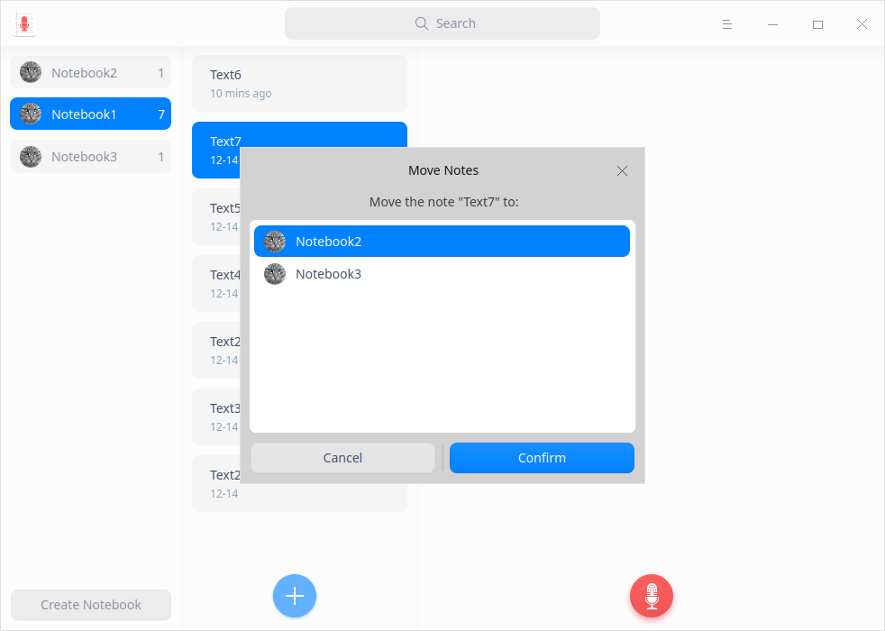
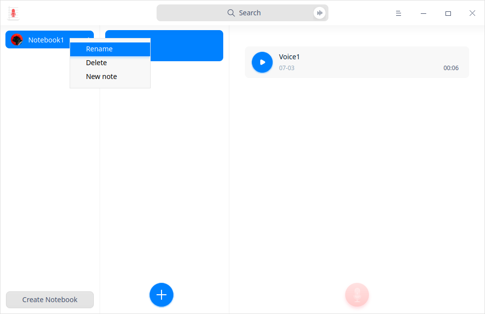
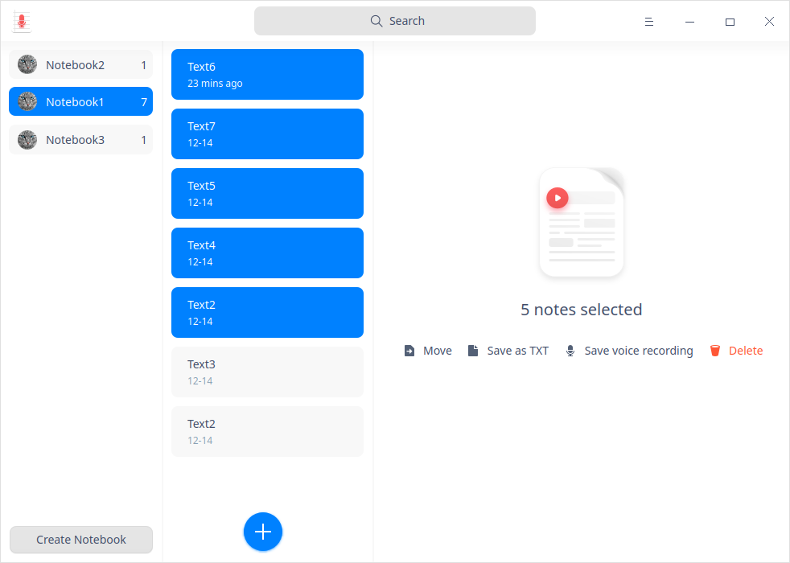

# Notas de voz|../common/deepin-voice-note.svg|

## Descripción

Notas de voz es un sencillo programa de notas basadas en textos y grabaciones de voz. 

## Guía

Puede ejecutar, salir o crear un acceso directo a Notas de voz de las siguientes maneras.

### Ejecutar Notas de voz

1.  Haga clic en  en el muelle para entrar en la interfaz del Lanzador.
2.  Localice  desplazando la rueda del ratón o buscando "notas de voz" en la interfaz del Lanzador y haga clic en él para ejecutarlo.
3.  Haga clic con el botón derecho del ratón en  y podrá:

   - Hacer clic en **Enviar al escritorio** para crear un acceso directo al escritorio.
   - Hacer clic en **Enviar al muelle** para fijarlo en el Muelle.
   - Hacer clic en **Añadir al arranque** para añadir la aplicación al inicio y que se ejecute automáticamente cuando se inicie el sistema.

   > Nota: Si Notas de voz se ha fijado en el muelle por defecto, puede hacer clic en  en el muelle para ejecutarlo.

   ### Salir de Notas de voz

   - Haga clic en  en la interfaz de Notas de voz para salir de Notas de voz.
   - Haz clic con el botón derecho del ratón en  en el muelle y selecciona **Cerrar todo** para salir.
   - Haga clic en  en la interfaz de Notas de voz y seleccione **Salir** para cerrar.

   ### Ver atajos de teclado

   En la interfaz de Notas de voz, pulsa **Ctrl** + **Shift** + **?** en el teclado para ver los atajos. El dominio de los atajos mejorará enormemente tu eficacia.

    

   ## Operaciones

   ### Crear cuaderno

   - Haga clic en **Crear cuaderno** para crear uno nuevo en caso que Notas de voz no lleve ninguno.

   

   &nbsp;&nbsp;&nbsp;&nbsp;&nbsp;&nbsp;&nbsp;&nbsp;&nbsp;&nbsp;&nbsp;&nbsp;&nbsp;

   - Cuando se crea un cuaderno en Notas de voz, también se crea un texto por defecto. Haga clic en el icono  de la interfaz de Notas de voz para crear más textos nuevos.

     Puede empezar a grabar voces o a crear textos después de crear un texto.
     
      En la lista de cuadernos, puede arrastrar un cuaderno para establecer la secuencia de visualización y ver el número de textos que contiene cada libreta.

### Grabar/Reproducir Notas de voz

Puede grabar audios de forma sencilla en dos pasos:

1. Haga clic en el icono  de la interfaz de Notas de voz para iniciar la grabación.
2.  Después, clic en el icono  para terminar la grabación.

> Consejo: Haga clic en el icono  para pausar la grabación durante el proceso y vuelva a hacer clic en  para reanudarla.

> Notas: El tiempo máximo de grabación es de 60 minutos. 

3. Haga clic en el icono  para escuchar la reproducción una vez finalizada la grabación.

### Buscar notas de voz

1. En el cuadro de búsqueda situado en la zona superior central de la interfaz de Notas de voz, puede:

   - Hacer clic en  para introducir palabras clave.

2. Pulsar la tecla **Intro** del teclado para realizar una búsqueda rápida.

   - Cuando haya información coincidente, la lista de resultados de la búsqueda se mostrará a la derecha.

   - Cuando no haya información coincidente, se mostrará a la derecha **Sin resultados de búsqueda**.

3. Haga clic en  en el cuadro de búsqueda para borrar las palabras clave actuales o cancelar la búsqueda. 

### Guardar la grabación de voz

1.   Seleccione un archivo de voz en la interfaz de Notas de voz.
2.   Haga clic con el botón derecho y seleccione **Guardar grabación de voz**.
3.   Guárdela en el dispositivo de almacenamiento.

>Consejos: También puede hacer clic con el botón derecho en el archivo de voz y seleccionar **Guardar como MP3** para guardarlo.

### Añadir notas de texto
1. Seleccione una libreta, haga clic con el botón derecho y seleccione **Nueva nota** o haga clic en el icono  de la interfaz de Notas de voz para añadir una nueva nota de texto.
2.  Mueva el cursor a la columna de la derecha y haga clic para introducir el texto necesario. 

> Consejos: 
>
> - Puede grabar audios en los cuadernos. Consulte [Grabar/Reproducir notas de voz](#Grabar/Reproducir notas de voz) para obtener más detalles.
> - Seleccione una nota de texto en la lista de libretas y haga clic con el botón derecho para seleccionar **Fija arriba** para colocar la nota de texto en la parte superior.

### Guardar como archivo TXT

1.  Seleccione una nota de texto en la interfaz de Notas de voz.
2.  Haga clic con el botón derecho y seleccione **Guardar como TXT**.
3.  Guarde la nota de texto en el dispositivo de almacenamiento en formato TXT.
    

### Mover notas de texto

1. Seleccione una nota de texto en la interfaz de Notas de voz.
2. Haga clic con el botón derecho del ratón para seleccionar **Mover** y seleccione una libreta en el cuadro emergente.
3. 3. Haga clic en **Confirmar** y mueva la nota de texto a la libreta seleccionada.

### Cambiar el nombre de los cuadernos

El cuadernos creado se guardará automáticamente como **Cuaderno(n)**. Puede cambiar su nombre en los siguientes pasos. 

1. En la interfaz de Notas de voz, haga clic con el botón derecho en una libreta.

2. Seleccione **Renombrar**.

3. Introduzca el nombre del archivo.

4. Haga clic en el área en blanco de la interfaz o pulse la tecla **Intro** del teclado para cambiar el nombre.

   > Consejo: También puede cambiar el nombre de cada nota de texto de una libreta. 

### Borrar notas de voz

1.  Seleccione un archivo de voz en la interfaz de Notas de voz.
2.  Haga clic con el botón derecho y seleccione **Borrar**.

3.  Haga clic en **Confirmar** en el cuadro emergente.

### Borrar notas de texto

1.   Seleccione una nota de texto en la interfaz de Notas de voz.
2.  Haga clic con el botón derecho y seleccione **Borrar**.

3.  Haga clic en **Confirmar** en el cuadro emergente.

### Borrar cuadernos

1. Seleccione un cuaderno en la interfaz de Notas de voz.
2. Haga clic con el botón derecho y seleccione **Borrar**.
3. Haga clic en **Confirmar** en el cuadro de aviso emergente.

### Operación por lotes

Puede seleccionar varias notas de texto a la vez con la ayuda del teclado para realizar operaciones por lotes.

1. Pulse **Ctrl/Shift** para seleccionar varias notas de texto en la lista de notas de texto.
2. Haga clic con el botón derecho del ratón para seleccionar o haga clic en **Mover**/ **Guardar como texto**/ **Guardar grabación de voz**/**Borrar** para realizar operaciones por lotes.

### Operación por lotes

Puede seleccionar varias notas de texto a la vez con la ayuda del teclado para realizar operaciones por lotes.

1. Pulse **Ctrl/Mayúsculas** para seleccionar varias notas de texto en la lista de notas de texto.
2. Haga clic con el botón derecho del ratón para seleccionar o haga clic en **Mover**/ **Guardar como TXT**/ **Guardar grabación de voz**/**Borrar** para realizar operaciones por lotes.

## Menú principal

En el menú principal, puede configurar la fuente de audio, comprobar la política de privacidad, cambiar los temas de las ventanas, ver el manual de ayuda y obtener más información sobre Voice Notes.

### Ajustes

Puede configurar la fuente de audio desde las opciones **Interna** y **Micrófono**.

1. En la interfaz de Notas de voz, haga clic en .
2. Configure la fuente de audio:
   - Seleccione **Fuente interna** y sólo se grabará el sonido integrado en el sistema. 
   - Seleccione **Fuente de micrófono** y sólo se grabará el sonido del micrófono. 

### Tema

El tema de la ventana ofrece tres tipos de temas, a saber, claro, oscuro y sistema.

1. En la interfaz de Notas de voz, haga clic en .
2. Haga clic en **Tema** para seleccionar un tema.

### Ayuda

Consulte la ayuda para obtener más información sobre Notas de voz.

1.  En la interfaz de Voice Notes, haga clic en .
2.  Haga clic en **Ayuda** para ver el manual de Notas de voz.

### Acerca de

1.  En la interfaz de Voice Notes, haga clic en . 
2.  Haga clic en **About** para ver la versión y la introducción de Notas de voz.

### Salir

1. En la interfaz de Voice Notes, haga clic en .
2.  Haga clic en **Salir** para salir de Notas de voz.