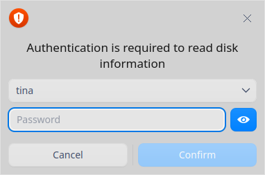
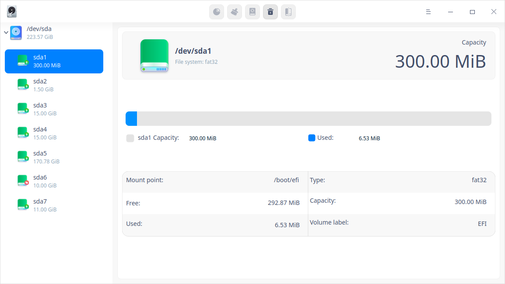
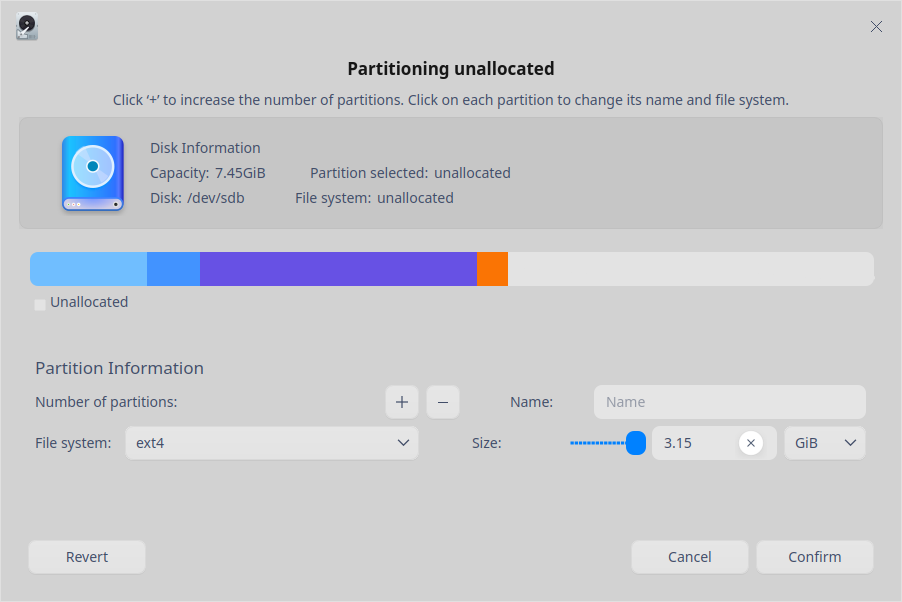
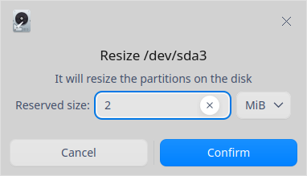
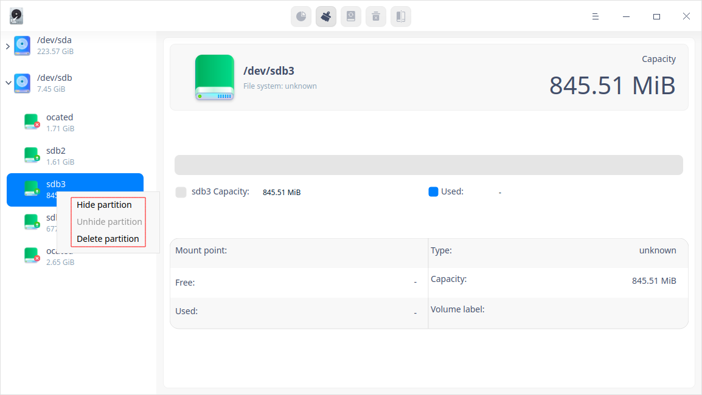
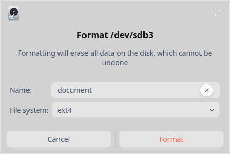
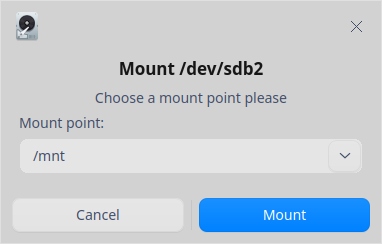
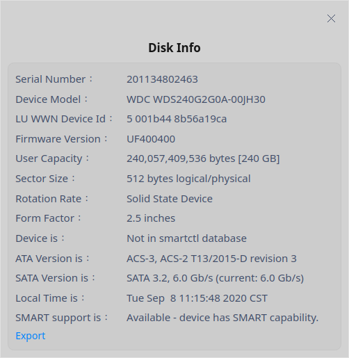
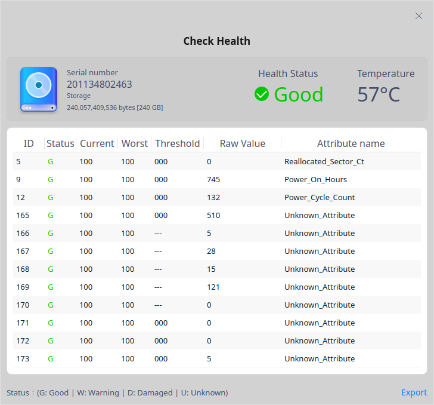

# Administrador de discos|../common/disk-manager.svg|

## Descripción

Administrador de discos es una herramienta útil para ayudarle a gestionar mejor sus discos a través de la partición de discos, la administración de los datos del disco, y la gestión de la salud. 

## Guía

Puede ejecutar, cerrar y crear accesos directos para el Administrador de discos de las siguientes maneras.

### Ejecutar el Administrador de discos

1. Haga clic en  en el Muelle y entre en la interfaz del Lanzador.
2. Localice  desplazando la rueda del ratón o buscando "administrador de disco" en la interfaz del Lanzador y haga clic en él para ejecutarlo. Aparece un cuadro de autenticación. Introduzca la contraseña para la autenticación. 

   

3. Haga clic derecho en  para que:

 - Haga clic en **Enviar al escritorio** para crear un acceso directo al escritorio.
 - Haga clic en **Enviar al muelle** para fijar la aplicación en el muelle.
 - Haga clic en **Añadir al arranque** para añadir la aplicación al inicio y que se ejecute automáticamente cuando se inicie el sistema.

### Salir del Administrador de discos

- En la interfaz del Administrador de discos, haga clic en para salir del Administrador de discos.
- Haga clic con el botón derecho del ratón en  en el muelle y seleccione **Cerrar todo** para salir del Administrador de discos.
- En la interfaz del Administrador de discos, haga clic en  y seleccione **Salir** para salir del Administrador de discos.

## Particionamiento de discos

En la interfaz del Administrador de discos, se muestra una lista de discos e información sobre las particiones relevantes, incluyendo el formato, la capacidad y los puntos de montaje de las particiones. Puede crear, redimensionar, formatear, montar y desmontar una partición.

### Crear una partición

1. En la interfaz del Administrador de discos, seleccione una partición no asignada y haga clic en el icono de la partición  en la barra de herramientas superior.
2. Aparecerá un diálogo de confirmación. Haga clic en **Confirmar** para entrar en la interfaz de partición no asignada, donde puede comprobar el tamaño, el nombre y el sistema de archivos de esta partición, y leer la información del disco donde se encuentra esta partición. 
3. En el área de información de la partición, rellene el nombre y el tamaño de la partición, seleccione el sistema de archivos de la partición, y haga clic en el icono . También puede crear múltiples particiones, y el nombre de cada partición se mostrará en el gráfico de barras bajo la información del disco. Puede eliminar una partición haciendo clic en el icono  cuando esté creando una nueva partición.

&nbsp;&nbsp;&nbsp;&nbsp;&nbsp;&nbsp;&nbsp;&nbsp;&nbsp;&nbsp;&nbsp;&nbsp;&nbsp;

>  Atención: Se puede crear hasta 24 particiones. Para crear una partición, necesitas un espacio de almacenamiento de al menos 52 MB. 

4. Después de la configuración, haga clic en **Confirmar**. La partición recién creada se mostrará bajo el disco correspondiente. 
5. La nueva partición se formateará automáticamente al crearla. Puede utilizar la partición recién creada después de montarla. Por favor, consulte [Montar una partición](#Montar una partición) para obtener información detallada.

>  Atención: Si la partición se crea en un dispositivo portátil, como una unidad flash USB, esta partición se montará automáticamente en el directorio /media/... cuando se vuelva a conectar. Por lo tanto, no es necesario montar manualmente el dispositivo.

### Redimensionar una partición

Puede redimensionar una partición si el tamaño es demasiado pequeño. Tenga en cuenta que sólo puede redimensionar una partición no montada.

1. En la interfaz del Administrador de discos, seleccione una partición no montada y haga clic en el icono  de la barra de herramientas superior.
2. Aparece una interfaz de redimensionamiento. Introduzca el tamaño reservado y haga clic en **Confirmar**. 

&nbsp;&nbsp;&nbsp;&nbsp;&nbsp;&nbsp;&nbsp;&nbsp;&nbsp;&nbsp;&nbsp;&nbsp;&nbsp;

3. Puede comprobar la capacidad de la partición una vez redimensionada.

### Ocultar una Partición

Después de ocultar una partición, no se mostrará en la interfaz del ordenador. Sin embargo, se mostrará en la interfaz del Administrador de discos. Los documentos guardados en la partición oculta no se perderán, pero no se podrá acceder a ellos normalmente.

Tenga en cuenta que sólo puede ocultar una partición no montada. Además, que no se puede ocultar la partición del sistema. 

1. En la interfaz del Administrador de discos, seleccione una partición y haga clic con el botón derecho en ella. 
2. Seleccione **Ocultar partición** y aparecerá un diálogo de confirmación. Haga clic en **Ocultar** y el icono de esta partición cambiará al estado oculto. 

### Mostrar una partición

1. En la interfaz del Administrador de discos, seleccione una partición oculta y haga clic con el botón derecho en ella. 
2. Seleccione **Mostrar partición** y aparecerá un diálogo de confirmación. Haga clic en **Mostrar** y el icono de esta partición cambiará al estado de desocultar. 
3. Una vez que la partición se desoculta, se desmonta automáticamente. Por favor, monte manualmente la partición para su uso normal. 

## Administración de datos del disco

### Formatear una partición

El formateo una partición se ejecuta normalmente para modificar el formato de las particiones, y borrará todos los datos del disco. Por favor, proceda con precaución ya que esta acción es irreversible. 

Tenga en cuenta que sólo puede formatear una partición no montada que no esté en uso actualmente.

1. En la interfaz del Administrador de discos, seleccione una partición y haga clic en el icono Formatear  de la barra de herramientas superior.
2. Aparecerá una interfaz para formateo. Introduzca el nombre y seleccione el sistema de archivos. 

&nbsp;&nbsp;&nbsp;&nbsp;&nbsp;&nbsp;&nbsp;&nbsp;&nbsp;&nbsp;&nbsp;&nbsp;&nbsp;
3. Haga clic en **Formatear** para confirmar. 

### Montar una partición

1. En la interfaz del Administrador de discos, seleccione una partición no montada y haga clic en el icono Montar  de la barra de herramientas superior.
2. Aparece una interfaz de montaje. Seleccione o cree un punto de montaje y haga clic en **Montar** para confirmar.

&nbsp;&nbsp;&nbsp;&nbsp;&nbsp;&nbsp;&nbsp;&nbsp;&nbsp;&nbsp;&nbsp;&nbsp;&nbsp;
>  Atención: Una partición puede ser montada en un directorio existente y dicho directorio puede no estar vacío. Sin embargo, una vez montada, todos los archivos y contenidos anteriores bajo este directorio no estarán disponibles. Por favor, proceda con precaución. 

### Desmontar una partición

Si quiere cambiar el punto de montaje de una partición, puede desmontarla primero y luego montarla de nuevo.

1. En la interfaz del Administrador de discos, seleccione una partición y haga clic en el icono Desmontar  de la barra de herramientas superior.
2. Aparece un diálogo de confirmación. Haga clic en **Desmontar** si confirma que no hay programas ejecutándose en la partición. 

### Borrar una partición

Una vez eliminada una partición, perderá todos los datos que contenga. Por favor, proceda con precaución.

Tenga en cuenta que sólo puede borrar una partición desmontada.

1. En la interfaz del Administrador de discos, seleccione una partición y haga clic con el botón derecho en ella. 
2. Seleccione **Borrar partición** y aparecerá un diálogo de confirmación. 3. Haga clic en **Borrar**, y esta partición desaparecerá bajo el disco correspondiente.

## Gestión del estado de los discos

### Comprobar la información del disco

1. En la interfaz del Administrador de discos, seleccione un disco. Haga clic con el botón derecho y seleccione **Información del disco**.
2. Puede comprobar el número de serie, el modelo del dispositivo, la capacidad del usuario y la tasa de rotación del disco.

&nbsp;&nbsp;&nbsp;&nbsp;&nbsp;&nbsp;&nbsp;&nbsp;&nbsp;&nbsp;&nbsp;&nbsp;&nbsp;
3. Haga clic en **Exportar** para exportar la información del disco a la carpeta designada. 

### Ejecutar la administración de la salud

1. En la interfaz del Administrador de discos, seleccione un disco. Haga clic con el botón derecho y seleccione **Administración de salud** > **Comprobar la salud**. 
2. Puede comprobar el estado de salud, la temperatura actual y el estado de diferentes atributos del disco.

&nbsp;&nbsp;&nbsp;&nbsp;&nbsp;&nbsp;&nbsp;&nbsp;&nbsp;&nbsp;&nbsp;&nbsp;&nbsp;
3. Haga clic en **Exportar** para exportar los resultados de la comprobación de la salud del disco a su carpeta designada. 

### Revisar error de tabla de particiones

1. En la interfaz del Administrador de discos, seleccione un disco. Haga clic con el botón derecho y seleccione **Gestión de la salud** > **Comprobar error de tabla de particiones**. 

2. Si no hay ningún error en la tabla de particiones, aparecerá un aviso de **No se encontraron errores en la tabla de particiones**; si se encuentra un error en la tabla de particiones, aparecerá un informe de **Errores en la tabla de particiones**. Puede solucionar el problema según el informe. 

## Menú principal

En el menú principal, puede cambiar los temas de las ventanas, ver el manual de ayuda y obtener más información sobre el Administrador de discos.

### Tema

El tema de la ventana ofrece tres tipos de temas, a saber, Claro, Oscuro y  Sistema.

1.  En la interfaz del Administrador de discos, haga clic en .
2.  Haga clic en **Tema** para elegir un tema.

### Ayuda

1.  En la interfaz del Administrador de discos, haga clic en .
2.  Haga clic en **Ayuda** para ver el manual del Administrador de discos.

### Acerca de

1.  En la interfaz del Administrador de discos, haga clic en .
2.  Haga clic en **Acerca de** para ver la versión y la introducción del Administrador de discos.

### Salir

1.  En la interfaz del Administrador de discos, haga clic en .
2.  2. Haga clic en **Salir** para salir del Administrador de discos.