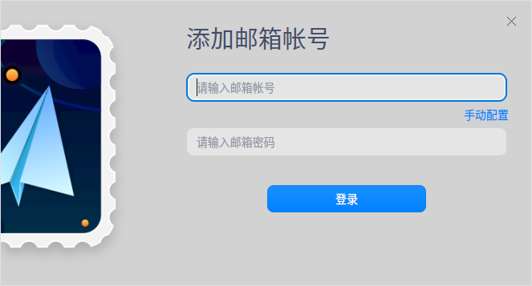
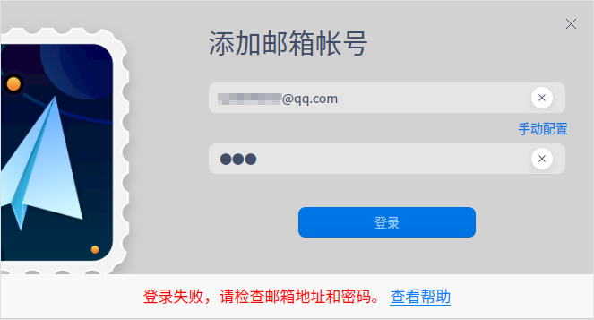
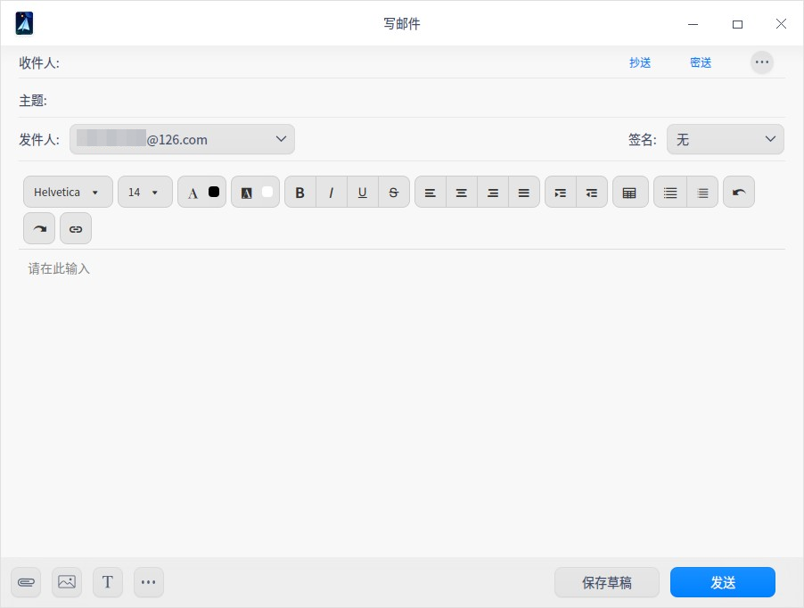
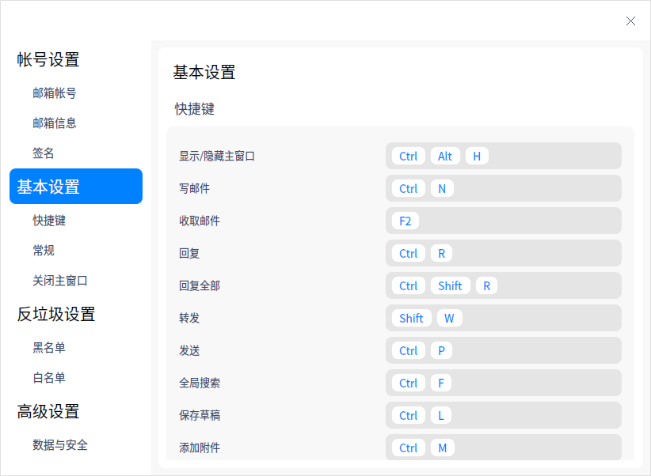
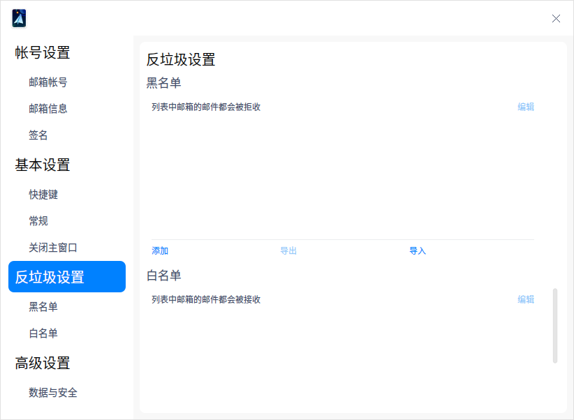
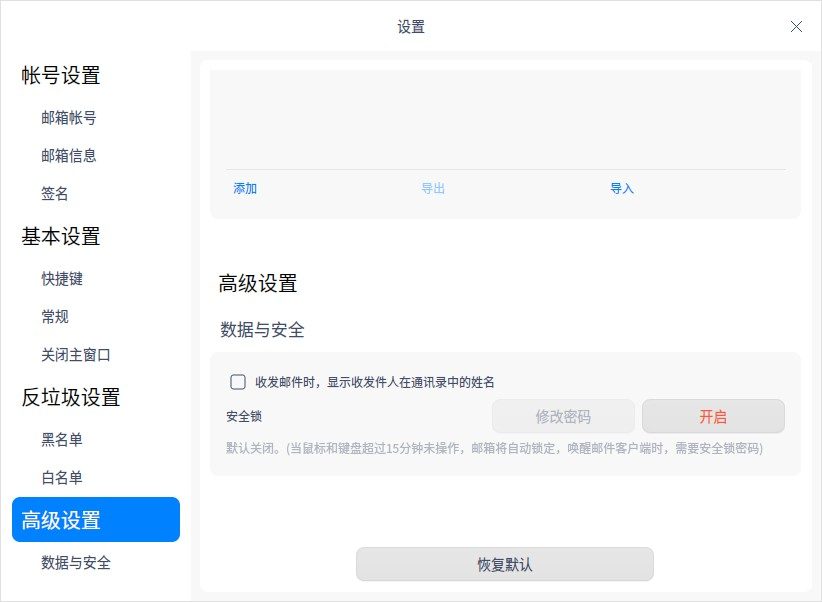

# 邮箱|../common/deepin-mail.svg|

## 概述

邮箱一款简单好用的邮件管理应用程序。支持IMAP和POP3协议，可同时管理多个邮箱帐号。

## 使用入门

您可以通过以下方式运行或关闭邮箱，或者创建快捷方式。

### 运行邮箱

1. 单击任务栏上的 进入启动器界面。
2. 上下滚动鼠标滚轮浏览或通过搜索找到邮箱按钮 ，单击打开邮箱 。
3. 右键单击，您可以：
   - 单击 **发送到桌面**，在桌面创建快捷方式。

   - 单击 **发送到任务栏**，将应用程序固定到任务栏。

   - 单击 **开机自动启动**，将应用程序添加到开机启动项，在电脑开机时自动运行该应用程序。

### 关闭邮箱

- 在邮箱主界面，单击   ，退出邮箱。
- 右键单击任务栏上的图标，选择 **关闭所有** 来退出邮箱。
- 在邮箱主界面单击  ，选择 **退出** 邮箱。

## 登录

1. 打开邮箱，在邮箱登录界面输入邮箱帐号、密码或授权码后，单击 **登录**。

   

2. 程序会自动检测输入的邮箱后缀是否在服务器数据库中：

   - 如果邮箱后缀在服务器数据库中，则可直接登录；

   - 如果邮箱后缀不在服务器数据库中，则需单击 **手动配置** 手动添加。

     
> 说明：QQ邮箱、网易邮箱（163.com及126.com）、新浪邮箱等需要开启POP3/IMAP/exchange等服务后才可以在邮箱中使用。开启服务后，服务端会产生授权码。在登录界面输入邮箱帐户及授权码即可登录邮箱。如果登录失败，单击 **查看帮助** 则可查看帮助信息。
>
> 

## 主界面

邮箱主界面由邮箱帐户、邮箱目录、邮件列表、邮件正文、写邮件、收邮件、搜索等组成。

<table class="block1">
    <caption>主界面</caption>
    <tbody>
        <tr>
            <td width="20px">1</td>
            <td width="100px">写邮件</td>
            <td>可以快速写邮件。</td>
        </tr>
        <tr>
            <td>2</td>
            <td>通讯录</td>
            <td>展示通讯录列表及联系人的信息，同时可补充联系人电话号码、地址等信息。</td>
        </tr>
         <tr>
            <td>3</td>
            <td>收邮件</td>
            <td>从服务器同步邮箱数据，包括邮件，地址簿，日历等信息。</td>
        </tr>
        <tr>
            <td>4</td>
            <td>搜索</td>
            <td>快速查找含该关键字的所有邮件。</td>
        </tr>
         <tr>
            <td>5</td>
            <td>邮箱帐户</td>
            <td>展示添加的所有邮箱帐户列表。</td>
        </tr>
        <tr>
            <td>6</td>
            <td>邮箱目录</td>
            <td>邮箱目录用于分类整理邮件数据，不同类别的邮箱目录可能不同。除了通用固定目录外，其他的就是用户个人创建的目录。</td>
        </tr>
         <tr>
            <td>7</td>
            <td>邮件列表</td>
            <td>展示邮箱目录下的所有邮件，显示内容包括：发件人、主题、摘要、发件时间及标星状态。</td>
        </tr> 
          <tr>
            <td>8</td>
            <td>邮件正文</td>
            <td>展示邮件标题、收发件人信息、时间及正文内容。</td>
        </tr> 
   </tbody>
   </table>

## 写邮件

1. 在邮箱主界面，单击写邮件按钮，进入写邮件界面。
2. 输入收件人邮箱帐号，或**单击** 从通讯录添加收件人，还可以选择抄送或密送。
3. 邮件正文支持富文本编辑，包括插入图片、链接等功能，还支持签名功能。
4. 编辑完成后，单击 **发送 **即可。

## 收邮件

收邮件是从服务器同步邮箱数据，包括邮件，地址簿，日历等信息，系统默认每15分钟同步1次邮箱数据。以下介绍两种收邮件的方式：

- 选中邮箱帐户，单击收取邮件按钮。
- 选中邮箱帐户并单击右键，选择 **收取邮件**。

## 查看邮件

1. 在邮件列表中选中邮件后，邮件正文区域展示该邮件的信息，包括邮件主题、收发件人信息、时间及正文内容。

2. 单击发件人或收件人邮箱，可查看收发件人的详细信息及往来邮件，还可以将他们添加到通讯录。

   

3. 在邮件正文区域，可以对邮件进行编辑、转发、标星、移动、删除等操作。

   

## 筛选邮件

邮件筛选功能可以帮您快速的找到需要的邮件。

1. 单击 **所有邮件**，显示筛选条件为：所有邮件、未读邮件、星标邮件、含附件及@我。

   

2. 选中后，邮件列表只显示符合条件的邮件。

   > 说明：如果需要更精确的搜索，可以直接单击输入关键字搜索邮件。 

3. 在邮件列表中可以选择单个或多个邮件。

 - 选中单个邮件：鼠标左键单击邮件即可选中单个邮件；

 - 选中多个邮件：

     - 按住 **Ctrl** 键，用鼠标左键依次单击邮件，可选中的多个邮件；

     - 用鼠标左键单击A邮件，然后按住 **shift** 键 ，再用左键单击B邮件，可选中从A到B之间的所有邮件。

## 删除邮件

删除邮件可以选择单个删除或批量删除，一般删除的邮件会存放到 **已删除** 目录，还可以选择永久删除。

### 单个删除

单个删除邮件有两种方式，删除后的邮件会存放到 **已删除** 目录。

- 在邮件列表选中邮件并单击右键，选择 **删除**。
- 在邮件正文中，单击删除按钮。

删除完后，可以在 **已删除** 目录中永久删除邮件。

### 批量删除

选中要删除的邮箱目录并单击右键，选择 **批量删除**，你可以根据时间范围，如删除一周前，一个月前的邮件等。

## 导入邮件

在邮箱目录列表中，选中邮箱目录并单击右键，选择 **导入邮件**。弹出文件管理器窗口，选择需要导入的邮件后，单击 **打开** 即可导入到指定目录。

## 导出邮件

导出邮件可以单独导出，也支持批量导出。

### 单个导出

单个导出邮件有两种方式：

- 在邮件列表选中邮件并单击右键，选择 **导出**。

- 在邮件正文中，单击更多操作按钮后，选择 **导出**。

在文件管理器中选择存储路径后单击 **保存**。

### 批量导出

选中指定的邮箱目录并单击右键，选择 **导出邮件**，弹出文件管理器窗口，选择存储路径后单击 **保存**。

## 通讯录

在邮箱主界面，单击通讯录按钮，进入通讯录界面。可查看通讯录列表及联系人的信息，同时可补充联系人电话号码、地址等信息，单击还可添加新联系人。

## 主菜单

在邮箱主菜单中，您可以进行邮箱设置、切换窗口主题，查看帮助手册等操作。

### 设置

在邮箱主界面，单击 。进入邮箱设置界面，可进行帐号设置、基本设置、反垃圾设置及高级设置。

#### 帐号设置

邮箱帐号：增加或删除邮箱帐号，单击 **添加帐号**，可继续添加新的邮箱帐号。单击 **编辑** 后，可选择删除邮箱帐号。

邮箱信息：显示发件人头像、姓名及邮箱协议，还可以更换头像及服务器设置。

签名：主要是向收件人提供更多联系信息，以及额外的品牌展示信息。您可以根据需求选择公司签名、个人签名或自定义签名。

#### 基本设置

快捷键：邮箱中常用操作的快捷键。

常规设置：邮箱开机启动、收件提醒及收件时间间隔等的基本设置。

#### 反垃圾设置

黑名单：在黑名单列表里的邮箱发过来的邮件全部拒收，可添加、导出及导入黑名单。

白名单：在白名单列表里的邮箱发过来的邮件全部接收，可添加、导出及导入白名单。

#### 高级设置

基于邮箱数据安全考虑，建议开启安全锁，设置开启密码。当鼠标和键盘超过15分钟未操作，邮箱将自动锁定，唤醒时需要输入开启密码。

#### 恢复默认

单击 **恢复默认** ，可恢复当前页面为默认设置。

### 主题

窗口主题包含浅色主题、深色主题和系统主题，其中系统主题为默认设置。

1. 在邮箱主界面，单击。
2. 单击 **主题**，选择一个主题颜色。

### 帮助

1. 在邮箱主界面，单击 。
2. 单击 **帮助** ，查看关于邮箱的帮助手册，让您进一步了解和使用邮箱。

### 关于

1. 在邮箱主界面，单击 。
2. 单击 **关于**，查看关于邮箱的版本和介绍。

### 退出

1. 在邮箱主界面，单击 。
2. 单击 **退出**。

文档更新时间: 2020-12-24 版本: 5.1

