# 文件管理器|../common/deepin-file-manager.svg|

## 概述

文件管理器是一款功能强大、简单易用的文件管理工具。它沿用了传统文件管理器的经典功能和布局，并在此基础上简化了用户操作，增加了很多特色功能。一目了然的导航栏、智能识别的搜索框、多样化的视图及排序让您管理起来得心应手，经典和超越，只为给您更好的体验！

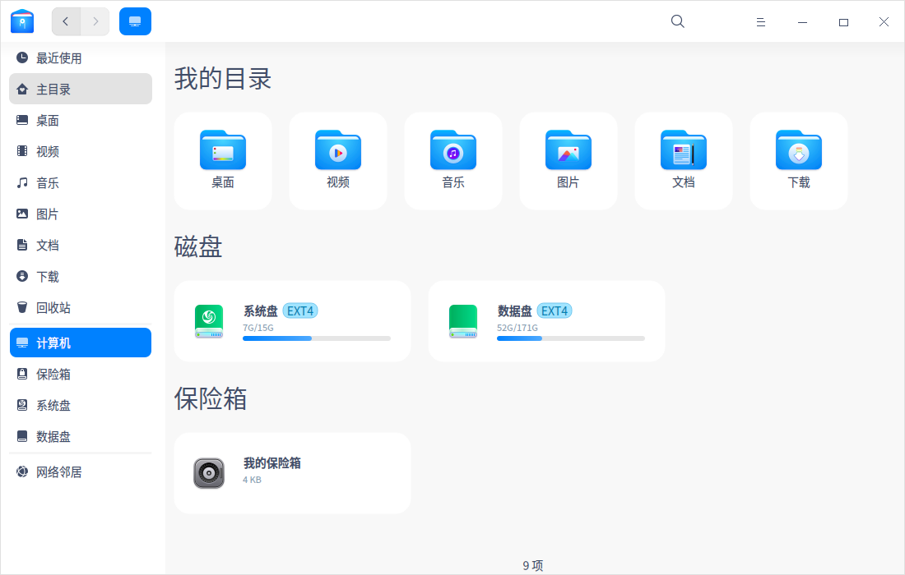

## 使用入门

通过以下方式运行或关闭文件管理器，或者创建文件管理器的快捷方式。

### 运行文件管理器

1. 单击桌面底部的 ，进入启动器界面。
2. 上下滚动鼠标滚轮浏览或通过搜索找到文件管理器，单击运行。
3. 右键单击 ，您可以：
 - 单击 **发送到桌面**，在桌面创建快捷方式。
 - 单击 **发送到任务栏**，将应用程序固定到任务栏。
 - 单击 **开机自动启动**，将应用程序添加到开机启动项，在电脑开机时自动运行该应用。

### 关闭文件管理器

- 在文件管理器界面，单击  ，退出文件管理器。
- 在任务栏右键单击 ，选择 **关闭所有** 来退出文件管理器。
- 在文件管理器界面，单击 ，选择 **退出** 来退出文件管理器。

### 查看快捷键

在文件管理器界面上，按下**Ctrl** + **Shift** + **?**  组合键来查看快捷键，熟练的使用快捷键，将大大提升您的操作效率。

## 主界面

文件管理器的主界面简单易用、功能全面，熟练地使用界面功能将使文件管理更加简单高效。

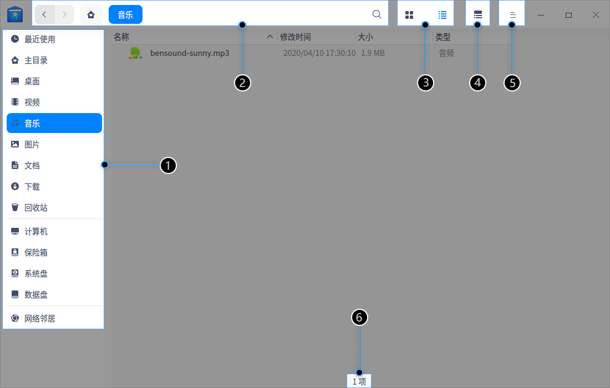

| 标号 | 名称          | 描述                                                         |
| ---- | ------------- | ------------------------------------------------------------ |
| 1    | 导航栏        | 单击导航图标，快速访问本地文件、磁盘、网络邻居、书签、标记等。 |
| 2    | 地址栏        | 通过地址栏，您可以快速切换访问历史、在上下级目录间切换、搜索、输入地址访问。 |
| 3    | 图标/列表视图 | 单击  , 图标，以图标或列表形式查看文件（夹）。 |
| 4    | 信息栏        | 单击 ， 查看文件（夹）的基本信息和标记。 |
| 5    | 菜单栏        | 通过主菜单，您可以新建窗口、切换窗口主题、设置共享密码、设置文件管理器、查看帮助文档和关于信息、退出文件管理器。 |
| 6    | 状态栏        | 显示文件数量或者已选中文件的数量。                           |

> 窍门：可拖动左侧导航栏右边的分隔线来改变其宽度。

## 基本功能

文件管理器具备基本的文件管理功能，对文件(夹)进行新建、复制、重命名、删除等操作都非常简单。

### 新建文件

#### 新建文档

1. 在文件管理器界面上，单击鼠标右键。
2. 单击 **新建文档**。
3. 选择新建文件的类型。
4. 输入新建文件的名称。

#### 新建文件夹

1. 在文件管理器界面上，单击鼠标右键。
2. 单击 **新建文件夹**。
3. 输入新建文件夹的名称。

### 重命名文件

1. 在文件管理器界面上，右键单击文件。
2. 选择 **重命名**。
3. 输入文件名称，按 **Enter** 键或者鼠标单击界面空白区域。

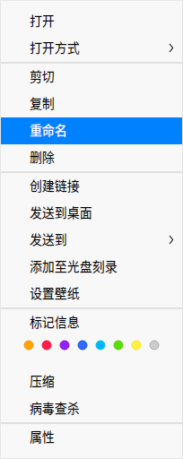

> 窍门：在 **设置** 中勾选“重命名时隐藏文件扩展名”，能更方便地修改文件名称。

### 批量重命名

1. 在文件管理器界面上，选中多个文件。
2. 右击文件，并选择 **重命名**。
   - **替换文本 **查找需要替换的文本，并输入替换后的文本，文件名中的关键字将被统一替换。
   - **添加文本** 输入需要添加的文本，并选择位置是名称之前还是之后，文件名将统一加入被添加的文本。
   - **自定义文本** 输入文件名，并输入序列的递进数字，文件名将统一改成新文件名+递进数字。
4. 单击 **重命名** 来完成操作。

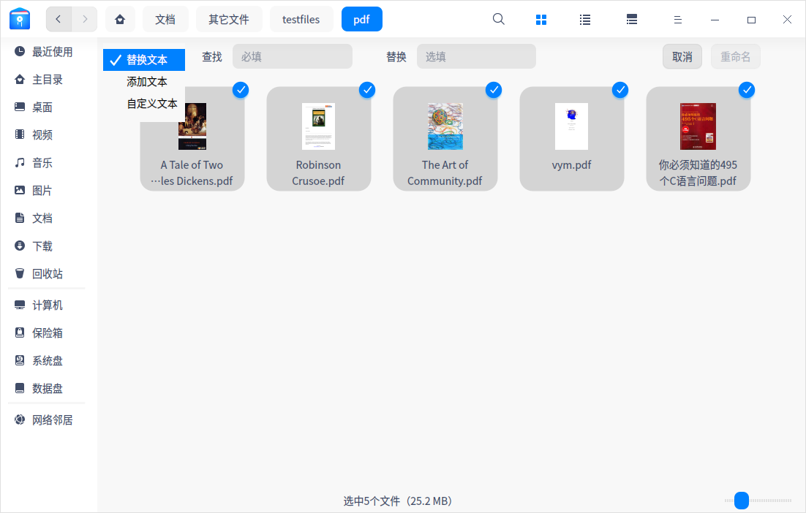

### 查看文件

单击界面上的  、 图标来切换图标视图和列表视图。

- 图标视图：平铺显示文件的名称、图标或缩略图。

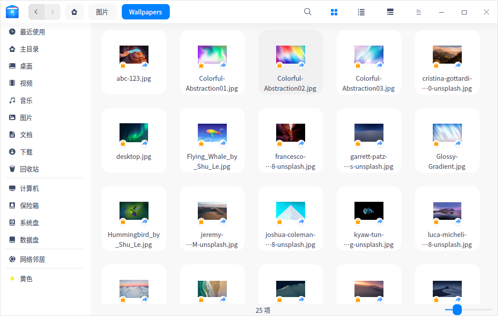

- 列表视图：列表显示文件图标或缩略图、名称、修改时间、大小、类型等信息。

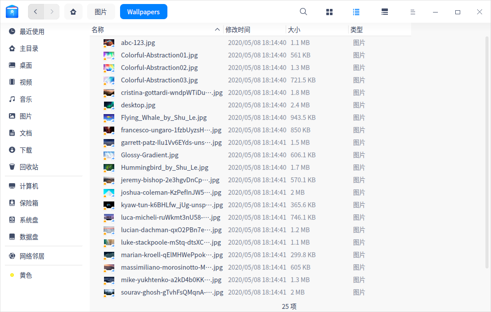

> 窍门：在列表视图中，把光标置于两列之间的分隔线上， 拖动它来改变列的宽度；双击分隔线可将当前列自动调整为本列内容最宽的宽度。

> 窍门：使用  **Ctrl + 1**  和  **Ctrl + 2**   快捷键，切换图标视图和列表视图。

### 排序文件

1. 在文件管理器界面上，单击鼠标右键。
2. 选择 **排序方式**。
3. 在子菜单中选择以名称、修改时间、大小或类型来排序文件。

> 窍门：在列表视图中，单击表头栏的列标签来切换升序、降序。

### 打开文件

1. 在文件管理器界面上，右键单击文件。
2. 选择 **打开方式** > **选择默认程序**。
3. 在程序列表中选择应用程序。

> 说明：直接双击文件会使用默认程序打开。您可以右键单击文件，在 **属性** > **打开方式** 中选择一个默认程序，也可以到控制中心 [默认程序](dman:///dde#默认程序设置) 中去设置此类文件的全局默认程序。

> 窍门：您可以选择相同类型的多个文件，右键选择“打开方式”选项，一次打开多个文件。

### 隐藏文件

1. 在文件管理器界面上，右键单击文件。
2. 选择 **属性**，勾选 **隐藏此文件**。

### 复制文件

1. 在文件管理器界面上，右键单击文件。
2. 单击 **复制**。
3. 选择一个目标存储位置。
4. 单击鼠标右键，然后选择 **粘贴**。

### 压缩文件

1. 在文件管理器界面上，右键单击文件。
2. 单击 **压缩**。
3. 输入压缩包名称，选择压缩包类型和目标存储位置。
4. 单击 **压缩**。

> 说明：打开“高级选项” 开关设置解压密码和分卷大小。加密文件和分卷压缩仅支持部分压缩格式。

### 删除文件

1. 在文件管理器界面上,右键单击文件。
2. 选择 **删除** 。

- 被删除的文件可以在回收站中找到，右键单击回收站中的文件可以进行 **还原** 或 **删除** 操作。
- 被删除的文件的快捷方式将会失效。

> 注意：外接设备删除文件会将文件彻底删除，无法从回收站找回。

### 撤销操作

在文件管理器中，可以用 **Ctrl + Z** 来撤销上一步操作，包括：

- 删除新建的文件。
- 恢复重命名（包括重命名文件后缀）之前的名字。
- 从回收站还原刚删除的文件。
- 恢复文件到移动（剪切移动、鼠标移动）前的原始路径。
- 删除复制粘贴的文件。

>注意：如果上面的这些操作是连续的，就可以一直撤消；如果操作中有覆盖某个同名文件和彻底删除文件，则撤消只能返回到这一步。

### 文件属性

文件属性会显示文件的基本信息，打开方式和权限设置。文件夹属性会显示文件夹的基本信息，共享信息和权限设置。

1. 在文件管理器界面上,右键单击文件。
2. 选择 **属性**，查看文件属性。

> 说明：查看多个文件属性会显示文件总大小和数量；查看快捷方式的属性将会额外显示源文件地址。您还可以使用 **Ctrl + I** 组合键查看文件属性。

### 病毒查杀

1. 在文件管理器界面上，右键单击文件。
2. 选择 **病毒查杀**，会弹出安全中心病毒查杀界面，您可对该文件进行安全扫描。

   > 说明：如果当前安全中心有查杀任务，则在弹出的对话框中点击 **查看** 进入安全中心病毒查杀界面进行查看。

## 常用操作

文件管理器具备很多特色功能，这些功能都让文件管理更加简单、高效。

### 切换地址栏

地址栏由历史导航、面包屑和输入框共同组成。通常情况下地址栏显示面包屑。

- 单击历史导航按钮，您可以快速在历史浏览记录间切换，查看前一个地址或者后一个地址。
- 文件所在位置的每一个层级都会形成一个面包屑，通过来回单击面包屑可以快速在不同文件层级间切换。

当用户单击搜索图标，或者在文件路径上右键选择"编辑地址"，地址栏会切换为输入框状态。在输入框外单击时，地址栏会自动恢复到面包屑状态。

- 输入框带有智能识别功能，您可以输入关键词或者访问地址回车，系统会自动识别并进行搜索或访问。

### 搜索文件

在文件管理器中单击搜索按钮，或使用  **Ctrl + F** 快捷键进入搜索状态，或在地址栏中输入关键词后按 **Enter** 键，搜索相关文件。
  - 需要指定目录搜索时，请先进入该目录，然后再进行搜索。

> 说明：
> + 在文件管理器的 **设置 **中，默认勾选了“自动索引内置磁盘”，您可以选择勾选“连接电脑后索引外部存储设备”，加快在外部设备的搜索速度。
> + 若想通过文件内容中的关键字来搜索文件，可在 **设置** > **高级设置** > **索引** 中勾选“全文搜索”。

#### 高级搜索
1. 在搜索状态下，输入关键字后按 **Enter** 键，当搜索到结果时，搜索框右侧显示  图标，点击该图标可进行高级搜索的操作。
2. 选择搜索范围、文件大小、文件类型、修改时间、访问时间和创建时间，进行更精准的搜索。

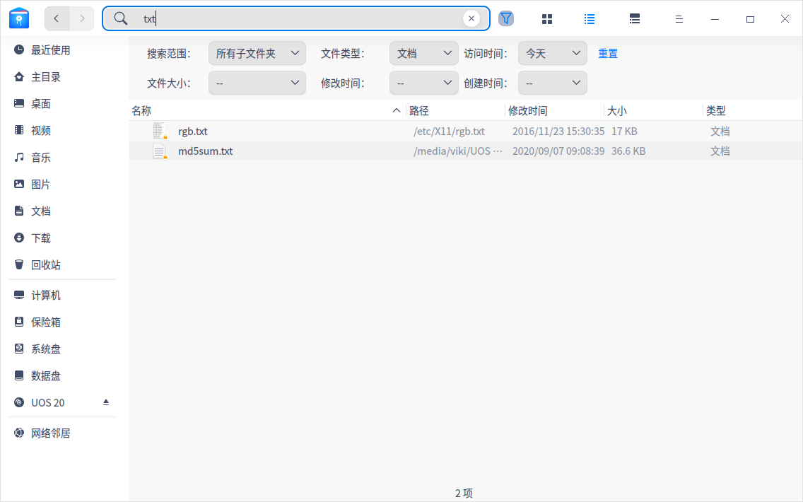

### 最近使用

在左侧导航栏上默认有 **最近使用** 入口，单击可以查看最近使用的文件。文件默认按照访问时间倒序排列。

> 说明：若想隐藏“最近使用”，可在 **设置** > **基本设置** > **隐藏文件**，取消勾选“显示最近使用文件”。若要隐藏某一个文件的访问记录，右击该文件选择 **移除**，该操作不会删除文件。

### 多标签页

文件管理器支持多标签页显示。

1. 在文件管理器界面上，右键单击文件夹。
2. 选择 **在新标签中打开**。
3. 当窗口有多个标签时，可以：
 - 单击标签栏右侧的 + 继续添加标签。
 - 单击标签上的 × 关闭标签。
 - 将鼠标置于标签栏上，单击鼠标中键关闭标签。

   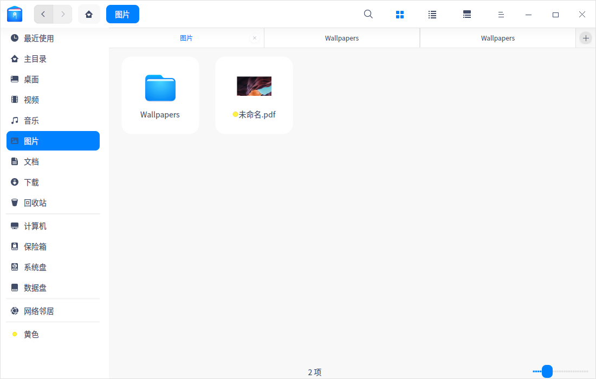

> 窍门：文件管理器窗口只有一个标签时，标签栏是隐藏的，您还可以使用快捷键  **Ctrl** + **T** 来新建标签。

### 书签管理

为常用文件夹添加书签，以便从左侧导航栏快速访问。

- 添加书签：右键单击文件夹，选择 **添加书签** 就可以在导航栏创建书签。
- 移动书签：在导航栏上下拖动书签调整书签排序。
- 删除书签：右键单击书签，选择 **移除** 来删除书签；或右键单击已添加书签的文件夹，选择 **移除书签** 来删除书签；也可以将书签拖到导航栏之外来删除书签。

### 标记信息

通过给文件/文件夹添加标记，可以更好地分类管理您的文件。

> 说明：当前仅x86平台支持 **标记信息** 功能，该帮助手册中涉及的标记信息相关内容仅适用于x86平台。

#### 添加标记

##### 通过编辑框添加标记

1. 右键单击文件(夹)，选择 **标记信息**。
2. 输入标记名称。若要添加多个标记，用逗号分隔。
3. 编辑完成后点击空白处保存设置。

>说明：标记颜色从8种默认颜色中随机分配。

##### 通过颜色按钮添加标记

右键单击文件(夹)，选择**颜色按钮**，直接生成这个颜色的标记。

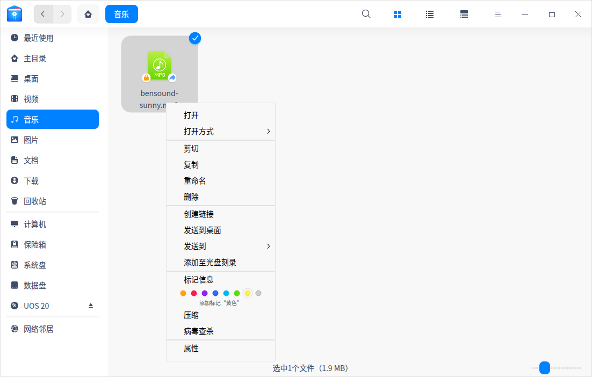

##### 通过右侧信息栏添加标记
选择文件(夹)后，单击 ，在右侧信息栏中也可以添加标记。

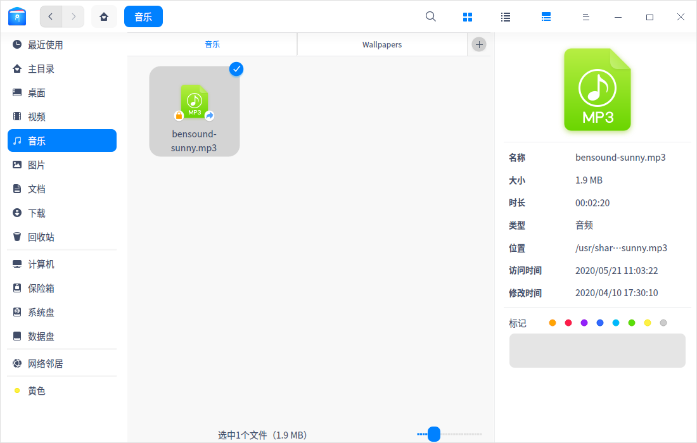

>说明：您可以一次为多个文件(夹)添加标记，一个文件(夹)也可以添加多个标记；您还可以在文件(夹)的属性中添加标记。添加成功的标记会出现在左侧导航栏内。

>注意：复制或剪切有标记的文件，所产生的文件仍然具有同样的标记。

#### 重命名标记

在侧边导航栏中，右键单击某个标记，选择 **重命名**，修改当前标记的名称。

#### 修改标记颜色

在左侧导航栏中，右键单击某个标记，选择 **颜色按钮**，即可修改当前标记的颜色。

#### 排序标记

上下拖动标记即可调整标记排序。

#### 删除标记

右键单击某个标记，选择 **移除**，删除当前标记。

### 文件预览

文件管理器支持空格键预览功能，选中文件并按下键盘上的空格键就可以快速预览文件。预览窗口可以查看图片分辨率、文档大小、文本内容等，还支持gif、音频、视频播放。

#### 预览视频

1. 选择您要预览的视频文件，按下空格键，即可开始预览。
2. 单击视频任意地方可暂停播放。
3. 播放过程中，可以拖动进度条来快进快退。
4. 单击底部 **打开** 按扭，在默认程序中打开该视频文件。

> 说明：您也可以同时选择多个文件，按下空格键进行预览。

### 权限管理
选择对应文件/文件夹，单击右键，选择属性，单击 **权限管理**， 为所有者，群组，和其他用户设置文件权限。

### 我的共享

当您设置了共享文件时，“我的共享”将会出现在导航栏上。当所有共享文件都取消共享后，“我的共享”自动从导航栏中移除。

#### 共享本地文件

1. 在文件管理器界面上，右键单击文件夹。
2. 选择 **共享文件夹**。
3. 在文件夹的属性窗口，勾选 **共享此文件夹**。
4. 根据需要设置 **共享名**、**权限** 、**匿名访问** 后关闭窗口。
5. 在文件管理器界面上，单击 。
6. 选择 **设置共享密码**。
7. 输入共享密码。
8. 单击 **确定**。

> 窍门：取消勾选 **共享此文件夹** 可以取消文件共享，也可以右键单击文件，选择 **取消共享**。

#### 访问共享文件

局域网中其他用户共享的文件一般都可以在网络邻居中找到，您也可以通过smb访问共享文件。

1. 单击  > **连接到服务器**，在编辑框中输入服务器地址，如：smb://xx.x.xx.xxx（一般为IP地址），单击 **连接**；或者直接在地址栏中输入服务器地址，按下键盘上的 **Enter** 键。
2. 输入用户名密码或者匿名访问。
 - 未加密的网络文件可以匿名访问，不需要输入用户名和密码。
 - 加密的网络文件会弹出登陆框，输入用户名和密码之后才能访问。如果在用户名密码提示框中勾选 **记住密码** ，再次访问不再需要密码。

      - 用户名：安装操作系统时创建的用户名，即登录系统的用户名。
      - 密码：共享文件时设置的共享密码。
3. 单击 **连接**。

### 网络邻居

1. 单击文件管理器导航栏上的  图标。
2. 双击想要访问的网络文件。
3. 输入用户名密码或者匿名访问。
 - 未加密的网络文件可以匿名访问，不需要输入用户名和密码。
 - 加密的网络文件会弹出登陆框，输入账号和密码之后才能访问。如果在用户名密码提示框中勾选 **记住密码**，再次访问不再需要密码。
4. 单击 **连接**。

### 以管理员身份打开

1. 在文件管理器界面空白处单击鼠标右键。
2. 选择 **以管理员身份打开**，在弹出的对话框中输入用户密码，点击 **确定**。
3. 该文件夹会以新窗口打开，在此窗口中可以进行高级权限的操作，关闭窗口后，终止管理员权限。

### 从终端中打开

1. 在文件管理器界面空白处单击鼠标右键。
2. 选择 **从终端中打开**，会启动终端应用程序，终端的路径为当前目录。

### 创建快捷方式

1. 在文件管理器界面上，右键单击文件(夹)。
2. 选择 **创建链接**。
3. 在弹窗中选择创建位置、链接名称。
4. 单击 **保存**，在目标位置会生成该文件(夹)的快捷方式。

> 窍门：选择 **发送到桌面** 可以直接在桌面上生成该文件(夹)的快捷方式。

### 发送文件(夹)到外接磁盘

当有外接磁盘接入时，您可以将文件或文件夹发送到外接磁盘。

1. 在文件管理器界面，右键单击需要发送的文件(夹)。
2. 选择 **发送到** > 外接磁盘。
3. 文件(夹)将会被发送到移动外接磁盘。

### 发送文件到蓝牙

若您的电脑配置了蓝牙模块，便可通过蓝牙进行短距离文件传输的操作。

1. 在文件管理器界面，右键单击需要发送的文件。
2. 选择 **发送到** > **发送到蓝牙**。
3. 若电脑未连接蓝牙设备，在弹出的对话框中点击“前往蓝牙设置”，界面跳转至 **控制中心** > **蓝牙** ，具体连接方法可参考 [连接蓝牙设备](dman:///dde#连接蓝牙设备)。
4. 连接成功后，文件管理器界面弹出蓝牙文件传输的对话框，勾选接收设备，点击 **下一步**。
5. 传输成功后在弹出的对话框中点击 **完成**。

   >窍门：若您需要传输文件夹，可提前将文件夹压缩后再通过蓝牙发送。

## 文件角标

您可以通过命令行，将图标文件指定给一个文件或文件夹作为角标显示出来。
   >说明：
   >- 角标文件支持svg、jpg、png、bmp、gif格式，且大小<=100kb。
   >- U盘及光盘下的文件，不支持添加角标。

### 添加单个角标

1、在终端输入命令 **gio set xxx(文件路径)  -t stringv metadata::emblems "xxx(图标路径)"** ，该命令默认在文件（夹）右下角添加角标。
   >注意：系统已定义的特殊角标，不支持被替换。

2、您也可以在上述命令中加入位置参数，将角标添加在文件（夹）的左上角（lu）、左下角（ld）、右上角（ru）或右下角（rd）。

例如：在文件（夹）左上角添加角标

**gio set xxx(文件路径)  -t stringv metadata::emblems "xxx(图标路径);lu"**

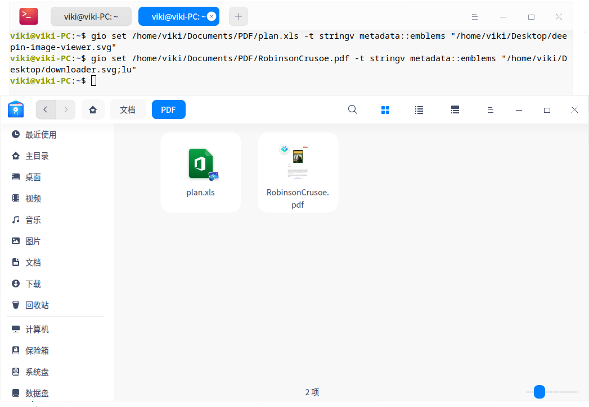

### 添加多个角标

在命令行中加入“**|**”符号将角标文件路径链接起来，为文件（夹）添加2~4个角标。文件（夹）同一个位置不支持叠加角标，仅支持替换。

例如：在文件（夹）四个角都添加角标

**gio set xxx(文件路径)  -t stringv metadata::emblems "xxx(图标路径);lu|xxx(图标路径);ld|xxx(图标路径);ru|xxx(图标路径);rd"**

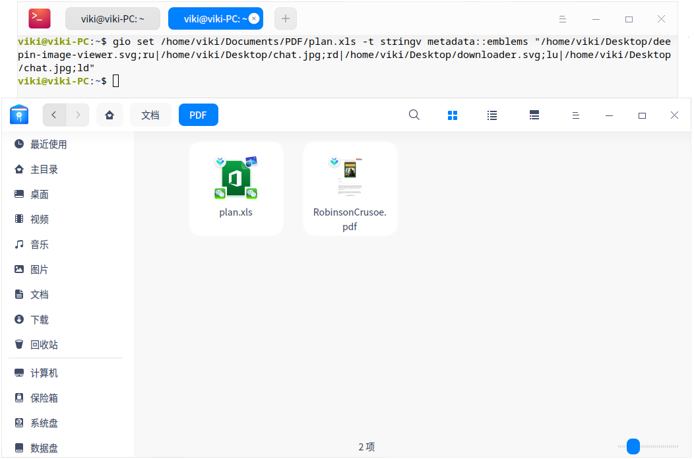

### 撤销角标

在终端中输入命令 **gio set xxx(文件路径) -t stringv metadata::emblems ""** 撤销文件（夹）上所有的角标。

## 文件保险箱

文件保险箱旨在为您打造专属的安全空间，为您的隐私保驾护航。先进的加密技术，便捷的操作流程，使用起来得心应手。

### 设置保险箱密码

首次使用保险箱需要对其进行密码设置，具体步骤如下：

1. 鼠标左键单击文件管理器导航栏中  图标，或者在计算机界面双击 “我的保险箱”，在弹出的保险箱对话框中点击 **开启** 按钮。 
2. 在设置解锁方式的对话框中设置解锁类型、保险箱密码、重复保险箱密码等，点击**下一步**。

> 说明: 密码必须同时包含大写字母、小写字母、数字和符号，且字符不小于8位，否则无法进入下一步。
&nbsp;&nbsp;&nbsp;&nbsp;&nbsp;&nbsp;&nbsp;&nbsp;&nbsp;&nbsp;&nbsp;&nbsp;&nbsp;
3. 此时保险箱密码生成密钥/二维码，建议您将密钥/二维码保存，若忘记密码，可用密钥/二维码开启保险箱。点击 **下一步**。
4. 点击 **加密保险箱**；在弹出的认证对话框中输入用户登录密码，点击 **认证**。

5. 在弹出的完成加密对话框中点击 **确定** 。
6. 设置完成后可将文件放入保险箱中。

### 锁上保险箱

将文件放入保险箱后，右键点击导航栏  图标或者在计算机界面右键点击“我的保险箱”。
- 选择 **立即上锁**，立即将文件保险箱锁上。
- 选择 **自动上锁**，在其下拉列表进行设置：
  + 选择“不使用”，计算机在锁屏或关机前一直保持未上锁状态。
  + 选择“5分钟”、“10分钟”或者“20分钟”后自动上锁保险箱。

### 解锁保险箱

右键点击导航栏  图标或者计算机界面 “我的保险箱”。

- 选择 **密码解锁**，在弹出的对话框中输入保险箱密码，点击 **解锁**。
- 选择 **使用恢复密钥...**，在弹出的对话框中输入32位密钥，点击 **解锁**。
>窍门：您也可以单击导航栏  图标或者双击计算机界面 “我的保险箱”，直接使用密码解锁保险箱。

### 删除保险箱
删除保险箱需要提前解锁保险箱。
1. 右键点击导航栏  图标或者在计算机界面右键点击 “我的保险箱”，选择 **删除保险箱**。
2. 在弹出的删除保险箱对话框中输入保险箱密码，点击 **删除**。
3. 在弹出的认证对话框中输入用户登录密码，点击 **认证 ** 完成删除操作。
> 注意：删除保险箱会将里面的文件一并删除。在进行删除操作前，请将保险箱中的文件备份。

## 磁盘管理

文件管理器可以管理本地和外接磁盘。

### 查看磁盘

您的本地磁盘会显示在文件管理器的左侧导航栏上。当您挂载外接磁盘或者插入其他移动存储设备时，也会在导航栏上看到相应的磁盘图标。

<table class="block1">
    <caption></caption>
    <tbody>
        <tr>
            <td>本地磁盘</td>
            <td>本地硬盘分区的所有磁盘</td>
        </tr>
        <tr>
            <td>外接磁盘</td>
            <td>包括移动硬盘、U盘、光盘</td>
        </tr>
    	<tr>
            <td>移动设备</td>
            <td>手机内存、存储卡、SD卡等</td>
        </tr>
    </tbody>
</table>

> 说明：如果磁盘或磁盘中的文件夹被加密了，请输入密码后查看文件。

### 弹出磁盘

1. 在左侧导航栏或计算机界面，右键单击需要移除的磁盘。
2. 选择 **安全移除**。
3. 磁盘将从磁盘列表中删除，一并弹出该磁盘的所有分区。

> 窍门：如果要弹出光盘，请选择 **弹出** 来移除光盘。单击导航栏中磁盘右边的  同样可以弹出磁盘或光盘。

### 重命名磁盘
1. 在左侧导航栏或计算机界面，右键单击需要重命名的磁盘。
2. 选择 **卸载**，再次单击右键选择 **重命名**。
3. 输入新的卷标名称。

### 格式化磁盘

1. 在左侧导航栏或计算机界面，右键单击需要格式化的磁盘。
2. 选择 **卸载**，再次单击右键选择 **格式化**。
3. 在格式化弹窗中设置格式化之后的文件类型和卷标。
4. 单击 **格式化**。

> 说明：快速格式化速度快，但是数据仍然可能通过工具被恢复，如果想要格式化后的数据无法被恢复，可以取消勾选“快速格式化”，然后执行格式化操作。

## 主菜单

在主菜单中，您可以新建窗口、切换窗口主题、连接到服务器、[设置共享密码](#共享本地文件)、设置文件管理器、查看帮助手册和版本介绍。

### 新建窗口

打开一个新的文件管理器窗口。

1. 在文件管理器界面，单击 。
2. 单击 **新建窗口**。

### 连接到服务器

通过连接服务器[访问局域网共享文件](#访问共享文件)。

1. 在文件管理器界面，单击 。
2. 选择 **连接到服务器**，在编辑框中输入服务器IP地址。
   - 单击  按钮可将该地址添加到“个人收藏服务器”列表中。
   - 在“个人收藏服务器”列表中选中一个地址，单击  按钮，将该地址从收藏列表中移除。
3. 单击 **连接**。

### 主题

窗口主题包含浅色主题、深色主题和跟随系统主题。

1. 在文件管理器界面，单击 。
2. 单击 **主题**，选择一个主题。

### 设置

1. 在文件管理器界面，单击 。
2. 单击 **设置**。
3. 修改设置让您的文件管理器用起来更方便：
   - 在基础设置项：
      + 设置  **打开行为**，是否总在新窗口打开文件夹，单击或者双击打开文件。
      + 设置  **新窗口新标签**，建立新窗口新标签时默认打开哪个目录。
      + 设置  **视图**，文件图标的大小和默认视图。
      + 设置  **隐藏文件**，是否显示隐藏文件、重命名时隐藏文件扩展名、是否在左侧导航栏显示最近使用文件。
   - 在高级设置项：
      + 设置  **索引**，是否自动索引内置磁盘和连接的外部存储设备，是否通过文件内容来进行搜索。
      + 设置  **预览**，文件管理器显示哪些文件的预览。
      + 设置  **挂载**，自动挂载功能。
      + 设置  **对话框**，是否使用文件管理器的文件选择对话框。
      + 设置  **其他**，是否隐藏系统盘。

### 帮助

查看帮助手册，进一步了解和使用文件管理器。

1. 在文件管理器界面，单击 。
2. 单击 **帮助**。
3. 查看文件管理器的帮助手册。

### 关于

1. 在文件管理器界面，单击 。
2. 单击 **关于**。
3. 查看文件管理器的版本和介绍。

### 退出

1. 在文件管理器界面，单击 。
2. 单击 **退出**。

文档更新时间: 2020-11-24 版本: 5.2
