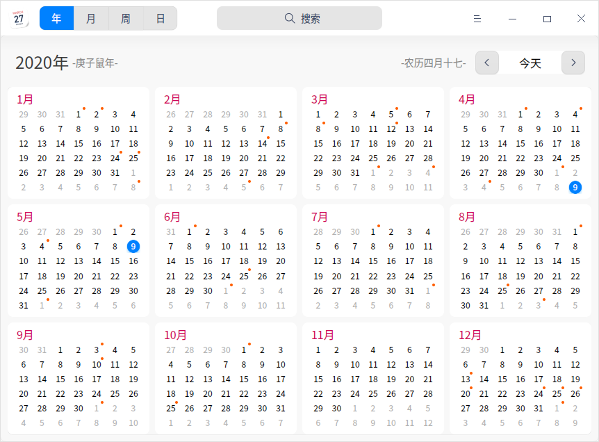
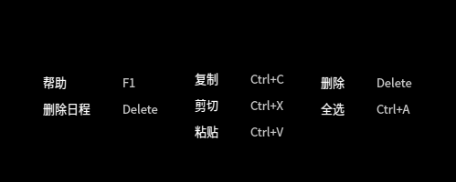
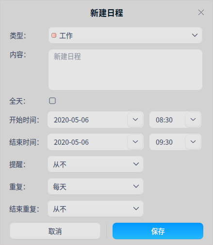

# 日历|../common/dde-calendar.svg|

## 概述

日历是一款集记事、日程功能于一体的，将时间与事件结合，起到管理个人生活作用的小工具。

## 使用入门

通过以下方式运行或关闭日历，或者创建日历的快捷方式。

### 运行日历

1. 点击桌面底部的 ，进入启动器界面。
2. 上下滚动鼠标滚轮浏览或通过搜索，找到日历  点击运行。
3. 右键单击 ，您可以：

   - 点击 **发送到桌面**，在桌面创建快捷方式。
   - 点击 **发送到任务栏**，将应用程序固定到任务栏。
   - 点击 **开机自动启动**，将应用程序添加到开机启动项，在电脑开机时自动运行该应用。

### 关闭日历

- 在日历界面点击 ，退出日历。
- 在任务栏右键单击 ，选择 **关闭所有** 来退出日历。
- 在日历界面点击 ，选择 **退出** 来退出日历。

### 查看快捷键

在日历界面上，按下 **Ctrl + Shift + ?** 组合键来查看快捷键，熟练的使用快捷键，将大大提升您的操作效率。

## 操作介绍

日历分为年、月、周、日视图，通过不同的视图方式展示日期属性。

系统默认显示月视图，可以通过鼠标点击切换年、月、周、日视图。

- 仅在中文系统中，日历会显示日期所对应的农历日期。
- 日期以 **1900** 年为起点，在日期切换时，不能查看早于 **1900** 年的日期。
- 在月视图、周视图中，周六周日的日期显示会区别于周一至周五。

| 视图 | 亮点                                 |
| ---- | ------------------------------------ |
| 年   | 显示全年的月份、天数。               |
| 月   | 显示节日信息、日程安排。             |
| 周   | 显示这一周每天的日程安排。           |
| 日   | 显示节日信息、详细的日程安排和黄历。 |

### 新建日程

1. 在月、周或者日视图中，选中一个日期。
2. 双击日期空白处或者点击鼠标右键 **新建日程**，弹出 **新建日程** 窗口。
3. 设置日程类型、内容、时间、提醒等信息。

   
&nbsp;&nbsp;&nbsp;&nbsp;&nbsp;&nbsp;&nbsp;&nbsp;&nbsp;&nbsp;&nbsp;&nbsp;&nbsp;
   - 类型：工作、生活和其他。
   - 日程的时间：全天、开始时间和结束时间。

      - 当勾选全天时：
         - 开始时间、结束时间：不能设置小时和分钟，只能选择日期。
         - 提醒设置：从不、日程发生当天（上午9时）、1天前、 2天前和1周前，其中1天前为默认设置。
   
      - 当不勾选全天时：
         - 开始时间、结束时间：既能设置小时和分钟，也能选择日期。
         - 提醒设置：从不、日程开始时、15分钟前、30分钟前、1小时前、1天前、 2天前、1周前。

   - 重复：从不、每天、工作日、每周、每月和每年。

   - 结束重复：从不、于n次后、于日期。

   > 说明：只有设置了 **重复** 功能，**结束重复** 才会出现。

4. 点击 **保存**，创建日程。
   
   > 窍门：支持将日程标签拖拽到指定的日期或时间上。

### 编辑日程

1. 在月、周或者日视图中，鼠标右键点击某一个已创建日程的日期。
2. 选择 **编辑**，弹出 **编辑日程** 窗口。
3. 设置编辑日程的相关属性。 
4. 点击 **保存**。 
5. 如果有设置全天或者重复，则弹出提示框，确认提示信息，完成日程编辑。

编辑日程时，系统会根据所更改内容的不同显示不同的提示信息。提示信息中按钮说明如下表。

| 按钮         | 说明                                                         |
| ------------ | ------------------------------------------------------------ |
| 全部日程     | 与此相关的重复日程修改有效。                                 |
| 仅此日程     | 只对当前日程编辑修改有效。                                   |
| 所有将来日程 | 当前选中日期及以后的日期的日程被全部修改，选中日期前的日程仍然保留。 |
| 全部更改     | 会将所有的重复日程进行修改。                                 |

### 设置全天或多天日程

在创建日程或编辑日程时，勾选 **全天**，设置 **开始时间**、**结束时间**，可以设置全天或多个持续的全天日程。

### 设置重复日程

1. 在创建日程或编辑日程时，点击 **重复** 右侧的下拉列表，然后进行选择。
   - **每天**：输入每次重复之间的天数。
   - **工作日**：输入每次重复之间的工作日数。
   - **每周**：输入每次重复间隔的周数，然后选择要日程在星期几发生。
   - **每月**：输入每次重复之间的月份数。
   - **每年**：输入每次重复之间的年份数，然后点按要日程发生的月份。

2. 点击 **结束重复** 右侧的下拉列表，然后选取日程的停止时间。

### 查看日程

在月、周、日视图下，双击日程标题，弹出“我的日程”窗口，此时即可以查看日程也可以 [编辑日程](#编辑日程) 或 [删除日程](#删除日程)。

### 查看日程提醒详情

当系统发出通知后，可以点击通知提示框，查看日程提醒详情。

日程提醒时，提示信息按钮说明如下表。

| 按钮        | 说明                                                         |
| ----------- | ------------------------------------------------------------ |
| 稍后提醒    | 提醒设置为当天，首次提醒后，点击“稍后提醒”，10分钟后再次提醒，此后每次点击“稍后提醒”增加5分钟。 |
| 明天提醒    | 提醒设置为1天或2天前                                         |
| 提前1天提醒 | 提醒设置为1周前                                              |
| 关闭提醒    | 关闭提示信息。                                               |

### 搜索日程

在年、月、周、日视图中，通过顶部搜索框搜索，日历右侧会自动显示搜索结果。

1. 在日历界面顶部搜索框中，您可以：
   - 点击，输入关键字。
   
2. 按下键盘上的 **Enter** 键进行搜索。
   - 当搜索到匹配的信息时，在右侧显示搜索结果列表。
   - 当没有搜索到匹配的信息时，在右侧显示“无搜索结果”。

3. 在搜索框中点击或删除输入的信息，即可清除当前输入的关键字或取消搜索。

### 删除日程

1. 在月、周或者日视图中，鼠标右键点击某一个已创建日程的日期。
2. 选择 **删除**，弹出 **您正在删除日程** 提示框。
3. 确认提示信息，删除日程。

您也可以 点击 **取消**，停止删除日程。

删除日程时，重复与非重复日程提示信息中按钮说明如下表。

| 按钮             | 说明                                                         |
| ---------------- | ------------------------------------------------------------ |
| 删除日程         | 删除非重复日程。                                             |
| 全部删除         | 删除所有的重复日程。                                         |
| 仅删除该日程     | 针对重复日程，仅删除当前所选日程。                           |
| 删除所有将来日程 | 针对重复日程，当前选中日期及以后的日期的日程被全部删除，选中日期前的日程仍然保留。 |

### 删除重复日程的所有重复

在日历中，如果选择重复日程的第一次重复，在删除日程时，点击 **全部删除**，可以删除所有的重复日程。

### 删除重复日程的部分重复

在日历中，如果选择重复日程的一次或多次重复，在删除日程时，可以选择点击：

- **仅删除该日程**：仅删除所选日程。
- **删除所有将来日程**：删除所选日程和所有将来重复日程。

## 主菜单

在主菜单中，您可以切换窗口主题、查看帮助手册，了解日历的更多信息。

### 主题

窗口主题包含浅色主题、深色主题和跟随系统主题，其中跟随系统主题为默认设置。

1. 在日历界面，点击。

2. 点击 **主题**，选择一个主题颜色。

### 帮助

查看帮助手册，通过帮助进一步让您了解和使用日历。

1. 在日历界面，点击 。
2. 点击 **帮助**。
3. 查看关于日历的帮助手册。

### 关于

1. 在日历界面，点击 。
2. 点击 **关于**。
3. 查看关于日历的版本和介绍。

### 退出

1. 在日历界面，点击 。
2. 点击 **退出**。

文档更新时间: 2020-10-29 版本: 5.6
